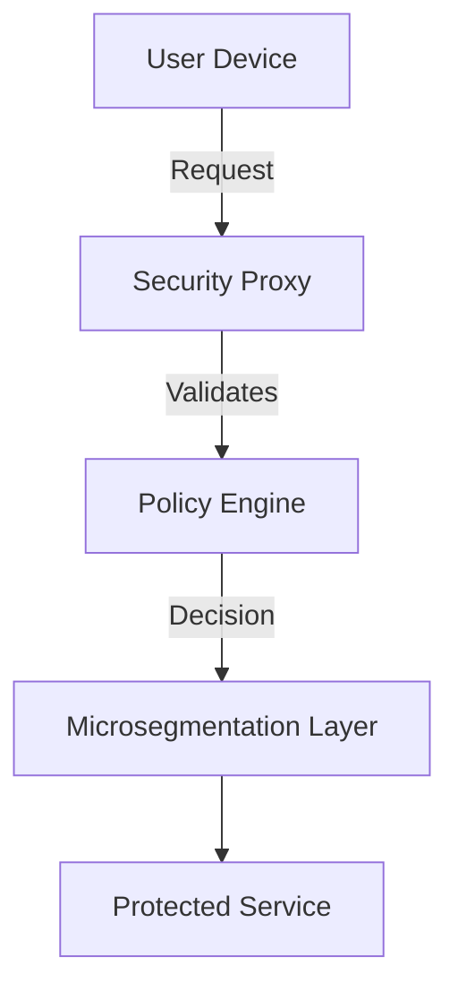

+++
title = "Zero-Trust Architecture: Implementation Strategies Beyond the Buzzword"
date = "2025-03-03T11:00:00-04:00"
draft = false
+++


# Zero-Trust Architecture: Implementation Strategies Beyond the Buzzword

In today’s rapidly evolving threat landscape, the traditional perimeter-based security model is no longer sufficient. Zero trust shifts the security paradigm by assuming no implicit trust—even for internal network traffic. In this post, we explore practical strategies for implementing a zero-trust model in modern organizations.

### The Concept of Zero Trust

Zero trust is built on the principle of "never trust, always verify." Every request—from any user or device—must be authenticated and authorized before granting access. This approach minimizes risks by reducing lateral movement in the network.

Learn more about the underlying framework in [NIST Special Publication 800-207](https://csrc.nist.gov/publications/detail/sp/800-207/final) citeturn0search0 and insights from [Palo Alto Networks’ Cyberpedia](https://www.paloaltonetworks.com/cyberpedia/what-is-zero-trust) citeturn0search1.

### Key Components of Zero Trust Architecture

Implementing zero trust involves several core elements:

- **Strong Identity Management:** Verifying the identity of users and devices continuously.
- **Microsegmentation:** Dividing the network into isolated segments to contain breaches.
- **Continuous Monitoring:** Regularly auditing access and activity across all network layers.
- **Least Privilege Access:** Granting only the minimal permissions required for tasks.

### A Practical Zero Trust Simulation in Python

Below is a Python code sample that simulates a token-based authentication mechanism—one of many ways to enforce zero trust at the application layer.

```python
import logging

# Configure logging for traceability and monitoring
logging.basicConfig(level=logging.INFO, format="%(asctime)s [%(levelname)s] %(message)s")

def authenticate_request(token):
    """
    Simulate token validation.
    In a production environment, tokens would be issued by an identity provider.
    """
    valid_token = "secure-token-123"
    if token == valid_token:
        logging.info("Token validated successfully.")
        return True
    logging.error("Invalid token detected!")
    return False

if __name__ == "__main__":
    request_token = input("Enter your access token: ")
    if authenticate_request(request_token):
        print("Access granted.")
    else:
        print("Access denied.")
```

*Explanation:*  
This simple simulation demonstrates how logging and strict token verification can contribute to a zero-trust framework by ensuring every request is checked.

### Visualizing Zero Trust Architecture

For a clearer picture, consider the following diagram illustrating the interaction between users, a security proxy, and internal services:



*Figure: A high-level view of a zero-trust network architecture.*

### Best Practices and Implementation Strategies

- **Automate Access Decisions:** Leverage policy engines to make real-time decisions.
- **Integrate Multi-Factor Authentication (MFA):** Strengthen identity verification.
- **Regularly Update Policies:** Adapt continuously as threats evolve.
- **Monitor and Analyze Traffic:** Use analytics to detect anomalies quickly.

### Conclusion

Implementing zero trust is not a one-off project but a continuous process. By embracing rigorous identity management, segmentation, and continuous monitoring, organizations can build resilient security architectures that adapt to modern threats.