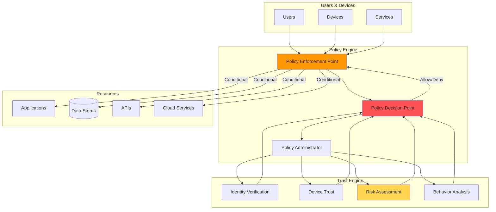
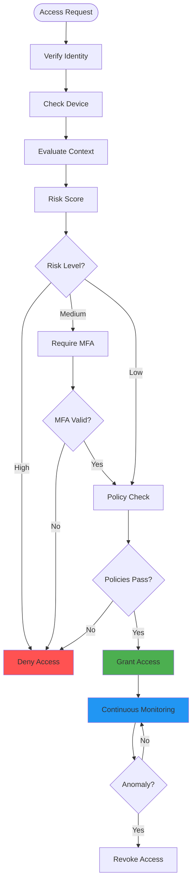

# Diagrams for 2024-08-27-zero-trust-security-principles.md

## How to use these diagrams:

1. Copy the Mermaid diagram code blocks
2. Replace verbose code sections in your blog post
3. The diagrams will render automatically in markdown

---

## Zero Trust Architecture

## Zero Trust Verification Flow

