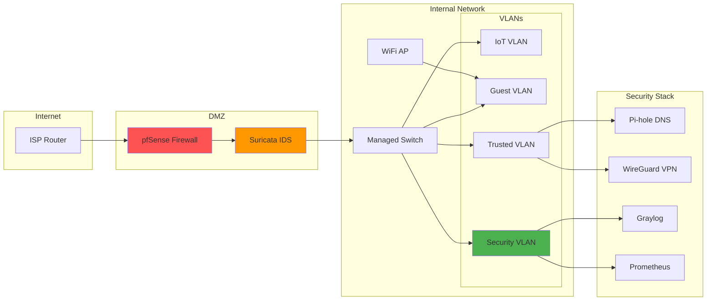
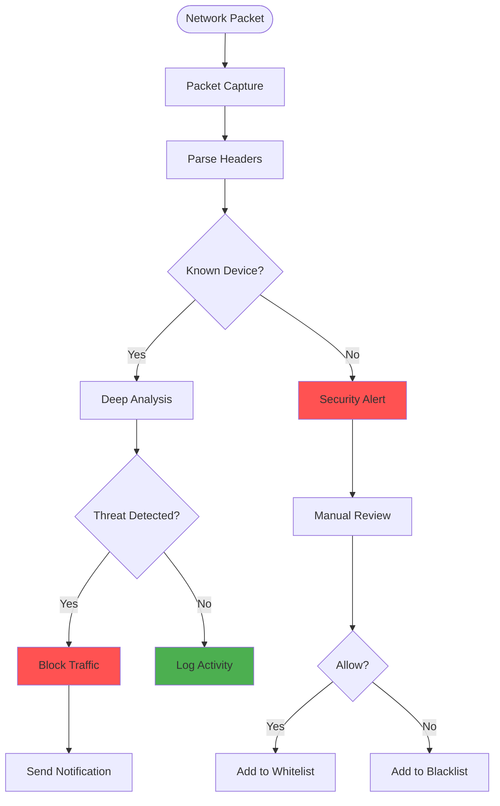

# Diagrams for 2025-02-10-automating-home-network-security.md

## How to use these diagrams:

1. Copy the Mermaid diagram code blocks
2. Replace verbose code sections in your blog post
3. The diagrams will render automatically in markdown

---

## Home Network Security Architecture

## Network Monitoring Flow

