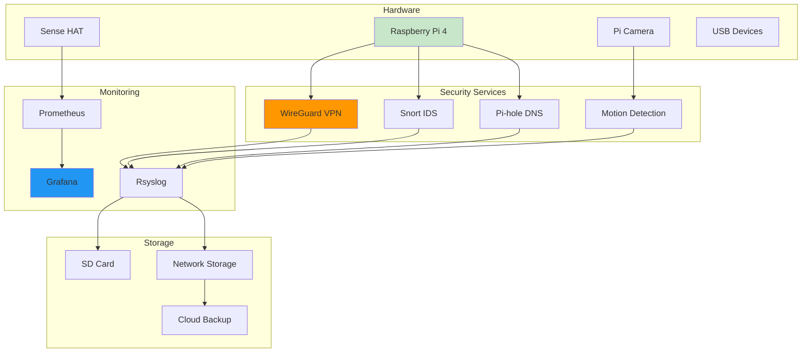
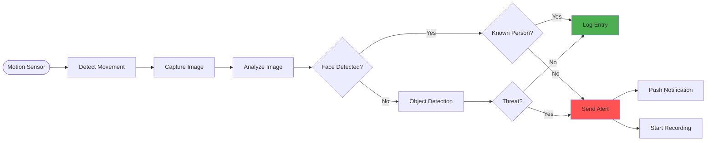

# Diagrams for 2025-03-10-raspberry-pi-security-projects.md

## How to use these diagrams:

1. Copy the Mermaid diagram code blocks
2. Replace verbose code sections in your blog post
3. The diagrams will render automatically in markdown

---

## Raspberry Pi Security Hub

## Motion Detection Flow

