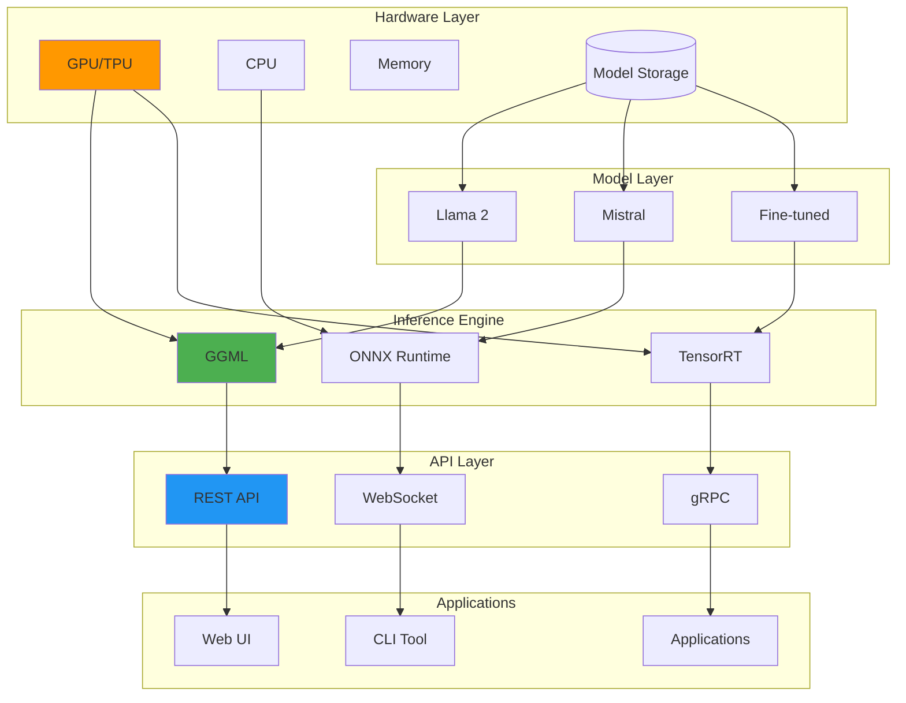
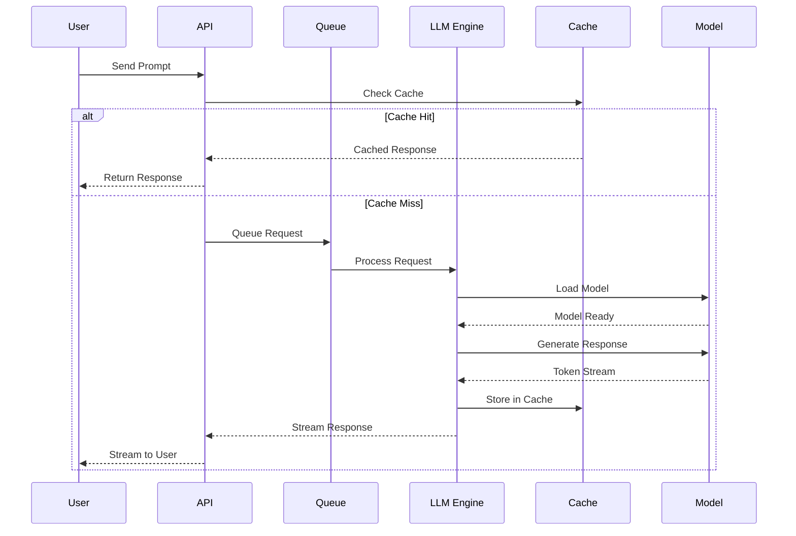

# Diagrams for 2025-06-25-local-llm-deployment-privacy-first.md

## How to use these diagrams:

1. Copy the Mermaid diagram code blocks
2. Replace verbose code sections in your blog post
3. The diagrams will render automatically in markdown

---

## Local LLM Architecture

## LLM Request Processing

