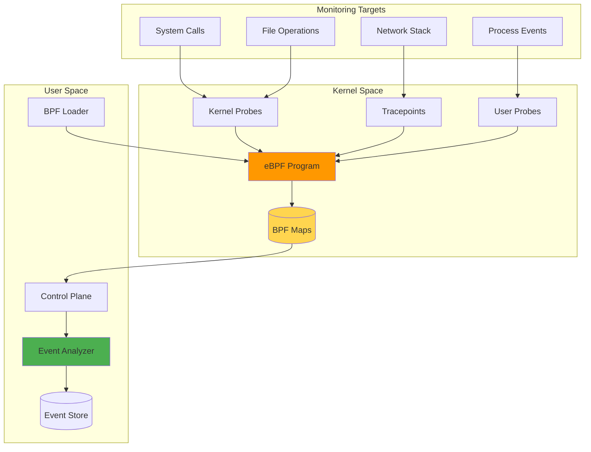
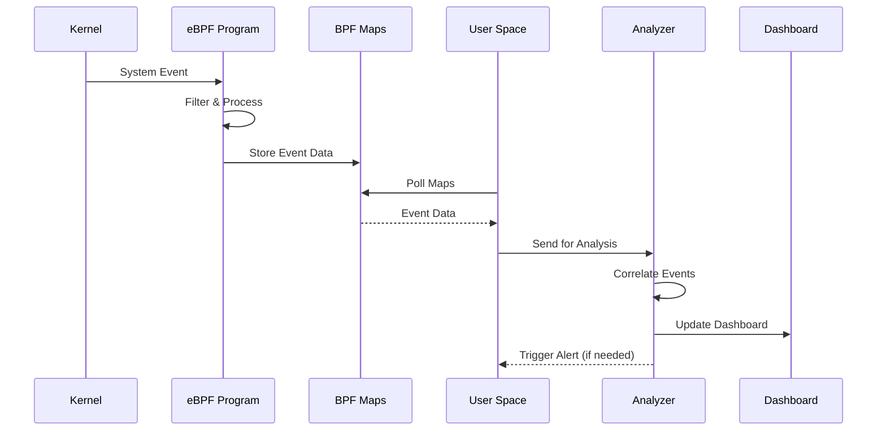

# Diagrams for 2025-07-01-ebpf-security-monitoring-practical-guide.md

## How to use these diagrams:

1. Copy the Mermaid diagram code blocks
2. Replace verbose code sections in your blog post
3. The diagrams will render automatically in markdown

---

## eBPF Security Architecture

## eBPF Event Processing Flow

