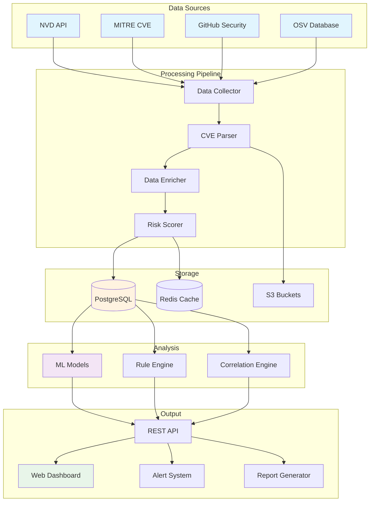
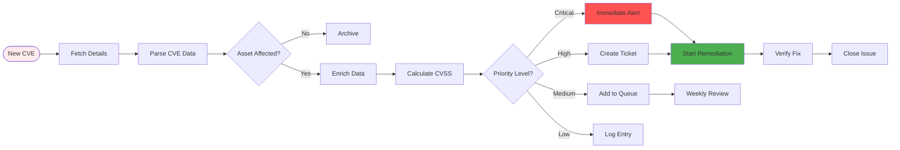

# Diagrams for 2025-07-15-vulnerability-management-scale-open-source.md

## How to use these diagrams:

1. Copy the Mermaid diagram code blocks
2. Replace verbose code sections in your blog post
3. The diagrams will render automatically in markdown

---

## System Architecture

## Vulnerability Processing Workflow

