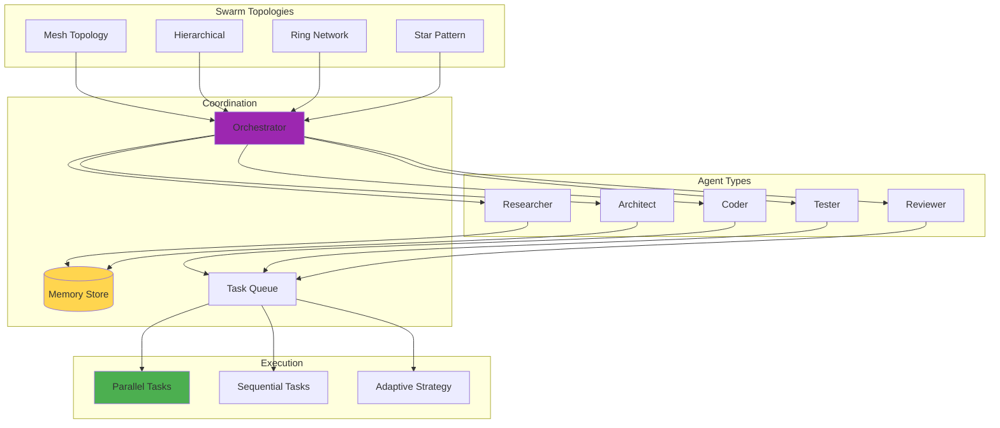
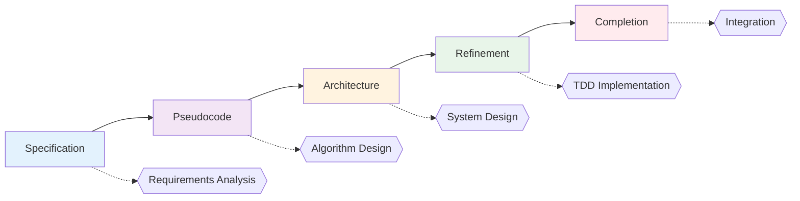
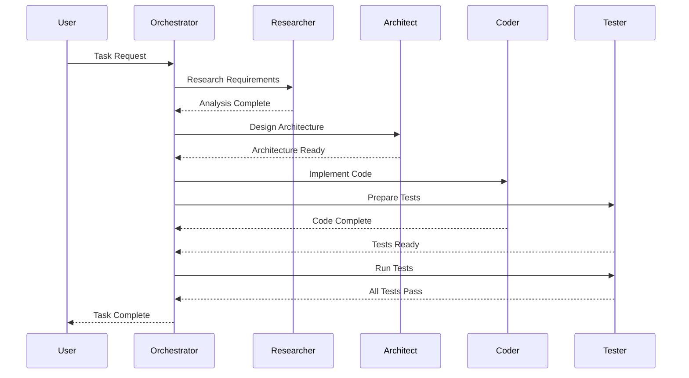

# Diagrams for 2025-08-07-supercharging-development-claude-flow.md

## How to use these diagrams:

1. Copy the Mermaid diagram code blocks
2. Replace verbose code sections in your blog post
3. The diagrams will render automatically in markdown

---

## Claude-Flow Swarm Architecture

## SPARC Development Flow

## Agent Collaboration Sequence

