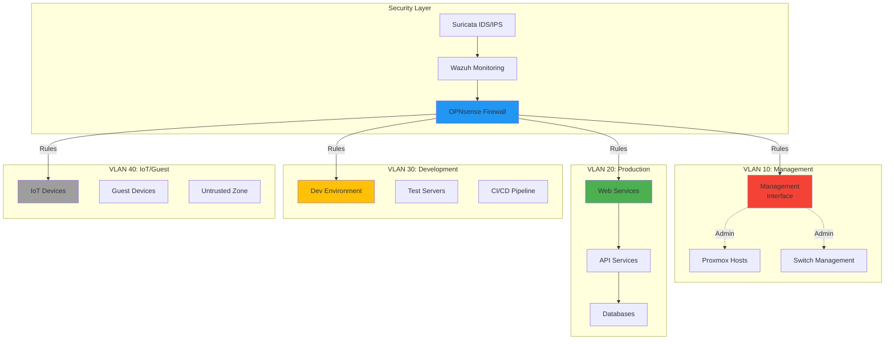
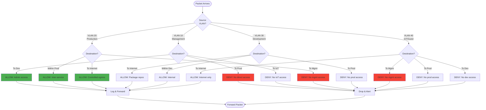
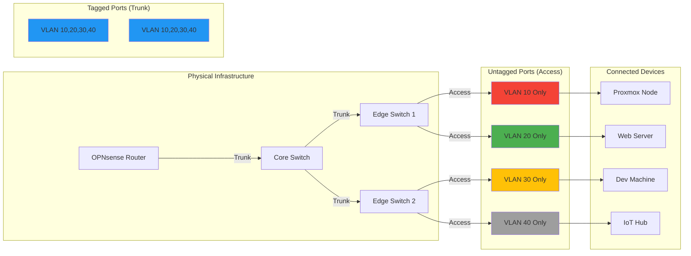
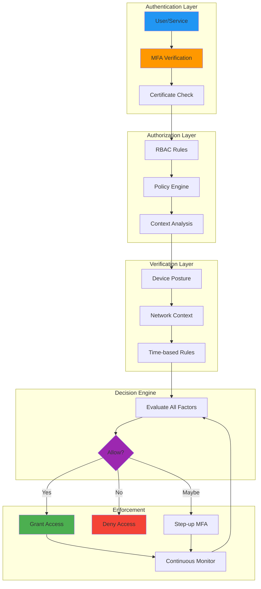
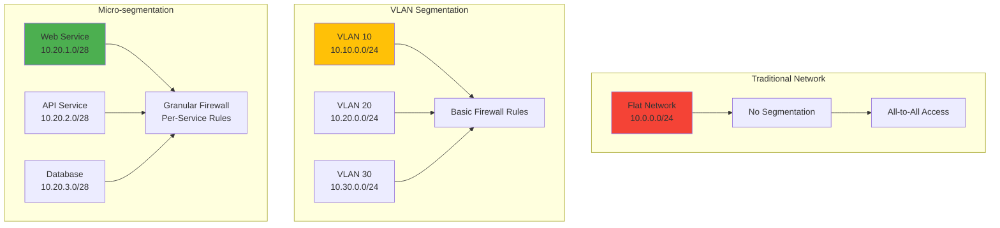
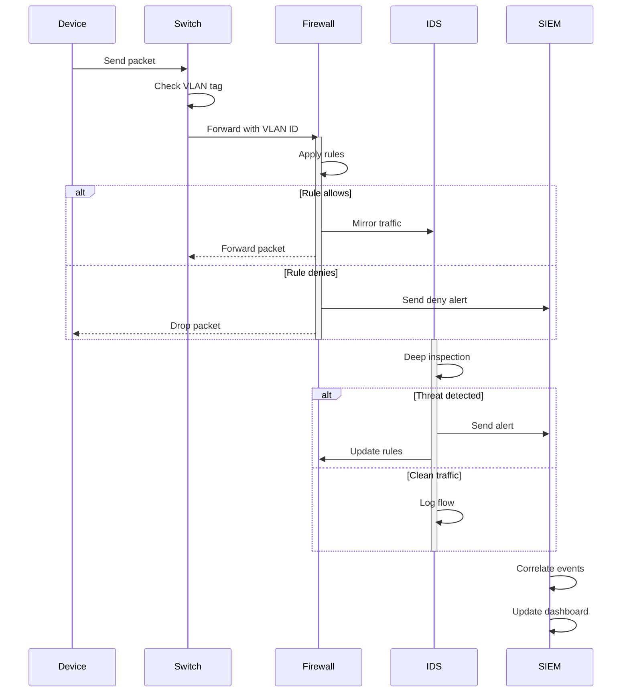

# Diagrams for 2025-09-08-zero-trust-vlan-segmentation-homelab.md

## How to use these diagrams:

1. Copy the Mermaid diagram code blocks
2. Replace verbose code sections in your blog post
3. The diagrams will render automatically in markdown
4. Extract large configuration blocks (55+ lines) to GitHub gists

---

## Zero Trust Network Segmentation



## Traffic Flow and Firewall Rules



## VLAN Tagging and Trunking



## Zero Trust Policy Enforcement



## Micro-segmentation Strategy



## Usage Example

Replace this verbose configuration:
```bash
# 55 lines of VLAN and firewall config
```

With:
```bash
# Essential config only
opnsense-cli vlan create \
  --id 20 --name "Production" \
  --interface em0 --rules zero-trust

# Full configuration: https://gist.github.com/...
```

And add network topology diagram above the code.

## Monitoring and Alerting


