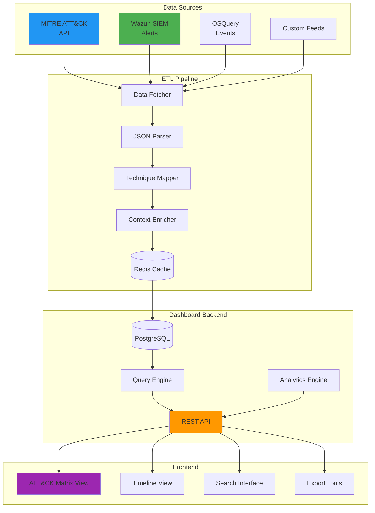
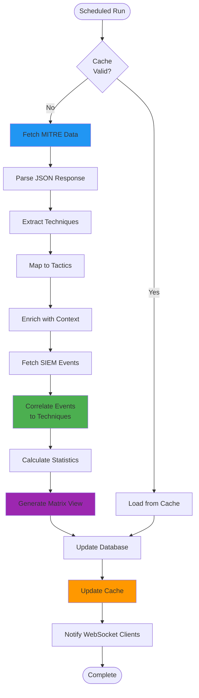
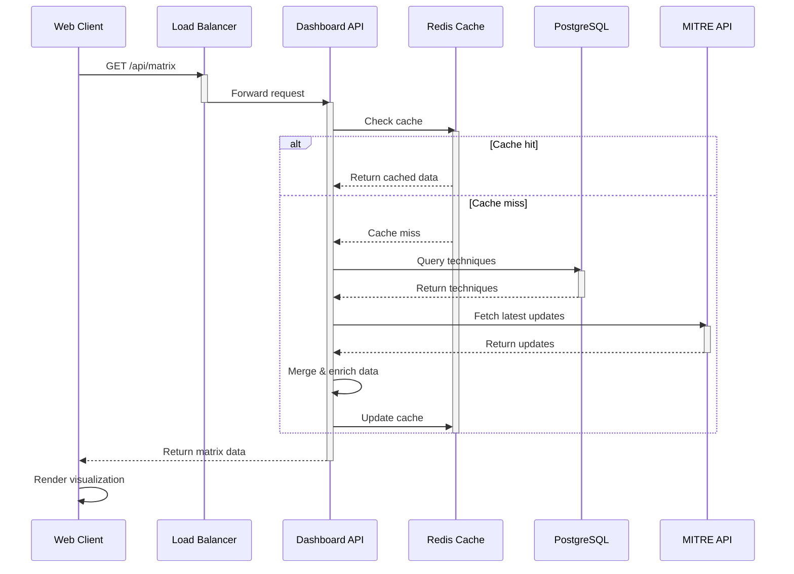
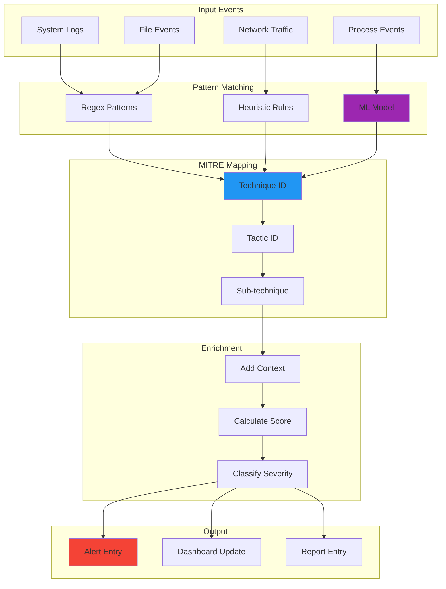
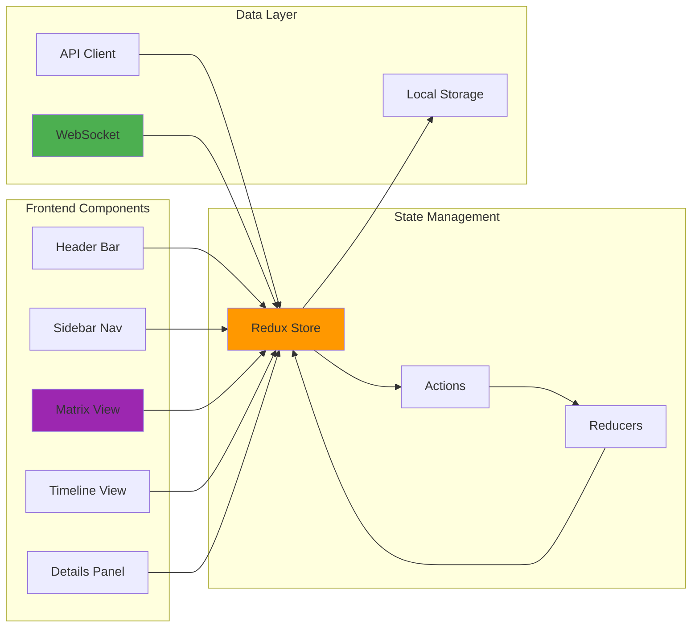
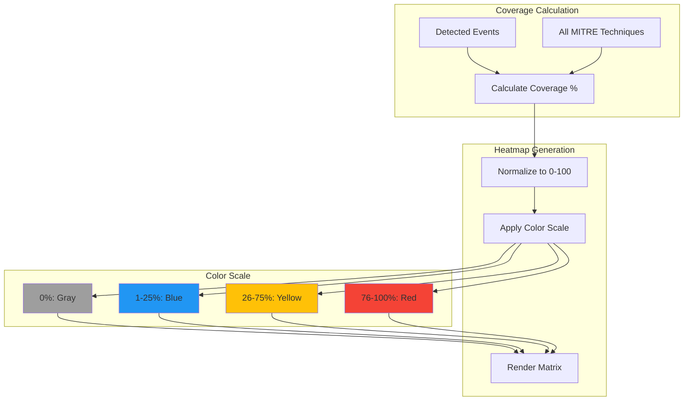

# Diagrams for 2025-09-14-threat-intelligence-mitre-attack-dashboard.md

## How to use these diagrams:

1. Copy the Mermaid diagram code blocks
2. Replace verbose code sections in your blog post
3. The diagrams will render automatically in markdown
4. Extract large code blocks (42+ lines) to GitHub gists

---

## MITRE ATT&CK Dashboard Architecture



## Data Ingestion Workflow



## API Request Flow



## Technique Mapping Process



## Dashboard Component Structure



## Usage Example

Replace this verbose code:
```python
# 42 lines of API setup and data fetching
```

With:
```python
# Essential setup only
dashboard = ATTACKDashboard(
    api_key=os.getenv("MITRE_API_KEY"),
    cache_ttl=3600
)
matrix_data = dashboard.get_matrix()
# Full implementation: https://gist.github.com/...
```

And add architecture diagram above the code.

## Coverage Heatmap Data Structure


