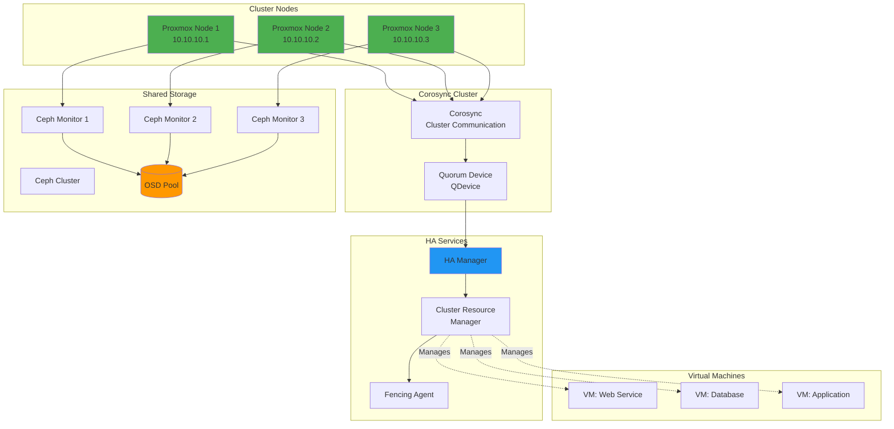
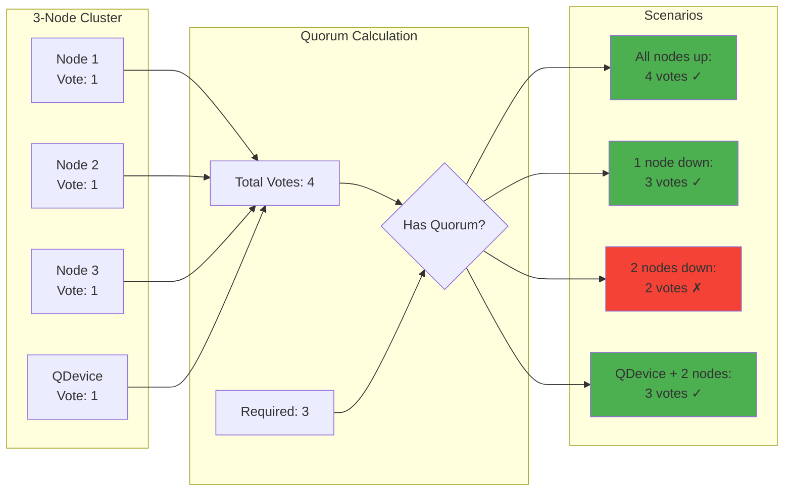
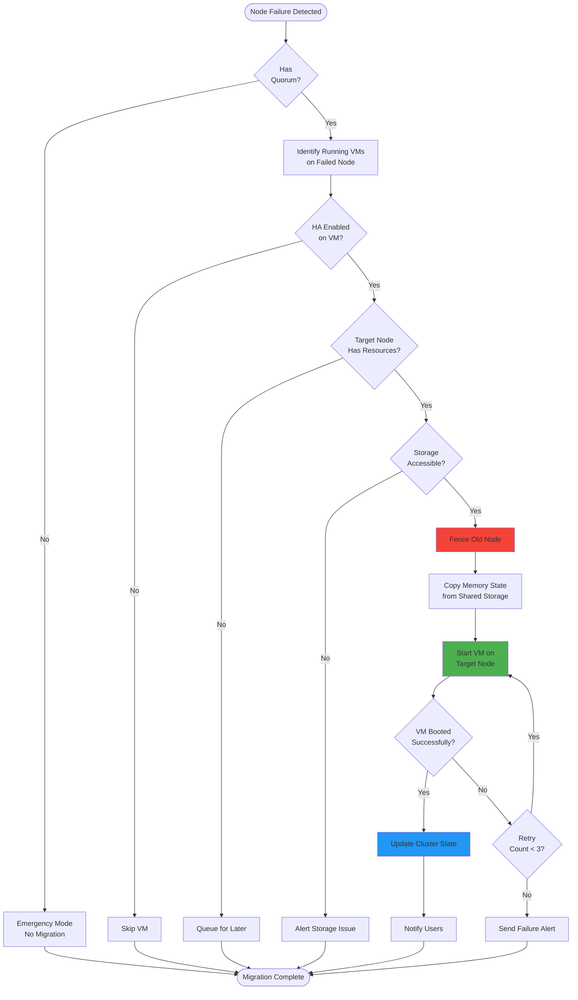
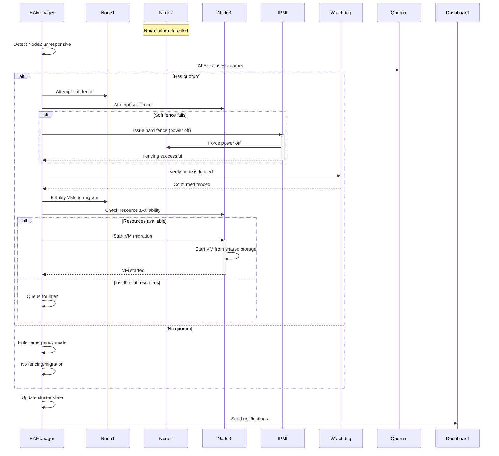
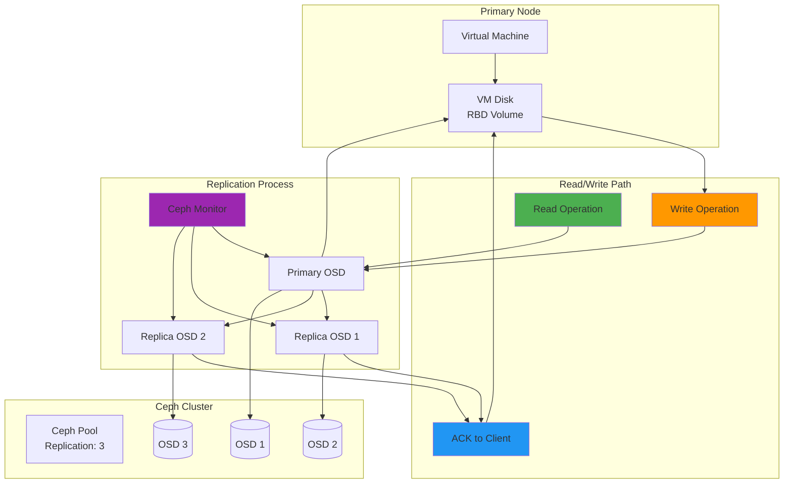
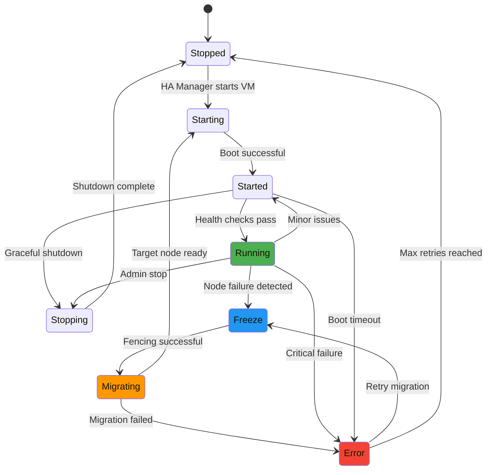
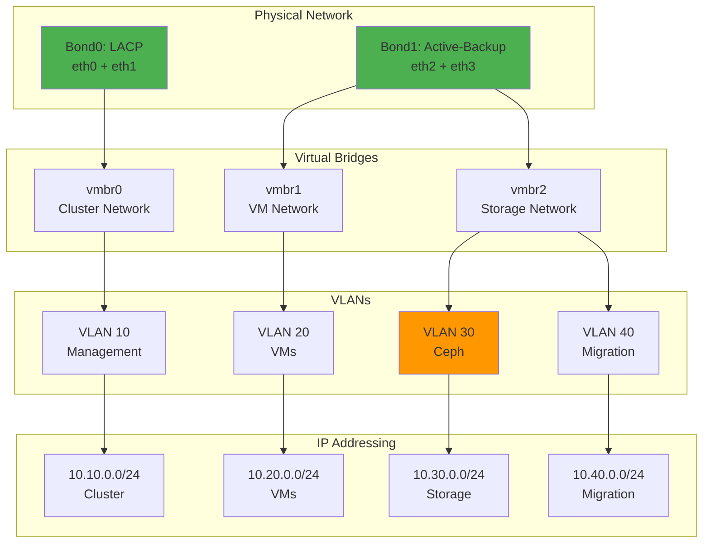
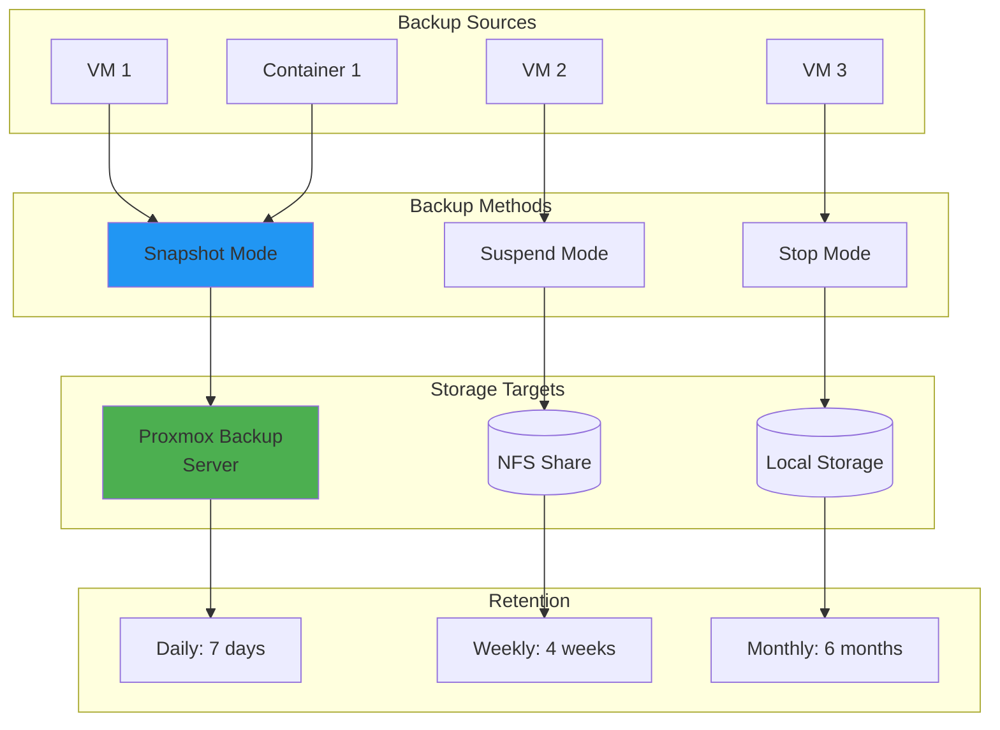

# Diagrams for 2025-09-29-proxmox-high-availability-homelab.md

## How to use these diagrams:

1. Copy the Mermaid diagram code blocks
2. Replace verbose code sections in your blog post
3. The diagrams will render automatically in markdown
4. Extract large configuration blocks (56+ lines) to GitHub gists

---

## Proxmox HA Cluster Architecture



## Quorum and Voting



## VM Migration Workflow



## Fencing Process



## Storage Replication



## HA State Machine



## Network Configuration



## Usage Example

Replace this verbose configuration:
```bash
# 56 lines of cluster configuration
```

With:
```bash
# Essential config only
pvecm create homelab-cluster \
  --bindnet0 10.10.0.0/24 \
  --ring0_addr 10.10.0.1

# Full configuration: https://gist.github.com/...
```

And add cluster architecture diagram above the code.

## Backup Strategy


