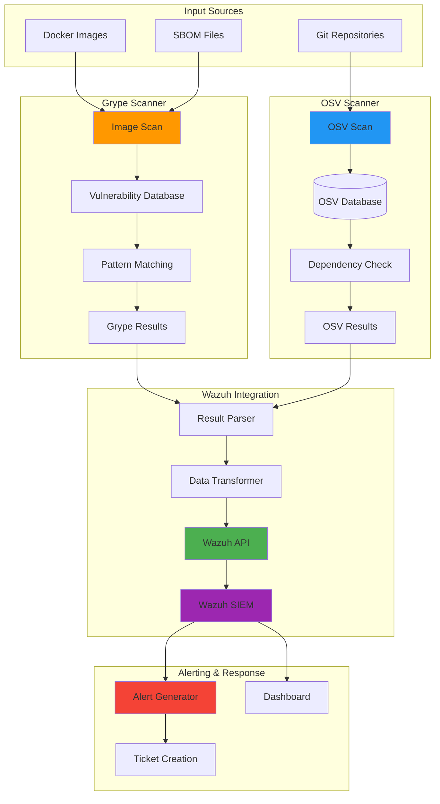
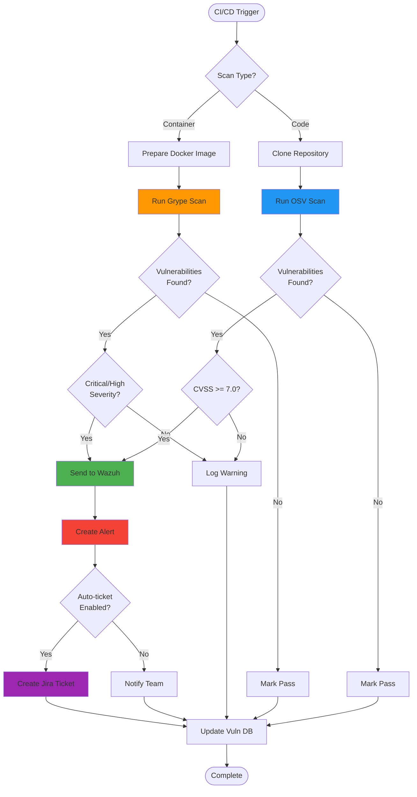
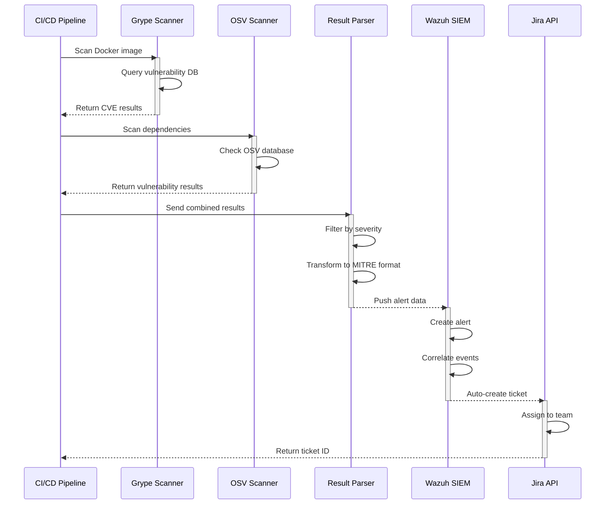
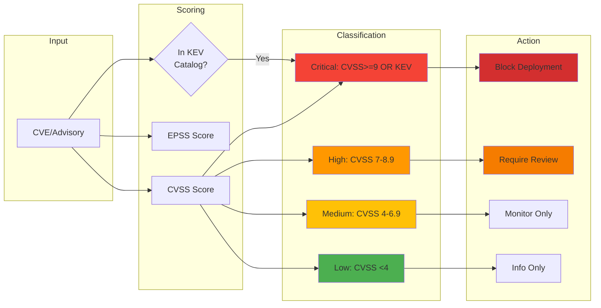

# Diagrams for 2025-10-06-automated-security-scanning-pipeline.md

## How to use these diagrams:

1. Copy the Mermaid diagram code blocks
2. Replace verbose code sections in your blog post
3. The diagrams will render automatically in markdown
4. Extract large code blocks (58+ lines) to GitHub gists

---

## Security Scanning Architecture



## Scanning Workflow



## Data Flow Sequence



## Severity Classification



## Usage Example

Replace this verbose code:
```python
# 58 lines of scanner configuration code
```

With:
```python
# Essential config only (5-10 lines)
scanner = VulnScanner(
    grype_db="/var/lib/grype",
    osv_cache="/var/cache/osv",
    wazuh_endpoint="https://wazuh.local:55000"
)
scanner.scan_image("myapp:latest")
# Full config: https://gist.github.com/...
```

And add architecture diagram above the code.
