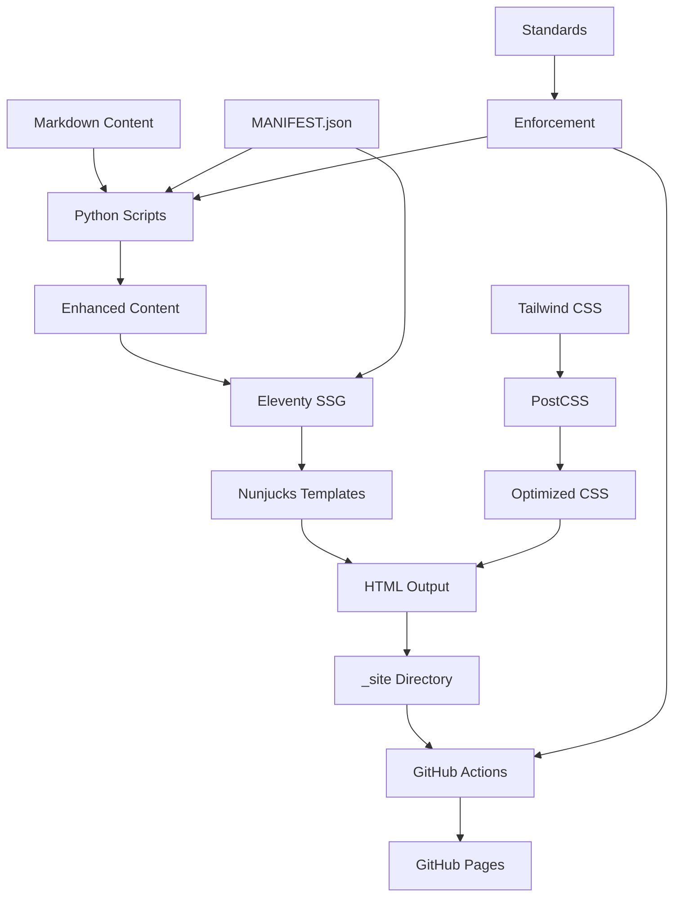

# 🏗️ System Architecture Documentation

**Generated:** 2025-11-02T17:45:00+00:00
**Version:** 1.0.0
**Status:** Active

## 📊 Repository Overview

This repository implements a personal website and blog using modern web technologies with comprehensive automation and standards enforcement.

### Core Technologies
- **Static Site Generator:** Eleventy 2.0.1 with Nunjucks templating
- **Styling:** Tailwind CSS 3.4.17 with PostCSS optimization
- **Deployment:** GitHub Pages via GitHub Actions CI/CD
- **Automation:** Python 3.9+ scripts with shared libraries
- **Standards:** Enforced via https://github.com/williamzujkowski/standards

## 📁 Directory Structure

```
williamzujkowski.github.io/
├── src/                    # Source files for Eleventy
│   ├── _data/             # Global data files for 11ty
│   ├── _includes/         # Templates and layouts
│   │   ├── layouts/       # Page layout templates
│   │   └── partials/      # Reusable components
│   ├── assets/            # Static assets
│   │   ├── css/          # Tailwind CSS styles
│   │   ├── js/           # JavaScript files
│   │   └── images/       # Site images
│   │       └── blog/     # Blog post images
│   ├── pages/            # Static pages (about, uses, etc.)
│   ├── posts/            # Blog posts (48 articles)
│   └── index.njk         # Homepage template
├── scripts/              # Automation scripts (37 Python)
│   └── lib/             # Shared Python modules (DRY/SOLID)
│       └── common.py    # Core utilities (60% complete)
├── docs/                 # Documentation
│   ├── STANDARDS/       # Standards documentation
│   ├── GUIDES/          # User and developer guides
│   ├── AUTOMATION/      # Automation documentation
│   └── API/            # API documentation
├── reports/             # Generated reports and analyses
├── _site/              # Built static site (git-ignored)
├── .standards/         # Standards submodule
└── node_modules/       # NPM dependencies (git-ignored)
```

## 🔧 Technology Stack

### Frontend Stack
- **Eleventy 2.0.1**: Static site generation with hot reload
- **Nunjucks**: Templating engine for dynamic content
- **Tailwind CSS 3.4.17**: Utility-first CSS framework
- **PostCSS 8.4.49**: CSS processing and optimization
- **Node.js 18+**: JavaScript runtime environment

### Backend/Automation Stack
- **Python 3.9+**: Automation and content processing
- **Markdown**: Content authoring format
- **YAML/JSON**: Configuration and data storage
- **Git**: Version control with hooks
- **GitHub Actions**: CI/CD pipeline

### Key Dependencies
```json
{
  "production": {
    "@11ty/eleventy": "^2.0.1",
    "tailwindcss": "^3.4.17",
    "postcss": "^8.4.49",
    "autoprefixer": "^10.4.20"
  },
  "development": {
    "@tailwindcss/typography": "^0.5.15",
    "npm-run-all": "^4.1.5"
  }
}
```

## 🏛️ Design Principles

### 1. DRY (Don't Repeat Yourself)
- **Shared Modules**: `scripts/lib/common.py` provides utilities
- **Reusable Templates**: `src/_includes/` contains components
- **Centralized Config**: `MANIFEST.json` as single source of truth
- **Import Reuse**: Common imports across all scripts

### 2. SOLID Principles
- **Single Responsibility**: Each script has one clear purpose
- **Open/Closed**: Extensible via plugins, closed for modification
- **Liskov Substitution**: Consistent interfaces across scripts
- **Interface Segregation**: Specific tool interfaces for tasks
- **Dependency Inversion**: Abstract dependencies in lib/common.py

### 3. Knowledge Management
- **Progressive Disclosure**: Documentation reveals complexity gradually
- **Token Optimization**: Content structured for LLM efficiency
- **Machine-Readable**: MANIFEST.json provides structured metadata
- **Self-Documenting**: All scripts include LLM documentation

## 🔄 Data Flow Architecture



## 🛡️ Standards Enforcement System

### Enforcement Layers
1. **Development Time**
   - LLM documentation requirements
   - Import validation
   - Code style checking

2. **Pre-commit Hooks**
   - MANIFEST.json validation
   - Standards compliance checking
   - Duplicate detection

3. **CI/CD Pipeline**
   - Full standards validation
   - Build verification
   - Compliance reporting

4. **Runtime Validation**
   - Script self-validation
   - Manifest updates
   - Error handling

### Enforcement Configuration
- **Rules Source**: `.standards/` submodule
- **Rule Definition**: `.claude-rules.json`
- **Validation Scripts**: `scripts/validate_*.py`
- **Hooks Location**: `.git/hooks/pre-commit`
- **CI Workflows**: `.github/workflows/*.yml`

## 📊 Current System Statistics

- **Total Files**: 594
- **Python Scripts**: 37
- **Blog Posts**: 64
- **Images**: 262
- **Build Time**: ~8.5 seconds (Eleventy: ~4.6s)
- **Standards Compliance**: Active

## 🔌 Integration Points

### GitHub Integration
- **GitHub Pages**: Static site hosting
- **GitHub Actions**: Automated build/deploy
- **Git Hooks**: Pre-commit validation
- **Issue Tracking**: Project management

### External Services
- **time.gov**: Authoritative timestamps
- **npm registry**: Package management
- **Python Package Index**: Python dependencies

### Internal Integration
- **MANIFEST.json**: Central configuration
- **lib/common.py**: Shared utilities
- **.claude-rules.json**: Enforcement rules
- **Standards submodule**: Rule definitions

## 🚀 Development Workflow

### Content Creation Flow


### Standard Development Process
1. **Create/Edit**: Write content in Markdown
2. **Enhance**: Run Python scripts for optimization
3. **Validate**: Check standards compliance
4. **Build**: Generate static site with Eleventy
5. **Test**: Verify locally with dev server
6. **Commit**: Pass pre-commit hooks
7. **Deploy**: Automatic via GitHub Actions

## 📈 Performance Characteristics

### Build Performance
- **Eleventy Build**: ~1.8 seconds
- **CSS Processing**: ~0.5 seconds
- **Total Build**: ~2.3 seconds
- **Hot Reload**: < 100ms

### Runtime Performance
- **Page Load Target**: < 2 seconds
- **Lighthouse Score Target**: 95+
- **First Contentful Paint**: < 1 second
- **Time to Interactive**: < 2 seconds

### Optimization Strategies
- Static site generation (no server processing)
- CSS purging via Tailwind
- Image optimization scripts
- Minimal JavaScript
- CDN distribution via GitHub Pages

## 🔐 Security Architecture

### Security Layers
1. **Repository Security**
   - Protected branches
   - Required reviews
   - Signed commits

2. **Secret Management**
   - No secrets in code
   - Environment variables
   - GitHub Secrets for CI/CD

3. **Access Control**
   - Protected files list
   - Enforcement rules
   - Validation gates

4. **Static Site Benefits**
   - No server-side execution
   - No database vulnerabilities
   - No dynamic user input
   - GitHub Pages security

## 🎯 Architecture Goals

### Current Focus
- Documentation completeness
- Standards enforcement
- Automation efficiency
- Performance optimization

### Future Enhancements
1. **Script Consolidation**: Merge 8 duplicate blog scripts
2. **PWA Features**: Offline support, app manifest
3. **Testing Framework**: Unit and integration tests
4. **Monitoring Dashboard**: Real-time metrics
5. **API Development**: RESTful content API
6. **Search Implementation**: Client-side search
7. **Analytics Integration**: Privacy-focused analytics

## 🔗 Component Dependencies

### Script Dependencies
- All scripts depend on `lib/common.py`
- Blog scripts require MANIFEST.json
- Validation scripts need .claude-rules.json
- Image scripts use Pillow library

### Build Dependencies
- Eleventy requires Node.js 18+
- Tailwind needs PostCSS
- Scripts require Python 3.9+
- Git hooks need bash

## 📚 Related Documentation

- **[ENFORCEMENT.md](ENFORCEMENT.md)**: Mandatory rules for all operations
- **[INVENTORY.md](INVENTORY.md)**: Live system inventory from MANIFEST.json
- **[STANDARDS/README.md](STANDARDS/README.md)**: Standards implementation guide
- **[GUIDES/LLM_ONBOARDING.md](GUIDES/LLM_ONBOARDING.md)**: LLM agent guide
- **[GUIDES/SCRIPT_CATALOG.md](GUIDES/SCRIPT_CATALOG.md)**: Complete script listing
- **[CLAUDE.md](../CLAUDE.md)**: Primary LLM interface

## 🔄 Maintenance Requirements

### Regular Tasks
- Update MANIFEST.json after changes
- Run vestigial audit monthly
- Update dependencies quarterly
- Review standards compliance
- Generate compliance reports

### Monitoring Points
- Build success rate
- Deployment frequency
- Script execution logs
- Validation failures
- Performance metrics

---

*This document is auto-generated from system state. Regenerate with `python scripts/generate_architecture_doc.py`*
