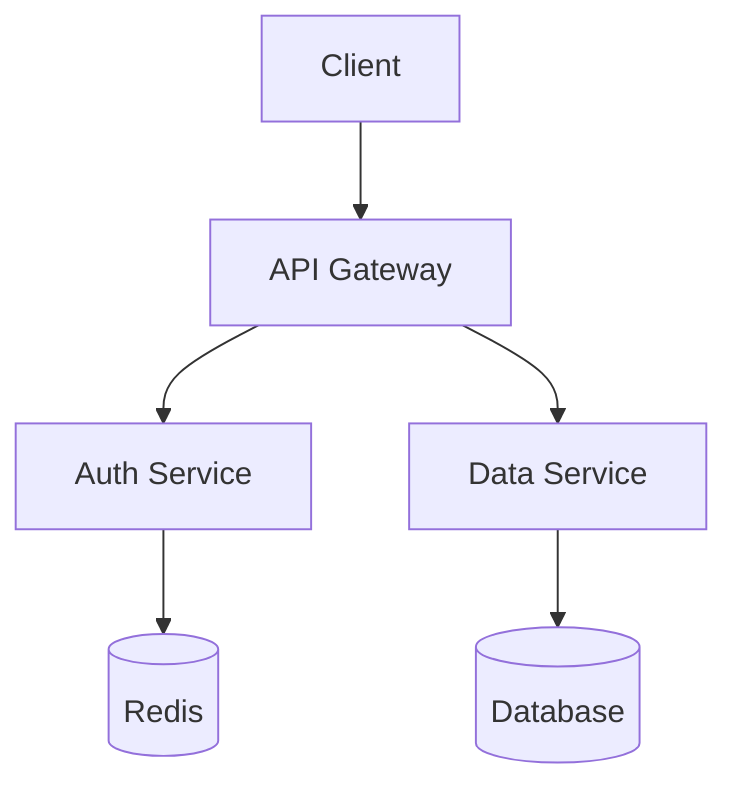
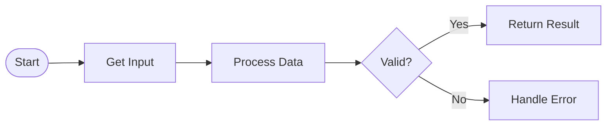
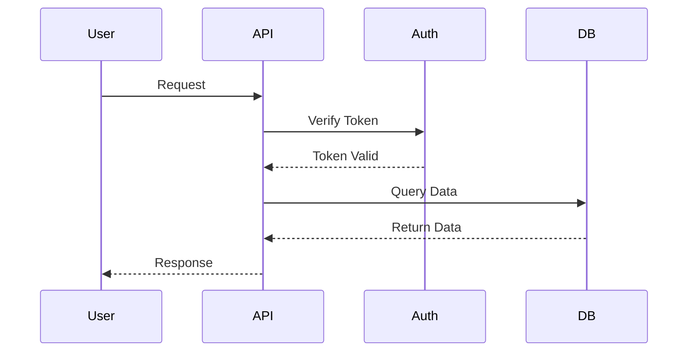

# Blog Visual Enhancement Guide

## Overview

This guide documents the visual enhancement system for blog posts, including image management, diagram generation, and content optimization strategies.

## Current Status

### ✅ Completed
- Removed 352 generic hero images that duplicated content
- Created blog content analyzer to identify high-code posts
- Generated Mermaid diagram templates for 8 high-priority posts
- Developed Playwright-based image search system (no API keys required)
- Created optimization scripts and templates

### 📊 Analysis Results

**High Priority Posts (>40% code):**
1. Vulnerability Management at Scale (93.3% code)
2. eBPF Security Monitoring (85.2% code)
3. Automating Home Network Security (80.1% code)
4. Raspberry Pi Security Projects (77.4% code)
5. Securing Personal AI Experiments (71.5% code)
6. DNS-over-HTTPS Implementation (67.1% code)
7. Local LLM Deployment (51.8% code)
8. Claude-Flow Development (47.4% code)
9. Zero Trust Security (43.0% code)

## Visual Enhancement Strategy

### 1. Replace Code with Diagrams

Use Mermaid diagrams to visualize:
- **Architecture diagrams** - System components and relationships
- **Flowcharts** - Process flows and decision trees
- **Sequence diagrams** - API interactions and workflows
- **Network diagrams** - Topology and connections
- **Data flow diagrams** - Information movement

### 2. Code Reduction Guidelines

**Keep Code Blocks Small:**
- Show only essential snippets (5-10 lines max)
- Use "..." to indicate omitted sections
- Focus on unique/important logic
- Remove boilerplate and imports

**Example Before:**
```python
import os
import sys
import json
import logging
from datetime import datetime
from typing import Dict, List, Optional
import requests
from requests.exceptions import RequestException

class VulnerabilityScanner:
    def __init__(self, config_path: str):
        self.config = self.load_config(config_path)
        self.logger = self.setup_logging()
        self.session = requests.Session()
        # ... 50 more lines
```

**Example After:**
```python
class VulnerabilityScanner:
    def scan_target(self, target: str) -> List[Vulnerability]:
        """Core scanning logic - simplified"""
        vulnerabilities = []
        for check in self.security_checks:
            if result := check.scan(target):
                vulnerabilities.append(result)
        return vulnerabilities
```

### 3. Visual Content Types

**Instead of Code, Use:**

| Content Type | When to Use | Tools |
|-------------|------------|-------|
| Architecture Diagrams | System design, components | Mermaid, draw.io |
| Flowcharts | Workflows, processes | Mermaid flowchart |
| Sequence Diagrams | API calls, interactions | Mermaid sequence |
| Comparison Tables | Multiple options/approaches | Markdown tables |
| Screenshots | UI changes, dashboards | Native tools |
| Infographics | Statistics, metrics | Canva, Figma |
| Network Diagrams | Infrastructure, topology | draw.io |
| Before/After | Transformations | Side-by-side images |

## Scripts and Tools

### 1. Content Analysis
```bash
# Analyze posts for code-to-text ratio
python scripts/optimize-blog-content.py
```

### 2. Diagram Generation
```bash
# Generate Mermaid diagram templates
python scripts/create-blog-diagrams.py
```

### 3. Image Search (Playwright)
```bash
# Search and download relevant stock images
python scripts/playwright-image-search.py
```

### 4. Cleanup Tools
```bash
# Remove generic hero images
python scripts/remove-hero-images.py
```

## Mermaid Diagram Examples

### Architecture Diagram


### Process Flow


### Sequence Diagram


## Image Attribution Template

When adding stock images, use this frontmatter format:

```yaml
images:
  hero:
    src: /assets/images/blog/stock/post-name-hero.jpg
    alt: Descriptive alt text
    caption: Photo by Photographer Name on Source
    attribution:
      photographer: Photographer Name
      source: Pexels/Unsplash/Pixabay
      source_url: https://source.com/photo-url
      license: License Type (Free to use)
```

## Best Practices

### Do's ✅
- Use diagrams at the beginning for context
- Keep code snippets focused and concise
- Add captions to all visual content
- Provide alt text for accessibility
- Link to full code in GitHub/Gists
- Use tables for comparisons
- Include screenshots for UI elements

### Don'ts ❌
- Don't include entire files of code
- Don't use generic stock photos
- Don't forget image attribution
- Don't use complex diagrams without explanation
- Don't duplicate information in code and text

## Implementation Checklist

For each high-priority post:

- [ ] Identify verbose code blocks
- [ ] Create appropriate diagrams
- [ ] Reduce code to essential snippets
- [ ] Add relevant stock images (if needed)
- [ ] Include proper attribution
- [ ] Test diagram rendering
- [ ] Verify improved readability
- [ ] Update post metadata

## Monitoring and Metrics

Track improvements:
- **Code ratio**: Target <25% for most posts
- **Load time**: Measure page load improvements
- **Engagement**: Monitor time on page
- **Accessibility**: Ensure all visuals have alt text

## Future Enhancements

1. **Animated Diagrams**: Use Mermaid's animation features
2. **Interactive Elements**: Add clickable diagrams
3. **Video Embeds**: Short explainer videos
4. **Code Sandboxes**: Embedded runnable examples
5. **Progressive Loading**: Lazy load images

## Resources

- [Mermaid Documentation](https://mermaid-js.github.io/)
- [Pexels Free Stock Photos](https://www.pexels.com/)
- [Unsplash Free Images](https://unsplash.com/)
- [Pixabay Stock Media](https://pixabay.com/)
- [draw.io Diagram Tool](https://app.diagrams.net/)

## Summary

The visual enhancement system transforms text-heavy technical posts into engaging, visual content that's easier to understand and more pleasant to read. By replacing verbose code blocks with diagrams and using relevant images strategically, we improve both user experience and page performance.