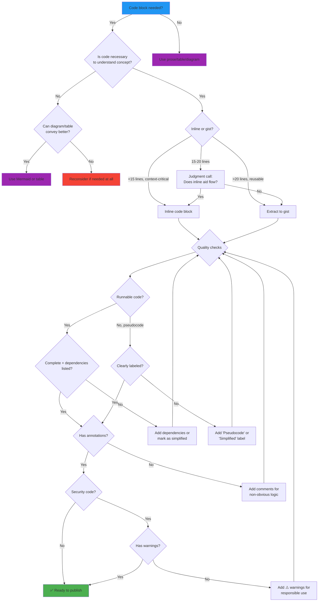

# Code Block Content Standards

**Status:** AUTHORITATIVE
**Version:** 1.0.0
**Created:** 2025-11-03
**Last Updated:** 2025-11-03
**Purpose:** Define quality standards for code block inclusion in blog posts

---

## Philosophy: Quality Over Metrics

**Core Principle:** Code blocks should enhance reader understanding, not pad content or satisfy arbitrary ratios.

The 25% code-to-content ratio threshold is a **ceiling, not a target**. It exists to prevent posts from becoming code dumps. It does NOT mean:
- ❌ Padding posts with explanatory prose to "dilute" code ratios
- ❌ Removing educational diagrams that aid comprehension
- ❌ Extracting every code snippet to gists when inline examples serve readers better

**The Goal:** Every code block should **earn its place** by serving readers.

---

## Decision Framework: Should This Be Code?

### Stage 1: Necessity Test

Answer these questions in order:

#### 1.1: Is this code **necessary** to understand the concept?

**YES → Continue to 1.2**

Examples:
- ✅ `docker run` command showing exact syntax for tutorial
- ✅ API endpoint configuration demonstrating security pattern
- ✅ eBPF program showing kernel hook implementation

**NO → Consider alternatives (prose, table, diagram)**

Examples:
- ❌ 50-line Dockerfile when "Use Alpine base image" suffices
- ❌ Full REST API client when concept is authentication flow
- ❌ Complete config file when only one field matters

#### 1.2: Does inline code serve readers better than a gist link?

**Inline is BETTER when:**
- Reader needs to **reference while reading** (configuration values, short commands)
- Code is **self-contained** and <15 lines
- Code demonstrates **specific point** in surrounding prose
- Interrupting flow to visit gist would **break context**

**Gist is BETTER when:**
- Code is **reusable** across multiple projects (Docker Compose, Ansible playbooks)
- File is **complete implementation** readers will copy-paste wholesale
- Code is >20 lines and serves as **reference material** not inline explanation
- Maintaining **latest version** outside post content is valuable

#### 1.3: Is the code **runnable and complete**?

**MUST be runnable if:**
- Labeled as "implementation," "example," or "working code"
- Tutorial or how-to guide
- Security proof-of-concept

**Can be pseudocode/incomplete if:**
- Illustrating **concept** not implementation ("detection logic simplified")
- Showing **pattern** not actual code ("core algorithm sketch")
- Full implementation available in linked gist

---

### Stage 2: Quality Requirements

Once you've decided code is necessary and format (inline vs gist), ensure quality:

#### 2.1: Completeness Standards

| Code Type | Completeness Requirement |
|-----------|-------------------------|
| **Production code** | Must be runnable as-is with clear dependencies |
| **Tutorial examples** | Must execute without errors in stated environment |
| **Conceptual illustrations** | Must be syntactically valid, labeled as "simplified" if truncated |
| **Pseudocode** | Must clearly indicate it's pseudocode (use `# Pseudocode` or `// Simplified logic`) |
| **Configuration** | Must show real values or clearly mark placeholders (`YOUR_API_KEY`) |

**Bad Example (unmarked pseudocode):**
```python
def detect_threat(event):
    if suspicious(event):
        alert()
```

**Good Example (clearly labeled):**
```python
# Simplified detection logic (full implementation in gist)
def detect_threat(event):
    if suspicious(event):  # Real: 200+ heuristics
        alert()  # Real: Multi-stage response pipeline
```

#### 2.2: Annotation Requirements

**MUST include comments for:**
- Non-obvious logic ("Why 443?" → "Standard HTTPS port")
- Security implications ("⚠️ Never disable cert validation in production")
- Configuration choices ("Alpine chosen for 5MB base image vs 100MB Ubuntu")
- Assumptions ("Requires Kubernetes 1.28+ for ValidatingAdmissionPolicy")

**Example:**
```bash
# Download blocklists (curated by RPiList, updated daily)
sudo wget https://raw.githubusercontent.com/RPiList/specials/master/Blocklists/malware.txt

# Update Pi-hole's gravity database (may take 2-3 min on first run)
pihole -g
```

#### 2.3: Attribution Standards

**MUST attribute when:**
- Code adapted from specific project/author
- Using non-trivial algorithms from research
- Configuration from official documentation

**Format:**
```python
# Adapted from BCC tools (Apache 2.0)
# https://github.com/iovisor/bcc/blob/master/examples/tracing/task_switch.py
def trace_context_switches():
    # ...
```

---

### Stage 3: Alternative Representations

#### 3.1: When to Use Mermaid Diagrams vs Code

**Use Mermaid when:**
- Showing **architecture** or **data flow**
- Visualizing **relationships** between components
- Illustrating **sequence** of operations
- Depicting **state transitions**

**Use code when:**
- Showing **exact syntax** readers will type
- Demonstrating **API usage** patterns
- Providing **runnable examples**

**Example Decision:**

**Question:** How do I show eBPF event flow from kernel to userspace?

- ✅ **Mermaid sequence diagram** (shows relationships, timing, actors)
- ❌ Code snippet (would be implementation details, not conceptual flow)

**Question:** How do I configure eBPF program attachment?

- ❌ Mermaid diagram (would just be boxes with text, no value over prose)
- ✅ **Code example** (readers need exact BCC Python syntax)

#### 3.2: When to Use Tables vs Config Files

**Use table when:**
- Showing **options/settings** comparison
- Documenting **API parameters**
- Listing **required/optional** fields

**Use config file when:**
- Showing **complete configuration** structure
- File will be **copy-pasted** as-is
- Demonstrating **syntax** or **nesting**

**Example:**

**Table format:**
| Setting | Default | Security Impact |
|---------|---------|----------------|
| `encryption` | `false` | HIGH - Always enable in production |
| `auth_timeout` | `300s` | MEDIUM - Reduce to 60s for sensitive systems |

**Config file format:**
```yaml
# docker-compose.yml
services:
  app:
    environment:
      ENCRYPTION: "true"  # Required for production
      AUTH_TIMEOUT: "60s"  # Tighter than 300s default
```

#### 3.3: When to Use Prose vs Code

**Use prose when:**
- Concept is **simple** and code adds no clarity
- Listing **generic steps** not specific implementation
- Describing **why** not how

**Use code when:**
- **Exact syntax** matters (CLI commands, API calls)
- **Precision** prevents errors (regex patterns, file paths)
- Showing **real-world example** not abstract concept

**Bad (unnecessary code):**
```bash
# Navigate to home directory
cd ~
# List files
ls
```

**Good (prose):**
Navigate to your home directory and list files to verify the installation created a `.config` folder.

**Good (necessary code):**
```bash
# Verify Pi-hole installed correctly
pihole status
# Expected output: "Pi-hole blocking is enabled"
```

---

## Post Type Policies

Different post types have different code block expectations:

### Tutorial Posts

**Characteristics:**
- Step-by-step instructions
- Readers follow along

**Code Standards:**
- ✅ **High code ratio acceptable** (30-40%) if tutorial-focused
- ✅ All code must be **runnable as-written**
- ✅ Clear **prerequisites** and dependencies
- ✅ Expected **output** shown for verification

**Threshold:** 35% (higher than default 25% for conceptual posts)

### Conceptual/Educational Posts

**Characteristics:**
- Explaining "how it works"
- Architecture and theory

**Code Standards:**
- ✅ **Lower code ratio** (15-25%)
- ✅ Mermaid diagrams **preferred** over code for architecture
- ✅ Code used **sparingly** to illustrate specific points
- ✅ Pseudocode **acceptable** if clearly labeled

**Threshold:** 25% (default)

**Special Case: DIAGRAM-HEAVY Posts**

Posts with >80% Mermaid content (e.g., eBPF guide with 97.3% Mermaid) are **educational visualizations**, not code dumps. These may exceed 25% total ratio if:
- Diagrams are **essential** to understanding (not decorative)
- Actual code content remains **<10% of post**
- Alternative formats (prose, tables) would **reduce comprehension**

**Policy:** Flag as `DIAGRAM-HEAVY` in calculator, review manually for necessity.

### Experience Reports

**Characteristics:**
- "What I learned from..."
- Personal projects

**Code Standards:**
- ✅ **Minimal code** (10-20%)
- ✅ Focus on **lessons learned** not implementation details
- ✅ Link to **GitHub repo** for full code
- ✅ Inline snippets show **key insights** only

**Threshold:** 20%

### Security Analysis Posts

**Characteristics:**
- Vulnerability research
- Threat modeling

**Code Standards:**
- ✅ **Proof-of-concept** code acceptable (25-30%)
- ✅ Must include **warnings** about responsible disclosure
- ✅ Working exploits should be **gists** (not inline)
- ✅ Detection rules acceptable inline (YARA, Sigma)

**Threshold:** 30% (higher for PoC demonstrations)

---

## Measurement Philosophy

### What Counts Against Ratio?

**Currently counted:**
- All fenced code blocks (```)
- Bash commands
- Python/JavaScript/etc.
- Configuration files (YAML, JSON, TOML)
- **Mermaid diagrams** (debatable - see below)

**Not counted:**
- Inline code spans (\`single backticks\`)
- Frontmatter metadata
- Blockquotes

### Should Mermaid Count Differently?

**Current State:** Mermaid blocks count 1:1 with code blocks.

**Arguments for differential weighting:**

**AGAINST current policy (Mermaid should count less):**
- Mermaid is **declarative markup**, not procedural code
- Purpose is **educational visualization**, not executable logic
- Encourages **removing diagrams** to hit ratio, reducing comprehension
- Posts like eBPF guide (97.3% Mermaid) are educational, not code-heavy

**FOR current policy (Mermaid should count same):**
- Still technical content occupying visual space
- Can be overused (decorative diagrams add no value)
- Simple threshold prevents complexity ("Is this diagram necessary?")

**Recommendation:** **Add DIAGRAM-HEAVY classification** (already implemented in v1.1.0):
- Posts with >80% Mermaid flagged for manual review
- Keep 25% total threshold for **actual code**
- Accept educational diagram posts that exceed ratio if **actual code <10%**

### Alternative Thresholds by Post Type

**Proposed tiered thresholds:**

| Post Type | Total Code | Actual Code (non-Mermaid) | Rationale |
|-----------|-----------|---------------------------|-----------|
| Tutorial | 35% | 30% | Step-by-step needs examples |
| Conceptual | 25% | 20% | Diagrams + light code |
| Experience | 20% | 15% | Lessons > implementation |
| Security Analysis | 30% | 25% | PoC demonstrations |
| DIAGRAM-HEAVY | 60%* | 10% | Educational visualizations (*if >80% Mermaid) |

**Implementation:** Add `post_type` frontmatter field, calculator uses appropriate threshold.

---

## Enforcement Recommendations

### Pre-Commit Hooks

**Current implementation:**
- ✅ Blocks commits if code ratio >25%
- ✅ Detects DIAGRAM-HEAVY posts (v1.1.0)

**Recommended additions:**
```python
# In precommit_validators.py

def validate_code_quality(code_blocks):
    """Enforce code block quality standards."""
    issues = []

    for block in code_blocks:
        # Check 1: Runnable code must have clear language tag
        if not block.language and "implementation" in surrounding_prose:
            issues.append(f"Line {block.start}: Runnable code needs language tag")

        # Check 2: Truncated code must be marked
        if "..." in block.code and "simplified" not in surrounding_prose:
            issues.append(f"Line {block.start}: Truncated code must be labeled")

        # Check 3: Security code needs warnings
        if any(word in block.code for word in ['exploit', 'vulnerability', 'attack']):
            if "⚠️" not in surrounding_prose:
                issues.append(f"Line {block.start}: Security code needs warning")

    return issues
```

### Validation Scripts

**New script:** `scripts/blog-content/validate-code-blocks.py`

**Checks:**
1. All code blocks have language tags (except Mermaid)
2. Runnable code includes dependencies/prerequisites in prose
3. Config files show real values or clear placeholders
4. Security PoCs include responsible disclosure warnings
5. Truncated code labeled as "simplified" or "pseudocode"

### CLAUDE.md Integration

**Location:** `docs/context/standards/code-block-standards.md`

**Cross-references:**
- `workflows/blog-writing.md`: Add code quality checklist
- `workflows/gist-management.md`: Update inline vs gist decision tree
- `standards/humanization-standards.md`: Code annotation as human voice

**Update blog-writing.md checklist:**
```markdown
- [ ] Code blocks have clear language tags
- [ ] Runnable code is complete with dependencies
- [ ] Pseudocode/simplified code is labeled
- [ ] Security code includes warnings
- [ ] Gist vs inline decision documented (why inline if >15 lines)
```

---

## Examples: Good vs Bad Code Blocks

### Example 1: Tutorial Command

**❌ Bad (no context):**
```bash
docker run -d nginx
```

**✅ Good (annotated):**
```bash
# Start nginx container in background
# -d: Detached mode (runs in background)
# Default port 80 will be exposed
docker run -d nginx
```

### Example 2: Configuration

**❌ Bad (truncated without explanation):**
```yaml
services:
  db:
    image: postgres
    # ... more config
```

**✅ Good (complete or linked):**
```yaml
# docker-compose.yml (minimal secure config)
services:
  db:
    image: postgres:16-alpine  # Lightweight production image
    environment:
      POSTGRES_PASSWORD_FILE: /run/secrets/db_password  # Never hardcode passwords
    secrets:
      - db_password
# Full config with monitoring/backups: https://gist.github.com/user/abc123
```

### Example 3: Security PoC

**❌ Bad (working exploit, no warning):**
```python
def exploit_rce(target_url):
    payload = "'; DROP TABLE users; --"
    requests.post(target_url, data={'input': payload})
```

**✅ Good (warning + responsible disclosure):**
```python
# ⚠️ EDUCATIONAL ONLY - Do not use against systems you don't own
# Vulnerability disclosed to vendor 2024-08-15, patched in v2.3.4
# This demonstrates SQL injection for detection rule development

def demonstrate_sql_injection():
    # Simplified logic (not working exploit)
    malicious_input = "'; DROP TABLE users; --"
    # Real implementation would sanitize with parameterized queries
```

### Example 4: Conceptual Algorithm

**❌ Bad (looks like working code but isn't):**
```python
def detect_anomaly(data):
    if unusual(data):
        return alert()
```

**✅ Good (clearly pseudocode):**
```python
# Pseudocode - Full implementation: https://gist.github.com/user/xyz789
def detect_anomaly(data):
    baseline = calculate_baseline(historical_data)  # 30-day sliding window
    if deviation(data, baseline) > 3_sigma:  # Statistical outlier detection
        return trigger_alert(severity="HIGH")  # Multi-tier alerting pipeline
```

### Example 5: Inline vs Gist Decision

**Scenario:** Docker Compose file for homelab monitoring stack

**❌ Bad (75 lines inline when gist is better):**
```yaml
# docker-compose.yml (FULL FILE - 75 lines)
version: '3.8'
services:
  prometheus:
    # ... 20 lines
  grafana:
    # ... 25 lines
  alertmanager:
    # ... 30 lines
```

**✅ Good (key excerpt + gist for full file):**
```yaml
# Prometheus configuration (key security settings shown)
services:
  prometheus:
    image: prom/prometheus:latest
    command:
      - '--web.enable-admin-api=false'  # Disable dangerous admin API
      - '--web.enable-lifecycle=false'  # Prevent remote reload
# Complete stack with alerting/SSL: https://gist.github.com/user/monitoring-stack
```

---

## Decision Tree Flowchart



---

## Quality Checklist

Before publishing any post with code blocks:

**Necessity:**
- [ ] Every code block serves a clear purpose
- [ ] Inline vs gist decision documented (if ambiguous)
- [ ] Diagrams/tables considered for conceptual content

**Completeness:**
- [ ] Runnable code is complete or links to complete version
- [ ] Dependencies/prerequisites listed in prose
- [ ] Pseudocode/simplified code clearly labeled

**Annotation:**
- [ ] Non-obvious logic has comments
- [ ] Security implications noted
- [ ] Configuration choices explained
- [ ] Version/compatibility requirements stated

**Attribution:**
- [ ] Adapted code attributes original source
- [ ] License noted for non-trivial borrowed code

**Safety:**
- [ ] Security PoCs include warnings
- [ ] Exploits disabled or simplified
- [ ] Responsible disclosure timeline noted

**Formatting:**
- [ ] Language tags present (except Mermaid)
- [ ] Syntax highlighting works
- [ ] Code renders correctly on mobile

---

## Maintenance

**Review Schedule:** Quarterly
**Next Review:** 2026-02-01
**Owner:** Content Quality Team

**Changelog:**

### Version 1.0.0 (2025-11-03)
- Initial standards document
- Decision framework (necessity → quality → alternatives)
- Post type policies (tutorial 35%, conceptual 25%, etc.)
- DIAGRAM-HEAVY classification for Mermaid-heavy posts
- Enforcement recommendations (pre-commit hooks, validation scripts)
- Examples and decision tree flowchart

**Future Enhancements:**
- [ ] Implement post_type frontmatter field
- [ ] Add tiered thresholds by post type to calculator
- [ ] Create `validate-code-blocks.py` script
- [ ] Update blog-writing.md with code quality checklist
- [ ] Add code annotation examples to humanization standards

---

**Cross-References:**
- [blog-writing.md](../context/workflows/blog-writing.md) - Blog post creation workflow
- [gist-management.md](../context/workflows/gist-management.md) - Gist extraction workflow
- [code-ratio-calculator.py](../../scripts/blog-content/code-ratio-calculator.py) - Measurement tool
- [humanization-standards.md](../context/standards/humanization-standards.md) - Voice and tone

**Parent:** [CLAUDE.md](../../CLAUDE.md)
