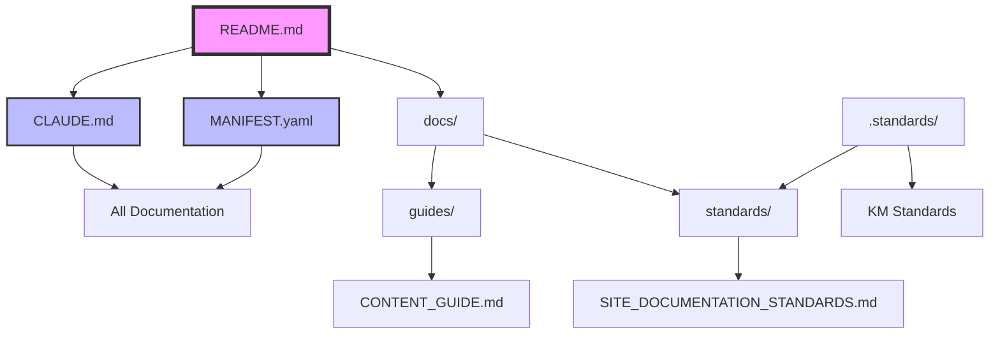
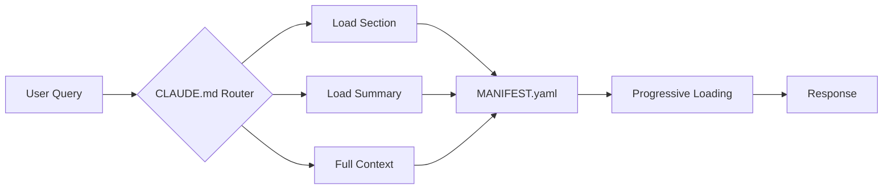

# Standards Relationship Graph

**Version:** 1.0.2  
**Last Updated:** 2025-06-26  
**Status:** Active  
**Type:** Reference Document

---

## Overview

This document maps the relationships between various standards and documentation in the williamzujkowski.github.io repository.

---

## Document Relationships

### Primary Documents



### Content Flow



---

## Dependencies

### Document Dependencies

| Document | Depends On | Required By | Related To |
|----------|-----------|-------------|------------|
| README.md (v2.2.0) | - | All docs | CLAUDE.md, MANIFEST.yaml |
| CLAUDE.md (v4.5.1) | MANIFEST.yaml | AI assistants | All docs |
| MANIFEST.yaml (v3.1.0) | - | CLAUDE.md | All docs |
| CONTENT_GUIDE.md (v2.0.0) | Site structure, Tailwind CSS | Content creators | Posts, Pages |
| SITE_DOCUMENTATION_STANDARDS.md | KM Standards | All docs | .standards/ |
| TODO.md | - | Development planning | All features |
| DOCUMENTATION_UPDATE_SUMMARY.md | All docs | Tracking changes | Version history |

### Technical Dependencies

| Component | Depends On | Provides |
|-----------|-----------|----------|
| Eleventy | Node.js, npm | Static site generation |
| Tailwind CSS | PostCSS, npm | Styling framework |
| eleventy-navigation | Eleventy | Hierarchical navigation |
| GitHub Actions | .github/workflows/ | CI/CD |
| GitHub Pages | GitHub Actions | Hosting |
| .standards/ | Git submodules | Standards framework |

---

## Cross-References

### Internal Links

```yaml
from_readme:
  - to: CLAUDE.md
    purpose: "AI navigation"
  - to: MANIFEST.yaml
    purpose: "Metadata reference"
  - to: docs/guides/CONTENT_GUIDE.md
    purpose: "Content creation"

from_claude:
  - to: README.md
    purpose: "Project overview"
  - to: MANIFEST.yaml
    purpose: "Token budgets"
  - to: All sections
    purpose: "Progressive loading"

from_content_guide:
  - to: README.md
    purpose: "Setup instructions"
  - to: SITE_DOCUMENTATION_STANDARDS.md
    purpose: "Standards compliance"
```

### External References

```yaml
standards_repository:
  - KNOWLEDGE_MANAGEMENT_STANDARDS.md
  - CODING_STANDARDS.md
  - TESTING_STANDARDS.md
  - SECURITY_STANDARDS.md

external_docs:
  - Eleventy Documentation
  - GitHub Pages Docs
  - Nunjucks Templates
```

---

## Implementation Status

### Implemented ✅

- [x] CLAUDE.md - AI router document (v4.2.0)
- [x] MANIFEST.yaml - Machine-readable metadata (v3.1.0)
- [x] README.md - Updated with features and current state (v2.2.0)
- [x] TODO.md - Comprehensive task tracking (updated 2025-06-25)
- [x] Documentation structure (docs/)
- [x] Content guidelines (v2.0.0 with Tailwind CSS)
- [x] Cross-reference system
- [x] Professional pages (About, Uses, Resources)
- [x] Blog posts (8 technical posts published)
- [x] Reading time estimates for all posts
- [x] Git-based last updated dates
- [x] 404 error page (custom design)
- [x] External link security (rel="noopener noreferrer")
- [x] Projects page updated to focus on personal GitHub projects
- [x] Search functionality for blog posts
- [x] Social share buttons (LinkedIn, Hacker News, Reddit, Copy Link)
- [x] Custom favicon (security-themed SVG)

### Planned 📋

- [ ] Automated link validation
- [ ] Dependency checking
- [ ] Version synchronization
- [ ] Contact form functionality (backend required)
- [ ] Blog post comments system (Giscus/Utterances)
- [ ] Open Graph images for social sharing
- [ ] Speaking/Writing page
- [ ] Newsletter signup integration
- [ ] Analytics (privacy-respecting)
- [ ] Progressive Web App features

---

## Validation

### Link Validation

Run this to check all internal links:
```bash
# Find all markdown links
grep -r "\[.*\](\./" docs/ --include="*.md" | sort | uniq

# Check for broken references
find . -name "*.md" -exec grep -l "](#" {} \; | xargs -I {} sh -c 'echo "Checking {}" && grep "](#" {}'
```

### Dependency Check

Ensure all referenced files exist:
```bash
# Check if all referenced docs exist
for file in README.md CLAUDE.md MANIFEST.yaml; do
  [ -f "$file" ] && echo "✓ $file" || echo "✗ $file missing"
done
```

---

## Maintenance

### Updating Relationships

When adding new documentation:
1. Add to MANIFEST.yaml documents section
2. Update this STANDARDS_GRAPH.md
3. Add cross-references in related docs
4. Update CLAUDE.md navigation map

### Version Synchronization

Keep versions aligned:
- Documentation version in headers
- MANIFEST.yaml version
- package.json version (for releases)

---

**Note:** This graph represents the Knowledge Management implementation for williamzujkowski.github.io as of 2025-06-26. The site now includes 8 blog posts, a consolidated About page with professional information, Uses and Resources pages, search functionality, social sharing, and focuses on personal open-source projects. The style guide has been moved to internal documentation.