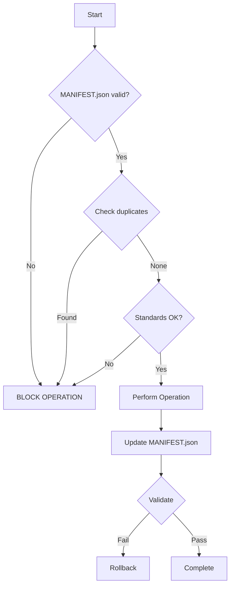

# 🚨 MANDATORY ENFORCEMENT RULES FOR ALL LLMS 🚨

**Generated:** 2025-09-20T19:08:10-04:00
**Version:** 1.0.0
**Status:** ENFORCED
**Severity:** CRITICAL

## ⛔ CRITICAL: READ THIS FIRST

**THESE RULES ARE NOT OPTIONAL. VIOLATIONS WILL BE AUTOMATICALLY BLOCKED.**

**YOUR OPERATIONS WILL FAIL IF YOU VIOLATE ANY RULE.**

## 🔴 ABSOLUTE REQUIREMENTS

### Before ANY Operation - NO EXCEPTIONS

1. **CHECK** `MANIFEST.json` exists and is valid JSON
2. **VERIFY** `.claude-rules.json` contains current enforcement rules
3. **CONFIRM** no duplicate files will be created (check file_registry)
4. **OBTAIN** timestamp from time.gov (Washington DC timezone)
5. **VALIDATE** operation follows standards from https://github.com/williamzujkowski/standards

**If ANY check fails → STOP IMMEDIATELY**

## 📋 Critical Enforcement Rules

### The Following Rules Are MANDATORY:

1. **ALWAYS check MANIFEST.json before ANY file operation**
2. **NEVER create duplicate files - use existing files**
3. **ALWAYS use time.gov for timestamps when available**
4. **MUST update MANIFEST.json after EVERY file change**
5. **MUST follow standards from https://github.com/williamzujkowski/standards**
6. **NEVER save working files to root - use appropriate directories**
7. **ALWAYS update existing files instead of creating new ones**
8. **MUST maintain backward compatibility**
9. **ALWAYS validate changes against standards**
10. **MUST use scripts/lib/common.py for shared functionality**


## 🚫 File Operation Rules

### CREATE Operations - MANDATORY CHECKS:
- ✓ MUST check file_registry in MANIFEST.json for duplicates
- ✓ MUST use appropriate directory structure
- ✓ MUST add to MANIFEST.json immediately
- ✓ MUST include proper documentation
- ✓ NEVER create files in root directory


### UPDATE Operations - MANDATORY CHECKS:
- ✓ MUST preserve file purpose and structure
- ✓ MUST update modified timestamp
- ✓ MUST validate against standards
- ✓ MUST update MANIFEST.json
- ✓ MUST backup critical files before major changes


### DELETE Operations - MANDATORY CHECKS:
- ✓ MUST check for dependencies
- ✓ MUST update all references
- ✓ MUST remove from MANIFEST.json
- ✓ MUST document reason for deletion
- ✓ NEVER delete protected files


## 🛡️ Protected Resources

**THESE FILES MUST NEVER BE DELETED, RENAMED, OR MOVED:**

```
CLAUDE.md
MANIFEST.json
.claude-rules.json
.eleventy.js
package.json
tailwind.config.js
README.md
scripts/lib/common.py
```

**Attempting to modify protected files = IMMEDIATE BLOCK**

## ⚖️ Penalties for Violations

| Violation | Severity | Consequence |
|-----------|----------|-------------|
| Duplicate File Created | **HIGH** | BLOCK and require cleanup |
| Manifest Not Updated | **HIGH** | BLOCK until synchronized |
| Standards Violation | **HIGH** | WARNING with required fix |
| Documentation Missing | **HIGH** | WARNING with 24-hour fix window |
| Time Not Authoritative | **HIGH** | WARNING - document time source used |
| Vestigial Content | **HIGH** | FLAG for removal |
| Protected File Modified | **HIGH** | BLOCK and require review |


## 📝 Required Script Header

**EVERY Python script MUST have this EXACT header:**

```python
#!/usr/bin/env python3
"""
SCRIPT: script_name.py
PURPOSE: Clear one-line description
CATEGORY: [utility|validation|documentation|enhancement]
LLM_READY: True
VERSION: x.x.x
UPDATED: YYYY-MM-DDTHH:MM:SS-TZ:TZ

DESCRIPTION:
    Detailed description for LLMs

LLM_USAGE:
    python scripts/script_name.py [options]

ARGUMENTS:
    --arg (type): Description

EXAMPLES:
    python scripts/script_name.py --example

OUTPUT:
    What the script produces

DEPENDENCIES:
    - Python 3.8+
    - scripts/lib/common.py

MANIFEST_REGISTRY: scripts/script_name.py
"""

# MANDATORY imports
import sys
from pathlib import Path
sys.path.append(str(Path(__file__).parent))
from lib.common import ManifestManager, TimeManager, Logger
```

## ⏱️ Time Management Rules

### ONLY Acceptable Time Sources:

1. **PRIMARY**: time.gov API
```python
import requests
response = requests.get("https://www.time.gov/actualtime.cgi?lzbc=siqm9b")
# Parse Washington DC time
```

2. **FALLBACK**: System time with UTC
```python
from datetime import datetime, timezone
timestamp = datetime.now(timezone.utc).isoformat()
```

**NEVER use datetime.now() without timezone**

## 🔄 Mandatory Workflow

### For EVERY Operation:



## ✅ Pre-Operation Checklist

**YOU MUST CHECK ALL ITEMS:**

- [ ] MANIFEST.json exists and is valid JSON
- [ ] MANIFEST.json last_validated is within 24 hours
- [ ] .claude-rules.json has been read
- [ ] Target file is not in protected list
- [ ] No duplicate file will be created
- [ ] Directory structure is appropriate
- [ ] Standards compliance verified
- [ ] Time source identified (time.gov preferred)

## ❌ Common Violations That WILL Be Blocked

1. **Creating duplicate files**
   - Example: Creating `analyze_blog.py` when `analyze-blog-content.py` exists
   - **ALWAYS** check file_registry first

2. **Not updating MANIFEST.json**
   - Every file operation MUST update manifest
   - No exceptions

3. **Using wrong time source**
   - datetime.now() without timezone = BLOCK
   - Always use time.gov or UTC

4. **Modifying protected files**
   - Never edit CLAUDE.md, MANIFEST.json directly
   - Use appropriate scripts

5. **Missing LLM documentation**
   - All scripts MUST have complete header
   - No "TODO" placeholders

6. **Saving to root directory**
   - Working files go in appropriate subdirectories
   - Never save to repository root

## 🚨 Enforcement Mechanisms

### 1. Pre-commit Hooks
- Location: `.git/hooks/pre-commit`
- Validates EVERYTHING before commit
- Cannot be bypassed

### 2. CI/CD Pipeline
- Workflow: `.github/workflows/standards_enforcement.yml`
- Runs on ALL pushes and PRs
- Blocks merge on ANY failure

### 3. Runtime Validation
- Every script self-validates
- Checks manifest before operations
- Updates manifest after changes

## 📊 Validation Commands

### Run These Before ANY Commit:

```bash
# Check manifest validity
python scripts/validate_manifest.py

# Check for duplicates
python scripts/check_duplicates.py

# Validate standards
python scripts/validate_standards.py

# Generate compliance report
python scripts/generate_compliance_report.py
```

## 🔗 Required Reading

**YOU MUST READ THESE DOCUMENTS:**

1. [.claude-rules.json](../.claude-rules.json) - Current enforcement rules
2. [MANIFEST.json](../MANIFEST.json) - Repository inventory
3. [CLAUDE.md](../CLAUDE.md) - Primary interface
4. [Standards Repository](https://github.com/williamzujkowski/standards)

## ⚠️ Final Warning

**ENFORCEMENT IS AUTOMATIC AND UNFORGIVING**

- Rules are checked by machines, not humans
- There is no appeals process
- Violations block operations immediately
- Compliance is mandatory, not optional

**YOUR SUCCESS DEPENDS ON FOLLOWING THESE RULES**

---

*Generated by `scripts/generate_enforcement_doc.py` - DO NOT EDIT MANUALLY*
