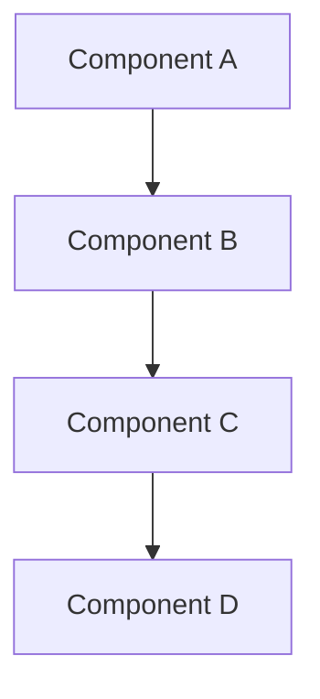
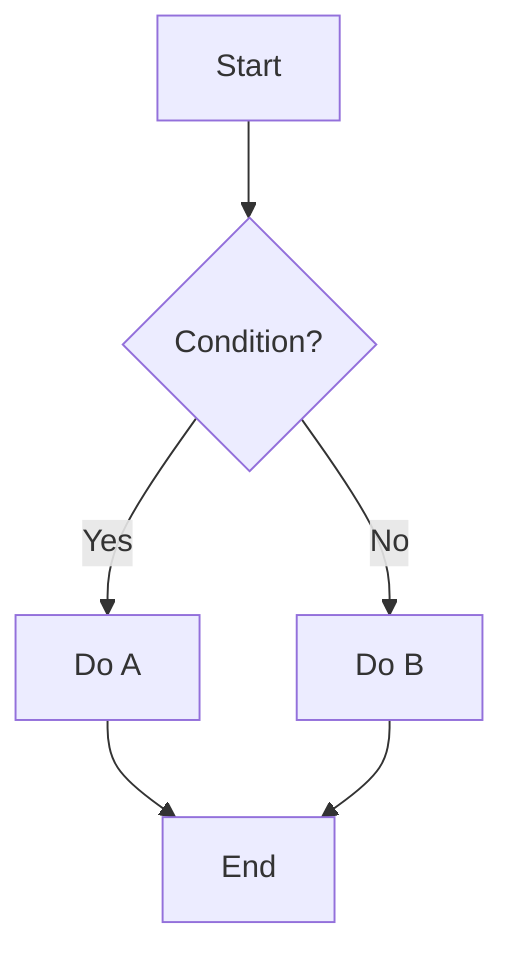
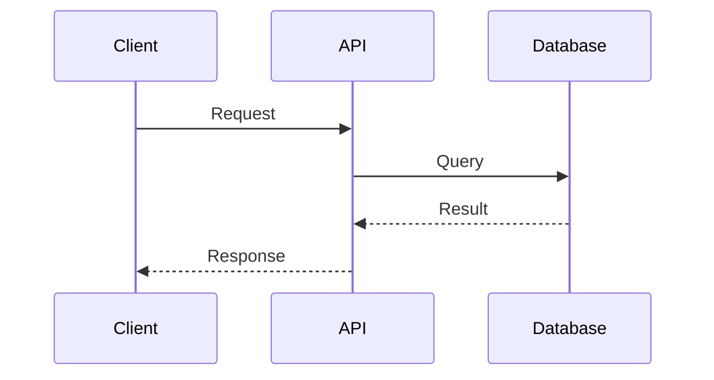
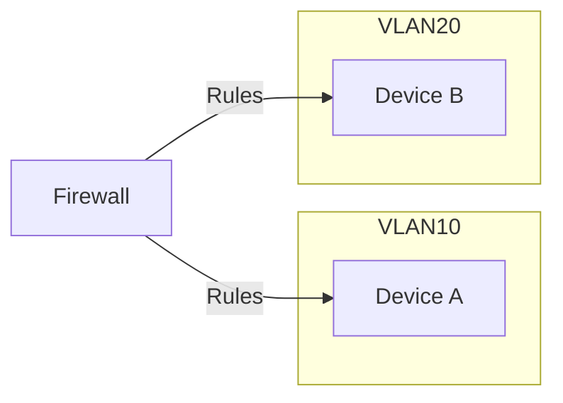

# Phase 8: Visual Enhancement Plan

**Date:** 2025-10-29
**Status:** In Progress
**Goal:** Reduce code-to-content ratio to <25% through diagrams and visual aids

## Executive Summary

Analysis of 59 blog posts reveals:
- **Average code ratio:** 23.2% (just above target)
- **High-priority posts:** 11 (>40% code)
- **Medium-priority posts:** 7 (25-40% code)
- **Diagram opportunities:** 221 identified
- **Target:** Bring high-priority posts under 30% code ratio

## High-Priority Posts (>40% Code)

### Tier 1: Critical (>60% code) - 4 posts

1. **Automated Security Scanning Pipeline** (72%)
   - File: `2025-10-06-automated-security-scanning-pipeline.md`
   - Code blocks: 19 | Suggestions: 6
   - **Diagrams needed:**
     - Architecture: Grype → OSV → Wazuh integration flow
     - Flowchart: Scanning workflow with decision points
     - Sequence: API interaction patterns
   - **Code reduction:** Extract 58-line and 109-line blocks to gists

2. **MITRE ATT&CK Dashboard** (68%)
   - File: `2025-09-14-threat-intelligence-mitre-attack-dashboard.md`
   - Code blocks: 9 | Suggestions: 6
   - **Diagrams needed:**
     - Architecture: Dashboard component structure
     - Flowchart: Data ingestion and processing pipeline
     - Sequence: API request/response cycles
   - **Code reduction:** Condense 10 similar lines, extract 42-line block

3. **Zero Trust VLAN Segmentation** (64.8%)
   - File: `2025-09-08-zero-trust-vlan-segmentation-homelab.md`
   - Code blocks: 20 | Suggestions: 4
   - **Diagrams needed:**
     - Network: VLAN topology and segmentation
     - Architecture: Zero Trust implementation layers
     - Flowchart: Traffic flow and firewall rules
   - **Code reduction:** Extract 55-line config block, condense 5 similar lines

4. **Proxmox High Availability** (62.1%)
   - File: `2025-09-29-proxmox-high-availability-homelab.md`
   - Code blocks: 23 | Suggestions: 6
   - **Diagrams needed:**
     - Architecture: Cluster architecture with quorum
     - Network: Node interconnection and storage paths
     - State: HA state machine transitions
   - **Code reduction:** Extract 56-line, 33-line, and 40-line blocks

### Tier 2: High (50-60% code) - 3 posts

5. **eBPF Security Monitoring** (59%)
   - File: `2025-07-01-ebpf-security-monitoring-practical-guide.md`
   - Code blocks: 10 | Suggestions: 2
   - **Diagrams needed:**
     - Architecture: eBPF program flow in kernel
     - Flowchart: Event capture and processing workflow
   - **Code reduction:** Extract 39-line block to gist

6. **Network Traffic Analysis with Suricata** (58%)
   - File: `2025-08-25-network-traffic-analysis-suricata-homelab.md`
   - Code blocks: 25 | Suggestions: 6
   - **Diagrams needed:**
     - Architecture: Suricata deployment topology
     - Flowchart: Packet processing pipeline
     - Network: Traffic mirroring configuration
   - **Code reduction:** Extract 51-line and 50-line config blocks

7. **Bitwarden Migration** (57.9%)
   - File: `2025-09-01-self-hosted-bitwarden-migration-guide.md`
   - Code blocks: 20 | Suggestions: 5
   - **Diagrams needed:**
     - Architecture: Self-hosted Bitwarden stack
     - Network: Reverse proxy and TLS setup
     - Flowchart: Migration process steps
   - **Code reduction:** Extract 49-line and 66-line blocks

### Tier 3: Moderate (40-50% code) - 4 posts

8. **IoT Security (OWASP IoTGoat)** (52%)
   - Diagrams: Architecture, flowchart
   - Code reduction: Extract 32-line block

9. **Container Security Hardening** (49%)
   - Diagrams: Architecture, flowchart
   - Code reduction: Extract 39-line block

10. **DNS-over-HTTPS** (43.4%)
    - Diagrams: Flowchart, network topology
    - Code reduction: Focus on key configuration sections

11. **Securing Personal AI Experiments** (39.2%)
    - Diagrams: Architecture, network segmentation
    - Code reduction: Minimal - already near target

## Medium-Priority Posts (25-40% Code)

- Claude CLI Context (38.6%)
- Local LLM Deployment (36.8%)
- Automating Home Network Security (36.5%)
- Vulnerability Prioritization with EPSS (34.4%)
- 3 additional posts

## Diagram Generation Strategy

### Phase 1: Templates (P8.3)
Create Mermaid diagram templates for common patterns:
1. **Architecture diagram template**
2. **Flowchart template**
3. **Sequence diagram template**
4. **Network diagram template**
5. **State diagram template**

### Phase 2: High-Impact Diagrams (P8.4)
Focus on Tier 1 posts first (72%, 68%, 64.8%, 62.1%):
- Generate 3-4 diagrams per post
- Extract verbose code blocks to GitHub gists
- Add diagram callouts and explanations
- Keep only 5-10 line essential snippets

### Phase 3: Automation (P8.5)
Build diagram-manager workflow:
- Script to parse code blocks and suggest diagrams
- Template generator for common patterns
- Link validator for gist references
- Build integration to render Mermaid diagrams

## Implementation Plan

### Week 1: Infrastructure
- [x] P8.1: Run optimize-blog-content.py (COMPLETE)
- [x] P8.2: Identify high-code posts (COMPLETE)
- [ ] P8.3: Generate Mermaid templates
  - Create templates for 5 diagram types
  - Document usage examples
  - Add to scripts/utilities/

### Week 2-3: Content Enhancement
- [ ] P8.4: Replace verbose code blocks
  - Tier 1: 4 posts (72%-62% → target <30%)
  - Tier 2: 3 posts (59%-58% → target <35%)
  - Tier 3: 4 posts (52%-43% → target <40%)
  - Extract code to gists
  - Add diagrams
  - Test rendering

### Week 4: Automation
- [ ] P8.5: Add diagram-manager workflow
  - Create diagram suggestion script
  - Integrate with blog build process
  - Add to pre-commit hooks
  - Document workflow

## Success Metrics

### Targets:
- **Tier 1 posts:** <30% code (reduction: 32-42 percentage points)
- **Tier 2 posts:** <35% code (reduction: 23-24 percentage points)
- **Tier 3 posts:** <40% code (reduction: 3-12 percentage points)
- **Overall average:** <20% code (current: 23.2%)

### Quality Gates:
- ✅ All diagrams render correctly in build
- ✅ Gist links are valid and accessible
- ✅ Essential code snippets are under 15 lines
- ✅ Diagrams add clarity, not clutter
- ✅ Mobile rendering works well
- ✅ Build time increase <10%

## Diagram Type Breakdown

Based on 221 opportunities identified:

1. **Architecture diagrams:** 45 opportunities
   - System components and interactions
   - Deployment topologies
   - Data flows

2. **Flowcharts:** 68 opportunities
   - Process workflows
   - Decision trees
   - State machines

3. **Sequence diagrams:** 42 opportunities
   - API interactions
   - Request/response cycles
   - Event flows

4. **Network diagrams:** 38 opportunities
   - VLAN topologies
   - Service meshes
   - Traffic flows

5. **Class/ER diagrams:** 28 opportunities
   - Data structures
   - Schema designs
   - Object relationships

## Mermaid Syntax Reference

### Architecture (Component) Diagram

### Flowchart

### Sequence Diagram

### Network Diagram

## Next Steps

1. ✅ Complete analysis (P8.1)
2. ✅ Identify high-code posts (P8.2)
3. ⏭️ Generate Mermaid templates (P8.3)
4. ⏭️ Start with Tier 1 post transformation (P8.4)
5. ⏭️ Build automation tooling (P8.5)

## Resources

- **Mermaid docs:** https://mermaid.js.org/
- **GitHub gist:** https://gist.github.com/
- **Draw.io:** https://app.diagrams.net/ (for complex diagrams)
- **Blog optimization report:** `blog_optimization_report.json`

---

**Status:** Ready to proceed with P8.3 (Template Generation)
**Estimated completion:** 2-3 weeks
**Impact:** Significant improvement in content readability and visual appeal
