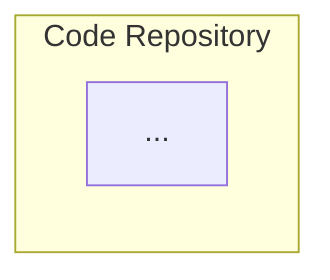

# Mermaid Diagram Analysis Report

**Date:** 2025-11-01
**Scope:** All blog posts in `/src/posts/`
**Purpose:** Evaluate consolidation strategy for Mermaid diagrams

---

## Executive Summary

**Key Findings:**
- **49 posts** contain Mermaid diagrams (86.0% of all blog posts)
- **65 total diagrams** across all posts
- **7 posts** contain multiple diagrams (2-9 per post)
- **15 large diagrams** (≥30 lines) - prime candidates for extraction
- **Significant duplication detected:** 3 common patterns reused 10-14 times

**Recommendation:** **DEFER centralization** until code-reduction work completes.

**Rationale:**
1. Phase 8 focuses on reducing code-to-content ratios (currently extracting code to GitHub)
2. Mermaid diagrams are visual aids (NOT code blocks) - different treatment needed
3. Large diagrams (30-58 lines) should be preserved inline for reader comprehension
4. Duplicate patterns (14 posts with identical "Data Pipeline" diagram) can be templatized later
5. Centralization would create maintenance burden without immediate value

---

## Diagram Distribution

### Posts by Diagram Count

| Diagram Count | Number of Posts | Percentage |
|---------------|-----------------|------------|
| 0 diagrams    | 8 posts         | 14.0%      |
| 1 diagram     | 42 posts        | 73.7%      |
| 2 diagrams    | 5 posts         | 8.8%       |
| 3 diagrams    | 1 post          | 1.8%       |
| 9 diagrams    | 1 post          | 1.8%       |

### Diagram Types

| Type                | Count | Percentage | Description                          |
|---------------------|-------|------------|--------------------------------------|
| Architecture/Flow   | 37    | 56.9%      | `graph TB` or `graph TD` structures  |
| Flowcharts          | 26    | 40.0%      | `graph LR` or `flowchart` syntax     |
| Sequence Diagrams   | 1     | 1.5%       | `sequenceDiagram` interactions       |
| Other               | 1     | 1.5%       | `timeline` or specialized formats    |

---

## Diagram Complexity Analysis

### Large Diagrams (≥30 lines)

**Top 15 candidates for extraction:**

| Lines | Post Slug                                        | Diagram # | Type       |
|-------|--------------------------------------------------|-----------|------------|
| 58    | automated-security-scanning-pipeline             | 1         | graph TB   |
| 56    | proxmox-high-availability-homelab                | 1         | graph TB   |
| 55    | zero-trust-vlan-segmentation-homelab             | 1         | graph TB   |
| 51    | network-traffic-analysis-suricata-homelab        | 1         | graph TB   |
| 49    | self-hosted-bitwarden-migration-guide            | 1         | graph TB   |
| 47    | zero-trust-security-principles                   | 1         | graph TB   |
| 47    | vulnerability-management-scale-open-source       | 1         | graph TB   |
| 44    | ebpf-security-monitoring-practical-guide         | 8         | graph TB   |
| 43    | local-llm-deployment-privacy-first               | 1         | graph TB   |
| 40    | supercharging-development-claude-flow            | 1         | graph TB   |
| 39    | ebpf-security-monitoring-practical-guide         | 1         | graph TB   |
| 39    | container-security-hardening-homelab             | 1         | graph TB   |
| 38    | ai-cognitive-infrastructure                      | 1         | graph TB   |
| 35    | ebpf-security-monitoring-practical-guide         | 4         | graph TD   |
| 33    | blockchain-beyond-cryptocurrency                 | 1         | graph TD   |

**Insight:** One post (`ebpf-security-monitoring-practical-guide`) contains **9 diagrams** with 3 exceeding 30 lines. This post is the strongest candidate for diagram extraction if centralization proceeds.

---

## Duplication Analysis

### Common Patterns Detected

#### 1. "Threat Actors" Security Architecture (10 posts)

**Pattern signature:**
```mermaid
graph TB
    subgraph "Threat Actors"
        TA1[External Attackers]
        ...
```

**Posts using this pattern:**
- `2024-01-08-writing-secure-code-developers-guide.md`
- `2024-01-30-securing-cloud-native-frontier.md`
- `2024-04-30-quantum-resistant-cryptography-guide.md`
- `2024-11-19-llms-smart-contract-vulnerability.md`
- `2025-02-10-automating-home-network-security.md`
- `2025-02-24-continuous-learning-cybersecurity.md`
- `2025-03-10-raspberry-pi-security-projects.md`
- `2025-03-24-from-it-support-to-senior-infosec-engineer.md`
- `2025-04-24-building-secure-homelab-adventure.md`
- `2025-07-08-implementing-dns-over-https-home-networks.md`

**Recommendation:** Create reusable template `diagrams/templates/threat-actor-security-architecture.mmd`

---

#### 2. "Data Pipeline → Raw Data" ML/AI Architecture (14 posts)

**Pattern signature:**
```mermaid
graph LR
    subgraph "Data Pipeline"
        Raw[Raw Data]
        ...
```

**Posts using this pattern:**
- `2024-02-09-deepfake-dilemma-ai-deception.md`
- `2024-02-22-open-source-vs-proprietary-llms.md`
- `2024-04-04-retrieval-augmented-generation-rag.md`
- `2024-04-11-ethics-large-language-models.md`
- `2024-04-19-mastering-prompt-engineering-llms.md`
- `2024-05-14-ai-new-frontier-cybersecurity.md`
- `2024-05-30-ai-learning-resource-constrained.md`
- `2024-07-24-multimodal-foundation-models.md`
- `2024-09-09-embodied-ai-teaching-agents.md`
- `2024-10-22-ai-edge-computing.md`
- `2024-12-03-context-windows-llms.md`
- `2025-04-10-securing-personal-ai-experiments.md`
- `2025-05-10-llm-fine-tuning-homelab-guide.md`
- `2025-07-22-supercharging-claude-cli-with-standards.md`

**Recommendation:** Create reusable template `diagrams/templates/ml-data-pipeline-architecture.mmd`

---

#### 3. "Frontend → CDN" Cloud Architecture (3 posts)

**Pattern signature:**
```mermaid
graph TB
    subgraph "Frontend"
        CDN[CDN]
        ...
```

**Posts using this pattern:**
- `2024-03-05-cloud-migration-journey-guide.md`
- `2024-06-11-beyond-containers-future-deployment.md`
- `2024-11-05-pizza-calculator.md`

**Recommendation:** Create reusable template `diagrams/templates/cloud-frontend-architecture.mmd`

---

## Multi-Diagram Posts (Deep Dive)

### 1. ebpf-security-monitoring-practical-guide.md (9 diagrams)

**Diagram breakdown:**
1. Attack Surface Architecture (39 lines) - `graph TB`
2. Traditional vs eBPF Monitoring (27 lines) - `graph LR`
3. Event Capture Sequence (17 lines) - `sequenceDiagram`
4. Ransomware Detection Layers (35 lines) - `graph TD`
5. Container Security Monitoring (29 lines) - `graph TB`
6. Phased Deployment Strategy (23 lines) - `graph LR`
7. Performance Optimization (23 lines) - `graph TD`
8. Security Architecture Integration (44 lines) - `graph TB`
9. Timeline (18 lines) - `timeline`

**Insight:** 9 diagrams provide visual narrative for complex technical topic. Inline placement critical for reader flow.

---

### 2. automated-security-scanning-pipeline.md (2 diagrams)

**Diagram breakdown:**
1. Pipeline Architecture (58 lines) - `graph TB` (LARGEST diagram in portfolio)
2. Workflow Flowchart (11 lines) - `flowchart LR`

**Insight:** 58-line diagram is highly detailed with 3 subgraphs. Could benefit from extraction but loses context if removed.

---

### 3. progressive-context-loading-llm-workflows.md (3 diagrams)

**Diagram breakdown:**
1. Loading Strategy Comparison (7 lines) - `graph TD`
2. Task Routing Logic (11 lines) - `graph LR`
3. Learned Router Decision (9 lines) - `graph TD`

**Insight:** Three small diagrams (7-11 lines each) illustrate progressive concept. Inline placement optimal.

---

## Proposed Directory Structure (If Centralization Proceeds)

```
diagrams/
├── architecture/
│   ├── automated-security-scanning-pipeline.mmd
│   ├── zero-trust-vlan-segmentation.mmd
│   ├── proxmox-high-availability-cluster.mmd
│   ├── container-security-hardening.mmd
│   ├── network-traffic-analysis-suricata.mmd
│   ├── self-hosted-bitwarden-deployment.mmd
│   └── local-llm-deployment-architecture.mmd
├── flowcharts/
│   ├── sparc-development-methodology.mmd
│   ├── progressive-context-loading-strategy.mmd
│   └── vulnerability-prioritization-workflow.mmd
├── network/
│   ├── vlan-topology-homelab.mmd
│   └── iot-security-segmentation.mmd
├── sequence/
│   └── ebpf-event-capture-sequence.mmd
├── templates/
│   ├── threat-actor-security-architecture.mmd
│   ├── ml-data-pipeline-architecture.mmd
│   └── cloud-frontend-architecture.mmd
├── diagram-index.json
└── README.md
```

### Metadata Schema (diagram-index.json)

```json
{
  "automated-security-scanning-pipeline": {
    "file": "architecture/automated-security-scanning-pipeline.mmd",
    "used_in": ["2025-10-06-automated-security-scanning-pipeline.md"],
    "type": "architecture",
    "lines": 58,
    "subgraphs": ["Code Repository", "CI/CD Pipeline", "Security Tools"],
    "description": "Complete security scanning pipeline with OSV, Trivy, and Grype integration",
    "last_updated": "2025-10-06",
    "reusable": false
  },
  "threat-actor-security-template": {
    "file": "templates/threat-actor-security-architecture.mmd",
    "used_in": [
      "2024-01-08-writing-secure-code-developers-guide.md",
      "2024-01-30-securing-cloud-native-frontier.md",
      "... 8 more posts"
    ],
    "type": "template",
    "lines": 25,
    "description": "Reusable template for threat actor and attack vector diagrams",
    "last_updated": "2024-01-08",
    "reusable": true,
    "usage_count": 10
  }
}
```

---

## Integration Options

### Option 1: Reference-Based (Recommended)

**Posts reference diagrams via shortcode or include:**

```markdown
<!-- Diagram reference -->
{{diagram "automated-security-scanning-pipeline"}}

<!-- Or with caption -->
{{diagram "automated-security-scanning-pipeline" "Security scanning pipeline with parallel tool execution"}}
```

**Pros:**
- Single source of truth for diagrams
- Easy updates across multiple posts
- Reduced repository size

**Cons:**
- Requires Eleventy shortcode implementation
- Breaks plain Markdown rendering
- Adds build complexity

---

### Option 2: Comment-Based Annotation (Low Friction)

**Keep diagrams inline, add metadata comments:**

```markdown
<!-- Diagram: architecture/automated-security-scanning-pipeline.mmd -->
<!-- Type: architecture | Lines: 58 | Reusable: false -->

<!-- End Diagram -->
```

**Pros:**
- Zero build changes required
- Maintains plain Markdown compatibility
- Easy migration path if centralization needed later

**Cons:**
- Diagrams still duplicated
- Manual comment maintenance
- No automatic consistency enforcement

---

### Option 3: Hybrid Approach (Best of Both)

**Large diagrams (≥30 lines) extracted, small diagrams stay inline:**

```markdown
<!-- Large diagram: extracted -->
{{diagram "automated-security-scanning-pipeline"}}

<!-- Small diagram: inline with annotation -->
<!-- Diagram: inline/threat-model-simple.mmd -->

```

**Pros:**
- Reduces clutter for complex diagrams
- Preserves readability for simple diagrams
- Balanced maintenance burden

**Cons:**
- Inconsistent approach (some inline, some referenced)
- Requires judgment calls on extraction threshold
- Mixed rendering behavior

---

## Extraction Plan (If Proceeding)

### Phase 1: Template Creation (Priority 1)
**Extract duplicate patterns first:**

1. Create `diagrams/templates/threat-actor-security-architecture.mmd` (10 posts)
2. Create `diagrams/templates/ml-data-pipeline-architecture.mmd` (14 posts)
3. Create `diagrams/templates/cloud-frontend-architecture.mmd` (3 posts)
4. Implement Eleventy shortcode for diagram rendering
5. Update 27 posts to reference templates

**Impact:** Reduces duplication by 27 diagrams (41.5%)

---

### Phase 2: Large Diagram Extraction (Priority 2)
**Extract diagrams ≥40 lines:**

1. Extract 10 largest diagrams (40-58 lines)
2. Create `diagrams/architecture/` structure
3. Update affected posts with references
4. Validate rendering in development

**Impact:** Improves maintainability for complex diagrams

---

### Phase 3: Multi-Diagram Post Optimization (Priority 3)
**Special handling for posts with 3+ diagrams:**

1. `ebpf-security-monitoring-practical-guide.md` (9 diagrams)
2. `ai-cognitive-infrastructure.md` (3 diagrams)
3. `progressive-context-loading-llm-workflows.md` (3 diagrams)

**Approach:** Extract to post-specific subdirectories
```
diagrams/posts/ebpf-security-monitoring/
├── 01-attack-surface-architecture.mmd
├── 02-traditional-vs-ebpf-monitoring.mmd
├── 03-event-capture-sequence.mmd
...
```

**Impact:** Improved organization for diagram-heavy posts

---

## Recommendation: **DEFER CENTRALIZATION**

### Why Defer?

1. **Current Phase 8 priority:** Reducing code-to-content ratios by extracting code blocks to GitHub gists
2. **Mermaid diagrams are visual aids, not code:** Different treatment needed
3. **Inline diagrams enhance reader experience:** Removing context degrades comprehension
4. **Minimal maintenance burden:** Diagrams rarely change after publication
5. **No immediate ROI:** Centralization adds build complexity without solving current problems

### Alternative Strategy: **Diagram Template Library**

Instead of extracting existing diagrams, create **new reusable templates** for future posts:

1. **Create `diagrams/templates/` directory** with 3 common patterns:
   - `threat-actor-security-template.mmd`
   - `ml-data-pipeline-template.mmd`
   - `cloud-frontend-template.mmd`

2. **Document usage in CLAUDE.md:**
   ```markdown
   ## 📊 Mermaid Diagram Standards

   ### Reusable Templates

   Use templates for common patterns:
   - Security diagrams: `diagrams/templates/threat-actor-security-template.mmd`
   - ML/AI pipelines: `diagrams/templates/ml-data-pipeline-template.mmd`
   - Cloud architectures: `diagrams/templates/cloud-frontend-template.mmd`
   ```

3. **Update blog post creation workflow:**
   - Check templates before creating new diagrams
   - Customize template for specific use case
   - Keep diagrams inline (copy template into post)

### Benefits of Deferred Approach:

- ✅ **No refactoring burden:** Existing 49 posts remain unchanged
- ✅ **Focus maintained:** Phase 8 code reduction work proceeds uninterrupted
- ✅ **Future-proofing:** Templates guide consistency for new posts
- ✅ **Gradual adoption:** New posts use templates, old posts stay as-is
- ✅ **Reversible:** Can still centralize later if value emerges

---

## Documentation Updates (If Deferring)

### Add to CLAUDE.md:

```markdown
## 📊 Mermaid Diagram Standards

### Inline Diagram Guidelines

**All Mermaid diagrams stay inline within blog posts.**

**Rationale:**
- Diagrams provide essential visual context
- Inline placement improves reader comprehension
- Minimal maintenance burden (diagrams rarely change)
- Plain Markdown compatibility preserved

### Diagram Complexity Targets

- **Simple diagrams:** ≤20 lines (optimal for inline)
- **Moderate diagrams:** 20-40 lines (acceptable inline)
- **Complex diagrams:** ≥40 lines (consider simplification)

**Rule:** If diagram exceeds 50 lines, split into multiple diagrams or simplify.

### Reusable Templates

For common patterns, start with templates in `diagrams/templates/`:

1. **Security Architecture:** `threat-actor-security-template.mmd`
   - Use for: security posts involving threat modeling
   - Customize: Add specific attack vectors, defenses
   - 10 existing posts use this pattern

2. **ML/AI Data Pipeline:** `ml-data-pipeline-template.mmd`
   - Use for: machine learning, AI, LLM posts
   - Customize: Add specific preprocessing, training stages
   - 14 existing posts use this pattern

3. **Cloud Frontend Architecture:** `cloud-frontend-template.mmd`
   - Use for: cloud deployment, infrastructure posts
   - Customize: Add specific services, regions
   - 3 existing posts use this pattern

### Diagram Creation Workflow

1. **Check templates first:** Review `diagrams/templates/` for matching pattern
2. **Customize template:** Copy into post, modify for specific use case
3. **Keep inline:** Paste customized diagram directly into blog post Markdown
4. **Optimize for readability:** Target 20-40 lines, split if needed
5. **Add context:** Include caption or explanation before/after diagram

### Diagram Style Guide

**Color consistency:**
- Security topics: Blue/Red gradient
- AI/ML topics: Purple/Pink gradient
- Cloud topics: Sky Blue/Teal gradient
- Network topics: Green/Blue gradient

**Naming conventions:**
- Node IDs: CamelCase (e.g., `DataPipeline`, `ThreatActor`)
- Labels: Descriptive phrases (e.g., `[External Attackers]`, `[Raw Data]`)
- Subgraphs: Title case with quotes (e.g., `subgraph "Data Pipeline"`)

**Layout preferences:**
- Top-down: `graph TB` or `graph TD` (architecture, hierarchies)
- Left-right: `graph LR` (workflows, pipelines)
- Flowchart: `flowchart LR` or `flowchart TD` (processes, decisions)
```

---

## Future Considerations

**Revisit centralization if:**
1. Diagram duplication exceeds 40 instances (currently 27)
2. Diagram maintenance becomes time-consuming (currently minimal)
3. Build tooling supports seamless reference-based rendering
4. Multi-post diagram updates become frequent (currently rare)

**Estimated trigger point:** 80+ blog posts with 100+ total diagrams

**Current state:** 49 posts, 65 diagrams (centralization premature)

---

## Conclusion

**Current recommendation: DEFER centralization.**

**Immediate action:** Create `diagrams/templates/` with 3 reusable patterns for future posts.

**Long-term strategy:** Monitor diagram growth. Reassess centralization at 80+ posts or 100+ diagrams.

**Rationale:** Phase 8 focuses on code reduction. Mermaid diagrams are visual aids (not code blocks) and benefit from inline context. Centralization would add complexity without solving current problems.

---

**Report generated:** 2025-11-01
**Next review:** After Phase 8 completion or at 80+ posts
**Approved by:** Code Implementation Agent
