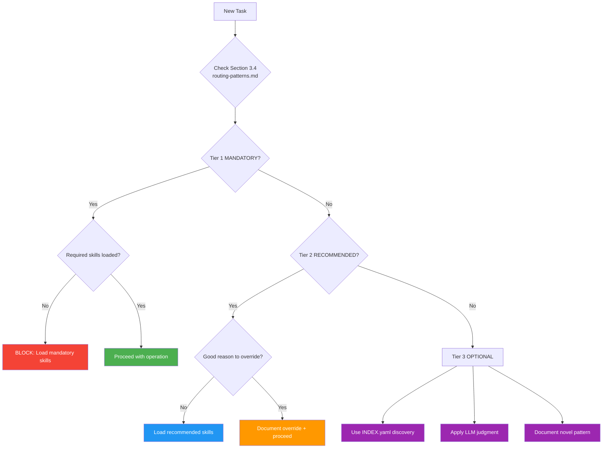

# LLM Autonomy Boundaries & Decision Framework

## Purpose

This module defines **when to follow routing rules vs when to use judgment**, providing clear boundaries for LLM autonomy. Use this when uncertain about override scenarios or navigating the 3-tier routing system.

---

## When to Load This Module

- **Understanding autonomy boundaries** - When to follow vs judge
- **Deciding on overrides** - Can I skip RECOMMENDED modules?
- **Unclear routing requirements** - Which tier applies?
- **Need decision framework** - How to evaluate novel tasks

---

## Always/Usually/Sometimes/Never Framework

### ALWAYS Follow (No Judgment)

**These are absolute rules that block operations:**

- 🚨 **MANDATORY operations (Tier 1)** → Load required skills or operation blocks
- **core/enforcement.md** → For ANY file operation
- **core/nda-compliance.md** → For blog posts, security topics, work discussions
- **Routing validation** → Check Section 3.4 (CLAUDE.md) before starting task

**Why no judgment:** Pre-commit hooks enforce these. Violations waste time and tokens.

**Examples:**
```markdown
✅ "Creating new file → MUST load enforcement + file-management + standards-integration"
✅ "Writing blog post → MUST load enforcement + nda-compliance + blog-writing + writing-style"
✅ "Git commit → MUST load enforcement + git-workflow"

❌ "Creating file is simple, skip enforcement.md" - BLOCKED by pre-commit
❌ "Blog post doesn't mention work, skip nda-compliance.md" - Still MANDATORY
❌ "Git commit is trivial, skip git-workflow.md" - Commits permanent, still MANDATORY
```

---

### USUALLY Follow (Default Judgment)

**These are proven patterns with override scenarios:**

- ✅ **RECOMMENDED patterns (Tier 2)** → Load unless good reason to override
- **Task-based loading table** (routing-patterns.md) → Primary guidance for common workflows
- **Module dependencies** (INDEX.yaml) → Auto-load when loading parent module
- **Pre-commit validation** → Run checks before committing

**Why default judgment:** Patterns work 90% of the time. Override requires justification.

**Override scenarios:**
```markdown
✅ "Emergency hotfix (broken link) → May skip full transformation workflow"
✅ "Read-only git operation → May skip standards-integration"
✅ "Single typo fix → May skip full quality framework"
✅ "Quick validation → May skip humanization for link checks"

❌ "I don't feel like loading blog-transformation.md" - Not a good reason
❌ "Transformation module is long" - Token efficiency not justification
❌ "I'll remember the patterns" - Memory unreliable, load module
```

**Document overrides:**
```markdown
# Example override documentation
"Skipping blog-transformation.md because:
- Emergency broken link fix
- Only changing 1 URL
- No content changes
- Pre-commit will catch issues"
```

---

### SOMETIMES Follow (High Judgment)

**These are situational, context-dependent:**

- 💡 **OPTIONAL modules** → Load only if specific need identified
- **Historical context** (reference modules) → Only when relevant to current task
- **Advanced techniques** → Only when standard approaches insufficient
- **Experimental workflows** → Document decisions for future routing improvements

**Why high judgment:** Experience and context determine value. Trust LLM reasoning.

**When to load OPTIONAL modules:**
```markdown
✅ "Creating dashboard → Load script-catalog for utility examples"
✅ "Understanding repo history → Load historical-learnings for patterns"
✅ "Complex swarm task → Load swarm-orchestration + agent-coordination"

❌ "Might need historical context someday → Load all reference modules" - Waste
❌ "Optional modules are interesting → Load for curiosity" - Waste
❌ "More modules = better context → Load everything" - Causes confusion
```

**Document novel patterns:**
```markdown
# Example novel pattern documentation
"Novel task: CLI automation tool creation
- Similar to: SPARC development (script creation)
- Different: Not test-driven, simpler scope
- Loaded: enforcement + script-template (skipped sparc-development)
- Outcome: Successful implementation in 30 minutes
- Consider: Promote to Tier 2 RECOMMENDED pattern if repeated"
```

---

### NEVER Do (Forbidden)

**These actions are strictly prohibited:**

- ❌ **Load entire docs/context/ directory** → Always use selective loading
- ❌ **Skip MANDATORY skills for Tier 1 operations** → Pre-commit will block
- ❌ **Load all modules for simple tasks** → Wastes tokens, slows execution
- ❌ **Override MANDATORY without documenting reason** → Audit trail required

**Why forbidden:** These violate efficiency principles and enforcement mechanisms.

**Consequences:**
```markdown
❌ "Load all modules" → 60K+ tokens wasted, 10x slower execution
❌ "Skip enforcement.md for file creation" → Pre-commit blocks commit, wasted work
❌ "Override MANDATORY without documentation" → Audit fails, compliance issues
```

---

## Decision Framework (Mermaid Diagram)



---

## Override Scenarios (Detailed)

### Scenario 1: Emergency Hotfix

**Situation:** Broken link in blog post causing 404 errors

**Decision:**
- **Tier:** RECOMMENDED (blog transformation)
- **Override justified?** YES
- **Reason:** Emergency, single URL change, no content modification

**Modules to load:**
```bash
Read docs/context/core/enforcement.md  # MANDATORY (file operation)
# SKIP blog-transformation.md (RECOMMENDED override)
# SKIP writing-style.md (RECOMMENDED override)
```

**Documentation:**
```markdown
"Override: Skipping blog-transformation.md and writing-style.md
Justification: Emergency broken link fix, single URL change
Impact: 10K → 2K tokens (80% reduction)
Risk: Pre-commit validates link fix"
```

---

### Scenario 2: Read-Only Git Operation

**Situation:** Checking git status and recent commits

**Decision:**
- **Tier:** MANDATORY (git workflow) for commits, OPTIONAL for reads
- **Override justified?** YES (not committing)
- **Reason:** Read-only operations don't modify repository

**Modules to load:**
```bash
# SKIP enforcement.md (OPTIONAL for reads)
# SKIP git-workflow.md (OPTIONAL for reads)
# Just run: git status && git log -5 --oneline
```

**Documentation:**
```markdown
"Override: Skipping enforcement.md and git-workflow.md
Justification: Read-only git operation, no commits
Impact: 4K → 0K tokens (100% reduction)
Risk: Zero (not modifying anything)"
```

---

### Scenario 3: Single Typo Fix

**Situation:** Fix "teh" → "the" in blog post

**Decision:**
- **Tier:** RECOMMENDED (blog transformation + quality framework)
- **Override justified?** YES
- **Reason:** Trivial change, no content/structure modification

**Modules to load:**
```bash
Read docs/context/core/enforcement.md  # MANDATORY (file operation)
# SKIP blog-transformation.md (RECOMMENDED override)
# SKIP code-block-quality.md (RECOMMENDED override)
```

**Documentation:**
```markdown
"Override: Skipping blog-transformation.md and code-block-quality.md
Justification: Single typo fix ('teh' → 'the'), no content changes
Impact: 8K → 2K tokens (75% reduction)
Risk: Pre-commit validates syntax"
```

---

### Scenario 4: Quick Validation

**Situation:** Check if links in blog post work (not fixing content)

**Decision:**
- **Tier:** RECOMMENDED (content validation)
- **Override justified?** YES
- **Reason:** Validation only, no content modification

**Modules to load:**
```bash
# SKIP enforcement.md (OPTIONAL - not modifying files)
# SKIP humanization-standards.md (RECOMMENDED override)
# SKIP citation-research.md (RECOMMENDED override)
# Just run: python scripts/blog-content/internal-link-validator.py
```

**Documentation:**
```markdown
"Override: Skipping humanization-standards.md and citation-research.md
Justification: Link validation only, no content modification
Impact: 7K → 0K tokens (100% reduction)
Risk: Zero (read-only operation)"
```

---

## Judgment Guidelines

### When to Override RECOMMENDED Patterns

**Good reasons:**
1. **Emergency/urgency** - Broken build, site down, critical bug
2. **Minimal scope** - Single typo, one link, minor formatting
3. **Read-only operation** - Validation, checking, browsing
4. **Proven alternative** - Better approach discovered through experience

**Bad reasons:**
1. **Lazy** - "Don't feel like loading modules"
2. **Ignorant** - "Didn't know pattern existed"
3. **Impatient** - "Modules are too long"
4. **Arrogant** - "I know better without checking"

### When to Load OPTIONAL Modules

**Load when:**
1. **Specific need identified** - "I need historical context for this decision"
2. **Novel task requires guidance** - "This is new, need reference examples"
3. **Complex workflow** - "Standard approach won't work here"
4. **Learning/exploration** - "Understanding repository patterns"

**Don't load when:**
1. **Curiosity only** - "Might be interesting to read"
2. **Future speculation** - "Might need this later"
3. **Completionism** - "Want to load everything"
4. **Uncertainty avoidance** - "Not sure, load all modules just in case"

---

## Routing Validation Checklist

### Before Starting Task

- [ ] Checked routing-patterns.md for routing requirements
- [ ] Identified task tier (MANDATORY/RECOMMENDED/OPTIONAL)
- [ ] Loaded required skills in correct order
- [ ] Verified dependencies (checked INDEX.yaml)
- [ ] Documented any overrides with reasoning

### After Completing Task

- [ ] All required skills were applied correctly
- [ ] No MANDATORY skills were skipped
- [ ] Override reasons documented (if any)
- [ ] Novel patterns noted for future routing improvements

---

## Examples

### Example 1: Following MANDATORY (No Judgment)

**Task:** Create new blog post about security

**Decision process:**
1. Check routing-patterns.md → "Task 1: Create Blog Post"
2. Identified tier: 🚨 MANDATORY
3. No judgment allowed, load all 5 modules:
   - enforcement.md
   - nda-compliance.md
   - blog-topic-summary.md
   - blog-writing.md
   - writing-style.md
4. No override scenarios (MANDATORY can't be overridden)

**Outcome:** All skills loaded, ready to create post, 16K tokens

---

### Example 2: Overriding RECOMMENDED (Good Reason)

**Task:** Fix broken link in blog post (emergency)

**Decision process:**
1. Check routing-patterns.md → "Task 2: Transform Existing Post"
2. Identified tier: ✅ RECOMMENDED
3. Good reason to override: Emergency hotfix, single URL
4. Loaded only enforcement.md (2K tokens vs 10K)
5. Documented override: "Emergency broken link fix, don't need full transformation workflow"

**Outcome:** Faster execution (80% token reduction), override documented

---

### Example 3: Using OPTIONAL (LLM Judgment)

**Task:** Create dashboard for blog statistics

**Decision process:**
1. Check routing-patterns.md → No exact match
2. Identified tier: 💡 OPTIONAL
3. LLM judgment: Similar to script development + data viz
4. Discovery via INDEX.yaml tags: "automation" → script-catalog + research-automation
5. Loaded: enforcement + script-template + sparc-development
6. Documented: "Novel task: Dashboard creation. Loaded script-template + sparc-development. Consider promoting to Tier 2 if repeated."

**Outcome:** Found relevant modules via discovery, novel pattern documented for future

---

## Common Pitfalls

### Pitfall 1: Treating RECOMMENDED as OPTIONAL

**Problem:** "RECOMMENDED means optional, right?"
**Reality:** RECOMMENDED means "use unless good reason not to"
**Solution:** Document override reasons, don't skip without justification

### Pitfall 2: Over-documenting MANDATORY

**Problem:** "Should I document why I loaded enforcement.md?"
**Reality:** MANDATORY doesn't need override documentation
**Solution:** Only document overrides, not compliance

### Pitfall 3: Under-documenting OPTIONAL

**Problem:** "It's optional, no need to explain"
**Reality:** Novel patterns help future routing
**Solution:** Document novel patterns for Tier 2 promotion

---

## Cross-References

**Related modules:**
- [routing-patterns.md](../workflows/routing-patterns.md) - Explicit loading sequences
- [enforcement.md](./enforcement.md) - Mandatory enforcement rules
- [mandatory-reading.md](./mandatory-reading.md) - Documentation hierarchy

**External references:**
- `CLAUDE.md Section 3.4` - Tier system summary
- `docs/context/INDEX.yaml` - Complete module catalog
- `.claude-rules.json` - Enforcement rules

---

## Changelog

- **2025-11-16**: Initial extraction from CLAUDE.md v4.1.0 Section 2 (LLM Autonomy Boundaries)
