# Blog Topic Selection Methodology

## Module Metadata

**Category:** workflows
**Priority:** MEDIUM (load before creating new blog posts)
**Load When:** Planning new posts, evaluating topics, quarterly content review
**Dependencies:** core/nda-compliance, core/enforcement, standards/writing-style
**Estimated Size:** ~7,200 tokens

---

## Purpose

This module provides the **authoritative methodology** for selecting blog post topics that fill content gaps, leverage personal expertise, and maintain the 75/25 evergreen-trending balance.

**MUST load this module before creating new blog posts** to ensure topic aligns with content strategy.

**For deep strategy details:** See `docs/strategy/blog-topic-strategy-2025.md` (3,040 words, comprehensive)
**For quick reference:** See `docs/strategy/TOPIC_SELECTION_QUICK_START.md` (921 words, actionable)

---

## When to Load This Module

**MANDATORY Load When:**
- Creating new blog post (before writing)
- Planning content calendar (monthly/quarterly)
- Evaluating multiple topic ideas

**OPTIONAL Load When:**
- Quarterly content gap analysis
- Refining existing post topics
- Brainstorming session

**Skip This Module If:**
- Editing existing post content (use blog-transformation.md)
- Only working on writing style (use writing-style.md)
- Validating citations (use citation-research.md)

---

## I. Current Content State (Context)

### Distribution Snapshot (62 posts analyzed 2025-11-13)

**Top Topics:**
- Security: 32 posts (52%)
- AI/ML: 23 posts (37%)
- Homelab: 21 posts (34%)
- Programming: 10 posts (16%)
- LLM: 10 posts (16%)

**Top Content Clusters:**
- Homelab + Security: 14 posts (strongest niche)
- Homelab + Networking: 8 posts
- AI + LLM: 7 posts
- Homelab + Privacy: 7 posts

**Publishing Cadence:**
- Current: 2-5 posts/month (inconsistent)
- Target: 4 posts/month (1 per week)

---

## II. Critical Content Gaps (MUST KNOW)

### 🔴 Severely Underrepresented (2-3 posts each)

**These topics need immediate attention:**

1. **Cloud Security & Architecture** (2 posts → target 8-10)
   - AWS/Azure/GCP security
   - Multi-cloud management
   - Cloud cost optimization
   - Serverless security

2. **Container & Orchestration** (3 posts → target 10-12)
   - Docker security hardening
   - Kubernetes RBAC, network policies
   - Service mesh security
   - Container escape scenarios

3. **Monitoring & Observability** (3 posts → target 8-10)
   - Prometheus setup & tuning
   - Grafana dashboards
   - Loki log aggregation
   - Distributed tracing
   - SLO/SLI implementation

4. **Python Security Automation** (3 posts → target 8-10)
   - Script library walkthroughs
   - Testing with pytest
   - API integrations
   - Performance optimization

### ⚠️ Missing Content Formats

**Gap: No multi-part series**
- Opportunity: "Building X from Scratch" (6-10 parts)
- Examples: "Building a SOC Lab", "Zero to Hero: Kubernetes"

**Gap: Limited tool comparisons**
- Opportunity: "X vs Y vs Z" reviews
- Examples: "SIEM Showdown: Wazuh vs Splunk vs ELK"

**Gap: Minimal failure stories**
- Opportunity: "Mistakes I Made" series
- Examples: "How I DDoS'd My Own Homelab"

**Gap: Few beginner guides**
- Opportunity: "Homelab Fundamentals" series
- Examples: "Your First Security Lab: $200 Budget"

---

## III. Topic Selection Decision Framework

### A. Quick Go/No-Go Filter

**Before evaluating a topic, verify:**

```
1. ✅ Personal homelab experience? (not work/NDA)
2. ✅ Can test/demo in my environment?
3. ✅ Unique angle or deeper than existing content?
4. ✅ Readers can reproduce?
5. ✅ Passes NDA compliance check?
```

**If ANY answer is NO → Reject topic immediately**

### B. Scoring System (0-5 each, minimum 15/25)

**Score each topic idea:**

| Criteria | Weight | Score 0-5 | Description |
|----------|--------|-----------|-------------|
| **Personal Experience** | Must be 4+ | ___/5 | Hands-on homelab testing, unique insights |
| **Audience Value** | Must be 3+ | ___/5 | Solves real problems, saves time/money, teaches skills |
| **Search Potential** | Nice to have 3+ | ___/5 | Monthly volume >100, ranking difficulty <60 |
| **Evergreen Longevity** | Prefer 4+ | ___/5 | Relevant 2+ years, not version-dependent |
| **Unique Angle** | Must be 3+ | ___/5 | Different from existing content, personal failures/lessons |
| **TOTAL** | | ___/25 | **Minimum 15 to proceed** |

**Priority Levels:**
- **18-25 points:** HIGH PRIORITY - Write immediately
- **15-17 points:** MEDIUM PRIORITY - Add to content calendar
- **<15 points:** LOW PRIORITY - Reconsider or reframe

### C. Decision Flowchart

```mermaid
flowchart TD
    A[Topic Idea] --> B{Passes NDA?}
    B -->|No| C[❌ REJECT]
    B -->|Yes| D{Personal Homelab<br/>Experience?}
    D -->|No| C
    D -->|Yes| E{Score Topic<br/>0-25}
    E --> F{Score ≥15?}
    F -->|No| C
    F -->|Yes| G{Fills Critical Gap?}
    G -->|Yes| H[✅ HIGH PRIORITY<br/>Write Now]
    G -->|No| I{Evergreen or<br/>Trending?}
    I -->|Evergreen| J[✅ MEDIUM PRIORITY<br/>Add to Calendar]
    I -->|Trending| K{Trending Topic<br/>Quota OK?}
    K -->|Yes 25%| J
    K -->|No Quota Full| C
```



---

## IV. Content Mix Strategy

### A. Recommended Ratios

**Overall Balance: 75/25 Evergreen-Trending**
- Current: ~80/20 (good foundation)
- Target: 75/25 (slightly more timely content)

**Content Types Breakdown:**
- 40% Deep technical guides (evergreen)
- 25% Practical implementations (evergreen)
- 15% Tool reviews & comparisons (evergreen)
- 10% Trending security topics (trending)
- 10% Career/learning content (evergreen)

### B. Weekly Publishing Pattern

**Target: 4 posts/month (1 per week)**

- **Week 1:** Deep technical guide (evergreen, fills gap)
- **Week 2:** Practical implementation (evergreen, hands-on)
- **Week 3:** Tool review/comparison (evergreen, new format)
- **Week 4:** Trending topic OR failure story (mixed)

### C. Quarterly Themes

**Align topics with seasonal focus:**

- **Q1:** Foundations & Fundamentals (fill gaps, beginner content)
- **Q2:** Advanced Implementations (multi-part series)
- **Q3:** Tool Evaluations & Comparisons (reviews, showdowns)
- **Q4:** Year in Review & Future Trends (retrospectives, predictions)

---

## V. Gap-Filling Priority Matrix

### Immediate Priorities (Next 12 Posts)

**Fill these gaps first (3 posts each):**

1. **Cloud Security**
   - AWS IAM Deep Dive: Beyond Basic Roles
   - S3 Security: Lessons from Public Bucket Failures
   - Multi-Cloud Security: Managing AWS + Azure

2. **Container Security**
   - Docker Security Hardening: 20 Best Practices
   - Kubernetes RBAC: Practical Implementation
   - Container Escape Scenarios: Testing in Homelab

3. **Monitoring & Observability**
   - Prometheus Architecture: Homelab Setup
   - Grafana Dashboards: From Zero to Hero
   - Alert Fatigue: Lessons from Over-Monitoring

4. **Python Security Automation**
   - Python Script Library Tour: 37 Utilities Explained
   - Building a Vulnerability Scanner in Python
   - Pytest for Security Scripts: TDD Approach

### Launch New Formats (Next 6 Posts)

**Introduce missing content types:**

1. **Tool Comparisons (3 posts)**
   - SIEM Solutions: Wazuh vs Splunk vs ELK
   - Backup Solutions: restic vs Borg vs Kopia
   - VPN Technologies: WireGuard vs OpenVPN vs Tailscale

2. **Failure Stories (3 posts)**
   - How I Accidentally DDoS'd My Own Homelab
   - 5 Costly Security Misconfigurations
   - When Automation Goes Wrong: Recovery Lessons

---

## VI. Topic Research & Validation

### A. Discovery Sources (Prioritized)

**1. Audience-Driven (PRIMARY)**
- GitHub repo issues/discussions
- Comments on existing posts
- Search console queries (what brings traffic)
- Questions from peers (NDA-safe only)

**2. Industry Research (SECONDARY)**
- CVE databases (new vulnerabilities)
- CISA advisories (trending threats)
- Tool release announcements
- Conference talks (DEF CON, Black Hat, BSides)
- Academic papers (arXiv security section)

**3. Homelab Experiments (TERTIARY)**
- New tools you're testing
- Problems you're actively solving
- Failed experiments (gold for failure stories!)
- Performance optimizations discovered
- Cost savings techniques

### B. Pre-Writing Validation Checklist

**Before committing to write, verify:**

- [ ] **NDA Compliance:** 100% homelab or public knowledge (no work references)
- [ ] **Hands-On Test:** Can demo in personal environment
- [ ] **Gap Alignment:** Fills identified content gap OR new format
- [ ] **Unique Value:** Different angle, deeper dive, or personal failure story
- [ ] **Reproducible:** Readers can follow along with similar hardware
- [ ] **Evergreen Check:** Relevant 18+ months OR clearly trending (quota available)
- [ ] **Audience Fit:** Security professionals or homelab enthusiasts
- [ ] **Complexity Match:** Intermediate-advanced (matches existing audience)
- [ ] **Time Budget:** Research + write + test completable in reasonable time
- [ ] **Citation Sources:** 10+ credible sources identified

---

## VII. Integration with Blog Writing Workflow

### A. Topic Selection BEFORE Blog Writing

**Correct sequence:**

1. **Load blog-topic-selection.md** (this module)
2. Evaluate topic against decision framework
3. Score topic (minimum 15/25)
4. Check gap alignment and format opportunities
5. Validate with pre-writing checklist
6. **THEN load blog-writing.md** to start writing

**Wrong sequence (DO NOT DO):**

1. ❌ Start writing without topic evaluation
2. ❌ Choose topic without checking gaps
3. ❌ Skip scoring system
4. ❌ Ignore content mix ratios

### B. Cross-Reference Requirements

**When creating new blog post:**
- Load: **blog-topic-selection.md** (topic evaluation)
- Load: **blog-writing.md** (writing process)
- Load: **nda-compliance.md** (safety check)
- Load: **writing-style.md** (tone/voice)
- Load: **humanization-standards.md** (quality check)

### C. Monthly/Quarterly Planning

**Load this module for:**
- Monthly content calendar planning (1st of month)
- Quarterly gap analysis (Jan, Apr, Jul, Oct)
- Annual strategy review (January)

---

## VIII. Common Pitfalls & Solutions

### ❌ Pitfall 1: Ignoring Content Gaps

**Problem:** Writing only on comfortable topics (security, AI) while ignoring gaps (cloud, containers, monitoring)

**Solution:** Use gap-filling priority matrix. Force 50% of posts to fill critical gaps until balanced.

### ❌ Pitfall 2: Chasing Every Trend

**Problem:** Violating 75/25 ratio by writing too many trending topics

**Solution:** Track trending post count monthly. Hard cap at 25% (1 out of 4 posts).

### ❌ Pitfall 3: Skipping Scoring System

**Problem:** Choosing topics by gut feel, leading to weak posts

**Solution:** Always score topics. If <15/25, either reframe or reject.

### ❌ Pitfall 4: Missing Format Diversity

**Problem:** All posts are single deep-dives, no series or comparisons

**Solution:** Force quarterly format quotas:
- Q1: Start 1 multi-part series
- Q2: Publish 3 tool comparisons
- Q3: Write 3 failure stories
- Q4: Create 3 beginner guides

### ❌ Pitfall 5: Work-Related Topics

**Problem:** Accidentally referencing work scenarios due to expertise

**Solution:** Always reframe through homelab lens. If can't test in homelab, reject topic.

---

## IX. Quick Reference: Topic Idea Bank

### High-Priority Gap Fillers

**Cloud Security (Need 6+ more):**
- AWS IAM Deep Dive: Beyond Basic Roles
- Azure Security Center: Homelab Integration
- GCP Security Command Center: Practical Setup
- Multi-Cloud Security: Managing AWS + Azure
- S3 Security: Lessons from Public Bucket Failures
- Serverless Security: Lambda Cold Start Issues

**Container Security (Need 7+ more):**
- Docker Security Hardening: 20 Best Practices
- Kubernetes RBAC: Practical Implementation
- Service Mesh Security: Istio vs Linkerd
- Container Escape Scenarios: Testing in Homelab
- Image Scanning: Trivy, Grype, Snyk Compared
- Kubernetes Network Policies: Real-World Examples
- Helm Security: Secrets Management Deep Dive

**Monitoring (Need 5+ more):**
- Prometheus Architecture: Homelab Setup
- Grafana Dashboards: From Zero to Hero
- Loki: Log Aggregation for Homelabs
- Distributed Tracing with Jaeger
- SLO/SLI Implementation in Practice

**Python Automation (Need 5+ more):**
- Python Script Library Tour: 37 Utilities Explained
- Pytest for Security Scripts: TDD Approach
- Building a Vulnerability Scanner in Python
- Python Packaging for Security Tools
- Async Python for Security Scanning

### New Format Opportunities

**Tool Comparisons:**
- SIEM: Wazuh vs Splunk vs ELK vs Graylog
- IDS/IPS: Suricata vs Snort vs Zeek
- Password Managers: Bitwarden vs 1Password vs KeePass
- Backup: restic vs Borg vs Kopia
- VPN: WireGuard vs OpenVPN vs Tailscale

**Failure Stories:**
- How I Accidentally DDoS'd My Own Homelab
- 5 Costly Security Misconfigurations
- When Automation Goes Wrong: Recovery Lessons
- Certificate Expiration Disasters
- The Day My Firewall Rules Locked Me Out

**Multi-Part Series:**
- Building a SOC Lab (6 parts)
- Zero to Hero: Kubernetes Homelab (4 weeks)
- Securing Your Homelab (10 parts)

**Beginner Guides:**
- Networking Basics for Homelab Enthusiasts
- Your First Security Lab: $200 Budget
- Understanding Logs: A Practical Introduction
- Docker Basics for Security Professionals

---

## X. Success Metrics & Tracking

### A. Monthly Tracking (Run topic-distribution-analyzer.py)

**Monitor these metrics:**
- Posts published in gap areas (target: 2/4)
- Trending post ratio (target: ≤25%)
- New format experiments (target: 1/month)
- Average topic score (target: ≥17/25)

### B. Quarterly Review

**Every 3 months:**
1. Re-run `scripts/analysis/topic-distribution-analyzer.py`
2. Compare gap closure progress
3. Adjust priorities based on performance data
4. Update topic idea bank with new discoveries

### C. Annual Strategy Review

**Every January:**
1. Review full `blog-topic-strategy-2025.md`
2. Analyze year's performance against goals
3. Set new gap-filling priorities
4. Refine scoring criteria if needed

---

## XI. Integration Checklist

**Before creating ANY new blog post, verify:**

- [ ] Loaded blog-topic-selection.md (this module)
- [ ] Scored topic (≥15/25 minimum)
- [ ] Checked gap alignment (fills critical gap?)
- [ ] Verified format diversity (series, comparison, failure, guide?)
- [ ] Confirmed NDA compliance (homelab only)
- [ ] Validated evergreen/trending ratio (≤25% trending)
- [ ] Pre-writing checklist completed (10 items)
- [ ] Ready to load blog-writing.md and start drafting

---

## XII. Related Resources

**Strategy Documents:**
- `docs/strategy/blog-topic-strategy-2025.md` - Comprehensive 3,040-word strategy
- `docs/strategy/TOPIC_SELECTION_QUICK_START.md` - 921-word quick reference

**Analysis Tools:**
- `scripts/analysis/topic-distribution-analyzer.py` - Run monthly for gap tracking

**Related Modules:**
- `core/nda-compliance.md` - Safety checks for all topics
- `workflows/blog-writing.md` - Writing process after topic selected
- `standards/writing-style.md` - Tone and voice guidelines
- `standards/humanization-standards.md` - Quality standards

**Content Guidelines:**
- `docs/guides/content-review-instructions.md` - Quality review process

---

## XIII. Version History

- **v1.0.0 (2025-11-13):** Initial methodology created from comprehensive blog strategy analysis (62 posts analyzed, 90+ topics proposed, decision framework designed)

---

**Remember:** Topic selection is the foundation of great content. A well-chosen topic (gap-filling, personally tested, unique angle) is halfway to a successful post. Use this framework rigorously.
