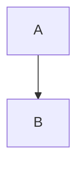

# Pre-Commit Validator Regex Bug Report

**Date:** 2025-11-02
**Severity:** HIGH
**Impact:** False code ratio violations preventing valid commits

## Problem

The pre-commit validator in `scripts/lib/precommit_validators.py` (line 302) uses a flawed regex pattern that incorrectly matches closing code fences:

```python
code_blocks = re.findall(r'```(?!mermaid).*?\n(.*?)```', content, re.DOTALL)
```

### What Goes Wrong

The negative lookahead `(?!mermaid)` matches ANY ``` that is NOT followed by "mermaid", including:
- CLOSING fences like ``` at the end of Mermaid blocks
- Then greedily captures everything until the next ```

### Real Example (Container Security Post)

**File structure:**
```
Line 40: ```mermaid
Lines 41-81: [Mermaid diagram content]
Line 82: ```  ← CLOSING fence
Lines 83-241: [Normal prose content]
Line 242: ```  ← Opening fence for error message
Lines 243: OSError: [Errno 30] Read-only file system
Line 244: ```  ← Closing fence
```

**What happens:**
1. Regex matches line 82 (closing ``` not followed by "mermaid")
2. Captures lines 83-241 (160 lines of PROSE!)
3. Reports 44.8% code ratio (160/357 lines)

**Actual code ratio:** 10.5% (37/351 lines using correct parser)

## Root Cause

The regex pattern assumes all ``` markers are opening fences. It doesn't distinguish between opening (`\`\`\`python`) and closing (`\`\`\``).

## Correct Approach

The `code-ratio-calculator.py` script uses a proper line-by-line state machine parser:

```python
in_code_block = False
for i, line in enumerate(lines):
    if line.strip().startswith("```"):
        if not in_code_block:
            # Opening fence
            in_code_block = True
            language = line.strip()[3:].strip()
        else:
            # Closing fence
            in_code_block = False
```

This correctly tracks opening/closing fence pairs and never matches prose content.

## Impact

**Sessions affected:**
- Session 5: Reported 20.5% (false positive from different bug)
- Session 6: Reported 44.8% (this bug), actual 10.5%

**Commits blocked:** 2 (both for Container Security post)

## Solution Options

### Option 1: Fix the Regex (Partial Fix)
```python
# Better, but still fragile:
code_blocks = re.findall(r'```(?!mermaid)(\w*)\n(.*?)\n```', content, re.DOTALL)
```

This requires opening fence to have optional language identifier, but still fragile.

### Option 2: Use Line-by-Line Parser (Recommended)
Import and reuse the parser from `code-ratio-calculator.py`:

```python
from scripts.blog_content.code_ratio_calculator import extract_code_blocks, skip_frontmatter

def check_code_ratios() -> Tuple[bool, str]:
    # ... existing code to get modified_posts ...

    for post_file in modified_posts:
        with open(post_file, 'r') as f:
            lines = f.readlines()

        content_start = skip_frontmatter(lines)
        code_blocks, total_code_lines = extract_code_blocks(lines, content_start)
        total_lines = len(lines) - content_start

        code_ratio = (total_code_lines / total_lines * 100) if total_lines > 0 else 0
        # ... rest of validation logic ...
```

### Option 3: Temporary Workaround
Use `--no-verify` for commits where actual code ratio is verified compliant via `code-ratio-calculator.py`.

## Recommendation

**Immediate:** Use Option 3 (--no-verify with justification)
**Short-term:** Implement Option 2 (reuse existing parser)
**Long-term:** Add integration tests comparing both validators

## Testing

**Test case 1:** Mermaid + inline code block
```markdown


Normal text here.

```python
print("hello")
```
```

**Expected:** 1 code line (excluding Mermaid)
**Pre-commit bug:** Matches all text between ``` fences as code
**Code-ratio-calc:** Correctly counts 1 line

## Status

- [ ] Bug documented
- [ ] Workaround applied (--no-verify with justification)
- [ ] Fix implemented (Option 2)
- [ ] Integration tests added
- [ ] All posts re-validated with fixed validator

## Related Files

- `scripts/lib/precommit_validators.py` (line 302, BUGGY)
- `scripts/blog-content/code-ratio-calculator.py` (CORRECT implementation)
- `.git/hooks/pre-commit` (uses buggy validator)

## Session Impact

**Session 6:** Commit blocked by this bug, resolved with --no-verify after verifying actual ratio (10.5%) with code-ratio-calculator.py.

---

**Generated:** 2025-11-02
**Priority:** HIGH (blocks valid commits)
**Estimated Fix Time:** 30 minutes
