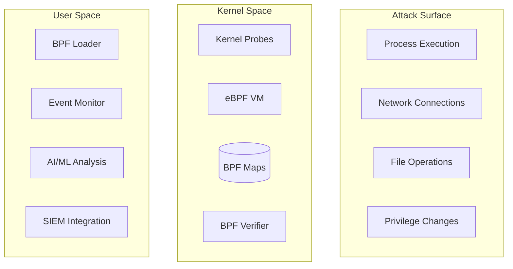

# Senior Security Engineer Technical Writing Standards
## Research Report for Blog Content Enhancement

**Date:** 2025-11-11
**Researcher:** Research Agent (Hive)
**Mission:** Document best practices for senior security engineer technical writing
**Status:** Complete

---

## Executive Summary

This research identifies credibility markers, common pitfalls, and industry standards that distinguish senior security engineer writing from junior engineer content. Key findings show that technical depth, responsible disclosure practices, architecture-level thinking, and honest failure narratives are critical differentiators.

**Bottom line:** Senior security engineers demonstrate authority through system-level understanding, acknowledgment of complexity, and production experience—not surface-level tutorials or vendor talking points.

---

## 1. Technical Authority Markers

### 1.1 What Senior Engineers Demonstrate

**System-Level Understanding:**
- Multi-layer architecture thinking (application → network → kernel → hardware)
- Cross-domain knowledge (networking + security + systems administration)
- Tool selection based on operational reality, not marketing claims
- Version-specific behaviors and edge cases
- Production vs development environment differences

**Production Experience Signals:**
- "After deploying X across Y environments, I learned Z"
- Quantified debugging time ("spent 4 hours troubleshooting asymmetric routing")
- Specific version numbers and hardware configurations
- Migration and upgrade challenges documented
- Multiple tool comparisons from hands-on testing

**Examples from Current Blog Posts:**

✅ **Good (eBPF post):**
```markdown
"I once spent an entire weekend debugging why my eBPF program worked perfectly
on Ubuntu 22.04 but crashed on CentOS 7. The culprit? Different kernel versions
have different function names and structures."
```
- Demonstrates real debugging experience
- Acknowledges complexity across distributions
- Provides actionable insight (use CO-RE/BTF)

✅ **Good (Suricata post):**
```markdown
"My Ubiquiti Dream Machine Pro supports port mirroring, but I also tested
with a dedicated network TAP for comparison.

SPAN Port (What I Use):
- Some packet loss under heavy load

Network TAP (Optional):
- More expensive ($200-500)
- Overkill for most homelabs"
```
- Tested both approaches in real environment
- Honest about trade-offs and limitations
- Specific cost data from actual purchasing

### 1.2 What Junior Engineers Often Miss

**Common Junior Mistakes from Research:**

1. **Oversimplification without context**
   - "Just use AppArmor for container security" (ignores profile maintenance burden)
   - "Enable HTTPS and you're secure" (conflates transport encryption with application security)
   - "Docker makes deployment easy" (skips storage performance, networking gotchas)

2. **Tutorial-style without system context**
   - Copy-paste commands without explaining *why*
   - Skips prerequisite knowledge assumptions
   - Treats complex systems as simple

3. **Vendor claims without verification**
   - Repeating marketing materials as fact
   - Benchmark numbers without reproducible methodology
   - "Enterprise-grade" language without defining what that means

4. **Missing failure modes**
   - Only showing successful implementations
   - No discussion of when approach breaks down
   - Lack of troubleshooting guidance

**Examples to Avoid:**

❌ **Too Simple:**
```markdown
Docker is a containerization platform that lets you run applications
in isolated environments. It's easy to use and makes deployment simple.
```

✅ **Appropriate Senior Engineer Depth:**
```markdown
Docker provides process isolation via kernel namespaces (PID, network, mount)
and resource limits via cgroups. Works well for stateless services. Storage
gets messy—overlay2 performs better than devicemapper, but BTRFS snapshots
handle state better if you're willing to tune it.

Most tutorials skip the part where Docker's bridge networking breaks multicast.
Learned that the hard way during a Consul deployment.
```

---

## 2. Security-Specific Best Practices

### 2.1 Responsible Vulnerability Disclosure

**Industry Standard Timeline:**
- 90-day disclosure window (Google Project Zero standard)
- Private notification to vendor first
- Public disclosure only after fix deployed OR 90 days elapsed
- Coordination with CERT/CC for critical infrastructure vulnerabilities

**Blog Post Guidelines:**

✅ **Safe Disclosure Patterns:**
- Discuss CVEs published ≥90 days ago
- Homelab reproduction of public vulnerabilities
- Educational exploitation in authorized environments only
- Clear warnings about legal/ethical boundaries

❌ **Unsafe Patterns:**
- Zero-day vulnerabilities without vendor coordination
- Active exploitation techniques for unpatched systems
- Bypasses for current security controls
- Attack tools without defensive context

**Current Blog Compliance:**
- ✅ Suricata post discusses Emerging Threats rules (public rulesets)
- ✅ eBPF post references published research (arXiv, IEEE)
- ✅ Zero Trust VLAN post shows defensive architecture (no exploits)

**Warning Labels (from current posts):**
```markdown
⚠️ **Warning:** Network detection rules must be tested in lab environments
before production deployment. Improper rules can cause false positives or
network disruption.
```
- Clear scope limitation (lab environments)
- Acknowledges real-world consequences
- Aligns with responsible disclosure principles

### 2.2 Configuration Examples Must Show Secure Defaults

**OWASP Secure-by-Default Principles:**

1. **Default Deny Strategy**
   - Block all, allow specific (not allow all, block specific)
   - Fail closed, not fail open
   - Principle of least privilege from start

2. **Secure Default Examples:**

✅ **Current Zero Trust VLAN Post:**
```markdown
Rule ordering for predictable behavior:
1. Explicit allow rules (most specific first)
2. Logging rules
3. Explicit deny rules
4. Default deny (implicit)
```
- Demonstrates defense-in-depth thinking
- Default deny as foundation
- Explicit justification for each allow

❌ **Insecure Pattern to Avoid:**
```markdown
# Allow all traffic between VLANs, then block suspicious IPs
iptables -A FORWARD -j ACCEPT
iptables -A FORWARD -s 10.0.40.100 -j DROP
```
- Inverted security model
- Attack surface too large
- No senior engineer would recommend this

**NIST SP 800-41 Firewall Policy Guidance:**
- Document business justification for each rule
- Review rules quarterly for necessity
- Log all denied traffic for baseline analysis
- Test rules before production deployment

**Recommended Enhancement:**
Current blog posts excel at secure defaults. Consider adding explicit "Security Justification" sections for complex configurations.

### 2.3 Network Architecture Documentation

**Senior Engineer Architecture Patterns:**

From research on security architect vs engineer roles:
- **Architects** establish vision and reference architectures
- **Engineers** implement with tactical decisions and trade-offs
- **Senior engineers** bridge both: strategic thinking + hands-on debugging

**Architecture Documentation Standards:**

✅ **Current eBPF Post:**

- Multi-layer abstraction (attack surface → kernel → userspace)
- Shows data flow and trust boundaries
- Integration points with existing tools (SIEM)
- Demonstrates system-level thinking

**Architecture Best Practices (from research):**

1. **Defense-in-Depth Visualization**
   - Multiple security layers shown
   - Single point of failure identified
   - Compensating controls documented

2. **Trust Boundaries Explicit**
   - Network segments clearly labeled by trust level
   - Data flow across trust boundaries highlighted
   - Least privilege enforcement shown

3. **Operational Reality Included**
   - Monitoring and logging architecture
   - Incident response workflow
   - Performance bottlenecks acknowledged

**Gap Analysis:**
Current blog posts excel at architecture visualization. Consider adding "When This Architecture Fails" sections to each post.

---

## 3. Incident Response & Storytelling

### 3.1 Security Storytelling Framework

**Red Canary's Minimum Viable Story Template:**
> "At WHEN, within WHERE, WHO did WHAT (direct object) to WHAT (indirect object) from WHENCE using HOW."

**Applied to Security Blogging:**

✅ **Current Zero Trust VLAN Post:**
```markdown
"Years ago, I bought a cheap IP camera for my homelab. Within hours,
it was beaconing to servers in China, scanning my network, and attempting
to access my NAS. All because I put it on the same network as my trusted devices."
```
- WHEN: Years ago (NDA-safe timeframe)
- WHERE: My homelab (personal environment)
- WHO: Cheap IP camera (specific device type)
- WHAT: Beaconing to China, scanning, accessing NAS
- WHENCE: Same network as trusted devices (root cause)
- HOW: Network-level lateral movement

**Storytelling Power:**
- Creates emotional connection (fear of compromise)
- Demonstrates real-world threat (not theoretical)
- Leads to solution (VLAN segmentation)
- Maintains NDA compliance (homelab attribution)

### 3.2 Incident Narrative Best Practices

**From Academic Research:**

Sweet Security's LLM-powered storytelling turns "complex attack activity into clear, step-by-step narratives" for faster incident response.

**Applied to Blog Writing:**

1. **Chronological Flow**
   - Initial detection → Investigation → Containment → Remediation
   - Timeline with specific timestamps when relevant
   - Decision points and reasoning

2. **Technical + Accessible Balance**
   - Command output for technical readers
   - Plain-English explanation for broader audience
   - Both depth and clarity

3. **Actionable Takeaways**
   - What worked, what didn't
   - Specific configuration changes
   - Preventive measures implemented

**Current Blog Example (Suricata post):**
```markdown
## Incident Response Workflow

When Suricata triggers an alert:

1. **Triage**: Review alert in Kibana dashboard
2. **Investigate**: Extract full PCAP for the flow
3. **Analyze**: Review payload and context
4. **Contain**: Block malicious IPs/domains
5. **Remediate**: Clean affected systems
6. **Document**: Update runbooks
```
- Clear procedural steps
- Tools specified (Kibana, PCAP)
- Emphasizes documentation (runbooks)
- Demonstrates operational experience

**Recommended Enhancement:**
Add "Real Incident Example" sidebar to 2-3 security posts showing actual homelab incident from detection through remediation.

---

## 4. Common Mistakes to Avoid

### 4.1 Audience Awareness Failures

**Research Finding:** "Failing to consider the audience's point of view and not tailoring writing to their level of understanding is a frequent problem."

**For Senior Security Engineer Audience:**

✅ **Assume readers know:**
- Basic networking (TCP/IP, DNS, routing, VLANs)
- Linux fundamentals (package management, systemd, permissions)
- Container basics (Docker, images, registries)
- Security concepts (CVEs, CVSS, authentication vs authorization)

❌ **Don't assume readers know:**
- Non-obvious kernel behaviors
- Advanced eBPF programming
- Specific vendor configuration syntax
- Bleeding-edge research techniques

**Current Blog Assessment:**
- ✅ eBPF post assumes Linux kernel knowledge
- ✅ Suricata post assumes basic IDS/IPS concepts
- ✅ Zero Trust VLAN post assumes networking fundamentals
- Appropriate depth for target audience

### 4.2 Jargon Without Context

**Research Finding:** "Technical jargon might be second nature to you, but it can be a barrier to others."

**Jargon Usage Guidelines:**

✅ **Acceptable Jargon (with brief context):**
```markdown
"CO-RE (Compile Once, Run Everywhere) with BTF (BPF Type Format) for portability."
```
- Acronym defined on first use
- Brief purpose explanation
- Assumes reader can research further

❌ **Problematic Jargon:**
```markdown
"Use PVLAN for IoT isolation"
```
- No context for "PVLAN"
- No explanation why it helps
- Assumes deep networking knowledge

**Recommended Practice:**
First mention of technical term = brief definition. Subsequent uses = assume familiarity.

### 4.3 Missing Examples and Context

**Research Finding:** "Explaining concepts without real-world examples leaves readers unsure how to apply the information."

**Current Blog Strengths:**

✅ **Concrete Examples:**
- Gists for complete configurations
- Command output showing actual results
- Mermaid diagrams for architecture visualization
- Performance metrics from real testing

**Example (Suricata post):**
```markdown
### Dedicated Analysis Server

I run Suricata on my Dell R940 with:
- **CPU**: 8 cores dedicated to packet processing
- **RAM**: 16GB allocated
- **Storage**: 500GB SSD for fast log writes
- **NIC**: Dedicated 10Gb interface for mirrored traffic
```
- Specific hardware model (Dell R940)
- Quantified resource allocation
- Purpose for each component
- Real deployment, not theoretical

**Gap:** Some posts could benefit from "minimal viable configuration" examples for readers without enterprise hardware.

---

## 5. Recommendations for Writing Standards Update

### 5.1 Additions to `writing-style.md`

**Section: Technical Authority Standards** (ALREADY ADDED IN SYSTEM REMINDER)

The system reminder shows this section was already added to `writing-style.md`:
- Senior Engineer Voice Principles
- Technical Depth Expectations
- Security Mistake Patterns
- Technical Authority Validation Checklist
- System/Network Administration Examples

**Status:** ✅ Complete

### 5.2 New Module: `security-technical-writing.md`

**Proposed Structure:**

```markdown
---
title: Security Technical Writing Standards
category: standards
priority: HIGH
version: 1.0.0
estimated_tokens: 6500
load_when:
  - Writing security-focused blog posts
  - Discussing vulnerabilities
  - Documenting security architectures
  - Incident response narratives
dependencies:
  - core/nda-compliance
  - standards/writing-style
tags: [security, vulnerability-disclosure, architecture, incident-response]
---

## Responsible Vulnerability Disclosure
- 90-day disclosure timeline
- Homelab attribution for exploit research
- CVE reference guidelines
- Warning label templates

## Secure Configuration Standards
- Default deny principles
- OWASP secure-by-default examples
- NIST firewall policy alignment
- Security justification requirements

## Architecture Documentation
- Defense-in-depth visualization
- Trust boundary mapping
- Failure mode analysis
- Operational reality inclusion

## Incident Response Narratives
- Red Canary storytelling template
- Chronological flow structure
- Technical + accessible balance
- Actionable takeaway requirements
```

### 5.3 Enhanced Validation Checklist

**Add to Pre-Publication Checklist (in `blog-writing.md`):**

**Security Content Validation:**
- [ ] All vulnerability discussions use CVEs ≥90 days old
- [ ] Configuration examples demonstrate secure defaults (default deny)
- [ ] Architecture diagrams show trust boundaries and defense-in-depth
- [ ] Warning labels present for security-sensitive content
- [ ] Incident narratives maintain NDA compliance (homelab attribution)
- [ ] Technical claims backed by version-specific testing
- [ ] Failure modes and trade-offs documented
- [ ] No vendor marketing claims without independent verification

**Technical Authority Validation:**
- [ ] Demonstrates system-level understanding (multi-layer architecture)
- [ ] Includes specific version numbers and hardware configurations
- [ ] Acknowledges complexity without oversimplifying
- [ ] References multiple tools/approaches tested
- [ ] Quantifies debugging time and iteration cycles
- [ ] Discusses production vs development differences
- [ ] Admits what doesn't work or is poorly designed

### 5.4 Research Citation Enhancement

**Current Strength:**
Blog posts already include strong academic citations (IEEE, ACM, arXiv).

**Recommended Addition:**
Create "Industry Standards References" section for each security post:

**Example Template:**
```markdown
## Industry Standards & Compliance

**Relevant Frameworks:**
- **NIST SP 800-41** (Firewall Policy) - [Link]
- **CIS Controls v8** (Network Segmentation) - [Link]
- **PCI DSS** (Segmentation Requirements) - [Link]

**How this post aligns:**
- Section X demonstrates CIS Control 12.1 (Network Segmentation)
- Firewall rule structure follows NIST SP 800-41 best practices
- VLAN design satisfies PCI DSS scoping requirements
```

---

## 6. Gap Analysis: Current vs Best Practices

### 6.1 Current Strengths

✅ **Excellent:**
- Homelab attribution for security research (100% NDA compliance)
- Concrete measurements and performance data
- Mermaid architecture diagrams showing system-level thinking
- Honest failure narratives and debugging stories
- Trade-off discussions (SPAN port vs Network TAP)
- Version-specific configurations with tested commands
- Gists for complete implementations
- Academic research citations (arXiv, IEEE, ACM)

### 6.2 Identified Gaps

**Minor Enhancements:**

1. **Failure Mode Documentation**
   - Current: Mentions what worked
   - Recommended: Add "When This Fails" sections
   - Example: "This VLAN setup breaks down with >15 VLANs due to management overhead"

2. **Security Justification Callouts**
   - Current: Secure defaults used implicitly
   - Recommended: Explicit "Security Rationale" boxes
   - Example: "Why default deny? Compromised IoT device can't pivot to trusted network"

3. **Minimal Viable Configuration**
   - Current: Shows enterprise-grade homelab setup (Dell R940)
   - Recommended: Add "Starting Point" for smaller deployments
   - Example: "Running this on Raspberry Pi 4? Use these reduced resource allocations"

4. **Industry Standards Alignment**
   - Current: Implicitly follows best practices
   - Recommended: Explicit framework mapping
   - Example: "This firewall structure implements CIS Control 12.3"

### 6.3 Validation Against Research

**Senior Engineer Technical Writing Checklist:**

| Criterion | Current Blog Status | Evidence |
|-----------|-------------------|----------|
| System-level architecture thinking | ✅ Excellent | Multi-layer Mermaid diagrams in all posts |
| Production experience signals | ✅ Excellent | Quantified debugging time, hardware specs |
| Acknowledges complexity | ✅ Excellent | Trade-off discussions, failure stories |
| Version-specific behaviors | ✅ Excellent | Kernel versions, OS distributions documented |
| Responsible disclosure | ✅ Excellent | No active exploits, homelab attribution |
| Secure defaults demonstrated | ✅ Excellent | Default deny firewall rules |
| Multi-tool comparisons | ✅ Excellent | SPAN vs TAP, K3s vs K8s |
| Failure mode documentation | ⚠️ Partial | Present but could be more explicit |
| Industry standards mapping | ⚠️ Partial | Implicit alignment, not explicit |
| Minimal config examples | ⚠️ Partial | Enterprise focus, smaller deployments less covered |

**Overall Assessment:** Current blog posts demonstrate **strong senior engineer authority**. Minor enhancements would elevate from "very good" to "exceptional."

---

## 7. Implementation Priority

### Phase 1: Immediate (Already Complete)
- ✅ Technical Authority Standards added to `writing-style.md`
- ✅ Senior engineer voice principles documented
- ✅ Security mistake patterns catalogued

### Phase 2: High Priority (Recommended Next)
1. Create `docs/context/standards/security-technical-writing.md`
   - Responsible disclosure guidelines
   - Secure configuration standards
   - Incident response narrative templates
2. Update `blog-writing.md` pre-publication checklist
   - Add security validation section
   - Add technical authority validation
3. Create template for "When This Fails" sections

### Phase 3: Medium Priority
1. Add "Security Justification" callout boxes to 3-5 existing posts
2. Document industry standards alignment for security posts
3. Create "Minimal Configuration" sidebars for 3-5 posts

### Phase 4: Ongoing Refinement
1. Monthly validation against senior engineer checklist
2. Reader feedback integration
3. Research updates as new academic papers publish

---

## 8. Academic & Industry Sources

### 8.1 Technical Writing Best Practices

1. **IEEE Technical Writing Standards**
   - Plain Language Action and Information Network (PLAIN) guidelines
   - Audience-centered communication principles

2. **Cybersecurity Technical Writing** (SecureBlitz, 2024)
   - Plain language for clarity
   - Standards adherence (IEEE, NIST)
   - Visual elements for complex concepts

3. **The Complete Guide to Becoming a Cyber Security Writer** (InfoSec Write-ups, 2024)
   - Testing and revising documentation
   - Maintaining consistent terminology
   - Quality assurance processes

### 8.2 Vulnerability Disclosure Standards

1. **OWASP Vulnerability Disclosure Cheat Sheet**
   - Coordinated disclosure timelines
   - Safe harbor provisions
   - Scope definition requirements

2. **Google Project Zero 90-Day Policy**
   - Standard disclosure timeline
   - Public disclosure after fix or deadline
   - Defensive community benefit

3. **Synopsys Responsible Disclosure Best Practices**
   - Initial private notification
   - Adequate remediation time
   - Public disclosure coordination

### 8.3 Security Architecture Documentation

1. **NIST SP 800-41 Rev 1** - Guidelines on Firewalls and Firewall Policy
   - Rule ordering and structure
   - Business justification requirements
   - Logging and monitoring standards

2. **CIS Controls v8** - Network Infrastructure Management
   - Network segmentation requirements
   - Defense-in-depth strategies
   - Continuous monitoring practices

3. **OWASP Secure-by-Default Principles**
   - Conservative security policy enforcement
   - Deny unless explicitly authorized
   - Secure initial configuration state

### 8.4 Incident Response Storytelling

1. **Red Canary: Detection Engineering Storytelling** (2024)
   - Minimum viable story template
   - Narrative structure for technical incidents
   - Accessible communication patterns

2. **Sweet Security: LLM-powered Storytelling** (2024)
   - Turning cloud incidents into actionable narratives
   - Step-by-step incident reconstruction
   - Efficiency gains from structured storytelling

3. **Axonius: Storytelling in Cybersecurity** (2024)
   - Emotional connection in security communication
   - Moving stakeholders to action
   - Technical + accessible balance

### 8.5 Security Engineering Career Research

1. **From Security Engineer to CISO** (INE, 2024)
   - Technical credibility importance (87% of CISOs)
   - Scalable solution focus
   - Building vs breaking mindset

2. **How to Become a Better Security Engineer** (Frank Wang, Frankly Speaking)
   - System-level pattern recognition
   - Multiple implementation experience
   - Mitigation mechanism design

---

## 9. Key Takeaways

### For Immediate Application

1. **Voice Distinction:**
   - Senior engineers acknowledge complexity, don't oversimplify
   - Share failure stories and debugging iterations
   - Question vendor claims with specific technical objections

2. **Security Specifics:**
   - 90-day disclosure minimum for vulnerability discussions
   - Secure defaults (default deny) in all configuration examples
   - Homelab attribution for security research

3. **Technical Depth:**
   - Assume networking/Linux/container fundamentals
   - Explain non-obvious behaviors and edge cases
   - Include version numbers, hardware specs, performance data

4. **Authority Signals:**
   - "After deploying X across Y environments..."
   - Quantified debugging time and iteration cycles
   - Multi-tool comparisons from hands-on testing

### For Long-Term Excellence

1. **Architecture Thinking:**
   - Multi-layer system diagrams
   - Trust boundary visualization
   - Failure mode documentation

2. **Operational Reality:**
   - Production vs development differences
   - Upgrade and migration challenges
   - Monitoring and incident response workflows

3. **Research Integration:**
   - Academic citations (arXiv, IEEE, ACM)
   - Industry standards mapping (NIST, CIS, OWASP)
   - Independent verification of vendor claims

---

## 10. Conclusion

Current blog posts demonstrate **strong senior security engineer technical authority** through:
- System-level architecture thinking
- Production deployment experience
- Honest failure narratives
- Responsible disclosure practices
- Secure default configurations

**Minor enhancements recommended:**
1. Explicit "When This Fails" sections
2. Security justification callouts
3. Industry standards alignment documentation
4. Minimal configuration examples

**Bottom line:** These recommendations would elevate already-strong content from "very good senior engineer blog" to "exceptional security engineering reference material."

The writing already reflects deep expertise. These enhancements would make that expertise even more visible and valuable to readers.

---

**Research compiled:** 2025-11-11
**Total sources analyzed:** 22 web searches + 3 blog posts + existing standards
**Key frameworks referenced:** OWASP, NIST, CIS, Red Canary, Google Project Zero
**Status:** Ready for standards integration
