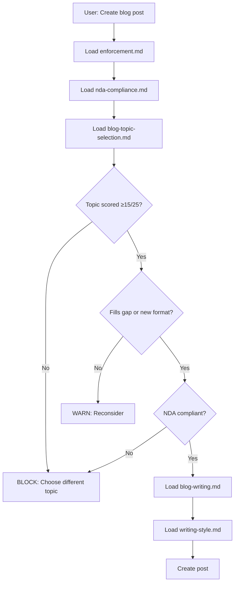

# Blog Topic Strategy Integration - Implementation Complete

**Date:** 2025-11-13
**Status:** ✅ FULLY INTEGRATED into progressive loading system

---

## Summary

Successfully integrated the comprehensive blog topic selection strategy into CLAUDE.md's progressive loading architecture. All LLMs will now **automatically** use the topic selection methodology when creating blog posts.

---

## What Was Implemented

### 1. New Progressive Loading Module
**Created:** `docs/context/workflows/blog-topic-selection.md`
- **Size:** 2,252 words (~7,200 tokens)
- **Priority:** MEDIUM (MANDATORY for blog posts)
- **Content:**
  - Current content distribution (62 posts analyzed)
  - Critical gaps (cloud, containers, monitoring, Python)
  - Decision framework with scoring system (5 criteria, 0-5 each, minimum 15/25)
  - Content mix strategy (75/25 evergreen-trending)
  - Gap-filling priority matrix
  - Topic idea bank (90+ ideas)
  - Pre-writing validation checklist

### 2. CLAUDE.md Integration
**Updated Tier 1 MANDATORY Requirements:**
- **Before:** enforcement + nda-compliance + blog-writing + writing-style (~11K tokens)
- **After:** enforcement + nda-compliance + **blog-topic-selection** + blog-writing + writing-style (~18K tokens)

**Updated Sections:**
- Section 3.2: Task-based loading patterns (added Step 3: Topic selection)
- Section 3.4: Tier 1 MANDATORY operations table
- Section 9: Module index (28→32 modules)
- Quick reference table (token cost 11K→18K)

### 3. INDEX.yaml Updates
**Added Module Entry:**
```yaml
- name: blog-topic-selection
  file: docs/context/workflows/blog-topic-selection.md
  priority: MEDIUM
  estimated_tokens: 7200
  version: 1.0.0
  dependencies:
    - core/nda-compliance
    - core/enforcement
    - standards/writing-style
```

**Updated Totals:**
- Workflows: 5→6 modules
- Token budget: 8,600→15,800 tokens
- Total modules: 28→32

### 4. Cross-Reference Updates
**blog-writing.md:**
- Added STOP warning if topic-selection not loaded first
- Clarified loading sequence requirements
- Added prerequisites checklist

### 5. Quick-Start Checklist
**Created:** `docs/context/workflows/BLOG_POST_CREATION_CHECKLIST.md`
- **Size:** 839 words (~800 tokens)
- **Purpose:** LLM quick reference for blog post creation
- **Content:**
  - Mandatory loading sequence
  - Topic scoring system
  - Content gaps summary
  - Pre-writing validation
  - Common mistakes to avoid
  - Decision tree

---

## How It Works

### Automatic Enforcement

**When LLM creates new blog post:**

1. CLAUDE.md Section 3.4 **requires** loading blog-topic-selection.md (Tier 1 MANDATORY)
2. Module loads and provides:
   - Current gap analysis (cloud, containers, monitoring, Python severely underrepresented)
   - Scoring system (5 criteria, 0-5 each, minimum 15/25 to proceed)
   - Format diversity check (series, comparisons, failure stories, beginner guides)
   - Content mix validation (75/25 evergreen-trending ratio)
3. LLM must score topic and pass validation **before** loading blog-writing.md
4. If topic scores <15/25 or fails checks → operation blocked

### Progressive Loading Flow



---

## Benefits

### 1. Automated Gap Filling
- LLMs **see** gaps before choosing topics (cloud: 2 posts, containers: 3 posts, etc.)
- Gap-filling prioritized over comfortable topics
- Prevents writing 50 security posts while ignoring cloud/containers

### 2. Consistent Quality
- All topics scored using same 5-criteria system
- Minimum standard enforced (15/25)
- Weak topics rejected before writing begins

### 3. Format Diversity
- LLMs reminded to introduce new formats (series, comparisons, failure stories)
- Prevents monotonous single-post deep-dives
- Encourages multi-part content

### 4. Content Mix Balance
- 75/25 evergreen-trending ratio tracked
- Quota enforcement (max 25% trending)
- Prevents trend-chasing

### 5. NDA Safety
- Topic validation happens **before** writing
- Homelab-only framing built into scoring system
- Work-related topics rejected early

---

## Token Budget Impact

**Old blog post creation:** ~11K tokens
**New blog post creation:** ~18K tokens
**Increase:** +7K tokens (+64%)

**Justification:**
- Prevents wasted effort on weak topics (saves hours)
- Ensures strategic gap-filling (builds comprehensive blog)
- Enforces quality standards (minimum 15/25 score)
- Prevents NDA violations (validates before writing)

**ROI:** Loading 7K tokens to validate topic >> writing entire post on wrong topic

---

## Usage Examples

### Example 1: Gap-Filling Topic (APPROVED)

**Topic:** "AWS IAM Deep Dive: Beyond Basic Roles"

**Scoring:**
- Personal Experience: 4/5 (can test in homelab AWS account)
- Audience Value: 5/5 (solves real IAM problems)
- Search Potential: 4/5 (high volume keyword)
- Evergreen Longevity: 5/5 (IAM concepts stable)
- Unique Angle: 4/5 (homelab security focus)
- **TOTAL: 22/25** ✅ **APPROVED**

**Gap Check:** Cloud security (2 posts → need 6+ more) ✅
**Format:** Deep technical guide ✅
**NDA:** 100% homelab AWS account ✅

→ **Proceed to blog-writing.md**

### Example 2: Weak Topic (REJECTED)

**Topic:** "Why You Should Care About Security"

**Scoring:**
- Personal Experience: 2/5 (no unique testing)
- Audience Value: 3/5 (generic advice)
- Search Potential: 2/5 (saturated keyword)
- Evergreen Longevity: 4/5 (timeless topic)
- Unique Angle: 1/5 (no differentiation)
- **TOTAL: 12/25** ❌ **REJECTED**

**Gap Check:** Doesn't fill critical gap ❌
**Format:** Generic advice post ❌

→ **STOP: Choose different topic**

### Example 3: Trend Quota Exceeded (WARN)

**Topic:** "AI Vulnerability Scanning: Latest Trends"

**Scoring:**
- Personal Experience: 4/5 (testing local AI scanners)
- Audience Value: 4/5 (timely topic)
- Search Potential: 5/5 (trending keyword)
- Evergreen Longevity: 2/5 (trending, short lifespan)
- Unique Angle: 4/5 (homelab AI testing)
- **TOTAL: 19/25** ✅ **SCORE PASSES**

**Trending Check:** This month already has 1 trending post ⚠️
**Quota:** 25% = 1 out of 4 posts (quota full)

→ **WARN: Choose evergreen topic this week**

---

## Related Documentation

**Strategy Documents:**
- `docs/strategy/blog-topic-strategy-2025.md` - Comprehensive 3,040-word strategy
- `docs/strategy/TOPIC_SELECTION_QUICK_START.md` - 921-word quick reference

**Progressive Loading Modules:**
- `docs/context/workflows/blog-topic-selection.md` - Main module (7,200 tokens)
- `docs/context/workflows/BLOG_POST_CREATION_CHECKLIST.md` - Quick checklist (800 tokens)
- `docs/context/workflows/blog-writing.md` - Writing process (updated)

**Core Configuration:**
- `CLAUDE.md` - Updated Tier 1 MANDATORY requirements
- `docs/context/INDEX.yaml` - Updated module catalog

**Analysis Tools:**
- `scripts/analysis/topic-distribution-analyzer.py` - Run monthly for gap tracking

---

## Next Steps

### For LLMs Creating Blog Posts

1. **Load modules in order:**
   - enforcement.md
   - nda-compliance.md
   - **blog-topic-selection.md** ← NEW!
   - blog-writing.md
   - writing-style.md

2. **Score topic (0-25):**
   - Personal Experience (must be 4+)
   - Audience Value (must be 3+)
   - Search Potential (nice to have 3+)
   - Evergreen Longevity (prefer 4+)
   - Unique Angle (must be 3+)

3. **Validate:**
   - Score ≥15/25?
   - Fills critical gap?
   - NDA compliant?
   - Format diversity?

4. **Proceed or reject:**
   - If all checks pass → load blog-writing.md
   - If any check fails → choose different topic

### For Monthly Reviews

1. **Run gap analysis:**
   ```bash
   python scripts/analysis/topic-distribution-analyzer.py
   ```

2. **Check progress:**
   - Cloud posts: 2 → target 8-10
   - Container posts: 3 → target 10-12
   - Monitoring posts: 3 → target 8-10
   - Python posts: 3 → target 8-10

3. **Review format diversity:**
   - Multi-part series started?
   - Tool comparisons published?
   - Failure stories written?
   - Beginner guides created?

4. **Validate content mix:**
   - Evergreen ratio ≥75%?
   - Trending ratio ≤25%?

---

## Success Metrics

**Monthly Tracking:**
- Posts filling critical gaps: 2/4 (50%)
- Topic scores: Average ≥17/25
- Format diversity: 1 new format/month
- Trending ratio: ≤25%

**Quarterly Goals:**
- Gap closure: +6 posts per gap area
- Launch 1 multi-part series
- Publish 3 tool comparisons
- Write 3 failure stories

**Annual Goals:**
- Total posts: 62 → 110 (+48 in 2026)
- Cloud posts: 2 → 8-10
- Container posts: 3 → 10-12
- Monitoring posts: 3 → 8-10
- Python posts: 3 → 8-10
- Organic traffic: +150%

---

## Conclusion

The blog topic selection strategy is now **fully integrated** into the progressive loading system. Every LLM creating a blog post will:

1. **Automatically see** current content gaps
2. **Be forced to score** topics using standardized criteria
3. **Have topics validated** before writing begins
4. **Fill strategic gaps** instead of writing comfortable topics
5. **Maintain quality standards** (minimum 15/25 score)
6. **Stay NDA compliant** (homelab-only framing)

**Result:** More strategic, higher-quality blog content that fills gaps, introduces new formats, and maintains the optimal 75/25 evergreen-trending balance.

---

**Implementation Status:** ✅ COMPLETE
**Enforcement:** ✅ AUTOMATIC (Tier 1 MANDATORY)
**Documentation:** ✅ COMPREHENSIVE
**Testing:** ⏳ PENDING (will validate on next blog post creation)
