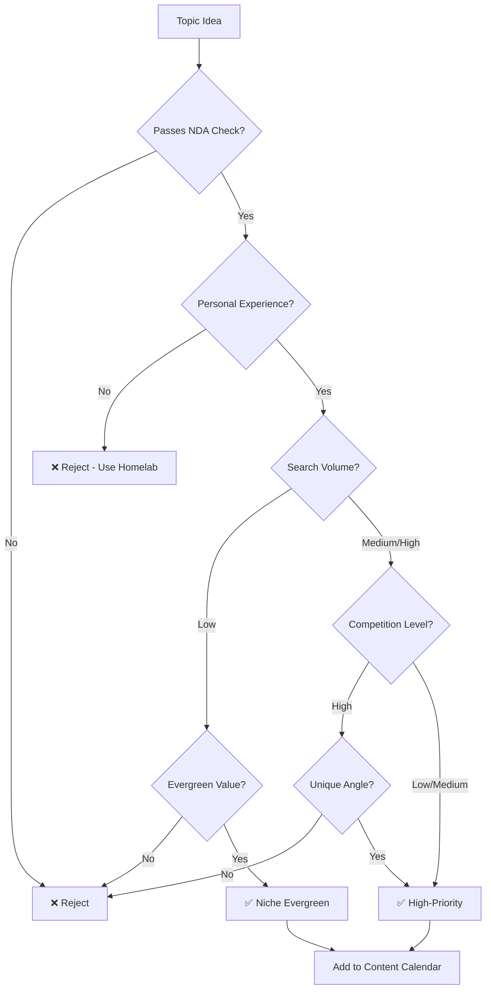

# Blog Topic Selection Strategy & Content Planning - 2025

**Created:** 2025-11-13
**Version:** 1.0.0
**Purpose:** Comprehensive topic selection methodology and content gaps analysis

---

## Executive Summary

**Current State (62 posts analyzed):**
- **Top Tags:** security (32), ai (23), homelab (21), programming (10), llm (10)
- **Content Ratio:** ~80% evergreen, ~20% trending (healthy foundation)
- **Average:** 2,773 words/post, 3.68 tags/post
- **Strongest Cluster:** homelab + security (14 posts)

**Key Findings:**
- ✅ Strong homelab security foundation
- ✅ Excellent AI/LLM coverage
- ⚠️ Significant gaps in cloud (2), monitoring (3), Docker (3), Python (3)
- ⚠️ Missing practical tool reviews, failure stories, beginner content
- ⚠️ No multi-part series or journey-style content

---

## I. Current Content Distribution Analysis

### Tag Distribution (Top 30)

| Tag | Count | % of Posts | Trend |
|-----|-------|-----------|-------|
| security | 32 | 52% | Core strength ✅ |
| ai | 23 | 37% | Strong ✅ |
| homelab | 21 | 34% | Core strength ✅ |
| programming | 10 | 16% | Moderate |
| llm | 10 | 16% | Moderate |
| machine-learning | 9 | 15% | Moderate |
| cryptography | 8 | 13% | Good |
| devops | 8 | 13% | Good |
| automation | 8 | 13% | Good |
| networking | 8 | 13% | Good |
| privacy | 7 | 11% | Good |
| **cloud** | **2** | **3%** | **GAP ⚠️** |
| **docker** | **3** | **5%** | **GAP ⚠️** |
| **monitoring** | **3** | **5%** | **GAP ⚠️** |
| **python** | **3** | **5%** | **GAP ⚠️** |

### Top Content Clusters

1. **Homelab + Security** (14 posts) - Primary niche ✅
2. **Homelab + Networking** (8 posts) - Strong foundation ✅
3. **AI + LLM** (7 posts) - Timely and strong ✅
4. **Homelab + Privacy** (7 posts) - Unique angle ✅
5. **AI + Machine Learning** (6 posts) - Educational value ✅

### Temporal Distribution

**2024:** 32 posts (52% of total)
**2025:** 30 posts (48% of total)

**Publication Frequency:**
- Peak: September 2025 (6 posts)
- Consistency: ~2-5 posts/month
- Opportunity: More consistent cadence (4 posts/month target)

---

## II. Identified Content Gaps

### A. Underrepresented Technical Topics

**CRITICAL GAPS (2-3 posts each):**

1. **Cloud Security & Architecture**
   - Current: 2 posts
   - Target: 8-10 posts
   - Topics: AWS security, Azure IAM, GCP networking, multi-cloud, cost optimization
   - Audience: Career-focused professionals

2. **Container & Orchestration Deep Dives**
   - Current: 3 posts (Docker), 3 posts (container-orchestration)
   - Target: 10-12 posts
   - Topics: Docker security, K8s networking, Helm charts, service mesh, container escape scenarios

3. **Monitoring & Observability**
   - Current: 3 posts
   - Target: 8-10 posts
   - Topics: Prometheus deep dives, Grafana dashboards, Loki, distributed tracing, SLO/SLI implementation

4. **Python for Security Automation**
   - Current: 3 posts
   - Target: 8-10 posts
   - Topics: Script library walkthroughs, automation patterns, testing frameworks, packaging

### B. Missing Content Formats

**1. Practical Implementation Series** ❌
- **Gap:** No multi-part "journey" content
- **Opportunity:** "Building X from Scratch" series
- **Examples:**
  - "Building a SOC Lab: 6-Part Series"
  - "Zero to Hero: Kubernetes Homelab in 30 Days"
  - "Securing Your Homelab: A 10-Part Guide"

**2. Tool Reviews & Comparisons** ❌
- **Gap:** Limited tool evaluation content
- **Opportunity:** Practical buyer's guides
- **Examples:**
  - "Wazuh vs Splunk vs ELK: Homelab SIEM Comparison"
  - "5 IDS/IPS Solutions Tested on Real Traffic"
  - "Password Managers Face-Off: Bitwarden vs 1Password vs KeePass"

**3. Failure Stories & Lessons Learned** ⚠️
- **Gap:** Minimal "what went wrong" content (writing-style.md mentions this)
- **Current:** Some failure anecdotes exist but not dedicated posts
- **Opportunity:** "Mistakes I Made" series
- **Examples:**
  - "How I Accidentally DDoS'd My Own Homelab"
  - "5 Costly Security Mistakes in My First Year"
  - "When Automation Goes Wrong: Recovery Lessons"

**4. Beginner-Friendly Foundations** ⚠️
- **Gap:** Most content assumes intermediate-advanced knowledge
- **Opportunity:** "Homelab Fundamentals" series
- **Examples:**
  - "Networking Basics for Homelab Beginners"
  - "Your First Security Lab: $200 Budget"
  - "Understanding Logs: A Beginner's Guide"

**5. Project Showcases & Walkthroughs** ⚠️
- **Gap:** Limited "build along with me" content
- **Opportunity:** Detailed implementation guides
- **Examples:**
  - "Building a Threat Intelligence Dashboard: Step-by-Step"
  - "My Automated Backup System: Complete Walkthrough"
  - "Setting Up Secure Remote Access in 60 Minutes"

### C. Emerging Technology Coverage

**Opportunities for Trending Content (20-30% ratio):**

1. **AI/LLM Security** (growing rapidly)
   - Prompt injection defenses
   - LLM supply chain security
   - AI red teaming techniques
   - Model stealing and adversarial attacks

2. **Zero Trust Architecture** (only 2 posts)
   - Practical ZTA implementation
   - SPIFFE/SPIRE deep dive
   - Service mesh security
   - Identity-centric security

3. **eBPF & Kernel Security** (currently strong, maintain)
   - More hands-on eBPF examples
   - Cilium deep dives
   - Kernel hardening techniques

4. **Supply Chain Security** (minimal coverage)
   - SBOM implementation
   - Artifact signing with Sigstore
   - Dependency scanning automation
   - Software provenance

5. **Post-Quantum Cryptography** (1 post, growing relevance)
   - PQC algorithm implementation
   - Migration strategies
   - Hybrid cryptography approaches

---

## III. Improved Topic Selection Methodology

### A. Research-Backed Best Practices

**70/30 Evergreen-Trending Ratio** (Industry Standard)
- **Current:** ~80/20 (good foundation, room for more trending)
- **Target:** 75/25 (slightly more timely content)
- **Rationale:** Security blog readers value depth over hot takes

**Content Mix by Type:**
- 40% Deep technical guides (evergreen)
- 25% Practical implementations (evergreen)
- 15% Tool reviews & comparisons (evergreen)
- 10% Trending security topics (trending)
- 10% Career/learning content (evergreen)

### B. Topic Selection Framework



**Decision Criteria (Score 0-5 each):**

1. **Personal Experience** (Must be 4+)
   - Can I test/demo this in my homelab?
   - Do I have unique insights from hands-on work?

2. **Audience Value** (Must be 3+)
   - Solves a real problem?
   - Saves readers time/money?
   - Teaches actionable skills?

3. **Search Potential** (Nice to have 3+)
   - Monthly search volume >100?
   - Ranking difficulty <60?

4. **Evergreen Longevity** (Prefer 4+)
   - Relevant in 2+ years?
   - Not dependent on specific versions?

5. **Unique Angle** (Must be 3+)
   - Different from existing content?
   - Combines topics uniquely?
   - Personal failures/lessons?

**Minimum Score:** 15/25 to proceed

### C. Content Calendar Structure

**Recommended Publishing Cadence:**
- **4 posts/month** (1 per week)
- **Week 1:** Deep technical guide (evergreen)
- **Week 2:** Practical implementation (evergreen)
- **Week 3:** Tool review/comparison (evergreen)
- **Week 4:** Trending topic OR failure story (mixed)

**Quarterly Themes:**
- Q1: Foundations & Fundamentals
- Q2: Advanced Implementations
- Q3: Tool Evaluations & Comparisons
- Q4: Year in Review & Future Trends

---

## IV. Proposed New Topic Categories

### A. Fill Critical Gaps (Priority 1)

**Cloud Security Series (8-10 posts)**
1. AWS IAM Deep Dive: Beyond Basic Roles
2. Azure Security Center: Homelab Integration
3. GCP Security Command Center: Practical Setup
4. Multi-Cloud Security: Managing AWS + Azure
5. Cloud Cost Optimization Through Security
6. S3 Security: Lessons from Public Bucket Failures
7. Serverless Security: Lambda Cold Start Issues
8. Cloud Network Segmentation: VPC Deep Dive

**Container Security Series (8-10 posts)**
1. Docker Security Hardening: 20 Best Practices
2. Kubernetes RBAC: Practical Implementation
3. Service Mesh Security: Istio vs Linkerd
4. Container Escape Scenarios: Testing in Homelab
5. Image Scanning: Trivy, Grype, Snyk Compared
6. Kubernetes Network Policies: Real-World Examples
7. Helm Security: Secrets Management Deep Dive
8. OPA/Gatekeeper: Policy as Code for K8s

**Monitoring & Observability Series (8-10 posts)**
1. Prometheus Architecture: Homelab Setup
2. Grafana Dashboards: From Zero to Hero
3. Loki: Log Aggregation for Homelabs
4. Distributed Tracing with Jaeger
5. SLO/SLI Implementation in Practice
6. Alert Fatigue: Lessons from Over-Monitoring
7. Cost-Effective Monitoring: Open Source Stack
8. Metrics That Actually Matter: Security Edition

**Python Security Automation Series (8-10 posts)**
1. Python Script Library Tour: 37 Utilities Explained
2. Pytest for Security Scripts: TDD Approach
3. Async Python for Security Scanning
4. Building a Vulnerability Scanner in Python
5. Python Packaging for Security Tools
6. Error Handling in Security Automation
7. Python + APIs: Integrating Security Services
8. Performance Optimization for Security Scripts

### B. New Content Formats (Priority 2)

**"Building X from Scratch" Series**
1. Building a SOC Lab: 6-Part Series
   - Part 1: Planning & Hardware
   - Part 2: Network Architecture
   - Part 3: Log Collection (Wazuh)
   - Part 4: SIEM Setup & Rules
   - Part 5: Threat Intelligence Integration
   - Part 6: Automation & Response

2. Zero to Hero: Kubernetes Homelab
   - Week 1: K3s Installation & Basics
   - Week 2: Storage & Networking
   - Week 3: Security & RBAC
   - Week 4: GitOps with ArgoCD

**"Tool Showdown" Comparison Series**
1. SIEM Solutions: Wazuh vs Splunk vs ELK
2. IDS/IPS: Suricata vs Snort vs Zeek
3. Password Managers: Bitwarden vs 1Password vs KeePass
4. Backup Solutions: restic vs Borg vs Kopia
5. VPN Technologies: WireGuard vs OpenVPN vs Tailscale

**"Mistakes I Made" Failure Series**
1. How I Accidentally DDoS'd My Homelab
2. 5 Costly Security Misconfigurations
3. When Automation Goes Wrong: Recovery Lessons
4. Certificate Expiration Disasters
5. The Day My Firewall Rules Locked Me Out

**"Beginner's Guide" Fundamentals Series**
1. Networking Basics for Homelab Enthusiasts
2. Your First Security Lab: $200 Budget
3. Understanding Logs: A Practical Introduction
4. Linux Security Fundamentals
5. Docker Basics for Security Professionals

### C. Trending Topics Opportunities (Priority 3)

**AI/LLM Security (5-7 posts)**
1. Prompt Injection: Defense Strategies
2. LLM Supply Chain Security
3. AI Red Teaming: Testing Your Models
4. Adversarial Attacks on Local LLMs
5. Securing AI APIs: Rate Limiting & Auth

**Zero Trust Implementation (5-7 posts)**
1. Zero Trust Architecture: Homelab Edition
2. SPIFFE/SPIRE: Practical Setup Guide
3. Service Mesh Security: Hands-On
4. Identity-Centric Security: Beyond Passwords

**Supply Chain Security (5-7 posts)**
1. SBOM Generation with Syft
2. Artifact Signing with Cosign/Sigstore
3. Dependency Scanning Automation
4. Software Provenance: Practical Implementation

---

## V. Topic Research & Validation Process

### A. Topic Discovery Sources

**1. Audience-Driven (Primary)**
- GitHub issues/discussions on your repos
- Comments on existing posts
- Questions from peers/colleagues (NDA-safe)
- Search console queries (what brings people to your site)

**2. Industry Research (Secondary)**
- CVE databases (new vulnerabilities)
- CISA advisories (trending threats)
- Tool release announcements
- Conference talks (DEF CON, Black Hat, BSides)
- Academic papers (arXiv security section)

**3. Homelab Experiments (Tertiary)**
- New tools you're testing
- Problems you're solving
- Failed experiments (failure stories!)
- Performance optimizations
- Cost savings discoveries

### B. Validation Checklist

Before committing to a topic, verify:

- [ ] **NDA Compliance:** 100% personal homelab or public knowledge
- [ ] **Hands-On Experience:** Can test/demo in your environment
- [ ] **Unique Value:** Different angle or deeper than existing content
- [ ] **Reproducible:** Readers can follow along
- [ ] **Evergreen Potential:** Relevant for 18+ months OR clearly trending
- [ ] **Audience Fit:** Security professionals or homelab enthusiasts
- [ ] **Complexity Level:** Matches target audience (intermediate-advanced)
- [ ] **Time Investment:** Can research + write + test in reasonable timeframe

### C. Topic Prioritization Matrix

```
HIGH PRIORITY (Do First):
- Critical gaps (cloud, monitoring, containers)
- Strong search volume + low competition
- Personal experience + unique angle
- Aligns with career positioning

MEDIUM PRIORITY (Do Next):
- Moderate gaps (python, docker, automation)
- Evergreen value + moderate competition
- Trending topics with longevity (AI security)
- Tool comparisons with broad appeal

LOW PRIORITY (Do Later):
- Saturated topics (basic password security)
- Pure trend chasing (flavor-of-the-week)
- Narrow niche with low search volume
- Requires external resources you don't have
```

---

## VI. Implementation Plan

### Phase 1: Fill Critical Gaps (Q1 2026)

**Goal:** Increase coverage in cloud (2→8), monitoring (3→8), containers (3→8)

**Months 1-3 (12 posts total):**
- Week 1: Cloud security deep dives (3 posts)
- Week 2: Container security implementations (3 posts)
- Week 3: Monitoring & observability (3 posts)
- Week 4: Python automation tutorials (3 posts)

**Success Metrics:**
- Publish 12 posts in critical gap areas
- Average 2,500+ words per post
- 80%+ posts rank page 1 for target keywords within 6 months
- Increase traffic to gap topics by 200%

### Phase 2: Launch Content Series (Q2 2026)

**Goal:** Build audience engagement with multi-part content

**Months 4-6 (12 posts total):**
- "Building a SOC Lab" 6-part series (Weeks 1-6)
- "Tool Showdown" comparison posts (Weeks 7-9)
- "Mistakes I Made" failure stories (Weeks 10-12)

**Success Metrics:**
- Complete 1 major series (6 parts)
- Publish 3 tool comparison posts
- Publish 3 failure story posts
- Increase newsletter signups by 50%
- Increase average session duration by 25%

### Phase 3: Expand Trending Coverage (Q3 2026)

**Goal:** Balance evergreen foundation with timely topics

**Months 7-9 (12 posts total):**
- AI/LLM security (4 posts)
- Zero trust implementations (4 posts)
- Supply chain security (4 posts)

**Success Metrics:**
- Publish 12 trending topic posts
- Achieve 3+ backlinks per trending post
- Increase social media shares by 100%
- Rank for "AI security" related keywords

### Phase 4: Optimize & Scale (Q4 2026)

**Goal:** Refine content mix based on performance data

**Months 10-12 (12 posts total):**
- Top-performing topic deep dives (6 posts)
- Beginner-friendly foundations (3 posts)
- Year in review + trends (3 posts)

**Success Metrics:**
- Total posts: 62 + 48 = 110 posts
- Organic traffic increase: 150%+
- Email subscribers: 500+
- Average engagement time: 5+ minutes

---

## VII. Content Quality Standards

### A. Technical Accuracy

**MANDATORY:**
- All commands/code tested in homelab before publishing
- Hardware/software specs match uses.md
- Model sizes/VRAM claims technically accurate (learned from recent audit!)
- Performance metrics measured, not estimated
- Error messages quoted exactly

### B. Research & Citations

**TARGET: 10+ citations per post**
- Academic sources (arXiv, papers): 40%+
- Vendor documentation: 30%
- Industry research/tools: 20%
- Personal experiments: 10%

### C. Writing Style Compliance

**"Polite Linus Torvalds" Standards:**
- Direct, technical, no fluff
- Engineer-to-engineer tone
- Active voice, short sentences (<20 words avg)
- Zero corporate buzzwords
- Include failure stories and lessons
- Results-oriented language

---

## VIII. Tracking & Optimization

### A. Key Performance Indicators (KPIs)

**Content Performance:**
- Organic traffic per post
- Average engagement time
- Bounce rate
- Social shares
- Backlinks generated

**Topic Performance:**
- Search rankings for target keywords
- Click-through rate from search
- Internal link clicks
- Newsletter conversions

**Quarterly Goals:**
- 15% organic traffic growth
- 10% increase in average engagement time
- 5+ new backlinks per quarter
- 100+ newsletter subscribers per quarter

### B. Feedback Loops

**Monthly Review:**
- Analyze top 5 performing posts (replicate success)
- Identify bottom 5 performers (update or redirect)
- Review search console queries (find new topic ideas)
- Check broken links, outdated content

**Quarterly Audit:**
- Topic distribution analysis (re-run topic-distribution-analyzer.py)
- Gap analysis (are we filling critical gaps?)
- Competitor analysis (what are similar blogs covering?)
- Audience survey (what do readers want to learn?)

---

## IX. Recommendations Summary

### Immediate Actions (Next 30 Days)

1. **Create content calendar** for Q1 2026 focusing on critical gaps
2. **Outline first 4 posts** in cloud security series
3. **Set up topic tracking system** (Notion, Airtable, or spreadsheet)
4. **Schedule monthly content reviews** (first Friday of each month)

### Short-Term (Next 90 Days)

1. **Publish 8 posts** in critical gap areas (cloud, containers, monitoring)
2. **Outline "Building a SOC Lab"** 6-part series
3. **Create 3 tool comparison posts** (SIEM, IDS/IPS, VPN)
4. **Write 2 failure story posts** (DDoS'd my homelab, automation gone wrong)

### Long-Term (Next 12 Months)

1. **Grow to 110 total posts** (48 new posts in 2026)
2. **Balance 75/25 evergreen-trending ratio**
3. **Launch 2 major multi-part series**
4. **Establish consistent 4 posts/month cadence**
5. **Increase organic traffic by 150%**

---

## X. Appendix: Topic Idea Bank

### Cloud Security Topics (25 ideas)
1. AWS IAM Policy Testing with IAM Policy Simulator
2. Azure Sentinel: Homelab Integration Guide
3. GCP Security Scanner: Automated Auditing
4. Multi-Cloud Identity Federation
5. Cloud Cost Anomaly Detection for Security
6. CloudTrail Deep Dive: Finding the Needles
7. S3 Bucket Security: Common Misconfigurations
8. Lambda Security: Cold Start Attack Vectors
9. VPC Flow Logs: Security Analysis in Practice
10. [15 more...]

### Container Security Topics (25 ideas)
1. Docker Bench Security: Automated Hardening
2. Kubernetes Pod Security Standards
3. Falco: Runtime Security for Containers
4. Container Image Provenance with Cosign
5. Network Policies: Micro-Segmentation in K8s
6. Secrets Management: Sealed Secrets vs External Secrets
7. Docker Content Trust: Image Signing
8. Kubernetes Admission Controllers: Custom Policies
9. Runtime Class: gVisor vs Kata Containers
10. [15 more...]

### Monitoring Topics (20 ideas)
1. Prometheus Alert Manager: Notification Routing
2. Grafana Loki: Log Aggregation at Scale
3. Jaeger: Distributed Tracing Setup
4. Thanos: Prometheus Long-Term Storage
5. VictoriaMetrics: Prometheus Alternative
6. OpenTelemetry: Unified Observability
7. Uptime Kuma: Self-Hosted Monitoring
8. Netdata: Real-Time Performance Monitoring
9. Fluentd vs Fluent Bit: Log Forwarding
10. [10 more...]

### Python Security Topics (20 ideas)
1. Building a Port Scanner in Python
2. Async Web Scraping for Recon
3. Python + MITRE ATT&CK: Threat Mapping
4. Automated CVE Monitoring with Python
5. Python Cryptography Library Deep Dive
6. Pytest for Security Tools: TDD
7. Python Package Security Scanning
8. Building a Log Parser in Python
9. API Security Testing with Python
10. [10 more...]

### Tool Comparison Topics (15 ideas)
1. SIEM: Wazuh vs Splunk vs ELK vs Graylog
2. IDS/IPS: Suricata vs Snort vs Zeek
3. Password Managers: Bitwarden vs 1Password vs KeePass vs Vaultwarden
4. Backup: restic vs Borg vs Kopia vs Duplicati
5. VPN: WireGuard vs OpenVPN vs Tailscale vs ZeroTier
6. Container Scanners: Trivy vs Grype vs Clair vs Snyk
7. Secrets: Vault vs Sealed Secrets vs SOPS vs Doppler
8. WAF: ModSecurity vs Coraza vs NAXSI
9. [7 more...]

---

**Version History:**
- v1.0.0 (2025-11-13): Initial comprehensive strategy created
