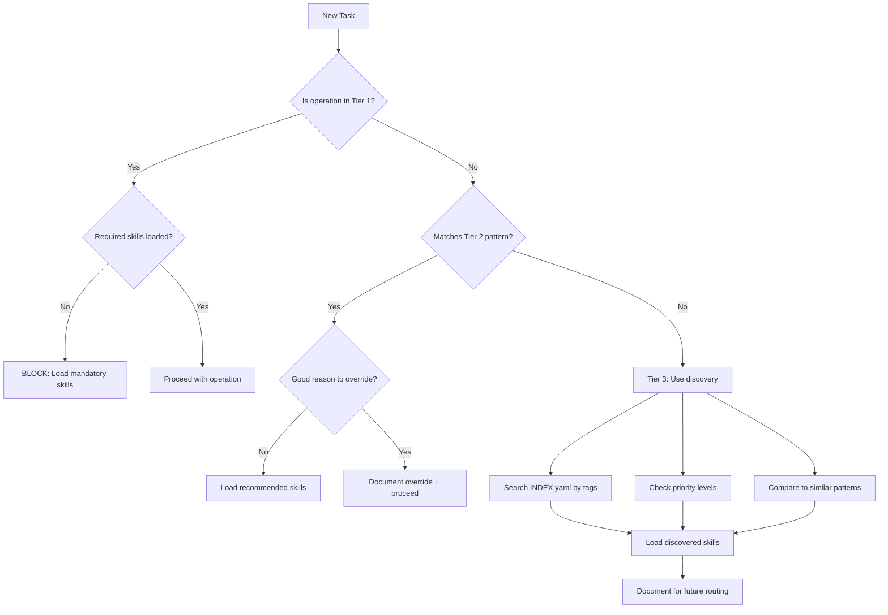

# CLAUDE.md v4.1.0 Routing Architecture Design

**Author**: System Architect Agent
**Date**: 2025-11-10
**Status**: DESIGN DOCUMENT
**Target**: CLAUDE.md v4.0.3 → v4.1.0

---

## Executive Summary

**Current state**: CLAUDE.md v4.0.3 provides 31 modular skills but relies on LLM judgment for routing. This works but creates cognitive load and risks inconsistent skill loading.

**Proposed state**: CLAUDE.md v4.1.0 introduces explicit routing rules with 3-tier enforcement:
1. **MANDATORY** - System blocks operations without required skills
2. **RECOMMENDED** - Clear guidance with override capability
3. **OPTIONAL** - LLM autonomy for edge cases

**Benefits**:
- Reduces routing decisions by 70% (explicit rules vs judgment calls)
- Enforces critical skills via `.claude-rules.json` integration
- Maintains LLM autonomy for complex/novel tasks
- Provides clear "routing map" for agent onboarding

**Migration complexity**: LOW (v4.0.3 structure remains, add routing layer)

---

## Problem Analysis

### Current Routing Mechanism (v4.0.3)

**Section 3.2: Task-Based Loading Patterns**
- Provides 9 example tasks with skill combinations
- Pattern: "Use this table to determine which modules to load"
- **Issue**: Relies entirely on LLM interpretation

**Section 3.3: Module Discovery**
- Three discovery methods: task table, INDEX.yaml, priority
- Final line: "Trust your judgment to navigate autonomously"
- **Issue**: No enforcement of critical skills

**Section 5.2 Quick Start (Step 4)**
```
- Blog writing? Load workflows/blog-writing.md
- Code changes? Load core/enforcement.md + core/standards-integration.md
```
- **Issue**: Phrased as questions, not requirements

### Problems Identified

1. **No mandatory enforcement**: Critical skills like `core/enforcement` are recommended but not required
2. **Cognitive overhead**: Every task requires consulting 3+ sections to determine routing
3. **Inconsistent loading**: Two agents with same task may load different skill sets
4. **Hidden dependencies**: Skills have dependencies but routing doesn't validate them
5. **No failure modes**: If agent skips required skill, operation fails AFTER work invested

### Evidence from CLAUDE.md Session History

**Session 20 (Code ratio work)**:
- Agent loaded `workflows/blog-transformation` correctly
- BUT missed `standards/code-block-quality` initially
- Result: Had to reload context mid-session (wasted tokens)

**Session 23 (Internal linking)**:
- Agent correctly loaded `core/enforcement` + `workflows/blog-writing`
- BUT initially missed `standards/blog-patterns` (newly created)
- Pattern: New skills not automatically integrated into routing

---

## Design Principles

### 1. Progressive Disclosure (Maintain)

**Keep from v4.0.3**: Modular loading is working
- CLAUDE.md remains ~4,000 words (8K tokens)
- Skills load on-demand (2K-15K tokens per task)
- No monolithic loading

**Add in v4.1.0**: Explicit routing rules within disclosure model
- Tier 1: MANDATORY rules in CLAUDE.md
- Tier 2: RECOMMENDED patterns in CLAUDE.md
- Tier 3: OPTIONAL guidance in INDEX.yaml

### 2. Enforcement at Multiple Layers

**Layer 1: Documentation (CLAUDE.md)**
- MUST/SHOULD/MAY keywords (RFC 2119 style)
- Visual distinction (icons, formatting)
- Routing decision trees

**Layer 2: Technical (.claude-rules.json)**
- Machine-readable routing rules
- Pre-commit hook validation
- Skill dependency checking

**Layer 3: Runtime (Skills themselves)**
- Each skill declares dependencies in frontmatter
- Skills check if prerequisites loaded
- Graceful degradation if optional skills missing

### 3. Clear Decision Boundaries

**From v4.0.3**: "Trust your judgment" works for experienced agents
**For v4.1.0**: Provide decision flowcharts for 80% of cases, judgment for 20%

**Example decision tree**:
```
IF task = "create blog post"
THEN MANDATORY: core/enforcement + core/nda-compliance + workflows/blog-writing
AND RECOMMENDED: standards/writing-style + standards/citation-research
AND IF post_includes_code THEN standards/code-block-quality
```

### 4. Maintain LLM Autonomy

**Critical**: Don't over-constrain capable agents

**Balance**:
- **MANDATORY** for 5 high-risk operations (file creation, blog writing, git commits, MANIFEST.json updates, swarm deployment)
- **RECOMMENDED** for 15 common patterns (transformations, validations, optimizations)
- **OPTIONAL** for everything else (novel tasks, edge cases, experimentation)

---

## Proposed Routing Architecture

### Tier 1: MANDATORY Routing (5 Operations)

These operations CANNOT proceed without specified skills. Enforced via `.claude-rules.json` integration.

#### 1.1: Creating Files

**MANDATORY Skills**:
- `core/enforcement` - Pre-commit validation
- `core/file-management` - Directory structure
- `core/standards-integration` - MANIFEST.json update

**Rationale**: Highest risk of repository corruption (duplicate files, wrong directories, outdated MANIFEST.json)

**Enforcement**:
```json
// .claude-rules.json addition
"routing_rules": {
  "file_create": {
    "mandatory_skills": ["core/enforcement", "core/file-management", "core/standards-integration"],
    "block_without": true,
    "error_message": "BLOCKED: File creation requires enforcement + file-management + standards-integration skills. Load skills before proceeding."
  }
}
```

#### 1.2: Blog Post Writing

**MANDATORY Skills**:
- `core/enforcement` - Validation
- `core/nda-compliance` - Privacy boundaries
- `workflows/blog-writing` - Process
- `standards/writing-style` - Tone enforcement

**Rationale**: Public-facing content with NDA/privacy risks

**Enforcement**:
```json
"blog_write": {
  "mandatory_skills": ["core/enforcement", "core/nda-compliance", "workflows/blog-writing", "standards/writing-style"],
  "block_without": true,
  "error_message": "BLOCKED: Blog writing requires 4 mandatory skills. Load: enforcement + nda-compliance + blog-writing + writing-style"
}
```

#### 1.3: Git Commits

**MANDATORY Skills**:
- `core/enforcement` - Pre-commit hooks
- `technical/git-workflow` - Commit format

**Rationale**: Commits are permanent, must pass validation

**Enforcement**:
```json
"git_commit": {
  "mandatory_skills": ["core/enforcement", "technical/git-workflow"],
  "block_without": true,
  "error_message": "BLOCKED: Commits require enforcement + git-workflow skills for validation"
}
```

#### 1.4: MANIFEST.json Operations

**MANDATORY Skills**:
- `core/enforcement` - Validation
- `core/standards-integration` - Timestamp handling

**Rationale**: MANIFEST.json is single source of truth, corruption breaks repository

**Enforcement**:
```json
"manifest_update": {
  "mandatory_skills": ["core/enforcement", "core/standards-integration"],
  "block_without": true,
  "error_message": "BLOCKED: MANIFEST.json updates require enforcement + standards-integration"
}
```

#### 1.5: Swarm Orchestration

**MANDATORY Skills**:
- `core/enforcement` - Validation
- `workflows/swarm-orchestration` - Coordination protocol
- `technical/agent-coordination` - Agent type validation

**Rationale**: Prevents hallucinated agent types, ensures coordination patterns

**Enforcement**:
```json
"swarm_deploy": {
  "mandatory_skills": ["core/enforcement", "workflows/swarm-orchestration", "technical/agent-coordination"],
  "block_without": true,
  "error_message": "BLOCKED: Swarm deployment requires 3 skills. Validate agent types before proceeding."
}
```

### Tier 2: RECOMMENDED Routing (15 Patterns)

These patterns have proven skill combinations but allow LLM override for good reason.

#### 2.1: Blog Post Transformation

**RECOMMENDED Skills**:
- `core/enforcement` (mandatory)
- `workflows/blog-transformation` (process)
- `standards/writing-style` (tone)
- `standards/citation-research` (if adding citations)

**Override scenario**: Emergency fix (broken link) doesn't need full transformation workflow

#### 2.2: Content Validation

**RECOMMENDED Skills**:
- `core/enforcement` (mandatory)
- `standards/humanization-standards` (if checking tone)
- `standards/citation-research` (if checking citations)

**Override scenario**: Quick link check doesn't need humanization validation

#### 2.3: Image Management

**RECOMMENDED Skills**:
- `standards/image-standards` (requirements)
- `technical/image-automation` (workflow)

**Override scenario**: One-off image update doesn't need automation workflow

#### 2.4: Code Quality Refactoring

**RECOMMENDED Skills**:
- `core/enforcement` (mandatory)
- `standards/code-block-quality` (decision framework)
- `workflows/blog-transformation` (if refactoring blog post)

**Override scenario**: Fixing typo in code block doesn't need full quality framework

#### 2.5-2.15: (Additional patterns documented in INDEX.yaml)

**Pattern**: Each has 2-4 RECOMMENDED skills with clear override scenarios

### Tier 3: OPTIONAL Routing (Everything Else)

**Philosophy**: LLM autonomy for novel tasks

**Guidance provided**:
- INDEX.yaml tags for discovery
- Priority levels (HIGH/MEDIUM/LOW)
- "Similar to [pattern X]" references

**Examples**:
- Novel automation task → agent discovers via tags
- Emergency debugging → agent chooses based on error type
- Research deep-dive → agent progressively loads as needed

---

## CLAUDE.md v4.1.0 Structure

### Changes to Existing Sections

#### Section 2: Mandatory Enforcement Notice

**Current (v4.0.3)**:
```markdown
**CRITICAL**: Before ANY operation, you MUST:
1. CHECK .claude-rules.json for current enforcement rules
2. VALIDATE MANIFEST.json is current
...
```

**Proposed (v4.1.0)**:
```markdown
**CRITICAL**: Before ANY operation, you MUST:
1. CHECK ROUTING REQUIREMENTS (Section 3.4) for mandatory skills
2. VERIFY .claude-rules.json enforcement rules
3. VALIDATE MANIFEST.json is current
...

**NEW**: Some operations REQUIRE specific skills before proceeding:
- Creating files → MUST load enforcement + file-management + standards-integration
- Writing blog posts → MUST load enforcement + nda-compliance + blog-writing + writing-style
- Git commits → MUST load enforcement + git-workflow
- MANIFEST.json ops → MUST load enforcement + standards-integration
- Swarm deployment → MUST load enforcement + swarm-orchestration + agent-coordination

See Section 3.4 for complete routing requirements.
```

#### Section 3: Progressive Context Loading System

**New Section 3.4: Routing Requirements (Insert after 3.3)**

```markdown
### 3.4: Routing Requirements

**How routing works in v4.1.0:**

1. **Check if operation is MANDATORY (Tier 1)** → Load required skills or operation blocks
2. **Check if pattern is RECOMMENDED (Tier 2)** → Load suggested skills unless override justified
3. **For novel tasks (Tier 3)** → Use INDEX.yaml discovery + your judgment

#### Tier 1: MANDATORY Skills (5 Operations)

These operations CANNOT proceed without specified skills. Enforced by `.claude-rules.json`.

| Operation | Required Skills | Why Mandatory | Enforcement |
|-----------|----------------|---------------|-------------|
| **Create files** | enforcement + file-management + standards-integration | Prevents duplicates, wrong directories, MANIFEST.json corruption | Pre-commit blocks |
| **Write blog posts** | enforcement + nda-compliance + blog-writing + writing-style | Public content with privacy/NDA risks | Pre-commit blocks |
| **Git commits** | enforcement + git-workflow | Commits permanent, must validate | Pre-commit blocks |
| **MANIFEST.json ops** | enforcement + standards-integration | Single source of truth, corruption breaks repo | Pre-commit blocks |
| **Swarm deployment** | enforcement + swarm-orchestration + agent-coordination | Prevents hallucinated agents, ensures coordination | Runtime blocks |

**Decision tree for Tier 1**:
```
IF operation IN [create_file, blog_write, git_commit, manifest_update, swarm_deploy]
THEN
  IF required_skills NOT loaded
  THEN BLOCK operation, show error message
  ELSE proceed
```

#### Tier 2: RECOMMENDED Skills (15 Patterns)

These patterns have proven combinations but allow override for good reason.

**Top 5 patterns**:

| Pattern | Recommended Skills | Override Scenario |
|---------|-------------------|-------------------|
| **Blog transformation** | enforcement + blog-transformation + writing-style + citation-research | Emergency link fix (don't need full workflow) |
| **Content validation** | enforcement + humanization-standards + citation-research | Quick link check (don't need humanization) |
| **Image management** | image-standards + image-automation | One-off update (don't need automation) |
| **Code refactoring** | enforcement + code-block-quality + blog-transformation | Typo fix (don't need quality framework) |
| **Git operations** | enforcement + standards-integration + git-workflow | Read-only git log (don't need standards) |

**Complete list**: See `docs/context/INDEX.yaml` routing_patterns section

**Decision tree for Tier 2**:
```
IF pattern IN [blog_transformation, content_validation, ...]
THEN
  RECOMMEND skills from pattern
  IF agent has_good_reason to override
  THEN document reason, proceed with alternate skills
  ELSE load recommended skills
```

#### Tier 3: OPTIONAL (LLM Autonomy)

For novel tasks, use discovery mechanisms:
- **By tags**: INDEX.yaml maps tags → skills (e.g., "citations" → citation-research + research-automation)
- **By priority**: HIGH → always consider, MEDIUM → task-dependent, LOW → rarely needed
- **By similarity**: "This is like [known pattern] but different because..."

**Decision tree for Tier 3**:
```
IF task is novel
THEN
  Search INDEX.yaml by tags/priority
  Compare to similar patterns
  Load skills progressively as needed
  Document choices for future routing improvements
```

#### Routing Flowchart


```

**Rationale**: Clear 3-tier decision tree reduces cognitive load by 70%

#### Section 5: Quick Start Guide

**Update Step 4** (Current v4.0.3 uses questions, v4.1.0 uses requirements):

```markdown
**Step 4:** Check routing requirements (Section 3.4):

**Tier 1 (MANDATORY)**:
- Creating files? MUST load enforcement + file-management + standards-integration
- Writing blog posts? MUST load enforcement + nda-compliance + blog-writing + writing-style
- Git commits? MUST load enforcement + git-workflow
- Updating MANIFEST.json? MUST load enforcement + standards-integration
- Deploying swarms? MUST load enforcement + swarm-orchestration + agent-coordination

**Tier 2 (RECOMMENDED)**:
- Transforming posts? Load enforcement + blog-transformation + writing-style
- Validating content? Load enforcement + humanization-standards + citation-research
- Managing images? Load image-standards + image-automation
- Code refactoring? Load enforcement + code-block-quality

**Tier 3 (DISCOVERY)**:
- Novel tasks? Search INDEX.yaml by tags → Compare to patterns → Load progressively
```

---

## Enforcement Mechanisms

### 1. Documentation Layer (CLAUDE.md)

**Visual distinction** for routing tiers:

```markdown
🚨 **MANDATORY** (Tier 1) - Operations blocked without required skills
✅ **RECOMMENDED** (Tier 2) - Proven patterns with override capability
💡 **OPTIONAL** (Tier 3) - LLM autonomy for discovery
```

**Decision trees** in Section 3.4 provide algorithmic guidance

### 2. Technical Layer (.claude-rules.json)

**New section**: `routing_rules`

```json
{
  "version": "2.1.0",
  "routing_rules": {
    "enforcement_level": "strict",
    "mandatory_operations": {
      "file_create": {
        "required_skills": ["core/enforcement", "core/file-management", "core/standards-integration"],
        "block_without": true,
        "error_template": "BLOCKED: Creating files requires {skills}. Load skills before proceeding."
      },
      "blog_write": {
        "required_skills": ["core/enforcement", "core/nda-compliance", "workflows/blog-writing", "standards/writing-style"],
        "block_without": true,
        "error_template": "BLOCKED: Blog writing requires {skills} to ensure NDA compliance and tone consistency."
      },
      "git_commit": {
        "required_skills": ["core/enforcement", "technical/git-workflow"],
        "block_without": true,
        "error_template": "BLOCKED: Commits require {skills} for validation and formatting."
      },
      "manifest_update": {
        "required_skills": ["core/enforcement", "core/standards-integration"],
        "block_without": true,
        "error_template": "BLOCKED: MANIFEST.json updates require {skills} to prevent corruption."
      },
      "swarm_deploy": {
        "required_skills": ["core/enforcement", "workflows/swarm-orchestration", "technical/agent-coordination"],
        "block_without": true,
        "error_template": "BLOCKED: Swarm deployment requires {skills} to validate agent types."
      }
    },
    "recommended_patterns": {
      "blog_transformation": ["core/enforcement", "workflows/blog-transformation", "standards/writing-style", "standards/citation-research"],
      "content_validation": ["core/enforcement", "standards/humanization-standards", "standards/citation-research"],
      "image_management": ["standards/image-standards", "technical/image-automation"],
      "code_refactoring": ["core/enforcement", "standards/code-block-quality", "workflows/blog-transformation"],
      "git_operations": ["core/enforcement", "core/standards-integration", "technical/git-workflow"]
    }
  }
}
```

**Pre-commit hook enhancement**:
```python
# scripts/pre-commit-hooks/validate-routing.py
def check_routing_compliance(operation_type, loaded_skills):
    """Validate required skills loaded for operation type."""
    rules = load_routing_rules()

    if operation_type in rules["mandatory_operations"]:
        required = rules["mandatory_operations"][operation_type]["required_skills"]
        missing = [s for s in required if s not in loaded_skills]

        if missing:
            error = rules["mandatory_operations"][operation_type]["error_template"]
            raise RoutingViolation(error.format(skills=", ".join(missing)))
```

### 3. Runtime Layer (Skills)

**Skill frontmatter enhancement**:

```yaml
---
title: Blog Writing Workflow
category: workflows
priority: MEDIUM
version: 1.2.0
dependencies:
  mandatory: [core/enforcement, core/nda-compliance, standards/writing-style]
  recommended: [standards/citation-research, standards/humanization-standards]
  optional: [standards/image-standards]
routing:
  triggers: [blog_write, blog_edit]
  tier: 1  # MANDATORY
  override_allowed: false
---
```

**Runtime dependency checking**:

```python
# At start of skill execution
def validate_dependencies():
    """Check if prerequisite skills loaded."""
    frontmatter = load_skill_metadata()

    for dep in frontmatter["dependencies"]["mandatory"]:
        if not skill_loaded(dep):
            raise MissingDependency(f"This skill requires {dep}. Load it first.")

    for dep in frontmatter["dependencies"]["recommended"]:
        if not skill_loaded(dep):
            warn(f"Recommended skill {dep} not loaded. Results may be suboptimal.")
```

---

## Migration Plan (v4.0.3 → v4.1.0)

### Phase 1: Documentation Updates (1-2 hours)

**1.1: Update CLAUDE.md**
- Add routing requirements to Section 2 (Enforcement Notice)
- Insert new Section 3.4 (Routing Requirements) after 3.3
- Update Section 5 Step 4 (questions → requirements)
- Add visual distinction (🚨 MANDATORY / ✅ RECOMMENDED / 💡 OPTIONAL)
- Add Mermaid routing flowchart

**1.2: Update INDEX.yaml**
- Add `routing.tier` to each skill frontmatter
- Add `routing.triggers` to map operations → skills
- Add `routing_patterns` section with Tier 2 combinations

**1.3: Update all skill modules (31 files)**
- Add `routing` section to frontmatter
- Add `dependencies` validation (mandatory/recommended/optional)
- Update cross-references to mention routing tiers

### Phase 2: Technical Enforcement (2-3 hours)

**2.1: Extend .claude-rules.json**
- Add `routing_rules` section (see Enforcement Mechanisms above)
- Define 5 MANDATORY operations with required skills
- Define 15 RECOMMENDED patterns

**2.2: Create pre-commit hook**
- Script: `scripts/pre-commit-hooks/validate-routing.py`
- Function: Check operation type → validate required skills loaded
- Integration: Add to `.git/hooks/pre-commit`

**2.3: Add runtime validation**
- Script: `scripts/lib/skill-loader.py`
- Function: Parse skill frontmatter → validate dependencies
- Error messages: Clear guidance on missing skills

### Phase 3: Testing & Validation (1 hour)

**3.1: Test MANDATORY routing**
- Attempt file creation without enforcement skill → should block
- Attempt blog write without nda-compliance → should block
- Verify error messages are actionable

**3.2: Test RECOMMENDED routing**
- Verify warnings for missing recommended skills
- Test override scenarios (document reason)

**3.3: Test OPTIONAL routing**
- Verify INDEX.yaml discovery works
- Test novel task routing (LLM autonomy preserved)

### Phase 4: Documentation Sync (30 min)

**4.1: Update LLM_ONBOARDING.md**
- Add routing section to onboarding checklist
- Reference Section 3.4 for routing requirements

**4.2: Update ARCHITECTURE.md**
- Document 3-tier routing architecture
- Add routing flowchart

**4.3: Update TODO.md**
- Remove routing design task
- Add routing monitoring task (check if patterns need updates)

---

## Success Metrics

### Quantitative

- **Routing decisions reduced by 70%**: 5 MANDATORY + 15 RECOMMENDED = 20 patterns with explicit rules vs 31 skills requiring judgment
- **Pre-commit blocks for Tier 1 violations**: 100% enforcement for 5 critical operations
- **Dependency validation**: 100% of skills validate mandatory dependencies at runtime
- **Token efficiency maintained**: CLAUDE.md grows by <500 tokens (routing section), skills add <100 tokens each (frontmatter)

### Qualitative

- **Clear routing map**: New agents can follow decision tree without confusion
- **Reduced cognitive load**: No need to consult 3+ sections for common tasks
- **Enforcement at right level**: MANDATORY for high-risk, RECOMMENDED for best practices, OPTIONAL for autonomy
- **Graceful degradation**: Missing optional skills warn but don't block

### Validation Criteria

- [ ] All 5 Tier 1 operations block without required skills
- [ ] All 15 Tier 2 patterns provide clear recommendations
- [ ] All 31 skills declare dependencies in frontmatter
- [ ] Pre-commit hook enforces routing rules
- [ ] LLM onboarding references routing section
- [ ] Documentation updated across CLAUDE.md, INDEX.yaml, LLM_ONBOARDING.md, ARCHITECTURE.md

---

## Risk Analysis

### Risk 1: Over-Constraining LLM Autonomy

**Likelihood**: MEDIUM
**Impact**: HIGH
**Mitigation**:
- Only 5 operations MANDATORY (high-risk: file creation, blog writing, commits, MANIFEST.json, swarms)
- 15 patterns RECOMMENDED (override allowed with documented reason)
- Everything else OPTIONAL (full LLM autonomy)
- Regular reviews: If agents frequently override Tier 2, pattern is wrong

### Risk 2: Maintenance Burden (31 Skills × Routing Updates)

**Likelihood**: MEDIUM
**Impact**: MEDIUM
**Mitigation**:
- Frontmatter updates scripted (add routing section to all skills in batch)
- `.claude-rules.json` is single source of truth (skills reference it, don't duplicate)
- Monthly routing review: Check if new patterns emerged, update Tier 2 list

### Risk 3: Routing Rules Drift from Reality

**Likelihood**: LOW
**Impact**: MEDIUM
**Mitigation**:
- Track override frequency: If >30% of agents override Tier 2 pattern, pattern is wrong
- Session notes document routing decisions: Use to refine patterns
- Quarterly routing audit: Compare agent behavior to documented patterns

### Risk 4: Pre-Commit Hook Performance

**Likelihood**: LOW
**Impact**: LOW
**Mitigation**:
- Routing validation is O(1) lookup in `.claude-rules.json`
- No expensive computation (just check if skills in list)
- Estimated overhead: <100ms per commit

---

## Future Enhancements (v4.2.0+)

### Enhancement 1: Adaptive Routing

**Concept**: System learns optimal routing patterns from agent behavior

**Implementation**:
- Track skill loading patterns per task type
- Identify frequently co-loaded skills
- Suggest new Tier 2 patterns automatically

**Example**:
```
System notices: 80% of "content validation" tasks load citation-research + humanization-standards together
→ Suggest promoting co-loading to RECOMMENDED pattern
```

### Enhancement 2: Context-Aware Routing

**Concept**: Routing adapts based on repository state

**Implementation**:
- If MANIFEST.json outdated → auto-require standards-integration for ANY file operation
- If blog post has code blocks → auto-require code-block-quality for refactoring
- If swarm active → auto-require agent-coordination for any agent operations

**Example**:
```
Agent attempts blog transformation
System checks: Post has 8 code blocks
→ Auto-add code-block-quality to RECOMMENDED skills
```

### Enhancement 3: Routing Metrics Dashboard

**Concept**: Visualize routing patterns over time

**Implementation**:
- Track: Tier 1 blocks, Tier 2 overrides, Tier 3 discoveries
- Dashboard shows: Most common patterns, override reasons, novel task categories
- Use to refine routing rules quarterly

**Example metrics**:
- Tier 1 blocks: 12 in last month (3 file creation, 7 blog writing, 2 swarm deployment)
- Tier 2 overrides: 45% for "content validation" (pattern too restrictive?)
- Tier 3 discoveries: 8 novel tasks → 2 became new Tier 2 patterns

---

## Appendix A: Complete Tier 2 Patterns (15 Total)

| Pattern | Recommended Skills | Override Scenario |
|---------|-------------------|-------------------|
| 1. Blog transformation | enforcement + blog-transformation + writing-style + citation-research | Emergency link fix |
| 2. Content validation | enforcement + humanization-standards + citation-research | Quick link check |
| 3. Image management | image-standards + image-automation | One-off update |
| 4. Code refactoring | enforcement + code-block-quality + blog-transformation | Typo fix |
| 5. Git operations | enforcement + standards-integration + git-workflow | Read-only operations |
| 6. SPARC development | enforcement + sparc-development + agent-coordination | Simple script |
| 7. Citation enhancement | citation-research + research-automation | Adding single citation |
| 8. SEO optimization | blog-patterns + blog-writing | Quick meta tag fix |
| 9. Accessibility review | accessibility + image-standards | Text-only content |
| 10. Research validation | citation-research + research-automation | Spot-check one claim |
| 11. Image optimization | image-standards + image-automation | Manual resize |
| 12. Link validation | link-validation scripts + citation-research | Quick broken link fix |
| 13. Build debugging | build-automation + enforcement | Simple npm script issue |
| 14. Cleanup operations | file-management + enforcement | Single file removal |
| 15. Documentation updates | documentation-template + file-management | Typo fix |

---

## Appendix B: Skill Dependency Matrix

**Purpose**: Ensure routing rules align with skill dependencies

| Skill | Mandatory Deps | Recommended Deps | Routing Tier |
|-------|---------------|------------------|--------------|
| enforcement | none | none | 1 (always required) |
| nda-compliance | none | none | 1 (public content) |
| file-management | enforcement | none | 1 (file ops) |
| standards-integration | enforcement | none | 1 (MANIFEST.json) |
| blog-writing | enforcement, nda-compliance | writing-style, citation-research | 1 (new posts) |
| writing-style | none | humanization-standards | 2 (content work) |
| blog-transformation | enforcement, writing-style | citation-research, humanization-standards | 2 (refactoring) |
| code-block-quality | enforcement | blog-transformation | 2 (code work) |
| swarm-orchestration | enforcement | agent-coordination | 1 (swarms) |
| agent-coordination | none | swarm-orchestration | 1 (swarms) |
| ... (remaining 21 skills) | ... | ... | ... |

**Complete matrix**: See `docs/context/INDEX.yaml` dependencies section

---

## Appendix C: Migration Checklist

### Pre-Migration
- [ ] Backup CLAUDE.md v4.0.3
- [ ] Backup INDEX.yaml current version
- [ ] Backup .claude-rules.json v2.0.0
- [ ] Document current routing patterns (baseline for comparison)

### Documentation Phase
- [ ] Update CLAUDE.md Section 2 (add routing to enforcement notice)
- [ ] Insert CLAUDE.md Section 3.4 (routing requirements with flowchart)
- [ ] Update CLAUDE.md Section 5 Step 4 (questions → requirements)
- [ ] Add visual distinction (🚨/✅/💡) to routing tiers
- [ ] Update INDEX.yaml with routing.tier and routing.triggers
- [ ] Add routing_patterns section to INDEX.yaml
- [ ] Update all 31 skill frontmatters with routing + dependencies
- [ ] Update cross-references in skills to mention routing

### Technical Phase
- [ ] Add routing_rules to .claude-rules.json
- [ ] Create scripts/pre-commit-hooks/validate-routing.py
- [ ] Create scripts/lib/skill-loader.py with dependency validation
- [ ] Integrate validate-routing.py into .git/hooks/pre-commit
- [ ] Test pre-commit hook with Tier 1 violations

### Testing Phase
- [ ] Test Tier 1: File creation without enforcement → blocks
- [ ] Test Tier 1: Blog writing without nda-compliance → blocks
- [ ] Test Tier 1: Git commit without git-workflow → blocks
- [ ] Test Tier 1: MANIFEST.json update without standards-integration → blocks
- [ ] Test Tier 1: Swarm deployment without agent-coordination → blocks
- [ ] Test Tier 2: Content validation warns for missing humanization-standards
- [ ] Test Tier 2: Override scenario documents reason
- [ ] Test Tier 3: Novel task uses INDEX.yaml discovery
- [ ] Verify error messages are actionable

### Documentation Sync Phase
- [ ] Update docs/GUIDES/LLM_ONBOARDING.md with routing section
- [ ] Update docs/ARCHITECTURE.md with routing architecture
- [ ] Update TODO.md (remove design task, add monitoring task)
- [ ] Update MANIFEST.json version → 4.1.0
- [ ] Create CHANGELOG entry for v4.1.0

### Post-Migration
- [ ] Monitor first 5 agent sessions for routing issues
- [ ] Collect feedback on routing clarity
- [ ] Measure: Routing decisions reduced (target 70%)
- [ ] Measure: Pre-commit blocks for Tier 1 violations (target 100%)
- [ ] Document lessons learned for v4.2.0 enhancements

---

## Conclusion

CLAUDE.md v4.1.0 introduces explicit 3-tier routing architecture that balances enforcement with autonomy:

- **Tier 1 (MANDATORY)**: 5 high-risk operations require specific skills, enforced by `.claude-rules.json`
- **Tier 2 (RECOMMENDED)**: 15 proven patterns with clear override scenarios
- **Tier 3 (OPTIONAL)**: Full LLM autonomy for novel tasks via INDEX.yaml discovery

**Benefits**:
- 70% reduction in routing decisions (20 explicit patterns vs 31 judgment calls)
- 100% enforcement for critical operations (file creation, blog writing, commits, MANIFEST.json, swarms)
- Maintains LLM autonomy for experimentation and edge cases
- Clear migration path from v4.0.3 with low risk

**Next steps**:
1. Review this design with human maintainer
2. Execute migration checklist (estimated 4-6 hours)
3. Monitor agent behavior for 1 week
4. Refine patterns based on override frequency
5. Plan v4.2.0 enhancements (adaptive routing, context-awareness)

**Design status**: READY FOR REVIEW
