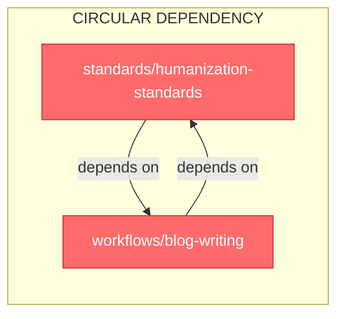
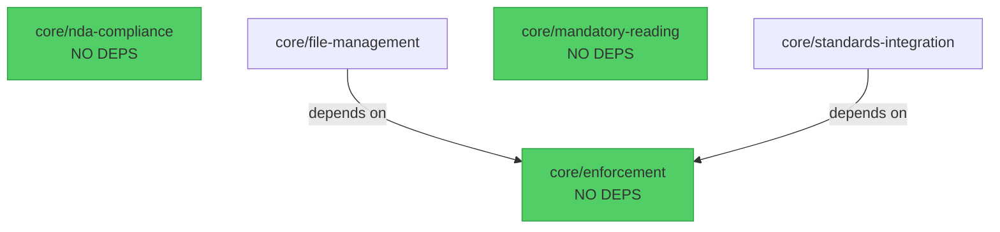
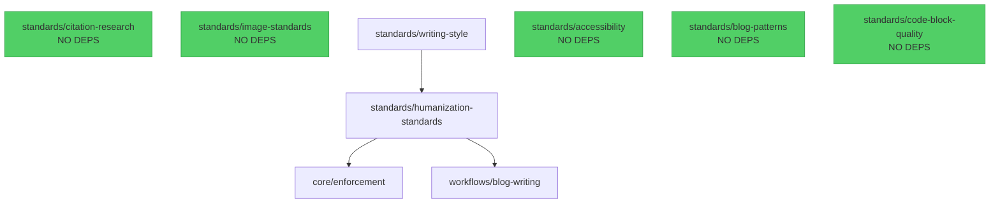

# Module Dependency Analysis Report

**Generated:** 2025-11-13
**Repository:** williamzujkowski.github.io
**Analyzed File:** docs/context/INDEX.yaml
**Total Modules:** 33

---

## Executive Summary

This report analyzes the module dependency graph in `docs/context/INDEX.yaml` for correctness, optimization opportunities, and maintainability issues.

**Key Findings:**
- ❌ **1 CRITICAL issue:** Circular dependency found
- ⚠️ **10 MINOR issues:** Inconsistent path formats
- ✅ **No missing modules:** All references valid
- ⚠️ **6 modules affected by circular dependency:** Infinite depth calculation

---

## Issues Found

### 🚨 CRITICAL: Circular Dependency (Severity: CRITICAL)

**Issue:** `standards/humanization-standards` and `workflows/blog-writing` depend on each other, creating a circular dependency loop.

**Dependency Chain:**
```
standards/humanization-standards
  → workflows/blog-writing
    → standards/humanization-standards (CYCLE!)
```

**Impact:**
- **Infinite dependency depth:** Makes automatic loading order calculation impossible
- **Affects 6 modules:** All modules that depend on either of these inherit the circular dependency
  - `standards/humanization-standards`
  - `standards/writing-style`
  - `templates/blog-post-template`
  - `workflows/blog-topic-selection`
  - `workflows/blog-transformation`
  - `workflows/blog-writing`
- **Load order ambiguity:** Which module should be loaded first?
- **Complexity:** Harder to understand and maintain

**Root Cause:**
- `standards/humanization-standards` lists `workflows/blog-writing` as a required dependency
- `workflows/blog-writing` lists `humanization-standards` (resolves to `standards/humanization-standards`) as a required dependency

**Recommended Fix:** See "Recommendations" section below for 3 resolution strategies.

---

### ⚠️ MINOR: Inconsistent Path Formats (Severity: MINOR)

**Issue:** 10 dependencies use short names instead of fully-qualified paths (e.g., `enforcement` instead of `core/enforcement`).

**Affected Modules:**

| Module | Dependency | Should Be |
|--------|-----------|-----------|
| `core/file-management` | `enforcement` | `core/enforcement` |
| `core/standards-integration` | `enforcement` | `core/enforcement` |
| `workflows/blog-writing` | `nda-compliance` | `core/nda-compliance` |
| `workflows/blog-writing` | `humanization-standards` | `standards/humanization-standards` |
| `workflows/blog-writing` | `citation-research` | `standards/citation-research` |
| `workflows/sparc-development` | `enforcement` | `core/enforcement` |
| `workflows/swarm-orchestration` | `enforcement` | `core/enforcement` |
| `workflows/swarm-orchestration` | `file-management` | `core/file-management` |
| `workflows/blog-transformation` | `humanization-standards` | `standards/humanization-standards` |
| `workflows/blog-transformation` | `citation-research` | `standards/citation-research` |

**Impact:**
- **Ambiguity:** Requires manual resolution logic to determine full path
- **Maintenance risk:** Harder to track cross-category dependencies
- **Tooling complexity:** Scripts must normalize paths before processing

**Recommended Fix:**
Update all dependencies to use fully-qualified paths (category/module-name format). This makes dependencies explicit and easier to validate.

---

## Dependency Statistics

### Summary Metrics

| Metric | Value |
|--------|-------|
| Total modules | 33 |
| Total dependencies | 25 |
| Average dependencies per module | 0.76 |
| Maximum dependencies | 3 |
| Root modules (no dependencies) | 18 (55%) |
| Leaf modules (nothing depends on) | 23 (70%) |
| Maximum dependency depth | ∞ (due to circular dependency) |

### Dependency Distribution

**Modules by Required Dependency Count:**
- 0 dependencies: 18 modules (55%)
- 1 dependency: 9 modules (27%)
- 2 dependencies: 5 modules (15%)
- 3 dependencies: 2 modules (6%)

**Most Complex Modules (Most Dependencies):**
1. `workflows/blog-topic-selection` - 3 dependencies
2. `workflows/blog-writing` - 3 dependencies
3. `workflows/blog-topic-summary` - 2 dependencies
4. `workflows/swarm-orchestration` - 2 dependencies
5. `workflows/blog-transformation` - 2 dependencies

---

## Highly Connected Modules

### Most Depended Upon (High Impact)

These modules have the most other modules depending on them. Changes to these modules affect many other modules.

| Module | Dependents | Priority | Risk Level |
|--------|-----------|----------|------------|
| `core/enforcement` | 8 | HIGH | 🔴 HIGH |
| `standards/humanization-standards` | 4 | HIGH | 🟡 MEDIUM |
| `core/nda-compliance` | 3 | HIGH | 🟡 MEDIUM |
| `standards/citation-research` | 3 | HIGH | 🟡 MEDIUM |
| `workflows/blog-writing` | 2 | MEDIUM | 🟢 LOW |
| `standards/writing-style` | 1 | MEDIUM | 🟢 LOW |
| `core/file-management` | 1 | HIGH | 🟢 LOW |

**Analysis:**
- `core/enforcement` is critical infrastructure (8 dependents)
- `standards/humanization-standards` is in circular dependency (affects 4 modules)
- Core modules generally have higher impact than workflow/technical modules

---

## Dependency Depth Analysis

**Definition:** Dependency depth = maximum number of transitive dependencies to load a module.

**Depth Distribution:**

| Depth | Module Count | Example Modules |
|-------|--------------|-----------------|
| 0 (Root) | 18 | `core/enforcement`, `standards/citation-research`, `reference/*`, most templates |
| 1 | 7 | `core/file-management`, `technical/git-workflow`, `workflows/sparc-development` |
| 2 | 1 | `workflows/swarm-orchestration` |
| 3 | 1 | `technical/agent-coordination` |
| ∞ (Circular) | 6 | `standards/humanization-standards`, `workflows/blog-writing`, `standards/writing-style`, etc. |

**Root Modules (No Dependencies):**

All modules that can be loaded independently without requiring any other modules:

- **Core:** `enforcement`, `nda-compliance`, `mandatory-reading`
- **Standards:** `citation-research`, `image-standards`, `accessibility`, `blog-patterns`, `code-block-quality`
- **Technical:** `script-catalog`, `build-automation`
- **Reference:** `directory-structure`, `batch-history`, `compliance-history`, `historical-learnings`
- **Templates:** `module-template`, `script-template`, `documentation-template`
- **Workflows:** `gist-management`

---

## Dependency Visualization

### Circular Dependency (CRITICAL)



### Core Modules



**Analysis:** Core modules have clean, minimal dependencies. Only `enforcement` is a dependency for other core modules.

### Standards Modules



**Analysis:** The circular dependency originates here. `writing-style` depends on `humanization-standards` which depends on `blog-writing` (workflows category).

---

## Recommendations

### 1. Fix Circular Dependency (CRITICAL Priority)

**Three resolution strategies:**

#### Option A: Remove `blog-writing` Dependency from `humanization-standards` (RECOMMENDED)

**Rationale:** Standards should define requirements, not depend on workflows.

**Change in INDEX.yaml:**
```yaml
- name: humanization-standards
  dependencies:
    - core/enforcement
    # REMOVE: - workflows/blog-writing
  optional_dependencies:
    - standards/writing-style
```

**Impact:**
- ✅ Breaks circular dependency
- ✅ Cleaner separation of concerns (standards vs workflows)
- ✅ Allows progressive loading (load standards first, then workflows)
- ⚠️ May need to update `humanization-standards.md` if it directly references blog-writing workflow

**Recommendation:** Check if `humanization-standards.md` truly needs `blog-writing` as a required dependency, or if it's just a cross-reference. If it's just informational, remove the dependency or make it optional.

---

#### Option B: Move Shared Content to New Module

**Rationale:** If both modules truly need each other, the shared logic should be in a separate module.

**Create new module:**
```yaml
- name: humanization-core
  category: standards
  dependencies:
    - core/enforcement
  description: Core humanization principles (no workflow dependencies)
```

**Update existing modules:**
```yaml
- name: humanization-standards
  dependencies:
    - standards/humanization-core
    - workflows/blog-writing  # OK now, no cycle

- name: blog-writing
  dependencies:
    - standards/humanization-core  # Instead of humanization-standards
```

**Impact:**
- ✅ Breaks circular dependency
- ✅ Promotes code reuse
- ⚠️ Requires refactoring two modules
- ⚠️ Adds complexity (one more module to maintain)

---

#### Option C: Merge Modules

**Rationale:** If the modules are tightly coupled, perhaps they should be one module.

**Not recommended because:**
- ❌ Violates single responsibility principle
- ❌ Mixes standards (what) with workflows (how)
- ❌ Increases module size and load time

---

### 2. Standardize Path Formats (MINOR Priority)

**Goal:** All dependencies use `category/module-name` format.

**Implementation:**
```yaml
# Current (inconsistent):
dependencies:
  - enforcement
  - humanization-standards

# Fixed (consistent):
dependencies:
  - core/enforcement
  - standards/humanization-standards
```

**Update 10 modules:**
1. `core/file-management`
2. `core/standards-integration`
3. `workflows/blog-writing`
4. `workflows/sparc-development`
5. `workflows/swarm-orchestration`
6. `workflows/blog-transformation`

**Validation script:**
```bash
# Check for short-form dependencies
grep -E '^\s+- [^/]+$' docs/context/INDEX.yaml
```

---

### 3. Add Dependency Validation to Pre-Commit Hooks

**Goal:** Prevent circular dependencies and path inconsistencies from being committed.

**Implementation:**

Create `/home/william/git/williamzujkowski.github.io/scripts/validation/validate-module-dependencies.py`:

```python
#!/usr/bin/env -S uv run python3
"""Validate module dependencies in INDEX.yaml"""

import yaml
import sys
from typing import Dict, List, Set

def find_cycles(graph: Dict[str, List[str]]) -> List[List[str]]:
    """Find circular dependencies using DFS"""
    # ... (implementation from analysis script)

def validate_paths(modules: Dict) -> List[tuple]:
    """Check all dependencies use category/name format"""
    issues = []
    for module_name, module_data in modules.items():
        for dep in module_data.get('dependencies', []):
            if '/' not in dep:
                issues.append((module_name, dep))
    return issues

def main():
    with open('docs/context/INDEX.yaml') as f:
        index = yaml.safe_load(f)

    # Build graph and validate
    # ... (implementation)

    if issues_found:
        print(f"❌ Found {len(issues_found)} dependency issues")
        sys.exit(1)
    else:
        print("✅ All dependencies valid")
        sys.exit(0)

if __name__ == '__main__':
    main()
```

**Add to `.git/hooks/pre-commit`:**
```bash
echo "Validating module dependencies..."
uv run python scripts/validation/validate-module-dependencies.py
```

---

### 4. Consider Optional vs Required Dependencies

**Observation:** Some dependencies might be too strict.

**Example:** `standards/humanization-standards` has optional dependency on `writing-style`. This is good design - it's available if needed but not required for loading.

**Review candidates for optional status:**
- `workflows/blog-topic-selection` → `standards/writing-style` (could be optional)
- `workflows/blog-writing` → `citation-research` (required for blog posts, but not for loading module)

**Recommendation:** Review each dependency and ask:
- "Can this module be loaded without this dependency?"
- "Is this dependency required for understanding the module, or just for executing it?"

If answer is "just for executing," consider making it optional.

---

### 5. Flatten Dependency Chains

**Observation:** `technical/agent-coordination` has depth 3:
```
technical/agent-coordination
  → workflows/sparc-development
    → core/enforcement
  → workflows/swarm-orchestration
    → core/file-management
      → core/enforcement
```

**Recommendation:** Consider if all transitive dependencies are truly necessary. Could `agent-coordination` directly depend on `core/enforcement` instead of inheriting it through two workflow modules?

**Tradeoff:**
- ✅ Clearer direct dependencies
- ⚠️ More dependencies to maintain
- ⚠️ May violate DRY if multiple modules need same set

**Action:** Review on case-by-case basis during next INDEX.yaml update.

---

## Optimization Opportunities

### 1. Module Load Order Recommendations

Once circular dependency is fixed, recommended load order for blog writing workflow:

```yaml
load_order:
  1. core/enforcement           # No dependencies (foundation)
  2. core/nda-compliance         # No dependencies (critical for blog content)
  3. standards/citation-research # No dependencies (needed by blog-writing)
  4. standards/humanization-standards  # Depends on enforcement only (after fix)
  5. standards/writing-style     # Depends on humanization-standards
  6. workflows/blog-writing      # Depends on nda-compliance, humanization-standards, citation-research
```

**Benefits:**
- Minimal redundant loading
- Clear dependency chain
- Easy to debug if module missing

---

### 2. Create Module Loading Groups

**Observation:** Common dependency patterns suggest natural grouping.

**Proposed groups:**

```yaml
loading_groups:
  blog_foundation:
    - core/enforcement
    - core/nda-compliance
    - standards/citation-research

  blog_quality:
    - standards/humanization-standards
    - standards/writing-style

  blog_complete:
    - workflows/blog-writing
    - workflows/blog-transformation
    - templates/blog-post-template
```

**Usage:**
```python
# Instead of loading 6+ modules individually
load_group('blog_foundation')  # Loads 3 modules
load_group('blog_quality')     # Loads 2 modules
load_module('workflows/blog-writing')  # Auto-loads dependencies
```

---

### 3. Add Dependency Caching

**Goal:** Avoid re-loading same dependency multiple times.

**Example:** `core/enforcement` is needed by 8 modules. Current naive loading would load it 8 times.

**Implementation:**
```python
loaded_modules = {}

def load_module(name):
    if name in loaded_modules:
        return loaded_modules[name]

    # Load dependencies first
    for dep in get_dependencies(name):
        load_module(dep)

    # Load this module
    content = read_module_file(name)
    loaded_modules[name] = content
    return content
```

---

## Action Items

### Immediate (Fix Before Next Commit)

- [ ] **CRITICAL:** Resolve circular dependency between `humanization-standards` and `blog-writing`
  - Recommended: Remove `blog-writing` from `humanization-standards` dependencies
  - Verify no hard dependency in module content
  - Update INDEX.yaml

### Short-term (This Week)

- [ ] **MINOR:** Standardize all 10 inconsistent path formats
  - Update dependencies to use `category/module-name` format
  - Run validation to confirm no short-form dependencies remain

- [ ] **VALIDATION:** Create pre-commit hook for dependency validation
  - Implement `validate-module-dependencies.py` script
  - Add to pre-commit hook
  - Test with intentional circular dependency

### Medium-term (Next 2 Weeks)

- [ ] **OPTIMIZATION:** Review optional vs required dependencies
  - Identify candidates for optional status
  - Update INDEX.yaml with clearer dependency semantics

- [ ] **DOCUMENTATION:** Document dependency best practices
  - When to use required vs optional
  - How to avoid circular dependencies
  - Path format standards

### Long-term (Next Month)

- [ ] **TOOLING:** Implement module loading with dependency resolution
  - Automatic transitive dependency loading
  - Caching to avoid duplicate loads
  - Load order optimization

- [ ] **MONITORING:** Add dependency metrics to reports
  - Track average dependency depth over time
  - Alert on new circular dependencies
  - Monitor module coupling

---

## Conclusion

**Overall Assessment:** The module dependency graph is mostly healthy with 2 key issues:

1. **CRITICAL:** One circular dependency affecting 6 modules (must fix)
2. **MINOR:** Inconsistent path formats in 10 modules (should fix for maintainability)

**Recommended Priority:**
1. Fix circular dependency (blocks proper load order calculation)
2. Standardize path formats (prevents future issues)
3. Add validation tooling (prevents regression)
4. Optimize loading (improves performance)

**Impact if fixed:**
- ✅ Clear load order for all modules
- ✅ Better separation of concerns (standards vs workflows)
- ✅ Easier to maintain and extend
- ✅ Automated validation prevents future issues

**Estimated effort:**
- Circular dependency fix: 30 minutes (review + update)
- Path format standardization: 15 minutes (bulk update + validation)
- Validation script: 1 hour (implementation + testing)
- **Total: ~2 hours**

---

**Report Generated by:** Claude Code (Code Quality Analyzer)
**Analysis Tool:** Python + YAML parsing + DFS cycle detection
**Validation Status:** ✅ All 33 modules analyzed, no missing references
