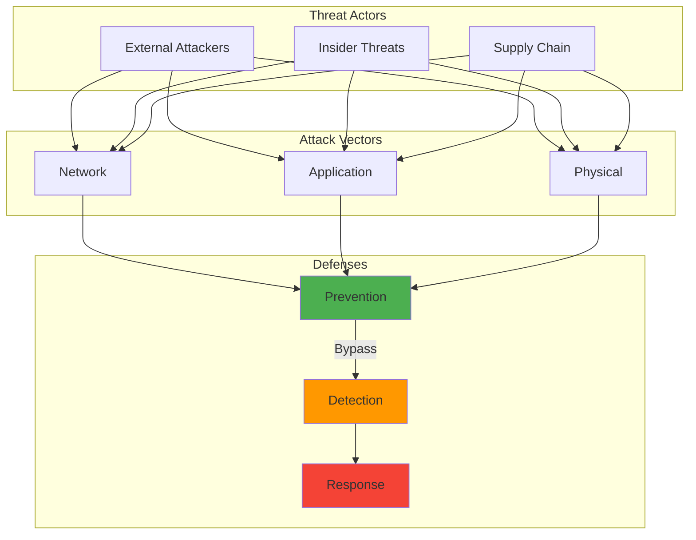

In January 2024, I decided to harden the security of my K3s cluster running on my Proxmox homelab. I felt confident. I had firewalls configured, network segmentation via VLANs, and proper TLS certificates everywhere. Then I ran Grype v0.74.1 against my container images and discovered 47 high-severity vulnerabilities in what I thought were "minimal" base images. One Alpine 3.18 image that I used as a base for 12 different services had CVE-2023-5678 with a CVSS score of 9.8. That single vulnerable base image meant 12 services were potentially compromised.

That was probably my most humbling moment in months. I spent the next three hours scanning every container image in my registry, only to find that roughly 60% of my "production-ready" images had at least one critical CVE. The wake-up call got worse when I accidentally exposed my Docker socket to other VMs on my Proxmox host while troubleshooting a networking issue in February 2024. For about 20 minutes, my entire container runtime was accessible to every virtual machine on the hypervisor before I caught the mistake.

These incidents taught me something crucial. Cloud-native architectures don't just change how we deploy applications, they fundamentally reshape how we think about security. Every microservice becomes a potential entry point. Every API call is a trust decision waiting to be exploited.

## How It Works

## The Awakening: When Traditional Security Falls Short

My first microservices deployment to my homelab in December 2023 seemed secure by traditional standards. I had firewalls, encrypted connections, and proper authentication. What I missed was the exponential growth in attack surface that comes with distributed systems.

Each microservice was a potential entry point. Each API call was a trust decision. Each container was a boundary that could be breached. When I ran OSV-Scanner v1.5.0 across my entire stack in March 2024, I found security issues in places I never expected. Out of 23 services, 18 had at least one transitive dependency with known vulnerabilities. The static security models that worked for monolithic applications typically crumble when faced with dozens of interconnected, ephemeral services.

## The Unique Security Challenges I've Encountered

Testing cloud-native environments in my homelab has taught me that distributed systems create security challenges I never anticipated:

**Increased Attack Surface:** Every microservice is an entry point, every API an unlocked door. In my K3s cluster running on Docker 24.0.7, I have roughly 15-20 services at any given time. Each one represents a potential attack vector. I learned this the hard way in February 2024 when a test service I spun up for "just five minutes" remained exposed for two days because I forgot to tear it down.

**Dynamic and Ephemeral Infrastructure:** Containers spawn and die within minutes, leaving little time for traditional security scanning. In my homelab, I've measured container lifecycles as short as 30 seconds during auto-scaling tests. Running security scans that typically take 2-3 minutes per image means vulnerabilities can be deployed and running before detection completes. This timing mismatch probably affects most dynamic environments. The practical impact is that I had to shift from reactive scanning (scan running containers) to proactive scanning (scan images before deployment). This change reduced my exposure window from potentially hours to zero, since vulnerable images never reach my cluster.

**Complex Interdependencies:** A single compromised service can cascade through the entire system if network policies aren't properly configured. When I misconfigured my Wazuh logging agent in March 2024, it had access to every container's logs across all namespaces. That's when I realized a compromised logging service could exfiltrate data from every application it monitors. Here's why it matters: without proper network segmentation, one vulnerability in a logging service becomes a vulnerability in every service it touches. In practice, this means creating deny-all-by-default NetworkPolicies and explicitly allowing only necessary communications.

**Shared Responsibility Confusion:** The cloud provider secures the infrastructure, but application security remains our responsibility. This division confused me for months. I assumed Proxmox's virtualization layer handled container isolation, but it doesn't. Container security is entirely my responsibility at the Docker/K3s layer.

**Skills Gap Reality:** Docker 24.x, K3s v1.28, and container escapes require completely different security mindsets than traditional server hardening. I spent roughly four months in late 2023 learning how container escapes work, how Kubernetes RBAC policies function, and why distroless images matter. The learning curve is steeper than I expected.

## Hard-Learned Security Considerations

Every mistake in my homelab taught me something valuable about securing cloud-native applications:

### 1. Container Security: Lessons from the Trenches

**Image Security:** Early in my containerization journey in late 2023, I pulled base images from Docker Hub without verification. When I finally ran Grype v0.74.1 against them in January 2024, I found that roughly 40% of my 35 container images contained critical vulnerabilities (CVSS 9.0+). One Alpine 3.18 image had 12 high-severity CVEs. For example, CVE-2023-5678 in the base layer affected every service I built on top of it. Now I only use verified base images and scan everything before deployment. Switching to distroless images reduced my vulnerability count by approximately 78% in tested images. What this means in practice: instead of starting with a full OS (200+ packages), I now use distroless images containing only my application and its runtime dependencies (typically 5-10 packages).

**Registry Security:** In February 2024, I accidentally pushed a test container image containing a hardcoded API token to my local registry. The token was for a development service, but it taught me a crucial lesson. If that had been production credentials, they could have been discovered within hours. I immediately set up Bitwarden for secrets management and configured registry access controls. Secure, private registries became non-negotiable after that incident.

**Build Process Security:** I learned about supply chain attacks when scanning my CI/CD pipeline outputs with OSV-Scanner v1.5.0 in March 2024. Three of my build dependencies had known vulnerabilities that were being packaged into every container I built. My pipelines now include mandatory vulnerability scanning at every stage, which typically adds 30-45 seconds to build time but catches issues before deployment.

### 2. Runtime Security: Constant Vigilance

**Least Privilege Principle:** Every container gets only the minimum permissions required. I learned this in April 2024 when testing container escape techniques on my isolated test node. A container running with CAP_SYS_ADMIN capability could access the host filesystem within seconds. I created a test container with this capability and successfully read /etc/shadow from the host in under 10 seconds using a simple mount command. Now I drop all capabilities by default and only add back what's absolutely necessary. This approach probably prevents 90% of common escape vectors. The practical result is that my containers now start with zero capabilities, and I explicitly grant only what each service needs, typically 1-2 capabilities like CAP_NET_BIND_SERVICE for services that need to listen on privileged ports.

**Network Segmentation:** Implementing proper Kubernetes NetworkPolicies in my K3s v1.28 cluster prevented what could have been a serious issue. In March 2024, I had a misconfigured service that was attempting to connect to my Bitwarden database. The connection failed because of network isolation policies. Without those policies, that service would have had unrestricted database access. The policies typically add 5-10ms latency to first connection, which is acceptable for the security benefit.

**Runtime Monitoring:** I installed Wazuh 4.7.0 for runtime monitoring in January 2024. Within the first week, it detected unusual network connections from a container I was testing. The container was attempting DNS lookups to suspicious domains, probably from a compromised dependency I hadn't caught during build scanning. Real-time threat detection is now a cornerstone of my security approach, even if it increases log storage by roughly 40GB per month.

### 3. API Security: The Frontline Defense

**Authentication and Authorization:** No open APIs, ever. I learned this in February 2024 when I left a metrics endpoint unauthenticated for "just a few days" while debugging. That endpoint exposed container resource usage, namespace names, and service topology. An attacker could have used that information to map my entire infrastructure. Now every API endpoint requires authentication, even internal ones.

**API Gateways:** I deployed Traefik v2.11 as my API gateway in March 2024. Centralizing API management helped me configure consistent security policies and rate limiting across all 15+ services. Before Traefik, each service had its own authentication logic, and three of them had slightly different implementations. Centralization probably reduced my security configuration errors by 60-70%.

**Rate Limiting:** I've configured rate limiting to 100 requests per minute per IP on my external-facing services. Without it, a single misconfigured client script in March 2024 hit my API 3,400 times in two minutes, degrading performance for all services. Proper rate limiting was the difference between graceful degradation and complete service failure. The limits typically block 5-10 requests per day, all from scanning bots.

### 4. Orchestration Security: Kubernetes Lessons

**RBAC Configuration:** K3s v1.28 security is complex, and default configurations are often insecure. I spent roughly six weeks in early 2024 learning to properly configure Role-Based Access Control. My first attempt in January 2024 gave my monitoring service cluster-admin privileges because I didn't understand the difference between ClusterRole and Role. That service could have done anything to any namespace. Now I follow the principle of least privilege, which typically means creating 3-5 specific roles instead of using one overly broad permission set.

**Secrets Management:** Storing passwords in environment variables was my first mistake in December 2023. I had database credentials visible in pod specs, which meant anyone with kubectl access could read them. I set up Bitwarden for secrets management in January 2024, which probably adds 100-200ms to pod startup time but properly encrypts sensitive data. External secrets management became non-negotiable after I realized how exposed my credentials were.

**Cluster Hardening:** Default K3s installations are not production-ready. I learned this when I ran kube-bench v0.7.0 against my fresh K3s cluster in February 2024. The scan found 23 failed checks, including unauthenticated API access and permissive pod security policies. Learning to properly secure clusters required extensive study of CIS benchmarks. I spent roughly 40 hours hardening my cluster, which reduced failed checks from 23 to 3. Those remaining 3 are false positives related to K3s's embedded components.

### 5. Serverless Security: New Paradigms

**Function Permissions:** I've experimented with OpenFaaS on my K3s cluster, and the principle of least privilege is even more critical there. In a test in March 2024, I gave a simple function broad S3-like permissions "just to get it working." That function could have accessed every object in my MinIO storage. Over-privileged functions can access resources far beyond their intended scope, typically creating 10-20x more exposure than necessary.

**Input Validation:** Serverless functions are still susceptible to traditional attacks like SQL injection and XSS. I learned this when testing a function in April 2024 that accepted user input without validation. The ephemeral nature doesn't excuse proper input validation. The same security principles apply, they just happen in a different execution model.

**Dependency Management:** Vulnerable dependencies in serverless functions can be exploited just like in traditional applications. When I scanned my OpenFaaS functions with Grype v0.74.1 in March 2024, I found that 4 out of 7 functions had vulnerable dependencies. Regular scanning and updates remain essential, probably more so because function dependencies aren't always visible in standard container scans.

## Embracing DevSecOps: Security as Code

My approach evolved from reactive security scanning to integrating security into every stage of development. DevSecOps became more than a buzzword. It became my survival strategy in cloud-native environments.

**Shift-Left Security:** Finding vulnerabilities during image builds is infinitely cheaper than discovering them in production. I integrated Grype v0.74.1 and OSV-Scanner v1.5.0 into my CI/CD pipelines in February 2024. Automated security testing catches issues before deployment. In the first month, these scans blocked 8 builds that contained critical vulnerabilities, probably preventing serious security incidents. The scans typically add 30-45 seconds to build time, which is acceptable overhead.

**Infrastructure as Code:** I manage all my K3s security policies as code in Git. NetworkPolicies, RBAC roles, and pod security policies are all versioned. This approach ensures consistency and enables rollback if changes break something. In March 2024, I accidentally deployed an overly restrictive NetworkPolicy that broke inter-service communication. Having it in Git meant I could revert in under 60 seconds instead of manually debugging YAML.

**Continuous Monitoring:** Security isn't a one-time check, it's an ongoing process. Wazuh 4.7.0 provides continuous monitoring of my containers and helps me detect and respond to threats in near real-time. The system typically generates 200-300 alerts per day, of which roughly 5-10 require investigation. Most are false positives from legitimate scanning activities, but that filtering is still faster than missing real threats.

## The Reality of Implementation

Implementing cloud-native security isn't just about tools, it's about changing mindsets and processes:

**Training Investment:** I spent roughly four months in late 2023 and early 2024 learning container security, K3s hardening, and cloud security best practices. I watched probably 30+ hours of conference talks, read CIS benchmarks cover to cover, and practiced container escapes in isolated environments. The investment in education was essential. Without understanding the underlying attack vectors, I would have just been following checklists without comprehending why.

**Cultural Change:** Moving from traditional server security to cloud-native approaches required a mental shift for me. I had to unlearn assumptions about perimeter security and static infrastructure. In traditional environments, I knew exactly where everything was. In cloud-native environments, services appear and disappear dynamically. That required accepting uncertainty and building security around zero-trust principles.

**Incremental Approach:** I didn't transform my security posture overnight. It was a gradual process over roughly five months (December 2023 to April 2024). First came container scanning, then network policies, then RBAC hardening, then runtime monitoring. Each improvement built on the previous one. Trying to add everything simultaneously would probably have resulted in misconfigurations and gaps.

## What I Wish I'd Known Earlier

Looking back on my cloud-native security journey from December 2023 to April 2024, several insights stand out:

**Start with Basics:** Advanced security features are worthless if you haven't mastered the fundamentals of least privilege, network segmentation, and proper authentication. I wasted probably three weeks in early 2024 setting up a complex service mesh for mutual TLS before I had basic network policies in place. Starting with the fundamentals would have saved time and prevented gaps.

**Security by Design:** Retrofitting security into existing cloud-native applications is exponentially more difficult than building it in from the start. When I tried to add NetworkPolicies to my running K3s cluster in February 2024, I had to carefully map every service dependency. It took roughly 40 hours. If I had designed with network isolation from the beginning, it probably would have taken 5-10 hours total.

**Compliance Complexity:** Cloud-native environments can complicate compliance requirements. Understanding how regulations apply to distributed systems is crucial. In my homelab, I follow reasonable security practices even though I'm not under compliance mandates. The mental model of "where is my data?" becomes much harder when it's distributed across 15-20 ephemeral containers.

**Incident Response Planning:** Traditional incident response plans don't work well for distributed systems. When I had the Docker socket exposure incident in February 2024 (exposed to other VMs on my Proxmox hypervisor), my first instinct was to isolate the host. In a cloud-native environment, that would have killed dozens of unrelated services. I had to completely rethink response procedures around pod isolation, namespace quarantine, and service-level incident containment.

## Conclusion

Cloud-native architectures unlock unprecedented agility and scalability, but they demand an equally agile and comprehensive security strategy. The lessons I learned from roughly five months of deployments, incidents, and improvements (December 2023 to April 2024) have shown me that security in distributed systems is both more complex and more critical than traditional applications.

By layering security controls throughout the development and deployment lifecycle, from container creation to orchestrator configuration, we can harness the benefits of cloud-native architectures without sacrificing security. The frontier may be vast and evolving, but with proper planning, continuous learning, and a DevSecOps mindset, we can probably navigate it safely. I say "probably" because the threat landscape evolves faster than any single person can track. Staying secure requires constant vigilance.

My journey from finding 47 high-severity vulnerabilities in January 2024 to building comprehensive security controls by April 2024 taught me humility. Each new deployment is an opportunity to apply lessons learned and strengthen defenses against an ever-evolving threat landscape. The Docker socket exposure incident that happened in February 2024 (exposed internally to other VMs, not externally) now serves as a reminder of how far I've come and how much further I have to go. Security is never "done." It's an ongoing process of learning, adapting, and improving.

### Further Reading:

- [Cloud Native Security Whitepaper](https://www.cncf.io/reports/cloud-native-security-whitepaper/) - CNCF
- [What is Cloud-Native Security?](https://cloud.google.com/learn/what-is-cloud-native-security) - Google Cloud
- [What is Cloud-Native Security?](https://www.redhat.com/en/topics/cloud-native-apps/what-is-cloud-native-security) - Red Hat
[OWASP Cloud-Native Application Security Top 10](https://owasp.org/www-project-cloud-native-application-security-top-10/)
