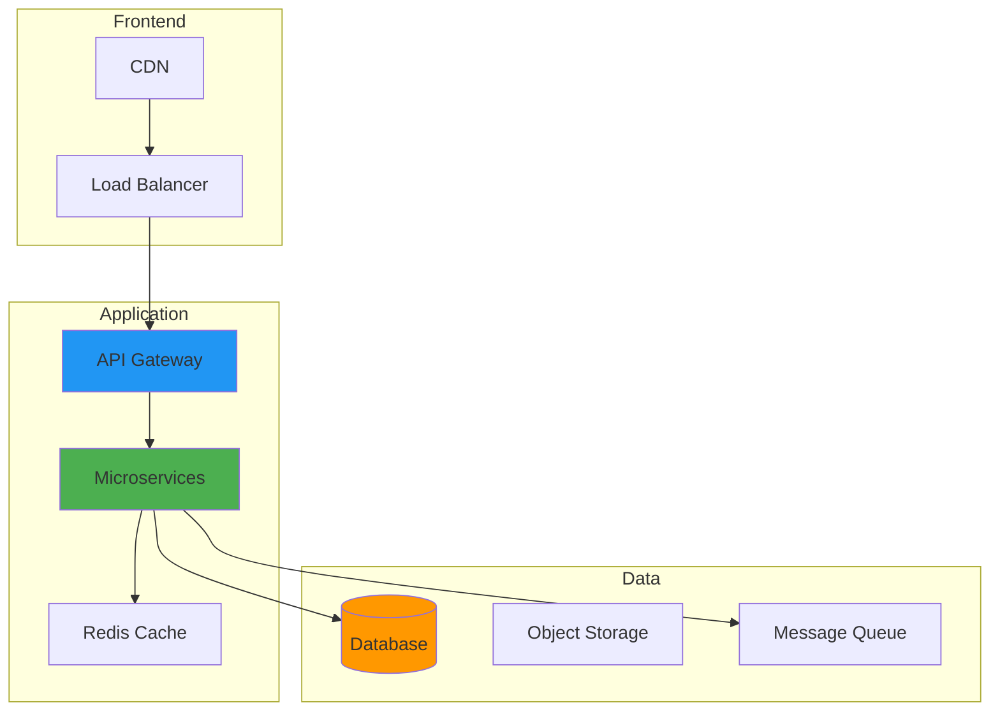

I recall standing in our data center years ago—warm air flowing from countless machines, cables snaking across raised floors—wondering if this physical infrastructure had become more anchor than asset. The constant hum of cooling systems and blinking server lights represented significant investment, but also significant constraints.

That moment crystallized our need for cloud migration, but the journey that followed taught me as much about organizational change management as it did about technology. Moving to the cloud isn't just a technical transformation—it's a fundamental shift in how we think about infrastructure, reliability, and scale.

## How It Works

## The Catalyst: Why We Finally Made the Leap

Our migration decision came from multiple pressures converging simultaneously:

**Capacity Constraints:** Our fastest-growing service was hitting infrastructure limits. Procurement cycles for new servers stretched months, while our competitors spun up resources in minutes.

**Cost Reality:** I spent weeks analyzing our total cost of ownership. Server depreciation, data center rent, cooling costs, and staff overhead painted a stark picture. We were paying premium prices for sub-optimal performance.

**Reliability Concerns:** A power outage that lasted six hours cost us more than our annual cloud budget would have been. Our single data center represented a massive single point of failure.

**Talent Challenges:** Our best engineers wanted to work on product features, not server maintenance. Attracting talent became harder when competitors offered modern, cloud-native environments.

## Crafting a Migration Strategy: Lessons from the Planning Phase

Our initial approach was embarrassingly naive—we thought migration meant "lift and shift" everything to AWS and call it done. Reality proved far more complex.

**Infrastructure Assessment:** Cataloging our systems revealed dependencies we'd forgotten existed. That "simple" web application connected to fourteen different services, three legacy databases, and a file server that hadn't been documented in years.

**Dependency Mapping:** We spent months creating visual maps of service interactions. Some dependencies were logical; others were historical accidents that had calcified into critical paths. Understanding these relationships prevented catastrophic failures during migration.

**Objective Clarification:** Our goals evolved during planning. Initial cost savings expectations gave way to more nuanced objectives: improved reliability, faster deployment cycles, global availability, and enhanced disaster recovery.

**Cloud Model Selection:** We experimented with all three service models:
- **IaaS:** Provided maximum control but required significant management overhead
- **PaaS:** Offered good balance between control and convenience for our web applications
- **SaaS:** Eliminated management burden but reduced customization options

The final architecture combined all three approaches based on specific application needs.

## Security and Compliance: Overcoming the Trust Barrier

Entrusting sensitive data to external providers initially felt like professional negligence. Years of "never trust the network" thinking had to be unlearned and replaced with more nuanced security models.

**Identity and Access Management Revolution:** Implementing proper IAM was both the most complex and most valuable part of our migration. Moving from "everyone has admin access" to granular, role-based permissions required cultural change as much as technical implementation.

**Zero Trust Implementation:** Cloud migration forced us to abandon perimeter-based security models. Every connection, even between internal services, required authentication and authorization. This seemed burdensome initially but proved more secure than our previous approach.

**Compliance Navigation:** Meeting HIPAA, PCI DSS, and SOX requirements in the cloud required understanding shared responsibility models. The cloud provider secured the infrastructure; we remained responsible for data protection, access controls, and proper configuration.

**Cloud Security Tools:** Services like AWS GuardDuty and Google Cloud Security Command Center provided threat detection capabilities that would have cost hundreds of thousands to implement on-premises.

A breakthrough moment came when I realized cloud providers had better security than we could achieve independently. Their dedicated security teams, compliance certifications, and threat intelligence exceeded our internal capabilities.

## Performance and Cost Optimization: The Ongoing Challenge

Migration was just the beginning—optimization became a continuous process:

**Right-Sizing Reality:** Our initial instance selections were laughably oversized. We provisioned based on peak usage patterns, leading to 70% average utilization. Learning to monitor and adjust became essential for cost control.

**Autoscaling Adventures:** Implementing autoscaling seemed straightforward until we experienced our first unexpected scaling event. A minor DDoS attack triggered automatic scaling that cost more than the attack would have.

**Storage Strategy:** Moving from simple file servers to cloud storage required understanding different storage classes, access patterns, and lifecycle policies. Hot, warm, and cold storage tiers became important architectural decisions.

**Reserved Instance Economics:** Understanding when to purchase reserved instances versus using on-demand pricing required detailed usage analysis. We saved 40% on compute costs by committing to one-year terms for predictable workloads.

**Serverless Adoption:** Functions-as-a-Service eliminated server management for event-driven workloads. Our image processing pipeline became both more reliable and cost-effective when converted to serverless architecture.

## The Human Factor: Managing Organizational Change

Technology challenges proved easier than human ones:

**Skill Development:** Our team needed new expertise in cloud services, containerization, and infrastructure-as-code. We invested heavily in training, certifications, and hands-on experimentation.

**Cultural Resistance:** Some team members viewed cloud migration as job elimination. Transparent communication about role evolution and new opportunities was crucial for maintaining morale.

**Responsibility Evolution:** Traditional operations roles transformed into cloud architecture and optimization functions. DevOps practices became necessary for effective cloud management.

**Communication Strategies:** Regular all-hands meetings, migration dashboards, and celebration of milestones kept stakeholders informed and engaged throughout the multi-year process.

## Migration Patterns: What Worked and What Didn't

**The Big Bang Approach (Failed):** Our initial plan to migrate everything over a weekend was abandoned after the first attempt resulted in 18 hours of downtime and angry customers.

**Gradual Migration (Successful):** Moving services incrementally allowed us to learn from each migration, refine processes, and minimize business impact.

**Strangler Fig Pattern:** For legacy applications, we gradually replaced functionality with cloud-native services while maintaining the original interface. This approach minimized risk while enabling modernization.

**Database Migration Strategies:** Database migrations proved most complex, requiring careful replication setup, testing procedures, and fallback plans. We learned to prioritize read replicas and gradual traffic shifting over big-bang cutovers.

## Unexpected Benefits: Discoveries Along the Way

**Global Presence:** Cloud regions enabled us to serve customers worldwide with acceptable latency. This capability would have required millions in infrastructure investment using traditional approaches.

**Disaster Recovery:** Cloud-based backup and recovery became routine instead of complex, expensive projects. Geographic redundancy became affordable and automatic.

**Innovation Acceleration:** New services and experiments could be launched in hours instead of months. This agility transformed how we approached product development.

**Monitoring and Insights:** Cloud-native monitoring tools provided visibility into application performance and user behavior that was previously impossible or prohibitively expensive.

## Lessons Learned: What I'd Do Differently

**Start Smaller:** Our ambitious initial scope created unnecessary complexity. Beginning with non-critical applications would have provided valuable learning experiences with lower stakes.

**Invest in Automation:** Manual migration processes don't scale. Infrastructure-as-code and deployment automation should be implemented before migration begins, not during.

**Plan for Failure:** Every migration will encounter unexpected issues. Having rollback plans, communication procedures, and extended maintenance windows prevents panic decisions.

**Budget for Learning:** Cloud migration costs include training, consulting, and inefficient initial configurations. Budgeting for learning curves prevents cost overruns and poor decisions.

## The Ongoing Journey: Cloud Operations as Continuous Improvement

Migration completion wasn't the end—it was the beginning of ongoing optimization:

**Cost Management:** Monthly cost reviews became routine. Cloud spending can grow unexpectedly without proper governance and monitoring.

**Security Updates:** Cloud security is a shared responsibility requiring continuous attention to configurations, access policies, and threat detection.

**Performance Optimization:** Regular analysis of resource utilization, application performance, and user experience drives ongoing improvements.

**Service Evolution:** Cloud providers release new services constantly. Staying current with offerings enables further optimization and capability enhancement.

## Conclusion: Transformation Beyond Technology

Cloud migration transformed our organization beyond simple infrastructure changes. We became more agile, resilient, and capable of rapid innovation. The physical servers gathering dust in our old data center represent more than deprecated hardware—they symbolize outdated thinking about infrastructure, scalability, and change management.

The journey wasn't without challenges, setbacks, and expensive lessons. But each difficulty taught us something valuable about modern infrastructure, organizational change, and the balance between control and convenience.

Standing in our current office—no server room, no cooling systems, no blinking lights—I'm reminded of how dramatically our relationship with technology infrastructure has evolved. Cloud migration didn't just change our architecture; it changed our mindset about what's possible when infrastructure becomes invisible and infinite.

For organizations considering cloud migration, my advice is simple: start with strategy, plan for complexity, invest in people, and embrace the journey as transformation rather than simple technology replacement. The destination is worth the effort, but the journey itself teaches invaluable lessons about adaptability in an increasingly digital world.

### Further Reading:

- [What is cloud migration?](https://cloud.google.com/learn/what-is-cloud-migration - Google Cloud
- [Best Practices for Planning, Executing, and Monitoring AWS Cloud Migrations](https://d1.awsstatic.com/Migration/migrating-to-aws-ebook.pdf) - AWS
- [Top Cloud Migration Best Practices](https://azure.microsoft.com/en-us/resources/cloud-migration-best-practices/ - Microsoft Azure
- [Cloud Migration](https://www.gartner.com/en/information-technology/glossary/cloud-migration) - Gartner