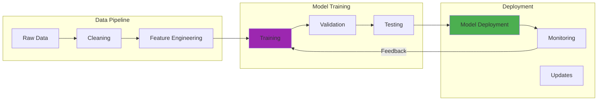

There's a moment in every conversation with a Large Language Model when you realize the fundamental limitation: the model can only work with what it learned during training. For me, that moment came during a demo where our customer service LLM confidently made up product specifications that didn't exist.

Watching potential customers receive authoritative-sounding but completely incorrect information was mortifying. That incident sparked my deep dive into Retrieval Augmented Generation (RAG)—a technique that gives AI systems the power to consult external knowledge sources before generating responses.

## How It Works

## The Problem: When "Knowing Everything" Isn't Enough

The limitations of standard LLMs became apparent as soon as we tried to use them for real-world applications:

**Knowledge Cutoffs:** Our model's training data ended months before our latest product releases. When customers asked about new features, the AI had no choice but to hallucinate or admit ignorance.

**Domain Specificity:** General language models lack deep knowledge about specialized domains. A model that could write poetry couldn't accurately answer questions about our proprietary API documentation.

**Dynamic Information:** Product prices, inventory levels, and policy changes couldn't be reflected in models with fixed training data.

**Context Limitations:** Even when relevant information existed in training data, context windows often couldn't accommodate all necessary background information for complex queries.

These limitations weren't just technical inconveniences—they were barriers to building reliable, trustworthy AI applications.

## RAG: The Solution That Changes Everything

Retrieval Augmented Generation elegantly addresses these limitations by combining the language generation capabilities of LLMs with the knowledge retrieval capabilities of search systems.

The process is conceptually simple but powerful:

1. **Query Analysis:** Understand what information the user is seeking
2. **Knowledge Retrieval:** Search external databases, documents, or knowledge bases for relevant information
3. **Context Augmentation:** Combine retrieved information with the original query
4. **Response Generation:** Use the LLM to synthesize a response based on both the query and retrieved context

## Building My First RAG System: Lessons Learned

My initial RAG implementation was embarrassingly naive. I thought I could just stuff search results into prompts and call it done. Reality proved more complex.

**Retrieval Quality Matters:** Poor search results lead to poor responses. I spent weeks fine-tuning our retrieval system, experimenting with different embedding models, and optimizing relevance scoring.

**Context Management:** Early versions either retrieved too little information (missing crucial context) or too much (exceeding context windows and confusing the model).

**Chunk Strategy:** Breaking documents into searchable chunks required careful consideration of size, overlap, and semantic coherence. Naive splitting often broke important relationships between ideas.

**Embedding Selection:** Different embedding models performed better for different types of content. Technical documentation required different embeddings than customer service conversations.

## The Anatomy of Effective RAG

Successful RAG systems require careful orchestration of multiple components:

### The Retriever: Finding What Matters

The retrieval component became the foundation of our system's success:

**Semantic Search:** Vector embeddings enabled finding relevant content even when query terms didn't match document text exactly.

**Hybrid Approaches:** Combining semantic search with traditional keyword matching improved recall for specific terms and proper nouns.

**Metadata Filtering:** Adding document type, date, and department filters helped narrow search scope and improve relevance.

**Reranking:** Secondary models could reorder retrieved results based on query-specific relevance signals.

### The Generator: Synthesizing Responses

The language model needed careful prompting to effectively use retrieved information:

**Source Attribution:** Prompts that encouraged citing specific sources improved transparency and enabled fact-checking.

**Conflict Resolution:** When retrieved documents contained contradictory information, the model needed strategies for handling conflicts.

**Confidence Indicators:** Teaching the model to express uncertainty when retrieved information was insufficient or unclear.

### The Knowledge Base: Organizing Information

The external knowledge source required as much attention as the AI components:

**Content Curation:** Regular updates, fact-checking, and quality control became essential for maintaining system reliability.

**Document Structure:** Consistent formatting, clear headings, and logical organization improved retrieval effectiveness.

**Version Control:** Tracking changes to knowledge base content helped identify when responses might become outdated.

## Real-World Applications: Where RAG Shines

Implementing RAG across different use cases taught me about its versatility and limitations:

### Customer Support

**Success:** RAG-enhanced chatbots could access current documentation, policy updates, and product specifications in real-time.

**Challenge:** Complex troubleshooting often required multiple retrieval steps and reasoning across different knowledge sources.

### Research and Analysis

**Success:** Researchers could query vast document collections and receive synthesized insights with proper citations.

**Challenge:** Ensuring comprehensive coverage of relevant literature while maintaining response coherence.

### Content Creation

**Success:** Writers could access reference materials and incorporate factual information into generated content.

**Challenge:** Balancing retrieved facts with creative requirements and maintaining consistent voice.

### Code Generation

**Success:** Accessing current API documentation and code examples dramatically improved generated code quality.

**Challenge:** Keeping pace with rapidly changing software libraries and frameworks.

## Advanced RAG Patterns: Beyond Basic Retrieval

As our systems matured, we explored more sophisticated RAG patterns:

### Multi-Step Reasoning

**Query Decomposition:** Breaking complex questions into subqueries that could be answered through multiple retrieval steps.

**Chain-of-Thought Retrieval:** Using intermediate reasoning steps to guide subsequent information retrieval.

### Conversational RAG

**Context Maintenance:** Maintaining conversation history while selectively retrieving information for follow-up questions.

**Reference Resolution:** Understanding when "it" or "that" refers to previously retrieved information versus conversation context.

### Multi-Modal RAG

**Document Understanding:** Retrieving and reasoning about documents containing text, images, and structured data.

**Cross-Modal Search:** Using text queries to find relevant images or using images to retrieve related text.

## Performance Optimization: Making RAG Fast and Reliable

Production RAG systems require careful performance optimization:

### Retrieval Performance

**Vector Database Selection:** Choosing databases optimized for similarity search at scale.

**Index Optimization:** Balancing search accuracy with query latency through appropriate indexing strategies.

**Caching Strategies:** Caching frequently accessed documents and common query results.

### Generation Performance

**Context Compression:** Techniques for summarizing retrieved content to fit within context windows.

**Streaming Responses:** Providing partial responses while additional retrieval and generation continue.

### System Architecture

**Asynchronous Processing:** Separating retrieval and generation to enable parallel processing.

**Fallback Mechanisms:** Graceful degradation when retrieval systems are unavailable.

## Challenges and Limitations: What RAG Can't Fix

Years of RAG implementation revealed persistent challenges:

**Retrieval Precision:** Search systems sometimes retrieve irrelevant information that confuses language models.

**Knowledge Conflicts:** When retrieved documents contradict each other, determining truth becomes complex.

**Computational Overhead:** RAG systems require more compute resources and introduce additional latency.

**Knowledge Gaps:** If relevant information doesn't exist in the knowledge base, RAG can't help.

**Context Integration:** Language models sometimes struggle to effectively integrate retrieved information with their parametric knowledge.

## The Future of RAG: Emerging Patterns

Current research is addressing many of RAG's limitations:

**Learned Retrieval:** Neural networks that learn what to retrieve based on task-specific objectives rather than generic similarity.

**Real-Time Updates:** Systems that can incorporate new information without full reindexing.

**Reasoning-Guided Retrieval:** Using intermediate reasoning steps to guide more targeted information retrieval.

**Multimodal Integration:** RAG systems that can retrieve and reason about text, images, audio, and structured data simultaneously.

## Implementation Advice: What I Wish I'd Known

**Start Simple:** Begin with basic keyword search and semantic similarity before adding complexity.

**Measure Everything:** Track retrieval precision, response quality, and user satisfaction metrics from day one.

**Curate Content:** Invest heavily in knowledge base quality and organization—garbage in, garbage out applies especially to RAG.

**Plan for Scale:** Vector databases and embedding models need to handle growing document collections efficiently.

**User Feedback Loops:** Implement systems for users to provide feedback on response quality and accuracy.

## Conclusion: RAG as a Bridge to Reliable AI

Retrieval Augmented Generation represents a crucial bridge between the impressive but limited capabilities of large language models and the reliable, factual responses required for real-world applications.

The embarrassing demo that introduced me to RAG's necessity taught a valuable lesson: AI systems must be grounded in verifiable, current information to be truly useful. RAG provides that grounding while maintaining the natural language capabilities that make LLMs powerful.

Implementing effective RAG systems requires understanding both the technical components—embeddings, vector databases, prompt engineering—and the operational requirements of content management, quality control, and performance optimization.

As language models continue to improve, RAG will likely evolve as well. The fundamental insight remains valuable: combining the reasoning capabilities of language models with the factual grounding of external knowledge creates AI systems that are both powerful and trustworthy.

The future of practical AI applications lies not in models that know everything, but in systems that know how to find and synthesize the right information at the right time. RAG points the way toward that future.

### Further Reading:

- [Retrieval-Augmented Generation for Knowledge-Intensive NLP Tasks](https://arxiv.org/abs/2005.11401) - Original RAG Paper
- [RAG vs Fine-tuning: Which Is the Best Tool to Boost Your LLM Application?](https://towardsdatascience.com/rag-vs-finetuning-which-is-the-best-tool-to-boost-your-llm-application-94654b1eaba7) - Practical Comparison
- [Building RAG-based LLM Applications for Production](https://www.anyscale.com/blog/a-comprehensive-guide-for-building-rag-based-llm-applications-part-1) - Implementation Guide