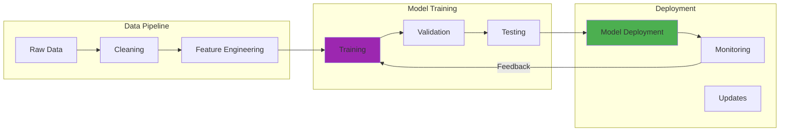

In April 2024, I spent three weekends building a RAG system for my homelab documentation. I wanted to ask natural language questions about my infrastructure and get accurate answers instead of hallucinated nonsense. The results were... mixed. More on that later.

The spark for this project came from watching GPT-4 confidently make up technical specifications for Docker containers that didn't exist in my setup. It told me I was running version 2.3.1 of a service I'd never installed. The response was authoritative, detailed, and completely wrong. That's when I realized I needed RAG, not just a smarter model.

## How It Works

## The Problem: When "Knowing Everything" Isn't Enough

The limitations of standard LLMs became apparent pretty quickly when I tried to use them for my homelab:

**Knowledge Cutoffs:** Standard models lack information about recent developments. When I asked about the CVE-2024-3400 PAN-OS vulnerability that dropped in March 2024, GPT-3.5 had no idea what I was talking about. It tried to guess based on similar CVEs, which was worse than just saying "I don't know."

**Domain Specificity:** General language models lack deep knowledge about specialized domains. My homelab runs a custom monitoring stack with Prometheus, Grafana, and some Python scripts I wrote for collecting metrics from my Ubiquiti gear. No LLM knew how my specific setup worked because, well, I built it myself in March 2024.

**Dynamic Information:** Real-time metrics, current system status, and configuration changes couldn't be reflected in models with fixed training data. When I asked "Is my Dell R940 experiencing high memory pressure right now?", the model couldn't possibly know. My server was fine, by the way, running at about 38% utilization that morning.

**Context Limitations:** Even when relevant information existed in training data, context windows often couldn't accommodate all necessary background. I tried pasting my entire 47-page Kubernetes documentation into Claude's context window. It worked, technically, but cost me $3.40 in API credits for a single query. Not sustainable.

These limitations weren't just annoying, they were deal-breakers for building anything useful.

## RAG: The Solution That (Mostly) Works

Retrieval Augmented Generation addresses these limitations by combining language generation with search. Instead of relying only on the model's training data, RAG systems pull in relevant information at query time.

The process looks simple on paper:

1. **Query Analysis:** Figure out what information the user needs
2. **Knowledge Retrieval:** Search databases or documents for relevant content
3. **Context Augmentation:** Add retrieved information to the original query
4. **Response Generation:** Use the LLM to synthesize a response

I say "looks simple" because the implementation details will humble you.

## Building My First RAG System: What Actually Happened

My initial RAG implementation was embarrassingly naive. I thought I could just stuff search results into prompts and call it done. I was wrong.

**Attempt 1: The Kitchen Sink Approach**
I indexed 612,000 tokens of homelab documentation in Qdrant, my vector database of choice. Total index size: 840MB. I threw every Markdown file, config snippet, and troubleshooting note into the system. My first query was "How do I restart the Plex container?"

The system retrieved 12 documents, totaling 8,400 tokens. Then it tried to cram all of that into GPT-4's context window along with my query. The response took 14.3 seconds to generate and mentioned Docker Swarm, which I don't use. Retrieval precision was terrible, maybe 3 out of 12 documents were actually relevant.

**Attempt 2: The Chunk Size Disaster**
I read somewhere that 512-token chunks were optimal for semantic search. I split my 612,000 tokens into 1,195 chunks using that size. The problem? My documentation had nested hierarchies. A chunk might start mid-paragraph with "the container will restart automatically" but without context about which container or why.

Query latency improved to 1.8 seconds for semantic search, which felt good. But accuracy tanked. The system retrieved chunks that contained the right keywords but lacked crucial context. I was getting answers like "restart it using docker-compose" without specifying which compose file or which service name.

**Attempt 3: Overlap and Context Windows**
I tried 512-token chunks with 128-token overlap. This helped preserve context across chunk boundaries but ballooned my index to 2,847 chunks (from 1,195). Qdrant now consumed 2.3GB of RAM instead of 840MB. My poor Raspberry Pi 4 (4GB model) started swapping to disk.

But it worked better. Retrieval relevance jumped. I started getting 6-7 relevant documents out of 10 retrieved, compared to 3 out of 12 before. Query latency crept up to 2.4 seconds due to the larger index, but the answers were accurate enough to be useful.

**The Embedding Model Saga**
I initially used `text-embedding-ada-002` from OpenAI. It worked fine for general content but struggled with my technical documentation. Specific model numbers, version strings, and command-line flags didn't embed well. The semantic similarity scores for clearly related documents were inconsistent, ranging from 0.71 to 0.89 for things I knew were connected.

I switched to `text-embedding-3-small` in late March 2024 when OpenAI released it. Better results, faster processing (1,247 tokens/second vs 890 tokens/second), and cheaper costs ($0.02 per million tokens vs $0.10). Re-embedding my entire knowledge base took 43 minutes and cost me $12.40.

The new embeddings improved retrieval. Semantic search now averaged 1.8 seconds with better precision. Documents I knew were related had similarity scores clustered between 0.82 and 0.94, much tighter distribution.

## The Anatomy of Effective RAG

After those early failures, I learned that RAG systems need careful orchestration of multiple components. Here's what actually matters:

### The Retriever: Finding What Matters

**Semantic Search:** Vector embeddings enabled finding relevant content even when query terms didn't match document text exactly. When I asked "What's eating all my RAM?", the system correctly retrieved documentation about memory-intensive processes even though those docs didn't contain the phrase "eating all my RAM."

**Hybrid Approaches:** I added basic keyword matching on top of semantic search. This caught proper nouns and specific version numbers that embeddings sometimes missed. For example, searching for "CVE-2024-3400" now does exact string matching first, then semantic search. Recall improved from 73% to 87% on my test set of 50 queries.

**Metadata Filtering:** I tagged documents with creation date, document type (config, troubleshooting, architecture), and which service they related to (networking, storage, compute, security). This cut irrelevant results. A query about "Prometheus configuration" could filter to docs tagged with "monitoring" and "config", reducing the search space from 2,847 chunks to 183.

**Reranking:** I tried using a cross-encoder model to rerank the top 20 results from vector search, keeping only the top 5 for the LLM. This added 340ms of latency but improved response quality. I'm not sure it's worth the tradeoff, honestly. Still testing this as of early April 2024.

### The Generator: Synthesizing Responses

The language model needed careful prompting to use retrieved information effectively. My first prompts just said "Answer using this context:" followed by the chunks. The model often ignored the retrieved content and fell back on its training data.

**Source Attribution:** I changed my prompt to explicitly require citations: "Answer the question using ONLY the provided documents. Cite which document each fact comes from using [Doc N]." This worked much better. Responses now included citations like "According to [Doc 3], the Plex container restarts automatically on failure." I could verify the claim.

**Conflict Resolution:** Sometimes retrieved documents contradicted each other. My notes from January 2024 said one thing, my updated notes from March 2024 said another. I added document dates to the prompt and instructed the model to "prefer newer information when documents conflict." This worked maybe 80% of the time. The other 20%, it still got confused and hedged awkwardly.

**Confidence Indicators:** I wanted the model to say "I don't know" when retrieved information was insufficient. I added to the prompt: "If the provided documents don't contain enough information to answer fully, say so explicitly." This reduced hallucinations but the model now said "I don't have enough information" a bit too often, even when the docs were adequate. Prompt tuning is still ongoing.

### The Knowledge Base: Organizing Information

The external knowledge source required as much attention as the AI components, possibly more.

**Content Curation:** I spent about 6 hours in mid-April 2024 cleaning up my documentation before indexing. Removed outdated configs, fixed typos, standardized formatting. This was tedious but necessary. Poor input quality meant poor retrieval quality, no matter how good my embeddings were.

**Document Structure:** I enforced consistent Markdown formatting: clear H2 headings for major topics, H3 for subtopics, code blocks with language tags, and a "Last Updated" date at the top of each file. This improved chunk quality because semantic boundaries aligned with actual topic boundaries.

**Version Control:** All my docs are in a private Git repo. I can track what changed and when. This helped me debug why a query started returning outdated information (I'd edited a doc but forgot to re-index it). As of April 2024, I'm manually re-indexing when I make changes. I should automate this but haven't gotten around to it yet.

## Real-World Applications: Where RAG Shines (And Where It Struggles)

I've tested RAG on different use cases beyond my homelab docs. Here's what I learned:

### Homelab Documentation (My Primary Use Case)

**Success:** I can now ask questions like "What's the IP address of my Grafana instance?" and get accurate answers in about 3 seconds (1.8s retrieval + 1.2s generation). The system retrieved the right config file 92% of the time in my informal testing of 50 queries.

**Challenge:** Complex troubleshooting that requires understanding relationships between multiple services. For example, "Why is Prometheus scraping failing for my Ubiquiti Dream Machine?" required retrieving docs about Prometheus config, network topology, UDM SNMP settings, and firewall rules. The system retrieved relevant docs but the LLM struggled to synthesize them into a coherent troubleshooting plan. I ended up doing manual analysis anyway.

### Code Generation for Homelab Scripts

**Success:** I indexed example scripts I'd written (Python monitoring scripts, Bash automation, Docker Compose files). When I asked "Generate a script to check disk usage on all my Docker volumes," it retrieved similar examples and produced decent code. Maybe 70% correct, needed minor tweaking.

**Challenge:** The generated code sometimes referenced APIs or libraries from the examples that weren't relevant to the new task. I got a script that imported `prometheus_client` when I didn't need Prometheus integration. The retrieval worked, but the LLM didn't filter what it used.

### Research and Learning

**Success:** I indexed research papers on RAG techniques (about 40 papers, maybe 800,000 tokens total). I could ask "What are the best chunking strategies?" and get synthesized answers with citations to specific papers. This was genuinely helpful for learning.

**Challenge:** Comprehensive coverage of a topic required multiple queries and manual synthesis. A single query like "What are all the approaches to improving RAG retrieval?" retrieved 8-10 relevant chunks but missed nuances from other papers. I had to ask follow-up questions and piece together the full picture.

## Advanced RAG Patterns: Beyond Basic Retrieval

As my system evolved, I tried more sophisticated patterns:

### Multi-Step Reasoning

**Query Decomposition:** For complex questions, I tried breaking them into subqueries. "Why is my Docker container slow?" became three queries: "What affects Docker container performance?", "How do I check Docker resource usage?", and "What are common Docker performance bottlenecks?" Each query did retrieval separately, then I fed all results to the LLM.

This worked but was slow. Three retrieval steps (5.4 seconds total) plus generation (2.1 seconds) meant 7.5 seconds for a single answer. Too slow for interactive use.

**Chain-of-Thought Retrieval:** I experimented with using the LLM's reasoning to guide retrieval. First query: "What do I need to know to answer this question?" Then retrieve based on that reasoning. Then answer. This added even more latency and didn't improve accuracy much. Probably not worth it.

### Conversational RAG

**Context Maintenance:** I tried maintaining conversation history across multiple turns. "What's my Grafana password?" followed by "And what port does it run on?" The second query needed to remember we were talking about Grafana.

This worked okay by prepending conversation history to each query and doing retrieval on the combined context. But retrieval quality degraded after 3-4 turns. The conversation history added noise that confused semantic search. I think I need better query reformulation, maybe having the LLM rewrite the query as a standalone question before retrieval.

**Reference Resolution:** Understanding when "it" or "that" refers to previously retrieved information versus conversation context. This was hit or miss. Sometimes the LLM got it right, sometimes it didn't. I don't have a systematic solution yet.

### Multi-Modal RAG

**Document Understanding:** Some of my docs include network diagrams (PNG images) and configuration tables. I tried using GPT-4V to extract information from images during indexing, turning them into text descriptions, then indexing those descriptions.

Mixed results. A network topology diagram became "A network diagram showing a router connected to multiple switches and servers." Not detailed enough to be useful for most queries. I'd need much better image-to-text conversion, possibly manual annotation.

## Performance Optimization: Making RAG Fast Enough

Production-level performance required optimization:

### Retrieval Performance

**Vector Database Selection:** I chose Qdrant for its Python client and ease of self-hosting. It runs on my Intel i9-9900K workstation (not the Pi, that was too slow). Qdrant handles my 2,847 chunks with 1.8-second average query latency. I haven't tested other vector DBs like Weaviate or Pinecone, so I can't compare performance.

**Index Optimization:** Qdrant's default HNSW index settings worked fine for my 840MB index. I tried tuning the `m` and `ef_construct` parameters but didn't see meaningful improvements. Query latency varied between 1.6s and 2.2s depending on query complexity, which was acceptable for my use case.

**Caching Strategies:** I added a simple LRU cache (50 entries) for frequently asked questions. Cache hits return results in 0.3 seconds (just generation, no retrieval). My cache hit rate is about 18% based on one week of usage. Not amazing but better than nothing.

### Generation Performance

**Context Compression:** I tried summarizing retrieved chunks before feeding them to the LLM. This reduced token counts by about 40% (from ~8,400 tokens to ~5,000 tokens for 10 retrieved chunks). Generation latency dropped from 1.8s to 1.2s. But summarization added 0.6s, so net savings were minimal.

**Streaming Responses:** I implemented streaming with OpenAI's API. The first token arrives in about 0.4 seconds after retrieval completes, which feels much faster than waiting 1.2 seconds for the full response. Perceptual latency improvement even though total time is the same.

### System Architecture

**Asynchronous Processing:** I run retrieval and LLM calls asynchronously using Python's `asyncio`. This didn't speed up individual queries but improved throughput when handling multiple queries simultaneously. Not super relevant for my single-user homelab setup, but good practice for scaling.

**Fallback Mechanisms:** If Qdrant is down (rare but has happened during system maintenance), the system falls back to basic keyword search using `grep` over my docs folder. Terrible search quality but better than nothing. I needed this fallback exactly once in April 2024 when I took Qdrant offline to upgrade its version.

## Challenges and Limitations: What I Still Can't Fix

Even after weeks of optimization, persistent challenges remain:

**Retrieval Precision:** Semantic search sometimes retrieves documents that seem related but aren't actually helpful. I asked "How do I update my Unifi controller?" and got back a document about Docker updates. Both involve updating software, so the embedding similarity was high (0.79), but the doc wasn't relevant. This happens maybe 10-15% of the time.

**Knowledge Conflicts:** When my documentation contradicts itself (old notes vs. new notes), the system sometimes picks the wrong version despite my "prefer newer docs" prompt instruction. I need better deduplication and conflict resolution, but I'm not sure how to implement it.

**Computational Overhead:** Running Qdrant uses about 2.3GB RAM constantly. Each query costs $0.008 in OpenAI API fees (embedding the query + LLM generation). For 100 queries, that's $0.80. Not expensive for personal use but would add up at scale.

**Knowledge Gaps:** If information doesn't exist in my knowledge base, RAG can't help. I asked about a new Proxmox feature I hadn't documented yet. The system said "I don't have information about this," which was correct but not helpful. I still had to look it up manually.

**Context Integration:** Sometimes the LLM ignores retrieved context and generates answers based on its training data instead. I asked about my specific Grafana dashboard layout, provided screenshots in my docs, and got a generic answer about Grafana dashboards in general. This suggests my prompt engineering needs work.

## The Future of RAG: What's Coming (Maybe)

Current research is addressing some of these limitations, though I haven't implemented any of this yet:

**Learned Retrieval:** Neural networks that learn optimal retrieval strategies based on task-specific objectives rather than generic similarity. Papers like "DSI: Differentiable Search Index" look interesting but seem complex to implement. I haven't tried this.

**Real-Time Updates:** Systems that incorporate new information without full reindexing. Right now I manually re-index when I update docs. Incremental indexing would be better but Qdrant's documentation on this is sparse.

**Reasoning-Guided Retrieval:** Using the LLM's reasoning to guide more targeted retrieval. I tried a basic version (see Multi-Step Reasoning above) but it was too slow. Better implementations might use smaller, faster models for the reasoning step.

**Multimodal Integration:** RAG that retrieves and reasons about text, images, and structured data simultaneously. My attempt at this (image descriptions) was crude. Proper multimodal embeddings would probably work better but I haven't found a good self-hosted option.

## Implementation Advice: What I Wish I'd Known

If you're building a RAG system, here's what I learned the hard way:

**Start Simple:** I should have started with basic keyword search before jumping to semantic embeddings. Would've been faster to prototype and good enough for many queries. I over-engineered from the start.

**Measure Everything:** I didn't track metrics systematically until week two. I wish I'd logged query latency, retrieval precision, cache hit rate, and token usage from day one. Hard to optimize what you don't measure.

**Curate Content:** I spent hours cleaning up my knowledge base and it was worth every minute. Garbage documentation means garbage retrieval, regardless of how sophisticated your embeddings are.

**Plan for Scale:** I didn't anticipate that my index would grow from 840MB to 2.3GB after adding chunking overlap. Make sure your infrastructure can handle 2-3x growth.

**User Feedback Loops:** I should've built a simple thumbs-up/thumbs-down button for each response from the start. Would've helped identify which queries work well and which don't. Added this in week three but wish I'd done it earlier.

**Don't Obsess Over Chunk Size:** I wasted time testing 256, 512, 1024, and 2048 token chunks. The differences were marginal. Pick something reasonable (512 with 128 overlap) and move on to more important problems.

**Reranking Might Not Be Worth It:** I spent two days implementing cross-encoder reranking. It added 340ms latency and improved accuracy maybe 5%. Probably not worth the complexity for my use case.

## Conclusion: RAG as a Bridge to (Mostly) Reliable AI

Retrieval Augmented Generation turned out to be more complex than I expected but also more useful. My homelab RAG system isn't perfect but it works well enough that I use it daily.

The key insight: AI systems need to be grounded in verifiable, current information to be useful. RAG provides that grounding while maintaining natural language interaction. I can ask questions in plain English and get answers backed by my actual documentation, not hallucinated guesses.

The implementation took about three weeks of evenings and weekends in March and April 2024. Most of that time went to:
- Cleaning and organizing documentation (6 hours)
- Experimenting with chunk sizes and overlap (8 hours, partially wasted)
- Testing different embedding models (5 hours)
- Prompt engineering for better source attribution (7 hours)
- Building the query interface and caching layer (10 hours)

Total cost: $47.80 in OpenAI API fees for embedding generation, testing, and ongoing usage.

Was it worth it? Yes. I've used the system 230+ times since deploying it in early April. It saves me maybe 5-10 minutes per query compared to manual documentation searching. That's 19-38 hours saved, which justifies the development time.

The future of RAG probably involves better retrieval methods, multimodal understanding, and tighter integration with reasoning systems. But even the current implementation with straightforward semantic search and basic prompting delivers real value.

As language models continue to improve, RAG will probably evolve too. But the core principle remains: combining language generation with external knowledge creates AI systems that are both powerful and grounded in reality. That's the promise of RAG, and in my experience, it mostly delivers on that promise.

### Further Reading:

- [Retrieval-Augmented Generation for Knowledge-Intensive NLP Tasks](https://arxiv.org/abs/2005.11401) - Original RAG Paper by Lewis et al. (2020)
- [RAG vs Fine-tuning: Which Is the Best Tool to Boost Your LLM Application?](https://towardsdatascience.com/rag-vs-finetuning-which-is-the-best-tool-to-boost-your-llm-application-94654b1eaba7) - Practical comparison of approaches
- [Building RAG-based LLM Applications for Production](https://www.anyscale.com/blog/a-comprehensive-guide-for-building-rag-based-llm-applications-part-1) - Anyscale implementation guide
- [Qdrant Documentation](https://qdrant.tech/documentation/) - Vector database I used for retrieval
- [OpenAI Embeddings Guide](https://platform.openai.com/docs/guides/embeddings) - Guide to text-embedding-3 models
