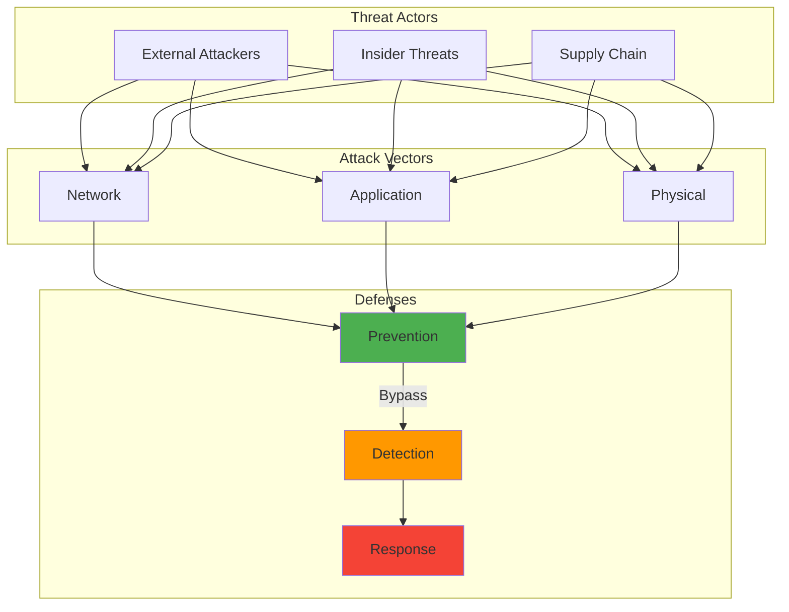

The day I first truly understood how Shor's algorithm could factor large integers efficiently on a quantum computer, I felt a chill that had nothing to do with the temperature. Every RSA key, every elliptic curve signature, every piece of public-key cryptography that secured our digital world could potentially become worthless overnight.

That realization years ago sparked my journey into quantum-resistant cryptography—a field that felt both urgently necessary and frustratingly theoretical. Today, as quantum computers inch closer to practical capability, that preparation feels less like paranoia and more like prudent planning.

## How It Works

## The Quantum Awakening: Understanding the Threat

My first encounter with quantum computing's cryptographic implications came during a security conference presentation about Shor's algorithm. The presenter walked through the mathematics with casual confidence, but I was transfixed by the implications.

Every secure communication channel, every digital signature, every encrypted database relied on mathematical problems that quantum computers could solve efficiently. The equations that would take classical computers longer than the age of the universe to solve might take quantum computers mere hours.

**The RSA Vulnerability:** RSA encryption depends on the difficulty of factoring large composite numbers. Classical computers struggle with this, but Shor's algorithm turns factoring into a problem quantum computers can solve efficiently.

**Elliptic Curve Cryptography at Risk:** ECC, praised for its efficiency and smaller key sizes, faces similar quantum vulnerabilities through modified versions of Shor's algorithm.

**Discrete Logarithm Problems:** The mathematical foundations underlying many cryptographic systems become tractable with quantum algorithms.

The most unsettling realization was that this wasn't a distant, theoretical concern—quantum computers were advancing rapidly, and their cryptographic impact would be binary. One day our encryption would be secure; the next day it might be useless.

## The Current State: How Close Are We?

Tracking quantum computing progress became an obsession. Every announcement from IBM, Google, or Rigetti felt significant:

**IBM's Quantum Roadmap:** Their plan to reach 1,000-qubit systems by 2025 and beyond suggested that cryptographically relevant quantum computers weren't decades away.

**Google's Quantum Supremacy:** Their demonstration of quantum advantage in specific problems showed that quantum computers could outperform classical systems in certain domains.

**Error Correction Progress:** Advances in quantum error correction brought stable, reliable quantum computation closer to reality.

**Investment and Interest:** Massive corporate and government investment indicated confidence in quantum computing's eventual practical impact.

A security audit I conducted years ago revealed that our entire organization's security assumed classical computational limitations. The quantum threat wasn't just about updating a few algorithms—it was about rethinking fundamental security assumptions.

## Post-Quantum Cryptography: Building Tomorrow's Defenses

The race to develop quantum-resistant algorithms felt like watching history unfold. Cryptographers worldwide worked to identify mathematical problems that would remain difficult even for quantum computers.

### Lattice-Based Cryptography: Mathematical Puzzles

**The Promise:** Lattice problems like finding the shortest vector in high-dimensional lattices appear resistant to quantum attacks.

**CRYSTALS-Kyber:** This key encapsulation mechanism became my first hands-on experience with post-quantum crypto. Implementing it revealed both its elegance and complexity.

**CRYSTALS-Dilithium:** The digital signature scheme based on lattice problems showed promise for practical deployment.

**Real-World Testing:** Early implementations in test systems revealed performance characteristics very different from traditional RSA or ECC.

### Hash-Based Signatures: Proven Security

**SPHINCS+:** This signature scheme's security relies only on the collision resistance of hash functions—properties we understand well and trust deeply.

**Performance Trade-offs:** Hash-based signatures offered strong security guarantees but came with larger signature sizes and computational overhead.

**Practical Limitations:** The stateful nature of some hash-based schemes created operational challenges for certain applications.

### Code-Based Cryptography: Hidden Structure

**Classic McEliece:** Based on error-correcting codes, this approach offered strong security guarantees but came with very large key sizes.

**Implementation Challenges:** Working with Classic McEliece revealed the practical difficulties of deploying systems with megabyte-sized keys.

### Multivariate Cryptography: Polynomial Equations

Systems of multivariate polynomial equations provided another potential foundation for post-quantum security, though with their own complexity trade-offs.

## NIST's Standardization: Bringing Order to Chaos

Watching NIST's post-quantum cryptography standardization process felt like witnessing democracy in action within the cryptographic community. Years of public evaluation, analysis, and debate culminated in the selection of standards that would shape our quantum-resistant future.

**The Competition:** Dozens of candidate algorithms underwent rigorous evaluation for security, performance, and implementability.

**Community Involvement:** The open evaluation process included contributions from researchers worldwide, revealing both strengths and weaknesses in proposed systems.

**The 2022 Announcement:** When NIST announced the initial standards—CRYSTALS-Kyber, CRYSTALS-Dilithium, FALCON, and SPHINCS+—it felt like a milestone in cryptographic history.

**Ongoing Evaluation:** Additional rounds of standardization continue, recognizing that diversity in cryptographic approaches provides better security than relying on single families of algorithms.

## Implementation Reality: Beyond the Math

Moving from theoretical post-quantum algorithms to practical implementations revealed unexpected challenges:

### Performance Considerations

**Key Sizes:** Post-quantum algorithms often require much larger keys than traditional cryptography. A Classic McEliece public key can exceed 1MB, compared to 256 bytes for an ECC key.

**Computational Overhead:** Operations like key generation, encryption, and signature verification often require more processing power than traditional algorithms.

**Memory Requirements:** Larger keys and intermediate values strain memory-constrained devices like IoT sensors or embedded systems.

### Integration Challenges

**Protocol Compatibility:** Existing protocols like TLS weren't designed for multi-megabyte keys or signatures, requiring careful adaptation.

**Certificate Infrastructure:** PKI systems needed updates to handle new key formats and signature algorithms.

**Hardware Support:** Cryptographic hardware acceleration, optimized for RSA and ECC, required redesign for post-quantum algorithms.

### Operational Considerations

**Key Management:** Larger keys complicate backup, storage, and distribution procedures.

**Performance Testing:** Understanding real-world performance characteristics across different platforms and use cases.

**Fallback Planning:** Designing systems that could gracefully handle both traditional and post-quantum algorithms during transition periods.

## Hybrid Approaches: Bridging Two Eras

The transition to post-quantum cryptography wouldn't happen overnight, leading to hybrid approaches that combined traditional and post-quantum algorithms:

**Dual Security:** Using both RSA/ECC and post-quantum algorithms provides security against both classical and quantum attacks.

**Compatibility Maintenance:** Hybrid systems can communicate with both legacy and updated endpoints.

**Risk Mitigation:** If post-quantum algorithms prove vulnerable to unexpected attacks, traditional algorithms provide backup security.

**Performance Balance:** Combining fast traditional algorithms with secure post-quantum ones can optimize performance while maintaining security.

## Preparing Organizations: Practical Steps

Helping organizations prepare for the post-quantum transition became a significant part of my work:

### Cryptographic Inventory

**Discovery:** Identifying every use of cryptography across an organization's systems, applications, and infrastructure.

**Documentation:** Creating comprehensive catalogs of cryptographic implementations, including algorithms, key sizes, and use cases.

**Dependency Mapping:** Understanding how cryptographic components interact and depend on each other.

**Priority Assessment:** Identifying which systems need protection against quantum attacks most urgently.

### Migration Planning

**Phased Approach:** Planning gradual migration rather than attempting wholesale replacement.

**Critical Path Analysis:** Identifying systems and components that must be updated first to maintain overall security.

**Testing Infrastructure:** Developing environments for validating post-quantum implementations before production deployment.

**Rollback Procedures:** Planning for potential issues with new cryptographic systems.

### Skills and Training

**Team Education:** Ensuring security and development teams understand post-quantum cryptography concepts and implications.

**Implementation Training:** Hands-on experience with post-quantum libraries and tools.

**Ongoing Learning:** Staying current with evolving standards, best practices, and new vulnerabilities.

## Lessons from Early Adoption

Experimenting with post-quantum cryptography in test environments taught valuable lessons:

**Start Small:** Beginning with non-critical systems allowed learning without risking production security.

**Performance Surprises:** Real-world performance often differed significantly from theoretical benchmarks.

**Integration Complexity:** Simple algorithm replacement often revealed unexpected system dependencies.

**User Experience Impact:** Larger keys and slower operations could affect user-facing applications in subtle ways.

## The Timeline Challenge: When to Act

Predicting when quantum computers will threaten current cryptography remains difficult, but the consensus suggests urgency:

**Cryptographically Relevant Quantum Computers:** Most experts predict practical threats within 10-30 years, though breakthrough discoveries could accelerate this timeline.

**Migration Time:** Large organizations might need 5-15 years to completely transition their cryptographic infrastructure.

**Data Lifetime:** Information that must remain confidential for decades needs protection now against future quantum threats.

**Regulatory Pressure:** Government agencies and regulated industries are beginning to mandate post-quantum cryptography adoption.

## Looking Ahead: The Post-Quantum World

The transition to post-quantum cryptography represents more than algorithm replacement—it's a fundamental shift in how we think about cryptographic security:

**Crypto-Agility:** Future systems must be designed for easier cryptographic updates as new threats and algorithms emerge.

**Hybrid Architectures:** The coexistence of multiple cryptographic approaches may become permanent rather than transitional.

**Performance Optimization:** Hardware and software optimizations for post-quantum algorithms will continue improving their practical viability.

**New Threat Models:** Post-quantum cryptography brings its own potential vulnerabilities that require ongoing research and vigilance.

## Personal Reflections on a Cryptographic Revolution

Watching the development of post-quantum cryptography has been like witnessing a controlled revolution in slow motion. The cryptographic foundations I learned early in my career are becoming obsolete, replaced by mathematical structures I'm still learning to understand.

The challenge isn't just technical—it's psychological. Accepting that systems we've trusted for decades may become insecure requires humility about technological permanence and confidence in our ability to adapt.

## Conclusion: Preparing for an Uncertain Future

The quantum threat to cryptography is unique in the history of information security—we know it's coming, we know it will be significant, but we don't know exactly when or how it will unfold.

This uncertainty makes preparation both challenging and essential. Organizations that begin their post-quantum journey now will be better positioned when quantum computers achieve cryptographic relevance. Those that wait risk finding themselves vulnerable at the worst possible moment.

The mathematical elegance of quantum computing's threat to classical cryptography is matched by the ingenuity of post-quantum solutions. As we stand on the brink of a new era in both computing and cryptography, the choices we make today about quantum-resistant systems will determine whether we enter that era securely or scramble to catch up.

The quantum future is coming whether we're ready or not. The question isn't whether we'll need post-quantum cryptography—it's whether we'll deploy it before we need it or after it's too late.

### Further Reading:

- [Getting Ready for Post-Quantum Cryptography](https://csrc.nist.gov/pubs/ir/8413/final - NIST
- [Quantum-Safe Cryptography](https://www.etsi.org/technologies/quantum-safe-cryptography - ETSI
- [Post-Quantum Cryptography](https://www.enisa.europa.eu/topics/cryptography/post-quantum-cryptography - ENISA
- [IBM Quantum Network](https://qiskit.org/textbook/ch-algorithms/shor.html) - Shor's Algorithm Implementation