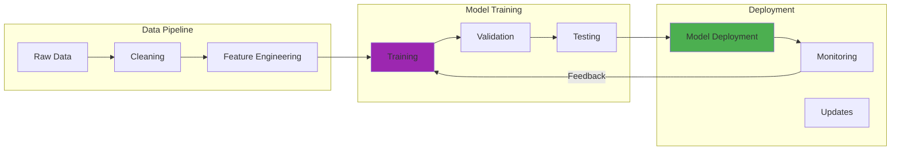

I still remember the morning our AI-powered security system flagged an anomaly that looked like routine database maintenance. Every traditional tool had missed it—the activity was subtle, well-disguised, and executed during normal business hours by seemingly legitimate accounts.

But the AI saw something different. It recognized patterns in data access that suggested reconnaissance, identified behavioral anomalies in user accounts, and connected seemingly unrelated events across weeks of activity. What we discovered was a sophisticated Advanced Persistent Threat that had been methodically mapping our network for months.

That incident crystallized both the immense promise and the profound challenges of AI in cybersecurity. The same technology that saved us from a potentially catastrophic breach could, in the wrong hands, enable attacks of unprecedented sophistication.

## How It Works

## The Double-Edged Nature of AI in Security

Working with AI security tools over the years taught me that every defensive capability creates corresponding offensive possibilities:

**Pattern Recognition:** AI excels at identifying subtle attack patterns, but it can also learn to generate attacks that evade traditional detection.

**Automation Scale:** AI can process security events at superhuman speed, but attackers can use the same automation to launch more sophisticated and voluminous attacks.

**Adaptive Learning:** AI systems improve through experience, but they can also be manipulated through adversarial inputs designed to corrupt their learning.

This duality creates a security landscape where defensive and offensive capabilities advance in tandem, requiring constant vigilance and adaptation.

## AI as the Ultimate Security Analyst

Deploying AI in security operations revealed capabilities that seemed almost magical:

### Anomaly Detection at Scale

Our first AI anomaly detection system processed network traffic patterns that would have required hundreds of analysts to evaluate manually. It identified:

**Subtle Data Exfiltration:** Detecting when normal file access patterns concealed unauthorized data extraction

**Insider Threats:** Recognizing behavioral changes in employee digital footprints that suggested compromised accounts or malicious intent

**Zero-Day Attacks:** Identifying previously unknown attack patterns through behavioral analysis rather than signature matching

**Supply Chain Compromises:** Correlating seemingly unrelated events across multiple systems to reveal coordinated attacks

### Threat Intelligence at Light Speed

AI transformed our ability to process and act on threat intelligence:

**IOC Correlation:** Automatically connecting indicators of compromise across multiple feeds and internal telemetry

**Attribution Analysis:** Identifying attack patterns and techniques associated with specific threat actors

**Predictive Intelligence:** Anticipating likely attack vectors based on current threat landscapes and organizational vulnerabilities

**False Positive Reduction:** Learning to distinguish genuine threats from benign anomalies, dramatically reducing alert fatigue

### Automated Response and Mitigation

The most impressive AI applications involved autonomous response to threats:

**Instant Containment:** Automatically isolating infected systems within seconds of detection

**Dynamic Defense Adaptation:** Adjusting firewall rules, access controls, and monitoring in real-time based on evolving threat patterns

**Forensic Automation:** Collecting and analyzing digital evidence faster than human investigators could manage

**Recovery Orchestration:** Coordinating complex system recovery processes with minimal human intervention

## The Dark Side: AI-Powered Attacks

But every defensive capability we developed highlighted corresponding attack possibilities:

### Adversarial Machine Learning

Testing our AI systems against adversarial attacks revealed fundamental vulnerabilities:

**Model Poisoning:** Attackers could potentially corrupt training data to create backdoors in AI security systems

**Evasion Attacks:** Carefully crafted inputs could fool AI systems into misclassifying malicious activity as benign

**Model Extraction:** Attackers could potentially reverse-engineer AI models to understand their decision-making processes

**Byzantine Attacks:** Coordinated manipulation of distributed AI systems to corrupt their collective decision-making

### Automated Attack Generation

AI didn't just improve attack detection—it enabled attack creation:

**Personalized Phishing:** AI could generate convincing spear-phishing emails tailored to specific individuals based on their digital footprints

**Deepfake Social Engineering:** Synthetic media could enable sophisticated impersonation attacks that bypass human intuition

**Automated Vulnerability Research:** AI could potentially discover new software vulnerabilities faster than defenders could patch them

**Adaptive Malware:** Self-modifying code that could evolve to evade detection systems in real-time

## Real-World Implementation: Lessons from the Trenches

### The Learning Curve

Deploying AI security tools required significant organizational adaptation:

**Skills Gap:** Security teams needed new expertise in machine learning, data science, and AI operations

**Data Quality:** AI systems required clean, well-labeled training data—garbage in, garbage out applied emphatically

**Integration Complexity:** Connecting AI systems with existing security infrastructure required careful architecture planning

**Performance Tuning:** Finding the right balance between detection accuracy and false positive rates required extensive experimentation

### Success Stories

When properly implemented, AI security systems delivered remarkable results:

**Reduced Mean Time to Detection:** AI helped identify threats hours or days faster than traditional methods

**Improved Analyst Productivity:** Automated triage and initial investigation freed human analysts for complex tasks

**Enhanced Threat Hunting:** AI-assisted threat hunting discovered attacks that might have remained undetected for months

**Proactive Defense:** Predictive models helped prioritize defensive measures before attacks occurred

### Failure Modes

But AI security systems also failed in instructive ways:

**Concept Drift:** Models trained on historical data sometimes failed to recognize new attack patterns

**Adversarial Resilience:** Sophisticated attackers learned to evade AI detection through careful attack crafting

**Overreliance:** Organizations that became too dependent on AI systems sometimes neglected other security fundamentals

**Black Box Problems:** Complex AI models sometimes made decisions that analysts couldn't understand or validate

## Ethical Considerations: Walking the Line

Deploying AI in security contexts raised profound ethical questions:

### Privacy vs. Security

**Employee Monitoring:** AI systems capable of detecting insider threats necessarily monitor employee behavior in detail

**Data Collection:** Effective AI security requires comprehensive data collection that may infringe on privacy expectations

**Behavioral Analysis:** Understanding normal behavior patterns requires analyzing personal digital activities

**Retention Policies:** Balancing security requirements with privacy rights regarding data retention and analysis

### Bias and Fairness

**Algorithmic Bias:** AI systems could disproportionately flag certain groups as suspicious based on biased training data

**False Positive Impact:** Biased false positives could unfairly impact specific individuals or communities

**Training Data Representation:** Ensuring AI training data represents diverse attack patterns and user behaviors

**Audit Requirements:** Regular evaluation of AI systems for biased decision-making

### Transparency and Accountability

**Explainable Decisions:** Security decisions made by AI systems need to be auditable and understandable

**Human Oversight:** Maintaining meaningful human control over AI-driven security decisions

**Legal Liability:** Determining responsibility when AI security systems make mistakes with serious consequences

**Regulatory Compliance:** Meeting legal requirements while leveraging AI capabilities

## Building Ethical AI Security Programs

Years of experience taught me that ethical AI security requires intentional design:

### Governance Frameworks

**Clear Policies:** Written guidelines for AI system development, deployment, and operation

**Regular Audits:** Systematic evaluation of AI systems for bias, accuracy, and ethical compliance

**Human Oversight:** Processes ensuring meaningful human review of AI decisions

**Stakeholder Involvement:** Including diverse perspectives in AI security system design and evaluation

### Technical Safeguards

**Explainable AI:** Prioritizing AI approaches that provide understandable reasoning for security decisions

**Bias Testing:** Regular evaluation of AI systems for discriminatory decision-making

**Robustness Validation:** Testing AI systems against adversarial attacks and edge cases

**Privacy Protection:** Implementing privacy-preserving techniques that maintain security effectiveness

### Operational Practices

**Continuous Monitoring:** Ongoing evaluation of AI system performance and impact

**Feedback Loops:** Mechanisms for identifying and correcting AI system problems

**Training Programs:** Ensuring security teams understand AI capabilities and limitations

**Incident Response:** Procedures for handling AI system failures or misuse

## The Future Battlefield: Escalating AI Arms Race

The evolution of AI in cybersecurity suggests an escalating arms race:

### Defensive Evolution

**Federated Learning:** Collaborative AI training across organizations without sharing sensitive data

**Quantum-Enhanced AI:** Leveraging quantum computing for advanced pattern recognition and cryptographic analysis

**Autonomous Security Operations:** Fully automated security operations centers with minimal human intervention

**Predictive Security:** AI systems that anticipate and prevent attacks before they begin

### Offensive Advancement

**AI-Generated Exploits:** Automated discovery and exploitation of software vulnerabilities

**Adversarial Networks:** AI systems designed specifically to evade defensive AI

**Social Engineering Automation:** AI-powered manipulation of human psychology at scale

**Infrastructure Targeting:** AI systems capable of identifying and attacking critical infrastructure vulnerabilities

## Preparing for an AI-Driven Security Future

Organizations need strategic approaches to navigate this evolving landscape:

### Investment Priorities

**Skills Development:** Training security teams in AI technologies and their implications

**Infrastructure Modernization:** Building platforms capable of supporting AI security tools

**Partnership Strategies:** Collaborating with AI security vendors and research institutions

**Threat Intelligence:** Developing capabilities to understand and respond to AI-powered attacks

### Risk Management

**AI Security Assessment:** Evaluating organizational exposure to AI-powered attacks

**Defensive Planning:** Developing strategies for protecting against autonomous and adaptive threats

**Incident Preparation:** Building response capabilities for AI-related security incidents

**Regulatory Compliance:** Staying current with evolving regulations around AI in security contexts

## Personal Reflections on AI's Security Revolution

Working at the intersection of AI and cybersecurity has been like watching two revolutions unfold simultaneously. The defensive capabilities that seemed like science fiction years ago are now routine parts of security operations, while attack possibilities that were purely theoretical are becoming practical realities.

The most profound realization is that AI doesn't just change cybersecurity tactics—it changes the fundamental nature of the security challenge. When both attackers and defenders have access to superhuman pattern recognition, automated decision-making, and adaptive learning, the security landscape becomes more complex and dynamic than ever before.

## Conclusion: Navigating the AI Security Revolution

AI represents both the greatest opportunity and the greatest challenge in cybersecurity's evolution. The same technologies that enable unprecedented defensive capabilities also empower attacks of previously unimaginable sophistication.

Success in this environment requires more than just implementing AI tools—it demands thoughtful consideration of ethical implications, careful attention to bias and fairness, and constant vigilance against the dual-use nature of AI technologies.

The incident that first showed me AI's security potential—detecting that APT attack our traditional tools missed—also taught me that AI security is ultimately about amplifying human capabilities rather than replacing human judgment. The most effective AI security systems I've worked with combine machine speed and scale with human wisdom and ethics.

As we advance into an AI-driven security future, the organizations that thrive will be those that harness AI's power while maintaining their commitment to ethical principles, human oversight, and continuous learning. The stakes couldn't be higher, but the potential for building more secure, resilient, and trustworthy systems has never been greater.

The AI security revolution is just beginning, and how we navigate its challenges and opportunities will determine whether we create a more secure digital world or one where the balance between attackers and defenders becomes permanently destabilized.

### Further Reading:

- [AI and cybersecurity: How to navigate the risks and opportunities](https://www.weforum.org/stories/2024/02/ai-cybersecurity-how-to-navigate-the-risks-and-opportunities/) - World Economic Forum
- [How is AI shaping the cybersecurity strategies of tomorrow?](https://www.accenture.com/us-en/blogs/security/how-ai-shaping-cybersecurity-strategies) - Accenture
- [Gen AI use cases rising rapidly for cybersecurity — but concerns remain](https://www.csoonline.com/article/3619006/generative-ai-cybersecurity-use-cases-are-expanding-fast-but-experts-say-caution-is-warranted.html) - CSO Online
- [NIST AI Risk Management Framework](https://www.nist.gov/itl/ai-risk-management-framework) - NIST