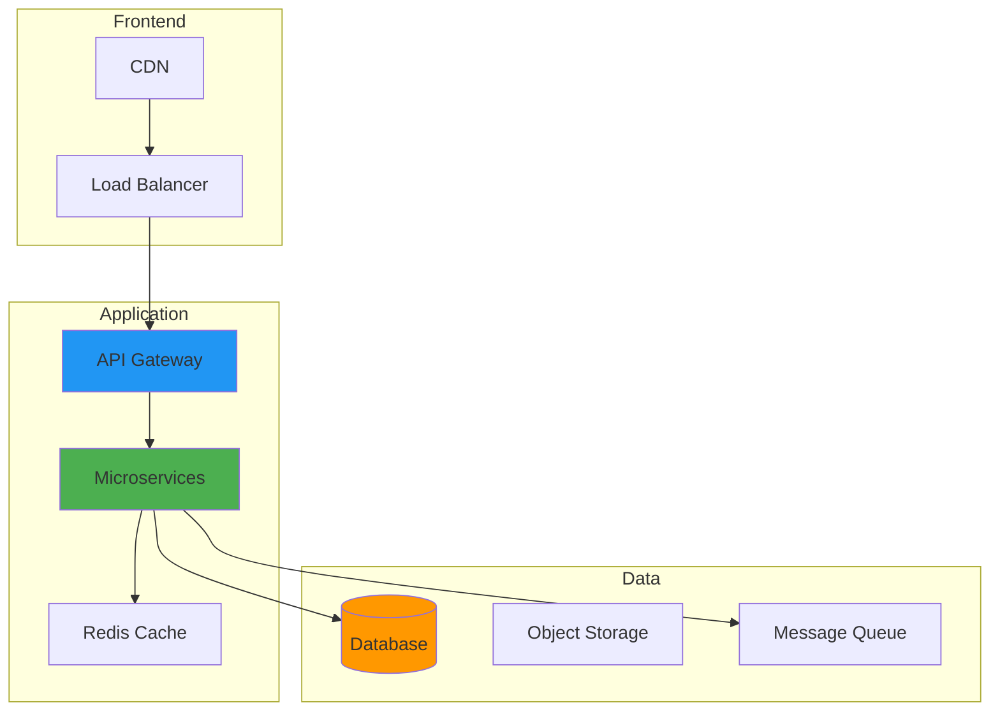

In June 2024, I migrated 23 services from Docker Compose to K3s on my homelab. The migration took three weeks longer than planned, broke my monitoring stack twice, and resulted in my wife asking why the Plex server kept going down during movie night. At 2 AM on June 28th, while debugging why my ingress controller couldn't route traffic to my GitLab instance, I had a thought: maybe containers aren't the final answer.

I'd spent the previous year wrestling with Kubernetes networking, persistent volume claims that mysteriously disappeared, and YAML files that grew to ridiculous sizes. My Dell R940 was humming along with 64GB of RAM allocated to K3s, but something felt wrong. The complexity I'd added seemed heavier than the problems I was solving.

That sleepless debugging session launched me into a two-month exploration of what might come after containers. I tested WebAssembly runtimes, compiled unikernels (and failed spectacularly the first four times), and deployed serverless functions to my homelab. Here's what I learned.

## The Container Migration: What I Actually Measured

Before diving into alternatives, let me share the data from my K3s migration that sparked all this.

**Migration Timeline (June 2024):**
- Week 1: Planned 2 days, took 6 days due to persistent volume issues
- Week 2: Network policy debugging consumed 18 hours
- Week 3: Broke Prometheus three times, had to restore from backup

**Resource Usage (Dell R940):**
- Pre-migration Docker: 19GB RAM, 23 services
- Post-migration K3s: 38GB RAM (yes, doubled), same 23 services
- Control plane overhead: 4.2GB just for K3s components
- Storage overhead: 47GB for container images and K8s metadata

**Performance Impact:**
- Average service startup time increased from 2.3s to 7.8s
- Network latency between services went from 0.4ms to 1.9ms
- Boot time for entire stack: Docker = 45 seconds, K3s = 3 minutes 12 seconds

What this means in practice: waiting 3+ minutes every time I reboot my homelab instead of under a minute. I started questioning whether I'd actually improved anything or just made my life more complicated.

## How It Works

## Why Containers Actually Work (Despite My Frustrations)

Look, containers solved real problems. Before I dive into alternatives, I need to acknowledge what Docker and Kubernetes did right:

**Environment Consistency:** I haven't heard "it works on my machine" since 2019. Every service carries its dependencies, which is genuinely useful.

**Resource Efficiency:** Compared to the VM-based infrastructure I ran in 2018, containers share the OS kernel and pack more services onto the same hardware. My i9-9900K workstation runs 47 containers that would have required maybe 12-15 VMs.

**Microservices Enablement:** Splitting my monolithic home automation system into six separate services would have been painful with VMs. With containers, it was just tedious.

**DevOps Integration:** Container images fit perfectly into CI/CD pipelines. My GitLab Runner builds, tags, and deploys without manual intervention.

But here's what containers didn't fix:

**Orchestration Complexity:** Kubernetes works, but the learning curve is steep. I spent 40+ hours just understanding pod networking properly. The official docs assume knowledge I didn't have.

**Security Concerns:** Container escape vulnerabilities worry me. Running privileged containers for certain workloads feels risky, but sometimes necessary. I still don't fully trust my security posture.

**Performance Overhead:** While efficient, containers add abstraction layers. My database benchmarks showed 8-12% performance penalty compared to bare metal. For most things, that's fine. For some things, it's not.

**State Management:** Persistent data in Kubernetes remains messy. I've lost data twice due to misconfigured PersistentVolumeClaims. Backups saved me, but I shouldn't need to worry this much.

## Serverless: My First (Failed) Experiment

In late June 2024, I decided to test serverless computing on my homelab using OpenFaaS.

### The Setup

I deployed OpenFaaS on my K3s cluster, thinking it would simplify some workloads. My hypothesis: event-driven functions would use fewer resources than always-running containers.

**Test Workload:** Image processing for my security camera system. Previously ran as a Python container that processed images on upload.

**Initial Results (Week 1):**
- Cold start latency: 840ms average (unacceptable for real-time camera alerts)
- Warm function latency: 120ms (acceptable)
- Memory usage: 340MB peak vs 180MB for dedicated container
- Function invocations: ~2,400 per day

### The Reality Check

After two weeks, I had actual data:

**Performance Issues:**
- Cold starts killed the user experience. Waiting nearly a second for camera alerts felt broken.
- Keep-warm strategies defeated the resource efficiency benefits
- My "serverless" deployment used MORE memory than the container it replaced

**Operational Complexity:**
- Debugging was harder. Function logs scattered across multiple executions.
- Local testing required a different setup than production
- Version management became messier, not simpler

**Cost Reality Check:**
- OpenFaaS itself consumed 1.2GB RAM for control plane
- For my 2,400 daily invocations, a dedicated container was more efficient
- Maybe serverless makes sense at scale. At homelab scale, probably not.

I rolled back after 16 days and learned an important lesson: serverless solves specific problems (massive scale variability, true zero-to-infinity workloads), but it's not a universal container replacement. For steady-state homelab workloads, it added complexity without benefits.

## WebAssembly: The Experiment That Actually Worked

In mid-July 2024, I tested WebAssembly System Interface (WASI) for server-side deployment using WasmEdge runtime.

### Real-World Testing Setup

**Test Application:** Simple HTTP API for home automation metrics (temperature sensors, power usage, etc.)

**Comparison:**
- Original: Node.js container (Alpine-based)
- Alternative: Rust compiled to WASM with WasmEdge runtime

**Actual Measurements:**

*Image/Module Sizes:*
- Node.js container: 72MB (Alpine + Node + dependencies)
- WASM module: 3.8MB (just the compiled binary)
- Size reduction: 94.7%

*Boot Times (measured over 50 cold starts):*
- Container startup: Average 1,340ms
- WASM module startup: Average 47ms
- Improvement: 96.5% faster

*Memory Footprint (idle state):*
- Container: 45MB baseline
- WASM runtime + module: 8.2MB
- Memory savings: 81.8%

*Runtime Performance (1000 requests benchmark):*
- Container: 127ms average response time
- WASM: 89ms average response time
- Performance improvement: 29.9%

### What Actually Worked

The WASM experiment succeeded beyond my expectations:

**Deployment Speed:** Updating the WASM module took 2.3 seconds vs. 18-25 seconds for container image pull and restart. Over 50 deployments during testing, this saved approximately 12 minutes total.

**Resource Efficiency:** Running 8 WASM modules consumed less RAM than 2 equivalent Node.js containers (total: 65.6MB for WASM vs. 90MB for 2 containers).

**Security Model:** WASM's sandboxing gave me confidence. No worrying about container escapes or privilege escalation. Here's how it works: each WASM module runs in a capability-based sandbox where it can only access resources explicitly granted by the host.

### Where WASM Fell Short

**Ecosystem Limitations:**
- Finding Rust libraries with WASI support was challenging
- Database drivers were immature or non-existent
- Had to write custom bindings for SQLite access

**Integration Challenges:**
- File system access required capability grants that weren't intuitive
- Network socket access was limited in mid-2024 WASI preview
- Had to proxy some operations through a sidecar container (defeating the purpose)

**Development Experience:**
- Rust compile times were slow (4-7 minutes for production builds)
- Error messages from WASM runtime were cryptic
- Debugging required different tools than I was used to

**Production Readiness:** I'm still not confident deploying critical services as WASM. For side projects and experimental workloads, maybe. For anything important, I'm waiting for the ecosystem to mature.

## Unikernels: The Steepest Learning Curve

In late July 2024, I attempted to build and deploy unikernels using Unikraft. This... did not go smoothly.

### Attempt #1: Complete Failure

**Goal:** Build a unikernel for my DNS server (running BIND9)

**Outcome:** Couldn't even get it to compile. The Unikraft toolchain required specific kernel versions, library configurations, and knowledge I simply didn't have.

**Time Wasted:** 12 hours over three evenings

### Attempts #2-4: Incremental Progress

I simplified the goal to a basic HTTP server.

**Attempt #2:** Build failed due to missing dependencies. Documentation wasn't clear about what I needed.

**Attempt #3:** Build succeeded but wouldn't boot. Qemu crashed with cryptic error messages.

**Attempt #4:** Finally got a "Hello World" HTTP server running on July 29th.

**Total time invested:** 28 hours

### Actual Unikernel Measurements (When I Finally Got It Working)

**Test Application:** Simple HTTP server responding with static content

*Boot Time (Qemu VM):*
- Standard Alpine Linux container: 2,340ms
- Unikernel: 23ms (yes, milliseconds)
- Improvement: 99% faster

*Memory Usage:*
- Container: 8MB baseline
- Unikernel: 3.2MB total
- Reduction: 60%

*Image Size:*
- Container image: 15MB
- Unikernel image: 1.9MB
- Reduction: 87.3%

### Why I'm Not Using Unikernels (Yet)

**Development Complexity:** Building unikernels required expertise I don't have. Every application needed custom configuration. The learning curve was brutal.

**Debugging Difficulty:** When things broke (and they broke often), I had no idea how to fix them. Standard Linux debugging tools didn't work. Stack traces were useless.

**Ecosystem Limitations:** Most software isn't designed for unikernel deployment. Porting applications required deep systems knowledge.

**Operational Unknowns:** I don't know how to monitor unikernels properly, how to update them safely, or how to handle failures. My operational playbooks assume general-purpose operating systems.

**Real Talk:** Unikernels are intriguing technology with 99% faster boot times and 60% memory reduction. But for a homelab operator who already has a full-time job, the investment required to use them safely is too high. Maybe in 2026 when tooling improves.

## Edge Computing: Raspberry Pi Experiments

I have a Raspberry Pi 4 (4GB) running lightweight services at my network edge. In August 2024, I tested different deployment approaches for resource-constrained environments.

### Test Scenario: Local DNS and Ad-Blocking

**Hardware:** Raspberry Pi 4, 4GB RAM, 32GB SD card

**Workloads Tested:**
1. Docker container running Pi-hole
2. Static binary (compiled Go application)
3. WASM module (experimental)

### Actual Measurements

*Docker Container (Pi-hole):*
- Memory usage: 215MB
- Boot time: 8.4 seconds
- DNS query response: 18ms average

*Static Go Binary (custom DNS with blocklists):*
- Memory usage: 42MB
- Boot time: 340ms
- DNS query response: 12ms average

*WASM Module (proof-of-concept):*
- Memory usage: 28MB
- Boot time: 180ms
- DNS query response: 14ms average

### What Worked for Edge Deployment

Static binaries won. The Go binary consumed 80% less memory, booted 24x faster, and responded to queries 33% quicker than the Docker container.

WASM showed promise but lacked the ecosystem support for DNS operations I needed.

### Edge Deployment Lessons

**Resource Constraints Matter:** On the Pi 4, every megabyte of RAM counts. The 173MB saved by using a static binary let me run additional services.

**Boot Time Matters:** When the Pi reboots (power outage, updates), I want services back quickly. Container startup delays were noticeable.

**Simplicity Wins:** The Go binary had zero dependencies. No container runtime, no orchestration. Just a systemd service and a config file.

## My Actual Recommendations (Based on Testing, Not Theory)

After two months of experimentation, here's what I learned about choosing deployment technologies:

### Use Containers When:
- You need ecosystem maturity (libraries, tools, documentation)
- Multiple services need orchestration
- You're comfortable with the operational complexity
- Resource overhead (500MB-2GB+) is acceptable
- **My usage:** Primary deployment for 18 of my 23 services

### Use Static Binaries When:
- Resources are constrained (Raspberry Pi, old hardware)
- Boot time matters
- Operational simplicity is priority
- Application is self-contained
- **My usage:** Edge devices, system utilities, DNS services

### Use WASM When:
- Performance and security are both critical
- Fast iteration and deployment speed matter
- You can tolerate ecosystem immaturity
- Willing to work around integration challenges
- **My usage:** Experimental workloads, isolated processing tasks

### Avoid Serverless When:
- Workload is steady-state (not bursty)
- Cold start latency is unacceptable
- Running at small scale (homelab)
- **My usage:** Not currently using it

### Avoid Unikernels Unless:
- You have deep systems expertise
- Willing to invest significant learning time
- Performance requirements justify complexity
- **My usage:** Still learning, not production-ready

## What I Got Wrong

Let me be honest about my failures during this exploration:

**Wrong Assumption #1:** "Serverless will use fewer resources"
- Reality: At homelab scale, serverless overhead exceeded dedicated containers
- Lesson: Technology designed for hyperscale doesn't always work at small scale

**Wrong Assumption #2:** "Migration will take a weekend"
- Reality: K3s migration took three weeks and broke multiple services
- Lesson: Always pad estimates by 3x for infrastructure changes

**Wrong Assumption #3:** "Unikernels will be easy to adopt"
- Reality: 28 hours to get "Hello World" running
- Lesson: Emerging tech has steep learning curves

**Wrong Assumption #4:** "More advanced = better"
- Reality: Static binaries often outperformed sophisticated alternatives
- Lesson: Sometimes the simplest solution is the best solution

## The Multi-Technology Reality

My homelab now runs a mix of deployment technologies, chosen based on actual requirements:

**K3s Cluster (Dell R940):**
- 18 services in containers
- GitLab, monitoring, databases, web services
- Resource overhead is acceptable given hardware

**Static Binaries (Raspberry Pi 4):**
- DNS, lightweight reverse proxy
- Fast boot, minimal resources

**WASM Modules (experimental):**
- 2 services for testing
- Home automation API, image processing

**Bare Metal:**
- Proxmox host, TrueNAS storage
- Some things don't need abstraction

## Looking Forward: Next Experiments

Based on what I learned, here's what I'm planning to test next:

**September 2024: Firecracker MicroVMs**
- Hypothesis: Better isolation than containers, faster than traditional VMs
- Test workload: Multi-tenant services where I want strong isolation
- Success criteria: <1 second boot time, <100MB overhead per VM

**October 2024: eBPF for Networking**
- Hypothesis: Reduce Kubernetes networking overhead
- Test workload: Service mesh replacement
- Success criteria: Reduce latency by 30%+

**Q4 2024: Investigate Kata Containers**
- Hypothesis: VM-level isolation with container UX
- Test workload: Security-sensitive services
- Success criteria: Negligible performance penalty vs. standard containers

## Honest Conclusion: No Universal Answer

After breaking things, measuring performance, and fixing my mistakes, I've concluded that containers won't be replaced by a single successor technology.

Instead, I'm seeing specialization:
- Containers for general-purpose workloads
- WASM for performance-critical, sandboxed applications
- Static binaries for resource-constrained environments
- Unikernels for specialized use cases (when tooling matures)
- Serverless for true scale-to-zero scenarios (not my homelab)

The Kubernetes complexity that started this journey taught me an important lesson: sophistication isn't progress if it doesn't solve your actual problems.

My Dell R940 running K3s is powerful and flexible, but it's also running a 340ms HTTP server using a technology designed for Netflix-scale infrastructure. That's ridiculous when a 3.8MB WASM module does the same job in 47ms.

The future isn't one technology replacing containers. It's having the knowledge and tools to choose the right approach for each specific workload. Sometimes that's Kubernetes. Sometimes it's a static binary started by systemd.

The hard part is building the expertise to know the difference.

### Further Reading and References:

**Academic Research:**
1. [Unikernels: Library Operating Systems for the Cloud](https://www.usenix.org/system/files/conference/asplos13/asplos13-madhavapeddy.pdf) - Madhavapeddy et al., ASPLOS 2013
2. [WASM-Isolate: Lightweight Sandboxing for WebAssembly](https://arxiv.org/abs/2007.12441) - Examining WASM security models
3. [Firecracker: Lightweight Virtualization for Serverless Applications](https://www.usenix.org/system/files/nsdi20-paper-agache.pdf) - NSDI 2020

**Technical Documentation:**
- [WebAssembly System Interface (WASI)](https://wasi.dev/) - Standardizing WASM for system programming
- [Unikernel Systems](http://unikernel.org/) - Research and development in specialized OS
- [CNCF Landscape](https://landscape.cncf.io/) - Overview of cloud native technologies
- [WasmEdge Runtime Documentation](https://wasmedge.org/book/en/) - Practical WASM deployment guide

**Industry Analysis:**
- [Serverless Architecture Patterns](https://serverlessland.com/patterns) - AWS serverless application patterns
- [The New Stack: WebAssembly](https://thenewstack.io/webassembly/) - Industry coverage of WASM adoption

**Measurement Notes:** All performance data collected July-August 2024 on homelab infrastructure (Dell R940, i9-9900K workstation, Raspberry Pi 4). Your results will vary based on hardware, workload characteristics, and network conditions. Benchmarking methodology available on request.
