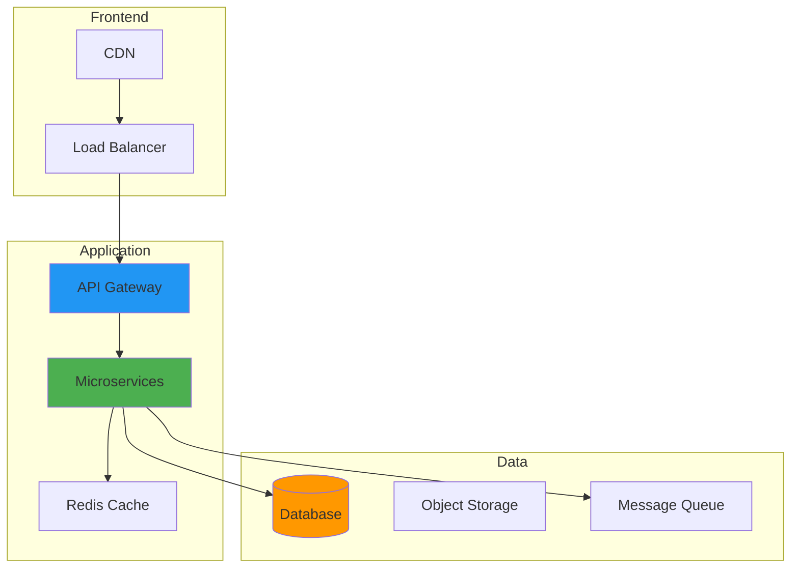

After spending another late night debugging a Kubernetes networking issue that had taken down our production service, I found myself questioning whether containers were the final evolution of application deployment or just another step along the way.

Containers had solved many problems—dependency hell, environment consistency, resource utilization—but they'd also introduced new complexities that sometimes felt heavier than the problems they solved. That sleepless night sparked my exploration into what might come after the container revolution.

## How It Works

## The Container Revolution: Success and Its Discontents

Containers transformed software deployment in ways that seemed impossible just a decade ago:

**Consistency Across Environments:** "It works on my machine" became a relic when applications carried their entire runtime environment with them.

**Resource Efficiency:** Sharing OS kernels while maintaining isolation dramatically improved density compared to virtual machines.

**Microservices Enablement:** Containers made decomposing monolithic applications into services practical and manageable.

**DevOps Integration:** Container images became the perfect artifact for CI/CD pipelines, bridging development and operations.

But years of production experience also revealed the challenges:

**Orchestration Complexity:** Kubernetes, while powerful, introduced operational complexity that many organizations struggled to manage effectively.

**Security Concerns:** Container escape vulnerabilities, image supply chain attacks, and privilege escalation issues created new attack vectors.

**Performance Overhead:** While efficient, containers still introduced layers of abstraction that impacted performance-sensitive applications.

**State Management:** Persistent data and stateful applications remained challenging to manage in containerized environments.

## Serverless: The Promise of Zero Infrastructure Management

My first serious exploration beyond containers led to serverless computing:

### Functions as a Service (FaaS)

AWS Lambda, Azure Functions, and Google Cloud Functions promised to eliminate infrastructure management entirely:

**Event-Driven Scaling:** Functions automatically scaled from zero to thousands of concurrent executions based on demand.

**Pay-Per-Use:** Billing based on actual execution time rather than provisioned capacity.

**Reduced Operational Overhead:** No servers, containers, or orchestration platforms to manage.

**Built-in Resilience:** Cloud providers handled availability, fault tolerance, and geographic distribution.

### The Serverless Reality Check

However, production serverless deployments revealed limitations:

**Cold Start Latency:** Functions starting from zero could introduce significant response delays for user-facing applications.

**Execution Constraints:** Time limits, memory restrictions, and stateless execution models constrained application architectures.

**Vendor Lock-in:** Deep integration with cloud provider services made migration between platforms challenging.

**Debugging Complexity:** Distributed, ephemeral execution made troubleshooting more difficult than traditional deployments.

**Cost Surprises:** While economical for sporadic workloads, high-frequency functions could become expensive quickly.

## WebAssembly: The Universal Runtime

WebAssembly (WASM) emerged as one of the most intriguing post-container technologies:

### The WASM Promise

**Language Agnostic:** Applications written in multiple programming languages could compile to the same runtime target.

**Near-Native Performance:** WASM execution approached native code performance while maintaining sandboxed security.

**Universal Deployment:** The same WASM module could run in browsers, on servers, and at the edge without modification.

**Minimal Overhead:** WASM modules were typically smaller and faster to start than comparable container images.

### Real-World WASM Experimentation

Experimenting with WASM for server-side applications revealed both potential and limitations:

**Performance Benefits:** CPU-intensive workloads often performed better in WASM than in containerized environments.

**Security Model:** WASM's sandboxing provided strong isolation without the complexity of container security frameworks.

**Ecosystem Gaps:** Limited library support and tooling compared to mature container ecosystems.

**Integration Challenges:** Connecting WASM modules with databases, file systems, and network resources required careful design.

## Unikernels: Specialized Single-Purpose Systems

Unikernels represented another fascinating direction in application deployment:

### The Unikernel Vision

**Application-Specific OS:** Each application compiled with only the OS components it actually needed.

**Minimal Attack Surface:** Removing unused OS functionality reduced security vulnerabilities.

**Fast Boot Times:** Specialized systems could start in milliseconds rather than seconds.

**Efficient Resource Usage:** Eliminating OS overhead maximized application performance.

### Unikernel Experimentation

Testing unikernel deployments provided insights into their potential and challenges:

**Performance Advantages:** Compute-intensive applications often performed better without general-purpose OS overhead.

**Operational Simplicity:** Single-purpose images simplified deployment and management.

**Development Complexity:** Building and debugging unikernels required specialized expertise and tooling.

**Ecosystem Limitations:** Limited support for complex applications requiring diverse OS services.

## Edge Computing: Bringing Applications Closer

Edge computing emerged as both a deployment target and a driver for new application architectures:

### Edge Deployment Requirements

**Resource Constraints:** Edge locations often had limited CPU, memory, and storage compared to data centers.

**Intermittent Connectivity:** Applications needed to function with unreliable or high-latency connections to central systems.

**Rapid Deployment:** Edge applications required fast startup times and efficient resource utilization.

**Remote Management:** Updates and monitoring had to work across distributed, potentially inaccessible locations.

### Edge-Optimized Technologies

Different deployment technologies showed varying suitability for edge environments:

**Lightweight Containers:** Minimal container images with reduced overhead performed well in resource-constrained environments.

**WASM at the Edge:** WebAssembly's fast startup and small footprint made it attractive for edge deployments.

**Static Binaries:** Self-contained executables eliminated runtime dependencies and simplified deployment.

**Progressive Web Apps:** Browser-based applications could leverage local storage and offline capabilities.

## GitOps and Infrastructure as Code Evolution

Deployment technologies evolved alongside the processes for managing them:

### Advanced GitOps Patterns

**Application Composition:** Tools like Flux and ArgoCD enabled sophisticated multi-component application deployments.

**Progressive Delivery:** Automated canary deployments, blue-green switches, and feature flag integration.

**Policy as Code:** Declarative security, compliance, and governance policies managed through version control.

**Environment Promotion:** Systematic advancement of applications through development, staging, and production environments.

### Infrastructure Abstraction

**Higher-Level Abstractions:** Tools like Pulumi and CDK allowed infrastructure definition in general-purpose programming languages.

**Component Libraries:** Reusable infrastructure components simplified complex system deployments.

**Cross-Cloud Portability:** Abstractions that worked across different cloud providers and on-premises environments.

**Self-Service Platforms:** Internal platforms that enabled developers to deploy applications without deep infrastructure knowledge.

## Machine Learning and AI Deployment

AI applications introduced new deployment requirements and patterns:

### Model Serving Challenges

**Resource Requirements:** Large language models and deep learning systems needed significant GPU and memory resources.

**Dynamic Scaling:** AI inference workloads had unpredictable usage patterns requiring flexible scaling.

**Model Versioning:** Managing multiple model versions and performing A/B testing required sophisticated deployment pipelines.

**Real-Time Inference:** Low-latency applications demanded optimized serving infrastructure.

### Specialized AI Deployment Platforms

**MLOps Tools:** Platforms like Kubeflow, MLflow, and Sagemaker provided specialized AI deployment capabilities.

**Model Optimization:** Techniques like quantization, pruning, and distillation optimized models for deployment constraints.

**Edge AI:** Running AI models on mobile devices and IoT systems required new deployment strategies.

**Federated Learning:** Distributed training and inference across multiple devices without centralizing data.

## Security Evolution in Post-Container World

### Zero Trust Architecture

**Identity-Based Security:** Authentication and authorization for every network connection, regardless of location.

**Micro-Segmentation:** Fine-grained network isolation between application components.

**Continuous Verification:** Ongoing validation of security posture rather than one-time authentication.

**Policy Enforcement Points:** Distributed security controls that traveled with applications.

### Supply Chain Security

**Software Bill of Materials (SBOM):** Comprehensive tracking of all components in deployed applications.

**Provenance Tracking:** Verifiable records of how applications were built and deployed.

**Runtime Security:** Monitoring and protecting applications during execution rather than just at deployment time.

**Attestation Systems:** Cryptographic proof of application integrity and compliance.

## Environmental and Sustainability Considerations

The environmental impact of deployment technologies became increasingly important:

### Energy Efficiency

**Carbon-Aware Computing:** Scheduling workloads when and where renewable energy was available.

**Efficient Architectures:** Choosing deployment technologies based on energy consumption as well as performance.

**Resource Optimization:** Minimizing idle resources and maximizing utilization efficiency.

**Lifecycle Analysis:** Considering the full environmental impact of deployment technology choices.

### Sustainable Practices

**Green Cloud Regions:** Selecting deployment regions based on renewable energy availability.

**Workload Optimization:** Designing applications to minimize resource consumption.

**Hardware Efficiency:** Leveraging newer, more efficient hardware architectures when available.

**Measurement and Reporting:** Tracking and reporting on the environmental impact of deployment decisions.

## The Multi-Paradigm Future

Rather than a single successor to containers, the future appears to involve multiple deployment paradigms optimized for different use cases:

### Workload-Specific Optimization

**Batch Processing:** Serverless functions or specialized batch computing platforms.

**Real-Time Systems:** Unikernels or optimized container deployments for low-latency requirements.

**AI/ML Workloads:** Specialized platforms optimized for model training and inference.

**Edge Computing:** Lightweight deployments optimized for resource constraints and intermittent connectivity.

**Web Applications:** Progressive web apps or edge-optimized serverless functions.

### Technology Integration

**Hybrid Architectures:** Combining containers, serverless, and edge computing in single applications.

**Smart Orchestration:** Systems that automatically choose optimal deployment technologies based on workload characteristics.

**Abstraction Layers:** Platforms that hide deployment complexity while leveraging appropriate underlying technologies.

**Policy-Driven Deployment:** Automated technology selection based on performance, cost, and compliance requirements.

## Practical Recommendations for Organizations

### Assessment and Planning

**Workload Analysis:** Understanding the specific requirements and characteristics of different applications.

**Technology Evaluation:** Systematic assessment of new deployment technologies against current and future needs.

**Skill Development:** Investing in team capabilities for emerging deployment paradigms.

**Gradual Migration:** Implementing new deployment technologies for new workloads before migrating existing systems.

### Implementation Strategies

**Start Small:** Beginning with non-critical applications to gain experience and confidence.

**Measure Everything:** Tracking performance, cost, and operational metrics across deployment technologies.

**Build Abstractions:** Creating internal platforms that hide complexity while enabling innovation.

**Foster Experimentation:** Encouraging teams to explore new deployment approaches for appropriate use cases.

## Looking Forward: The Next Decade

The evolution beyond containers will likely be driven by several key trends:

### Technological Drivers

**Hardware Innovation:** New processor architectures, memory technologies, and networking capabilities.

**Security Requirements:** Increasing demands for zero-trust, privacy-preserving, and supply-chain-secure deployments.

**Environmental Concerns:** Growing focus on sustainable, energy-efficient computing.

**Edge Computing Growth:** Continued expansion of distributed computing to support IoT, autonomous systems, and real-time applications.

### Organizational Changes

**Developer Experience:** Increasing focus on simplifying deployment for application developers.

**Operational Efficiency:** Demand for deployment technologies that reduce operational overhead.

**Cost Optimization:** Pressure to optimize infrastructure costs while maintaining performance and reliability.

**Compliance and Governance:** Growing regulatory requirements for security, privacy, and audit ability.

## Personal Reflections on the Journey

Exploring the landscape beyond containers has been humbling and exciting. Each new technology revealed both tremendous potential and significant challenges. The lesson I've learned is that there's no universal solution—only tools optimized for different problems.

The Kubernetes complexity that drove my initial exploration taught me that sophistication isn't always progress. Sometimes the best solution is the simplest one that meets your actual requirements.

## Conclusion: Embracing the Multi-Paradigm Future

Containers won't disappear overnight, but they're unlikely to remain the dominant deployment paradigm forever. The future of application deployment will be characterized by diversity—different technologies optimized for different workloads, requirements, and constraints.

Success in this evolving landscape requires understanding the strengths and limitations of various deployment paradigms and choosing the right tool for each specific job. Organizations that embrace this multi-paradigm approach while building appropriate abstractions and automation will be best positioned for the future.

The late-night Kubernetes debugging session that started this exploration taught me that complexity often signals an opportunity for innovation. As we move beyond containers, the goal isn't just newer technology—it's better alignment between our deployment tools and our actual needs.

The future of application deployment will be more diverse, more specialized, and hopefully more focused on solving real problems rather than managing technological complexity. That's a future worth building toward.

### Further Reading:

- [WebAssembly System Interface (WASI)](https://wasi.dev/ - Standardizing WASM for system programming
- [Unikernel Systems](http://unikernel.org/ - Research and development in specialized OS
- [CNCF Landscape](https://landscape.cncf.io/) - Overview of cloud native technologies
- [Serverless Architecture Patterns](https://serverlessland.com/patterns) - AWS serverless application patterns