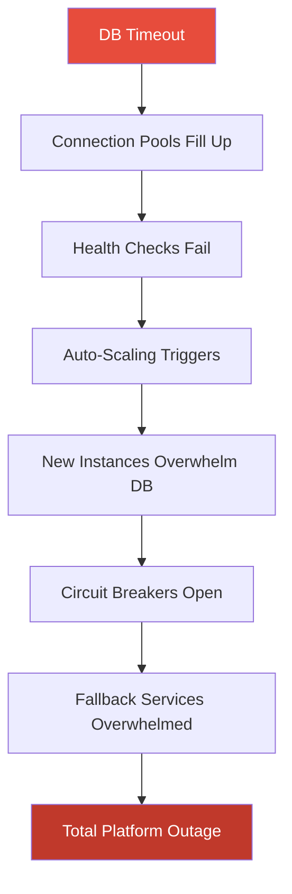

---

date: 2024-06-25
description: "The cascade failure that changed how I think about building systems that break gracefully."
title: Designing Resilient Systems — Lessons from Things Breaking
tags:
  - architecture
image: "https://images.unsplash.com/photo-1551288049-bebda4e38f71?w=1200&h=630"
imageAlt: "Data visualization dashboard with analytics"

---
## When "Bulletproof" Systems Fail Perfectly

Here's a scenario that plays out more often than anyone in this industry likes to admit: a single database connection timeout triggers a cascade failure that brings down an entire platform in three minutes.

On paper, the system had everything — load balancers, database replicas, circuit breakers, auto-scaling, comprehensive monitoring. And yet:

1. The primary database becomes unresponsive
2. Connection pools fill up as queries back up
3. Health checks start failing, triggering auto-scaling
4. New instances can't connect to the already-overwhelmed database
5. Circuit breakers open, but fallback services are also overwhelmed
6. Total platform outage

The postmortem revealed something uncomfortable: every safety mechanism *amplified* the original failure. Auto-scaling made it worse by piling more connections onto a dying database. Circuit breakers triggered, but their fallback services shared the same overwhelmed infrastructure. The "resilient" architecture had created a tightly-coupled system wearing a distributed costume.

This kind of incident fundamentally changes how you think about resilience. It's not about preventing failures — it's about failing gracefully.

## Graceful Degradation: The Pattern That Actually Works

The fix wasn't more redundancy. It was accepting that the system would break and designing for *how* it breaks.

The mental model shift: stop thinking about "uptime vs. downtime" and start thinking about a spectrum. A platform running at 60% capacity with some features disabled is vastly better than a platform showing error pages to every user. Your customers will tolerate slow. They won't tolerate gone.

Instead of all-or-nothing service, you define tiers:

- **Essential:** Authentication, basic transaction processing, critical data access — these must always work
- **Important:** Real-time notifications, advanced search, personalization — degraded under stress
- **Optional:** Analytics dashboards, recommendation engines, social features — disabled first

After implementing this, the next incident resulted in ~800ms response times (up from a normal 200ms) and reduced features, but the platform stayed up. That's the difference between a user waiting slightly longer and a user getting a 503.

## Circuit Breakers That Don't Make Things Worse

The original circuit breakers had a simple problem: they were binary. All traffic or no traffic. This is the software equivalent of a fuse that shuts off your entire house when you plug in a toaster.

Martin Fowler's circuit breaker pattern[5] defines three states (closed → open → half-open), but real resilience requires going further:

**Adaptive thresholds.** Static thresholds don't account for context. A 5% error rate during a product launch is normal. A 5% error rate at 3 AM means something is on fire. Circuit breakers should tighten under stress and relax during known high-load events.

**Partial traffic.** Instead of blocking everything, let a percentage through. Sample requests test whether the downstream service has recovered. Critical requests (payment processing) get priority over optional ones (analytics).

**Smart fallbacks.** When a service is down, serve cached responses for reads and queue writes for later processing. Stale data is almost always better than an error page.

**Recovery testing.** Don't just flip the circuit back to closed. Ramp traffic gradually. Monitor error rates during ramp-up. Auto-rollback if problems resurface. The worst thing you can do after an outage is slam 100% of backed-up traffic into a service that just recovered. You'll create the same cascade all over again.

## Chaos Engineering: Breaking Things On Purpose

Rather than waiting for production to surprise you, break things deliberately. Netflix pioneered this with Chaos Monkey[6], evolving into full-scale region failure testing.

This sounds counterintuitive until you try it. A simple experiment — injecting a 2-second delay into a payment service — revealed that an "independent" notification service started timing out. Nobody remembered the hidden synchronous dependency that connected them.

Chaos experiments consistently surface assumptions that are wrong under stress:

- Services assumed to be independent have hidden dependencies through shared caches or databases
- Timeouts that seem generous prove too short under realistic load
- Retry logic amplifies failures instead of mitigating them — a single failed request can cascade into 64 retries within 30 seconds
- Monitoring blind spots hide critical failure modes until production hits them

The best approach is to start in non-production environments. Run game days where the team responds to simulated incidents. Gradually increase the blast radius as confidence grows. Eventually, you get comfortable enough to run experiments in production — which is where the real surprises are.

One thing I've learned: the value of chaos engineering isn't just the bugs you find. It's the confidence you build. When your team has survived a dozen simulated outages, the real one at 2 AM is still stressful, but it's not *novel*. You've already practiced the response. That practiced calm is worth more than any monitoring dashboard.

## The Human Side

The best technical systems still need effective human response. A few things I've seen matter most:

**Blameless postmortems.** If people fear punishment, they'll hide information. PagerDuty's incident response guide[8] puts it well: "For every major incident, a blame-free, detailed description of exactly what went wrong is needed." Focus on what the system allowed to happen, not who made the mistake.

**Knowledge distribution.** If only one person understands a critical system, you have a single point of failure wearing a backpack. Pair programming, shadow on-call rotations, and documentation written for someone who's never seen the system all help. The goal is that any two team members can respond to any incident.

**Error budgets.** Google's SRE team[2] formalized this: perfect reliability isn't the goal, and chasing it has sharply diminishing returns. Define your SLO (say, 99.9% — about 43 minutes of downtime per month), and use the remaining budget for shipping features faster. When the budget runs low, slow down and fix reliability. When it's healthy, ship fast. This turns "reliability vs. velocity" from a culture war into a data-driven conversation.

## What Financial Markets Got Right

One cross-industry parallel worth noting: the SEC's market-wide circuit breakers[12] trigger automatic trading halts at 7%, 13%, and 20% declines. The logic is identical to software circuit breakers — pause activity, let information propagate, prevent panic-driven cascading. Financial stress testing (required by Dodd-Frank for large banks) is basically chaos engineering for money. These concepts didn't originate in software, and it's worth remembering that.

## What I Keep Coming Back To

Robust systems try to prevent failure. Resilient systems accept it as inevitable and design for it. The difference sounds philosophical, but it's deeply practical:

- **Decouple aggressively.** Asynchronous messaging, dedicated data stores per service, fallback mechanisms. A failure in one service should not be able to take down another. The cascade failure at the top happened because services that looked independent were sharing a database connection pool. That's tight coupling hiding behind a microservices diagram.
- **Monitor behavior, not just metrics.** CPU usage tells you what's happening. Distributed tracing tells you *why*. Request flows through components, decision points, state transitions — that's where you find the cascading failures before they cascade. I've seen teams stare at green dashboards while their users couldn't complete transactions, because the dashboards measured infrastructure health instead of user outcomes.
- **Test your recovery, not just your functionality.** Actually restore from backups. Actually fail over to the secondary region. Actually test what happens when your biggest dependency goes down. "It should work" is not a recovery plan. The number of teams I've seen discover their backup restore doesn't work *during an actual outage* is uncomfortable.

The cascade failure scenario I described at the top is painful, but instructive. Every safety mechanism — load balancers, auto-scaling, circuit breakers — was doing exactly what it was designed to do. The problem was that nobody had tested what happened when all of them activated at once. Resilience isn't any single pattern. It's the discipline of asking "what happens when this goes wrong?" at every design decision, and then actually testing the answer.

### References

1. [Error Budget Policy](https://sre.google/workbook/error-budget-policy/) — Google SRE Workbook (2018)
2. [Embracing Risk](https://sre.google/sre-book/embracing-risk/) — Google SRE (2016)
3. [Implementing SLOs](https://sre.google/workbook/implementing-slos/) — Google SRE Workbook (2018)
5. [Circuit Breaker](https://martinfowler.com/bliki/CircuitBreaker.html) — Martin Fowler (2014)
6. [Chaos Engineering Upgraded](https://netflixtechblog.com/chaos-engineering-upgraded-878d341f15fa) — Netflix (2016)
8. [PagerDuty Incident Response](https://response.pagerduty.com/) — PagerDuty (2024)
12. [Market-Wide Circuit Breakers](https://www.sec.gov/resources-for-investors/investor-alerts-bulletins/investoralertscircuitbreakershtm) — SEC (2024)
