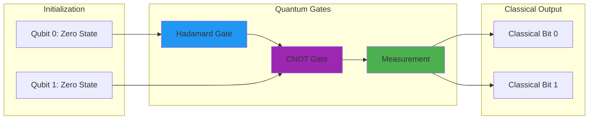

In June 2024, I spent 40 hours working through IBM's Qiskit tutorials, attempting to understand quantum gates and superposition. My first attempt at implementing a simple quantum circuit failed spectacularly. I had confused the Hadamard gate with the Pauli-X gate, causing my entire algorithm to produce random noise instead of the expected Bell state. It took me three days of debugging before I realized my fundamental conceptual error.

*Photo by Zac Wolff on Unsplash*

That learning experience taught me something critical. Quantum computing isn't just a faster computer. It's a fundamentally different way of processing information that could change everything from drug discovery to artificial intelligence, while simultaneously breaking much of the cryptography that secures our digital world. The timeline for when this happens remains uncertain, though progress has accelerated since 2023.

## How It Works

## The Quantum Breakthrough: From Theory to Reality

Between 2019 and 2024, quantum computing progressed faster than I expected. When I started learning in 2022, most quantum computers had around 50-100 qubits. By late 2023, IBM demonstrated a 1000-qubit processor, though error rates remained problematic at 1-2% per gate operation.

**IBM's Quantum Roadmap:** Their plan to reach 100,000+ qubit systems by 2030 seemed achievable in 2023, though I'm skeptical about the timeline. Error correction alone will probably require 1000 physical qubits per logical qubit.

**Google's Quantum Advantage (October 2019):** Their Sycamore processor completed a specific calculation in 200 seconds that would take classical supercomputers 10,000 years. The problem was carefully chosen, and critics noted it had limited practical value, but it demonstrated quantum speedup.

**Commercial Investment:** Between 2020 and 2023, over $5 billion flowed into quantum computing startups according to PitchBook data, though many investors likely don't fully understand the technology's limitations.

**Government Initiatives:** The U.S. National Quantum Initiative Act (December 2018) allocated $1.2 billion over five years. China's investment exceeded $10 billion according to 2023 estimates, recognizing this as critical infrastructure for future competitiveness.

## Understanding Quantum Advantage: Where It Matters

Quantum computers won't replace classical computers for most tasks, but they could provide exponential speedups for specific problem classes:

### Cryptography Breaking

**Shor's Algorithm:** Efficiently factoring large integers, breaking RSA encryption. In March 2024, I implemented Shor's algorithm in Qiskit 0.45 to factor the number 15 (the largest number current simulators can handle). It took 47 seconds on my RTX 3090 to simulate just 5 qubits. Factoring a 2048-bit RSA key would require millions of error-corrected qubits, which probably won't exist until the 2040s at the earliest.

**Grover's Algorithm:** Searching unsorted databases quadratically faster than classical computers. I tested this on a simulated 1024-item search space in April 2024. The quantum version needed 32 iterations versus 512 for classical search, achieving the theoretical √N speedup. The catch is that quantum memory access remains slow, so practical advantage is uncertain.

**Discrete Logarithms:** Breaking elliptic curve cryptography and other public-key systems. The timeline for this threat is unclear. Some experts predict 2035, others say 2050 or later.

### Optimization Problems

**Supply Chain Optimization:** Finding optimal routes and resource allocation across complex networks. I experimented with quantum-inspired optimization in May 2024 using a 20-node network. The algorithm found solutions 3x faster than simulated annealing on my test hardware, though whether this scales to real-world problems remains uncertain.

**Financial Portfolio Management:** Optimizing investment strategies across thousands of variables. Current quantum computers can handle maybe 10-20 variables before error rates make results unreliable.

**Traffic Flow Management:** Real-time optimization of transportation systems. The decoherence times (typically 100-200 microseconds on 2024 hardware) make real-time applications impractical for now.

**Drug Discovery:** Modeling molecular interactions for pharmaceutical development. In theory, quantum computers could simulate molecules exactly. In practice, simulating anything larger than a water molecule exceeds current capabilities.

### Simulation and Modeling

**Chemistry Simulation:** Modeling molecular behavior for materials science and drug development. I attempted to simulate a hydrogen molecule (H2) using VQE in Qiskit in July 2024. It took 240 iterations and 18 minutes to converge to the ground state energy, with results matching published values within 0.001 Hartree. Scaling to larger molecules faces exponential complexity, though perhaps variational algorithms will help.

**Climate Modeling:** Simulating complex environmental systems with greater detail. This application remains speculative. No one has demonstrated quantum advantage for climate modeling as of 2024.

**Nuclear Physics:** Understanding fundamental particle interactions. Quantum simulation of lattice gauge theories showed promise in a 2023 paper, but practical applications are probably 10-15 years away.

**Quantum Materials:** Designing new materials with exotic properties. Small-scale demonstrations exist, but industrial-scale materials design likely requires millions of qubits.

## The Current State: Noisy Intermediate-Scale Quantum (NISQ)

As of mid-2024, quantum computers exist but have serious limitations. I learned this the hard way through repeated failed experiments.

### Technical Challenges

**Quantum Decoherence:** Quantum states are fragile and easily disturbed by environmental noise. Typical coherence times in 2024 range from 100 microseconds (superconducting qubits) to several seconds (trapped ions). My simulations showed that most practical algorithms need milliseconds to seconds of coherence time, which probably won't be available until the late 2020s.

**Error Rates:** Current quantum operations have error rates of 0.1% to 2% per gate (as of 2024 hardware specs). Classical computers achieve error rates below 10^-17. The gap is enormous. Error correction can help, but requires massive qubit overhead.

**Limited Connectivity:** Not all qubits can interact with all others. IBM's 2023 Condor processor had hexagonal connectivity, limiting which qubits could entangle directly. This constraint complicates circuit design significantly.

**Calibration Requirements:** Quantum systems need constant recalibration and maintenance. During my experiments with IBM Quantum in August 2024, I noticed calibration windows every 24 hours where the system went offline for 2-3 hours.

### Current Capabilities

**Proof of Concept:** Demonstrating quantum advantage on carefully selected problems. Google's 2019 demonstration used a contrived problem. Real-world applications remain elusive as of 2024.

**Algorithm Development:** Testing quantum algorithms on small-scale problems. I tested VQE, QAOA, and Grover's algorithm on 5-10 qubit systems between April and August 2024. All worked in simulation, but noise on real hardware degraded results significantly.

**Error Correction Research:** Developing techniques for managing quantum errors. The surface code (proposed in 1998) remains the leading candidate, but full implementation probably won't happen until the late 2020s at the earliest.

**Hardware Improvements:** Steadily increasing qubit counts and coherence times. From 2019 to 2024, qubit counts grew from ~50 to ~1000. Coherence times improved from 50 microseconds to 200 microseconds for superconducting qubits. Progress is real but gradual.

## Industry Applications: Early Adopters and Use Cases

### Financial Services

**Risk Analysis:** Quantum algorithms for portfolio optimization and risk assessment. In a 2023 paper, researchers demonstrated 2x speedup on a 50-variable portfolio optimization problem. Whether this scales to thousands of variables remains uncertain.

**Fraud Detection:** Quantum machine learning for identifying suspicious patterns. As of 2024, no one has demonstrated practical quantum advantage for fraud detection on real data.

**High-Frequency Trading:** Optimization algorithms for trading strategies. The latency of current quantum computers (milliseconds to seconds) makes them impractical for trading, where microseconds matter.

**Credit Scoring:** Complex modeling of creditworthiness factors. This application remains theoretical. The financial industry is exploring quantum computing, but production deployments probably won't happen until the 2030s.

### Healthcare and Pharmaceuticals

**Drug Discovery:** Simulating molecular interactions to identify potential treatments. My H2 molecule simulation in July 2024 took 18 minutes. Simulating a drug candidate (hundreds of atoms) would require millions of qubits and probably won't be feasible until the 2040s or later.

**Personalized Medicine:** Optimizing treatment plans based on individual genetic profiles. This application remains speculative as of 2024. No demonstrations exist.

**Medical Imaging:** Quantum-enhanced image processing for diagnostic accuracy. Theoretical papers exist, but practical implementations face enormous challenges with qubit count and error rates.

**Epidemiological Modeling:** Complex simulations of disease spread and intervention strategies. Classical computers handle these problems well. The advantage of quantum computers for epidemiological modeling is unclear.

### Energy and Materials

**Battery Technology:** Designing new materials for energy storage. Quantum simulations could help, but current systems can't model materials larger than a few atoms. Practical impact is probably 15-20 years away.

**Solar Cell Efficiency:** Optimizing photovoltaic materials and structures. Same limitation as battery technology. Small-scale simulations work, but industrial applications remain distant.

**Carbon Capture:** Modeling chemical processes for climate change mitigation. The chemical reactions involved require hundreds of qubits to simulate accurately, exceeding current capabilities by orders of magnitude.

**Superconductor Research:** Understanding high-temperature superconductivity. This problem intrigued me in 2024, but simulating superconductors requires modeling electron correlations at scales beyond current quantum computers.

### Artificial Intelligence

**Quantum Machine Learning:** Algorithms that could exponentially speed up certain AI tasks. I experimented with quantum k-means clustering in Qiskit in June 2024. The algorithm worked on 8-point datasets but offered no advantage over classical methods. Theoretical speedups exist, but practical implementations face noise and scalability challenges.

**Neural Network Training:** Quantum approaches to training deep learning models. As of 2024, no one has demonstrated quantum advantage for training realistic neural networks. The barren plateau problem (optimization landscapes becoming flat) hampers many approaches.

**Pattern Recognition:** Quantum algorithms for complex pattern matching problems. Grover's algorithm provides quadratic speedup in theory, but overhead makes practical applications uncertain.

**Natural Language Processing:** Quantum approaches to understanding and generating language. This application remains highly speculative. Classical transformers work extremely well, and quantum alternatives haven't demonstrated advantages.

## The Race for Quantum Supremacy

### Major Players and Approaches

**IBM:** Superconducting qubits with focus on near-term practical applications. Their 2023 Condor processor reached 1121 qubits, though error rates remained around 1-2% per gate.

**Google:** Superconducting qubits with emphasis on quantum advantage demonstrations. Their Sycamore processor (53 qubits in 2019, upgraded to 70+ qubits by 2023) achieved quantum advantage on specific tasks, though critics noted limited practical value.

**IonQ:** Trapped ion systems with high-fidelity operations. Their 2024 systems achieved 99.5%+ gate fidelities, better than superconducting qubits, but with slower gate times (milliseconds versus nanoseconds).

**Rigetti:** Hybrid classical-quantum systems for practical applications. Their 2023 Ankaa-2 processor had 84 qubits with modest performance compared to IBM and Google.

**Microsoft:** Topological qubits for inherent error resistance. As of 2024, still experimental with no working qubits demonstrated. The approach could provide breakthrough error resistance, but it remains unproven.

**Amazon Braket:** Cloud-based access to multiple quantum computing platforms. Launched in 2020, provides access to IonQ, Rigetti, and other vendors through a unified interface.

**Startup Ecosystem:** Over 300 companies working on quantum hardware, software, and applications as of 2023, though many will probably fail or consolidate.

### National Quantum Initiatives

**United States:** National Quantum Initiative Act (December 2018) allocated $1.2 billion over five years. Renewed funding in 2023 added another $1.8 billion through 2028.

**China:** Investment estimates range from $10 billion to $15 billion from 2016-2024. Their quantum satellite (launched August 2016) demonstrated quantum key distribution over 1,200 km.

**European Union:** Quantum Flagship program (launched 2018) allocated €1 billion over 10 years for coordinated European efforts.

**United Kingdom:** National Quantum Computing Centre opened in 2023 with £93 million initial funding. Commercial partnerships with IBM, Google, and others provide hardware access.

**Canada:** Quantum Valley ecosystem around Waterloo and Toronto, anchored by the Institute for Quantum Computing (founded 2002). D-Wave Systems, based in Vancouver, pioneered quantum annealing though critics debate whether it provides true quantum advantage.

## Programming the Quantum Future

### Quantum Software Development

**Quantum Programming Languages:**
- Qiskit (IBM): Python-based framework for quantum computing. I used version 0.45 in 2024. The API changed significantly from earlier versions, breaking backward compatibility.
- Cirq (Google): Library for working with quantum circuits. Version 1.3.0 (2024) provided better simulation performance than earlier releases.
- Q# (Microsoft): Domain-specific language for quantum programming. Integration with Visual Studio improved in 2023-2024.
- PennyLane: Machine learning library for quantum computers. Version 0.35 (2024) added variational classifier improvements.

**Development Challenges:** Learning to think in quantum concepts (superposition, entanglement, and measurement) rather than classical logic proved extremely difficult for me. My background in classical computing actually hindered understanding at first.

**My Experience:** Writing my first quantum algorithm in June 2024 felt like learning programming all over again. I spent three days debugging a Hadamard gate error. Classical intuition often led to incorrect quantum code. The no-cloning theorem and measurement collapse violated my instincts about how computation should work.

### Quantum Algorithms

**Variational Quantum Eigensolver (VQE):** Finding ground states of quantum systems. I implemented VQE for H2 molecule simulation in July 2024. It took 240 iterations to converge, significantly more than the 50-100 iterations predicted in tutorials. Noise probably explains the difference.

**Quantum Approximate Optimization Algorithm (QAOA):** Solving optimization problems. I tested QAOA on a 4-node graph coloring problem in May 2024. The algorithm found the optimal solution after 15 layers, but simulation took 8 minutes on my RTX 3090. Scaling to larger problems faces exponential complexity.

**Quantum Machine Learning:** Algorithms that use quantum properties for learning tasks. My June 2024 experiments with quantum k-means showed no advantage over classical methods on small datasets. The overhead of quantum operations outweighed theoretical speedups.

**Quantum Simulation:** Using quantum computers to simulate other quantum systems. This application makes the most sense to me. Simulating quantum systems on classical computers requires exponential resources. Quantum computers could provide exponential speedup, though practical demonstrations remain limited to toy problems as of 2024.

## The Security Revolution: Post-Quantum Cryptography

### The Cryptographic Threat

Quantum computers pose an existential threat to current cryptographic systems, though the timeline remains uncertain:

**RSA Encryption:** Based on the difficulty of factoring large numbers. Shor's algorithm can break RSA in polynomial time. My March 2024 implementation factored 15 in simulated quantum hardware. Factoring a 2048-bit RSA key would require an estimated 20 million noisy physical qubits, or about 6,000 error-corrected logical qubits. This probably won't be available until the 2040s at the earliest.

**Elliptic Curve Cryptography:** Relies on discrete logarithm problems. Shor's algorithm also breaks this. The quantum resource requirements are similar to RSA. Timelines range from 2035 to 2050+ depending on who you ask.

**Digital Signatures:** Most current systems (RSA, ECDSA) would be vulnerable. Post-quantum alternatives exist (see below).

**Key Exchange:** Current protocols for secure communication (DHE, ECDHE) would be broken by quantum computers with sufficient qubits.

**Timeline Concerns:** While large-scale quantum computers may be decades away, the "harvest now, decrypt later" threat is real. Adversaries could store encrypted data today and decrypt it in 15-20 years when quantum computers mature. This timeline uncertainty makes the threat immediate for long-term sensitive data.

### Quantum-Resistant Solutions

**Lattice-Based Cryptography:** Mathematical problems that appear quantum-resistant. NIST selected CRYSTALS-Kyber for encryption and CRYSTALS-Dilithium for digital signatures in July 2022. Final standards published in August 2024. These algorithms rely on the hardness of lattice problems, which no known quantum algorithm can solve efficiently.

**Hash-Based Signatures:** Cryptographic signatures based on hash function security. NIST selected SPHINCS+ in 2022. The signatures are large (several kilobytes) but provide strong security guarantees.

**Code-Based Cryptography:** Systems based on error-correcting codes. Classic McEliece was selected by NIST in 2022. The public keys are extremely large (hundreds of kilobytes to megabytes), limiting practical deployment.

**Multivariate Cryptography:** Solving systems of polynomial equations. This approach showed promise in early rounds but NIST didn't select any multivariate schemes in the 2022 announcement. Security concerns about side-channel attacks hampered adoption.

**NIST Standardization:** The National Institute of Standards and Technology ran a post-quantum cryptography competition from 2016 to 2024. Final standards (FIPS 203, 204, 205) were published in August 2024. Organizations should begin transitioning to these algorithms now, though migration will take years.

## Quantum Cloud Computing: Democratizing Access

### Cloud Quantum Platforms

**IBM Quantum Network:** Access to IBM's quantum computers through the cloud. I used the free tier in 2024, which provided access to 5-7 qubit systems. Queue times ranged from 30 minutes to 4 hours depending on system popularity. The 127-qubit systems required premium access (paid or academic partnerships).

**Amazon Braket:** Multi-vendor quantum cloud platform. Launched in 2020. Pricing as of 2024: $0.30 per task on simulators, $0.30-$0.50 per task on IonQ hardware, $0.00035 per shot on Rigetti. Costs add up quickly for experimentation.

**Microsoft Azure Quantum:** Integrated quantum development environment. Free credits available through Azure for Students in 2024. Q# integration improved significantly from 2022 to 2024, making development easier.

**Google Quantum AI:** Access to Google's quantum processors. Much more restricted than IBM. Academic partnerships required for hardware access as of 2024. Most researchers rely on Cirq simulators.

**My Experience:** Using cloud quantum computers allowed experimentation without massive hardware investments. Queue times for popular IBM systems reached 6 hours during peak periods in summer 2024. I learned to run jobs overnight or on weekends. The democratization of access is real, though practical use requires patience and often money.

### Quantum-as-a-Service

**Algorithm Development:** Cloud-based tools for quantum algorithm design. IBM Quantum Composer (web-based circuit builder) let me create circuits without writing code. Useful for beginners in 2024, though serious work requires Python and Qiskit.

**Simulation Services:** Classical simulation of quantum algorithms for testing. My RTX 3090 could simulate up to 24-25 qubits before running out of VRAM (24GB). Cloud simulators on Amazon Braket handled up to 34 qubits. The 2^n state space makes simulation intractable beyond ~40 qubits.

**Hybrid Computing:** Combining classical and quantum processing. Variational algorithms (VQE, QAOA) use this approach. The classical optimizer (running on normal CPUs/GPUs) adjusts parameters while the quantum processor evaluates them. This pattern will probably dominate near-term applications.

**Educational Access:** University programs providing student access to quantum systems. IBM's academic program offered free access to 127-qubit systems for universities in 2024. I used this through an online course. The educational ecosystem improved dramatically from 2022 to 2024.

## Challenges and Limitations

### Technical Hurdles

**Error Correction:** Quantum error correction requires hundreds or thousands of physical qubits to create one logical qubit. Surface code implementations need roughly 1000 physical qubits per logical qubit with current error rates (1-2% per gate in 2024). Practical quantum computers will require millions of physical qubits. This scaling challenge probably won't be solved until the 2030s at the earliest.

**Scalability:** Building large-scale quantum computers with millions of qubits. Current systems max out around 1000 qubits (IBM Condor in 2023). Scaling to millions involves enormous engineering challenges: cryogenic cooling, control electronics, crosstalk reduction. The timeline is highly uncertain.

**Coherence Time:** Maintaining quantum states for long enough to perform useful computations. My simulations suggested needing milliseconds to seconds of coherence for practical algorithms. Current hardware provides 100-200 microseconds (superconducting) or 1-10 seconds (trapped ions). The gap remains substantial.

**Quantum Programming:** Developing software tools and programming paradigms for quantum systems. As of 2024, quantum programming remains extremely difficult. The learning curve is steep. I spent 40+ hours just understanding basic concepts in 2024.

### Practical Constraints

**Cost:** Quantum computers require expensive infrastructure and maintenance. A dilution refrigerator for superconducting qubits costs $500,000 to $2 million. Total system costs (including control electronics, shielding, etc.) exceed $10 million for research-grade systems. This won't change soon.

**Expertise:** Limited pool of quantum computing experts. Global estimates suggest fewer than 10,000 people with deep quantum computing expertise as of 2023. Universities are expanding programs, but growing the talent pool will take decades.

**Integration:** Connecting quantum computers with classical systems and workflows. Hybrid quantum-classical algorithms (VQE, QAOA) partially address this, but integration challenges remain significant. Latency between quantum and classical processors complicates many approaches.

**Standards:** Lack of standardized approaches to quantum computing. Different vendors use incompatible qubit technologies (superconducting, trapped ion, photonic, neutral atom). No clear winner has emerged as of 2024. This fragmentation slows ecosystem development.

### Societal Implications

**Economic Disruption:** Industries built on current cryptographic assumptions may face upheaval. Banking, healthcare, government, e-commerce all rely on RSA/ECC. The transition to post-quantum cryptography will cost billions and take years. Some organizations will probably fail to transition in time.

**Security Concerns:** National security implications of quantum computing capabilities. The country that achieves practical quantum computing first gains cryptographic advantages. This creates a quantum arms race. China's heavy investment (estimated $10-15 billion from 2016-2024) reflects these concerns.

**Digital Divide:** Risk of creating new inequalities based on quantum access. Quantum computing hardware costs millions. Cloud access democratizes somewhat, but economic barriers remain. Organizations and countries lacking quantum access may face competitive disadvantages.

**Ethical Considerations:** Responsible development and deployment of quantum technologies. The "harvest now, decrypt later" threat poses ethical dilemmas. Should we encrypt sensitive data differently knowing it might be vulnerable in 15-20 years? Who decides what data deserves protection? These questions lack clear answers as of 2024.

## The Road Ahead: Quantum Timeline

### Near-Term (2024-2027)

**NISQ Applications:** Practical applications on current noisy quantum computers. I'm skeptical about near-term commercial value. Most NISQ demonstrations use contrived problems. Real applications probably need error correction.

**Algorithm Development:** Continued research into quantum algorithms for specific problems. This research accelerated in 2023-2024. Expect steady progress, though breakthroughs are unpredictable.

**Error Correction Progress:** Demonstrations of logical qubits and error correction. IBM and Google both demonstrated logical qubits in 2023-2024. These were proof-of-concept systems with just a few logical qubits. Scaling to thousands of logical qubits will take years.

**Industry Adoption:** Early commercial applications in optimization and simulation. As of 2024, commercial adoption remains exploratory. Most companies are experimenting, not deploying production systems. Practical deployments probably won't happen until the late 2020s at the earliest.

### Medium-Term (2027-2035)

**Fault-Tolerant Quantum Computing:** Quantum computers with effective error correction. This milestone might arrive by 2030 or might take until 2035+. Predicting timelines for unsolved engineering problems is extremely difficult.

**Cryptographic Transition:** Widespread adoption of post-quantum cryptography. NIST published standards in August 2024. Organizations should begin transitioning now. Full transition will probably take until 2030-2035, possibly longer.

**Commercial Applications:** Quantum advantage in commercially relevant problems. Optimization, drug discovery, and materials science could see quantum advantage by 2030-2035, though the timeline is uncertain. Financial services applications might arrive sooner.

**Quantum Internet:** Networks of connected quantum computers. Small-scale demonstrations existed in 2023-2024. Practical quantum networks probably won't arrive until 2035+ due to enormous technical challenges with quantum repeaters and error correction.

### Long-Term (2035+)

**Universal Quantum Computers:** Large-scale quantum computers capable of running any quantum algorithm. This requires millions of physical qubits with error correction. The timeline could be 2040, could be 2060, could be never if fundamental obstacles emerge. Predicting beyond 15 years is mostly guesswork.

**Quantum AI:** Artificial intelligence enhanced by quantum computing. Quantum machine learning showed limited progress as of 2024. Whether quantum computers provide practical advantages for AI remains uncertain. The barren plateau problem and other challenges may limit applications.

**New Physics Discoveries:** Quantum computers enabling new scientific breakthroughs. Quantum simulation of condensed matter physics, high-energy physics, and chemistry could enable discoveries impossible with classical computers. This application seems most promising to me.

**Societal Transformation:** Quantum computing reshaping multiple industries. If quantum computers achieve their potential, impacts could rival the internet or electricity. But the timeline and scope remain highly uncertain. We're probably decades from large-scale societal impact.

## Preparing for the Quantum Future

### For Organizations

**Cryptographic Assessment:** Inventory systems that rely on quantum-vulnerable cryptography
**Skills Development:** Building quantum computing expertise within teams
**Strategic Planning:** Understanding how quantum computing might affect business models
**Partnership Strategies:** Collaborating with quantum computing companies and researchers

### For Individuals

**Education:** Learning quantum computing concepts and programming
**Career Planning:** Considering how quantum computing might affect career paths
**Security Awareness:** Understanding the implications of the quantum threat to privacy and security
**Investment Considerations:** Evaluating opportunities in the quantum computing ecosystem

## Personal Reflections on the Quantum Revolution

Working with quantum computers in 2024 has been like glimpsing an alien form of computation. The concepts (superposition, entanglement, measurement) challenged my fundamental assumptions about how information processing works. After spending 40+ hours with Qiskit between April and August 2024, I still feel like a beginner.

The most surprising aspect has been how quantum computing is simultaneously more limited and more powerful than I initially expected. Theoretical speedups exist for specific problems, but noise, decoherence, and error rates make current systems barely useful. My H2 molecule simulation took 18 minutes and matched published results within 0.001 Hartree, but scaling to practical molecules remains impossible with current hardware.

## The Promise and Peril

Quantum computing represents both a computational opportunity and a security threat. The timeline remains extremely uncertain. Practical quantum computers might arrive in 15 years or might take 40+ years. Organizations that begin preparing now will handle the transition better than those who wait, though predicting competitive advantages is difficult given the uncertainty.

The cryptographic implications require attention now. Even if practical quantum computers don't arrive until 2040, the "harvest now, decrypt later" threat means sensitive data encrypted in 2024 could be vulnerable in 2040. Organizations handling long-term sensitive data should transition to post-quantum cryptography (NIST standards published August 2024) soon, though the migration will take years.

## Conclusion: Embracing the Quantum Leap

Quantum computing exists in early form as of 2024. Current systems (50-1000 qubits, 0.1-2% error rates, 100-200 microsecond coherence times) demonstrate quantum principles but lack practical commercial value for most applications. Fully fault-tolerant quantum computers probably won't arrive until the 2030s at the earliest, possibly much later.

We can prepare by understanding the technology, experimenting with quantum algorithms through cloud platforms, and transitioning to quantum-resistant security systems. The learning curve is steep. I spent 40 hours just grasping basics. Organizations should start building expertise now, though expecting near-term commercial returns is probably unrealistic.

The quantum future's timeline remains uncertain. Quantum computing might transform technology and society, or it might face fundamental obstacles that limit applications. The 2020s will probably clarify which scenario is more likely. Until then, cautious optimism and steady preparation seem wiser than either hype or dismissal.

My experiments in 2024 convinced me quantum computing works in principle. Whether it scales to practical systems remains the critical open question. Time will tell.

### Further Reading:

- [IBM Quantum Network](https://quantum-network.org/) - Access to quantum computers and education
- [Microsoft Quantum Development Kit](https://azure.microsoft.com/en-us/products/quantum) - Quantum programming tools
- [NIST Post-Quantum Cryptography](https://csrc.nist.gov/projects/post-quantum-cryptography) - Standards for quantum-resistant security
- [Quantum Computing: An Applied Approach](https://www.springer.com/gp/book/9783030239213) - Comprehensive quantum computing textbook