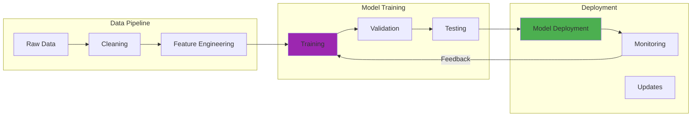

Years ago, when I first encountered supercomputing facilities, the sheer scale was overwhelming—massive rooms filled with interconnected nodes, humming with activity. The landscape of High-Performance Computing has changed dramatically since then, and what we're seeing today goes far beyond just faster processors.

The transformation I've witnessed in HPC isn't just about raw computational power anymore. It's about how these systems are becoming more intelligent, more sustainable, and surprisingly more accessible to organizations that could never afford their own supercomputers.

## How It Works



## AI and HPC: A Perfect Partnership

The most interesting development I've observed is how AI and HPC have become symbiotic partners rather than separate domains. This isn't just about using supercomputers to train large models—it's become much more sophisticated.

### Smart Resource Management

Modern HPC facilities now use AI to optimize themselves. I remember when job scheduling was a manual art form, with administrators constantly tweaking parameters. Now, AI systems analyze usage patterns and automatically optimize resource allocation:

```python
# Example of AI-guided adaptive mesh refinement
def adaptive_mesh_refinement(simulation_state, ml_predictor):
    # Analyze current simulation state
    regions_of_interest = ml_predictor.identify_critical_regions(simulation_state)
    
    # ... (additional implementation details)
    for region in non_critical_regions:
        coarsen_mesh(region)
```

What fascinates me is how this creates a feedback loop—the AI helps the HPC system run more efficiently, and the HPC system provides the computational power the AI needs to improve. It's like watching two technologies teach each other.

### Physics-Informed Neural Networks

One area where I've seen remarkable progress is in combining traditional physics simulations with neural networks. Instead of replacing physical models entirely, we're creating hybrid approaches that respect conservation laws while gaining the speed benefits of neural computation.

This approach particularly appeals to me because it represents the best of both worlds—the accuracy of physics-based modeling with the efficiency of machine learning.

## The Democratization Revolution

Perhaps the most significant change I've witnessed is the democratization of HPC through cloud services. Years ago, if you needed supercomputing power, you either had to be at a major research institution or have deep pockets. That barrier is largely gone now.

### Serverless Supercomputing

The concept of "serverless supercomputing" would have sounded like an oxymoron a few years back. Now, you can submit computational jobs without managing any infrastructure:

- Request specific resources (CPU cores, GPU hours, memory) for exactly the duration needed
- Access specialized accelerators including quantum processing units and neuromorphic chips
- Use domain-specific templates for pharmaceutical research, financial modeling, etc.

I find it remarkable that a startup can now access the same computational resources that were once exclusive to national laboratories, paying only for what they use.

## Sustainability: The New Constraint

Energy consumption has become the critical limiting factor in HPC scaling. When I first learned about exascale computing, the focus was purely on performance. Now, the conversation has shifted to performance per watt.

### Innovative Cooling Solutions

The cooling innovations I've seen recently are genuinely impressive:

- **Two-phase immersion cooling**: Components literally submerged in dielectric fluid that boils off to remove heat
- **Waste heat recovery**: Capturing thermal energy for facility heating or electricity generation
- **Weather-aware scheduling**: Timing workloads based on outside temperature and cooling efficiency

I remember visiting facilities where the cooling systems consumed nearly as much power as the computers themselves. The new approaches are achieving 25% energy reuse rates—that's a game-changer for operational costs.

### Power-Aware Programming

What's particularly interesting is how this sustainability focus is changing software development practices:

```python
# Power-aware computational kernel
def power_aware_matrix_multiply(A, B, power_constraint):
    operation_count = estimate_operations(A, B)
    
    # Determine optimal execution strategy based on power constraints
    if power_constraint < LOW_POWER_THRESHOLD:
        return low_power_algorithm(A, B)
    elif can_fit_in_cache(A, B):
        return cache_optimized_algorithm(A, B)
    else:
        blocks = determine_optimal_blocking(A, B, power_constraint)
        return blocked_algorithm(A, B, blocks)
```

The idea that algorithms should adapt their behavior based on available power budget represents a fundamental shift in how we think about computational efficiency.

## Domain-Specific Architectures

One trend I find particularly exciting is the move away from general-purpose supercomputers toward specialized systems designed for specific problem domains.

### Molecular Dynamics Accelerators

Purpose-built systems for drug discovery are achieving 50-100x better performance per watt compared to general-purpose processors. These systems embed physical constraints directly in hardware, ensuring simulations maintain physical realism while reducing computational requirements.

### AI-Specific HPC

The specialized AI systems I've encountered recently go well beyond just having more GPUs:
- Neuromorphic computing elements that mimic brain structure
- In-memory AI processing that eliminates data movement penalties
- Optical AI accelerators that perform matrix operations at the speed of light

## Quantum-Classical Hybrid Computing

The integration I've seen between quantum and classical HPC systems has been fascinating to watch unfold. Rather than quantum computers replacing classical ones, they're becoming specialized components within larger classical workflows.

```python
# Example of hybrid quantum-classical programming
def optimize_molecular_configuration(molecule, target_properties):
    classical_simulator = ClassicalMolecularSimulator()
    initial_configuration = classical_simulator.initialize_configuration(molecule)
    
    # ... (additional implementation details)
    
    return current_configuration
```

What I find most promising is how these hybrid approaches are making quantum computing practically useful today, even before we achieve fault-tolerant quantum computers.

## Real-World Impact

The applications I've seen emerge from these HPC advances are genuinely transformative:

- **Climate modeling**: We can now run global climate models at 1km resolution, providing local-scale predictions for adaptation planning
- **Materials discovery**: AI-enhanced HPC is accelerating materials discovery by 50x compared to traditional approaches
- **Digital twins**: High-fidelity simulations of entire industrial systems or urban environments for optimization and scenario planning

## Looking Ahead: The Path to Zettascale

As impressive as today's exascale systems are, the research community is already thinking about zettascale computing—1000x more powerful. But achieving this won't just be about scaling up current approaches.

The path forward requires:
- Revolutionary materials like new semiconductors and superconducting components
- Novel computing paradigms that integrate neuromorphic, quantum, and biological elements
- Algorithms that minimize data movement and maximize efficiency across heterogeneous systems

What excites me most is that this isn't just about building bigger machines—it's about creating entirely new ways to solve humanity's most complex problems, from climate change to disease research.

The HPC revolution isn't just changing how we compute; it's changing what we can discover and achieve. And we're still in the early stages of this transformation.

---

*For those interested in exploring HPC further, the [Top500 List](https://www.top500.org/ provides regular updates on the world's most powerful systems, while the [Exascale Computing Project](https://www.exascaleproject.org/) offers insights into the cutting-edge research driving these innovations.*