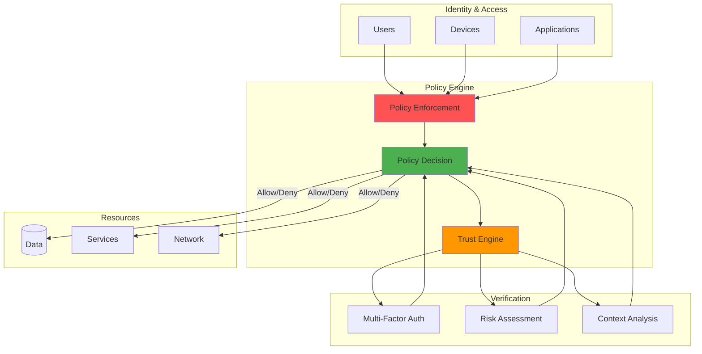
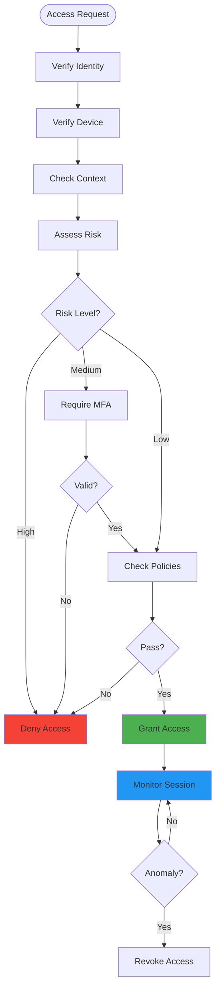

## BLUF: Zero Trust is Federal Law, Industry Standard

Federal agencies must adopt Zero Trust Architecture by 2024 under Executive Order 14028[1], and 63% of enterprises are following suit according to Forrester Research[2]. The shift from perimeter-based "castle-and-moat" security to identity-centric "never trust, always verify" isn't optional. It's a response to cloud computing, remote work, and sophisticated attacks that bypass traditional defenses. Here's the architecture, implementation strategy, and lessons learned from modernizing security for distributed systems.

Years ago, I remember when network security was simpler. If you were inside the corporate firewall, you were trusted. That castle-and-moat approach worked when employees sat at desks connected to company networks and applications lived in data centers behind clearly defined perimeters.


*Photo by Franck on Unsplash*

But that world is gone. The shift to cloud computing, remote work, and distributed systems has made the traditional perimeter meaningless. This is where Zero Trust architecture comes in, operating on the principle of "never trust, always verify."

I've seen organizations struggle with this transition, and I've learned that implementing Zero Trust isn't just about adopting new tools. It's about fundamentally rethinking how we approach security in software development.


## Zero Trust Architecture



### Architecture Components Explained

The Zero Trust Architecture diagram illustrates the policy-driven access control model:

**Identity & Access Layer:**
- Users, devices, and applications each have separate identity planes requiring distinct verification
- No implicit trust based on network location or previous authentication
- Continuous identity validation throughout session lifetime
- Multi-factor authentication as baseline requirement

**Policy Engine:**
- Policy Enforcement Points (PEP): Distributed gatekeepers at every resource boundary
- Policy Decision Points (PDP): Centralized authorization logic evaluating access requests
- Trust Engine: Risk scoring based on identity, device health, context, and behavioral analytics
- Sub-100ms decision latency required for production performance

**Verification Layer:**
- MFA methods: FIDO2, TOTP, biometric, hardware tokens, certificate-based
- Risk assessment: Real-time scoring using threat intelligence and user behavior analytics
- Context analysis: Location, device posture, time of day, peer group behavior
- Adaptive access: Dynamic privilege adjustment based on continuous risk calculation

**Resource Protection:**
- Data encryption at rest and in transit with key management
- Service segmentation with micro-perimeter boundaries
- Network micro-segmentation replacing flat trust zones
- All access decisions logged for compliance and forensic analysis

## Zero Trust Verification Flow



### Verification Flow Stages

The access request flow demonstrates continuous verification:

**Stage 1 - Identity Verification:**
- Multi-factor authentication (password + FIDO2 key, biometric, certificate)
- Session token issuance with short expiration (15-60 minutes)
- Device binding to prevent token theft across endpoints

**Stage 2 - Device Health Check:**
- Endpoint detection and response (EDR) status verification
- Operating system patch level and encryption status
- Compliance with device policies (firewall enabled, antivirus active)

**Stage 3 - Context Evaluation:**
- IP reputation scoring against threat intelligence feeds
- Geo-location anomaly detection (impossible travel scenarios)
- Time-of-day analysis (access outside normal working hours)

**Stage 4 - Risk Assessment:**
- Composite risk score from identity, device, context signals
- High risk: Deny access immediately, trigger security alert
- Medium risk: Require step-up authentication (additional MFA)
- Low risk: Proceed to policy evaluation

**Continuous Monitoring:**
- Session behavior analytics throughout access duration
- Anomaly detection triggers re-verification or revocation
- All decisions logged with full context for audit trail

## Beyond the Perimeter: Why Zero Trust Matters

The traditional model assumed threats existed outside the network. But years ago, I learned the hard way that some of the most damaging incidents come from inside the supposed "secure" perimeter. This includes compromised credentials, malicious insiders, or attackers who've already breached the outer defenses.

Zero Trust flips this assumption. NIST SP 800-207 defines three core principles with specific implementation requirements[3]:

### 1. Verify Explicitly

Authenticate and authorize based on all available data points. Specific requirements include:

- **Multi-factor authentication**: Something you know (password), have (FIDO2 key), are (biometric)
- **Device attestation**: TPM-based secure boot, hardware-backed key storage, EDR validation
- **Continuous validation**: Re-verify at every privilege boundary, not just at login
- **Contextual signals**: IP reputation, geo-location, time patterns, peer group behavior
- **Zero standing privileges**: Just-In-Time access provisioning with automatic expiration

### 2. Use Least Privilege Access

Limit user access with Just-In-Time and Just-Enough-Access. Key controls include:

- **Just-In-Time (JIT) access**: Temporary elevated privileges (1-8 hour windows)
- **Just-Enough-Access (JEA)**: Minimum permissions required for specific task
- **Time-bound credentials**: Auto-expiring tokens prevent credential reuse
- **Attribute-based access control (ABAC)**: Contextual permissions (role + location + time)
- **Network micro-segmentation**: Granular firewall zones limiting lateral movement

### 3. Assume Breach

Minimize blast radius and verify end-to-end encryption. Essential practices include:

- **Lateral movement prevention**: Segment networks so compromised endpoints can't pivot
- **Blast radius minimization**: Isolate failure domains (one service breach doesn't cascade)
- **Encryption everywhere**: Data at rest (AES-256), in transit (TLS 1.3), in use (homomorphic)
- **Behavioral analytics**: Machine learning detects anomalous access patterns
- **Automated incident response**: Rapid containment, session termination, account suspension

This shift makes security about identity and context rather than network location.

## Identity as the New Perimeter

In a Zero Trust world, identity becomes the primary security boundary. For developers, this means rethinking how authentication and authorization work:

**Identity Verification Methods:**
- **Password + MFA**: TOTP, SMS (weak), push notifications, FIDO2 hardware keys
- **Certificate-based**: Client certificates, smart cards, TPM-backed keys
- **Biometric**: Fingerprint, facial recognition, behavioral biometrics (typing patterns)
- **Federation**: SAML, OpenID Connect, OAuth 2.0 for enterprise SSO

**Session Management:**
- **Token-based**: JWT with short expiration (15-60 minutes) and refresh rotation
- **Continuous authentication**: Re-verify at privilege boundaries (admin actions, sensitive data)
- **Risk-based challenges**: Step-up authentication when behavior deviates from baseline
- **Device binding**: Tie sessions to specific endpoints, prevent token replay attacks

**Identity Provider Integration:**
- **Cloud providers**: Azure AD, AWS IAM Identity Center, Google Cloud Identity
- **Open source**: Keycloak, Ory, Authentik for self-hosted identity management
- **Passwordless**: FIDO2/WebAuthn, passkeys, certificate-based authentication
- **Federated access**: Cross-organization identity without credential sharing

```typescript
// Example of continuous validation middleware
const validateSession = async (req, res, next) => {
  const token = req.headers.authorization?.split(" ")[1];
  
  if (!token) {
    # ... (additional implementation details)
  }
};
```

What I find interesting about this approach is that it validates identity continuously rather than just at login. The system can detect changes in security posture and respond immediately.

## Microservices and Service-to-Service Security

Years ago, when I first worked with microservices, internal service communication often relied on network-level trust. If Service A could reach Service B on the internal network, it was allowed to communicate.

Zero Trust changes this completely. Every service interaction requires authentication and authorization:

**Mutual TLS (mTLS) Implementation:**
- **Certificate-based authentication**: Each service has cryptographic identity
- **Automatic certificate rotation**: Short-lived certificates (24-48 hours) minimize exposure
- **Private certificate authority**: Internal CA for service certificates (Vault, cert-manager)
- **Certificate validation**: Verify subject alternative names (SANs), check revocation lists

**Service Mesh Platforms:**
- **Istio**: Envoy-based sidecar proxies, automatic mTLS[6], policy enforcement
- **Linkerd**: Lightweight service mesh, minimal resource overhead, Rust-based proxies
- **Consul Connect**: HashiCorp's service mesh integrated with service discovery
- **AWS App Mesh**: Managed service mesh for EKS/ECS workloads
- **Traffic encryption**: 100% encrypted service-to-service communication without code changes
- **Observability**: Distributed tracing, service metrics, access logging built-in

**API Gateway Patterns:**
- **Centralized gateway**: Single entry point for authentication, rate limiting, WAF
- **Distributed gateways**: Per-service gateways for scalability and fault isolation
- **Authentication**: OAuth 2.0 token validation, API key management, certificate verification
- **Threat protection**: Rate limiting, DDoS mitigation, SQL injection prevention

**Service Identity Standards:**
- **SPIFFE/SPIRE**: Platform-agnostic workload identity[7] with automatic attestation
- **Kubernetes service accounts**: Native service identity with token projection
- **IAM roles**: Cloud provider service identities (AWS IAM roles, Azure managed identities)

```yaml
# Example Istio policy enforcing mTLS between services
apiVersion: security.istio.io/v1beta1
kind: PeerAuthentication
metadata:
  name: default
  namespace: prod
spec:
  mtls:
    mode: STRICT
```

This creates a web of trust where every component must prove its identity before communicating.

## Least Privilege in Practice

The principle of least privilege sounds straightforward, but applying it effectively requires careful design:

**Permission Models:**
- **RBAC (Role-Based)**: Group permissions by job function (developer, admin, auditor)
- **ABAC (Attribute-Based)**: Contextual access (user + resource + environment attributes)
- **ReBAC (Relationship-Based)**: Graph-based permissions (owner, collaborator, viewer)
- **PBAC (Policy-Based)**: Declarative rules engine (Open Policy Agent, Cedar)

**Just-In-Time (JIT) Access:**
- **On-demand elevation**: Request temporary admin privileges for specific task
- **Approval workflows**: Manager approval, peer review, or automated risk-based approval
- **Time-bound access**: Auto-expiring permissions (1 hour for prod access, 8 hours for troubleshooting)
- **Session recording**: Audit trail for all privileged actions with video playback

**Access Governance:**
- **Privilege analytics**: Identify unused permissions, over-privileged accounts
- **Quarterly access reviews**: Managers recertify team permissions, auto-revoke uncertified access
- **Breakglass procedures**: Emergency access with full audit trail and security team notification
- **Least privilege enforcement**: Start with zero permissions, grant only what's required

```java
// Fine-grained authorization in a Java application
@PreAuthorize("hasPermission(#documentId, 'Document', 'READ') and " +
              "authentication.details.ipAddress.startsWith('192.168.')")
public Document getDocument(String documentId) {
    return documentRepository.findById(documentId);
}
```

This example shows how authorization can consider multiple factors. Not just who is making the request, but what they're trying to access and where they're accessing it from.

## Continuous Verification and Monitoring

Traditional security often involved point-in-time decisions: authenticate once, then trust until the session expires. Zero Trust requires ongoing verification:

**User Behavior Analytics (UBA):**
- **Baseline establishment**: Learn normal patterns (login times, resources accessed, data volumes)
- **Anomaly detection**: Flag deviations (unusual login location, abnormal data exfiltration)
- **Machine learning models**: Supervised learning for known threats, unsupervised for novel attacks
- **Peer group analysis**: Compare behavior against colleagues with similar roles

**Risk Scoring:**
- **Composite scores**: Identity confidence + device health + context signals + behavior
- **Dynamic thresholds**: Adjust sensitivity based on resource criticality
- **Real-time calculation**: Re-score on every access request, not just at login
- **Automated responses**: Step-up authentication (medium risk), session termination (high risk)

**Threat Intelligence Integration:**
- **IOC feeds**: Indicators of compromise (malicious IPs, file hashes, domains) using Gartner's CARTA framework[8]
- **Reputation services**: IP reputation, domain age, TLS certificate validity
- **MITRE ATT&CK mapping**: Detect adversary techniques in behavior patterns
- **Feedback loops**: False positive tuning, model retraining with incident outcomes

```python
# Example of continuous behavior monitoring
def check_for_anomalous_behavior(user_id, action, resource):
    # Get user's historical behavior pattern
    user_pattern = get_user_behavior_pattern(user_id)
    
    # ... (additional implementation details)
    update_behavior_pattern(user_id, action, resource)
    return True
```

This approach creates a learning system that adapts to user behavior patterns and flags deviations that might indicate compromise.

## Securing the CI/CD Pipeline

One area where I've seen Zero Trust principles make a huge difference is in CI/CD security. Years ago, build systems often had broad access to production systems "because they needed to deploy."

Zero Trust approaches this differently:

**Pipeline Security Stages:**
- **Build isolation**: Each pipeline run in ephemeral container, no persistent state
- **Artifact signing**: Cryptographic signatures on every build artifact (Cosign, Notary)
- **Integrity verification**: Checksum validation, signature verification before deployment
- **Immutable artifacts**: Once built and signed, artifacts cannot be modified

**Secret Management:**
- **External secrets**: HashiCorp Vault, AWS Secrets Manager, Azure Key Vault integration
- **Dynamic credentials**: Temporary database passwords, cloud API tokens with auto-rotation
- **Least privilege deployment**: Service accounts with minimal permissions, time-bound tokens
- **Secret scanning**: Pre-commit hooks detect accidentally committed credentials

**Security Gates:**
- **SAST (Static Analysis)**: Code scanning for vulnerabilities before build
- **SCA (Software Composition Analysis)**: Dependency scanning for known CVEs
- **Container scanning**: Image vulnerability analysis (Trivy, Grype) blocks high-severity issues
- **Policy-as-code enforcement**: Open Policy Agent (OPA) policies[9] validate compliance before deployment

```yaml
# Example GitLab CI with security scanning and verification
stages:
  - build
  - test  
  - security
    # ... (additional implementation details)
  only:
    - main
```

Every artifact is signed and verified. Deployments use minimal permissions. Security scanning isn't optional. It's a gate that must pass.

## The Challenges I've Encountered

Implementing Zero Trust isn't without challenges. Google's BeyondCorp implementation reveals key enterprise lessons[10]. Here are the biggest ones I've faced:

### Performance Impact

Additional authentication and authorization checks add latency:

- **Latency sources**: Authentication (50-100ms), authorization (10-50ms), encryption overhead (5-15ms)
- **Caching strategies**: Token caching with short TTL, policy decision caching, session persistence
- **CDN integration**: Edge authentication (Cloudflare Workers, Lambda@Edge) for geo-distributed users
- **Hardware acceleration**: AES-NI instructions for encryption, TPM/HSM for cryptographic operations
- **Performance targets**: <100ms auth decision, <50ms token validation, <200ms mTLS handshake

### Developer Resistance

Developers often view security measures as obstacles to productivity:

- **Common objections**: "Security slows us down," "Too many authentication prompts," "Just give me admin"
- **Developer experience focus**: Transparent security, CLI tools, IDE plugins, automated workflows
- **Security champions program**: Empower developers as security advocates, provide training and resources
- **Integration over friction**: Build security into existing tools (kubectl plugins, CI/CD stages)
- **Cultural shift**: Position security as enabler of faster, safer deployments, not blocker (NSA guidance addresses this transformation[11])

### Legacy System Integration

Older systems often can't support modern authentication methods:

- **Integration patterns**: Reverse proxy (NGINX, Envoy), API gateway (Kong, Apigee), identity proxy
- **Protocol translation**: Legacy basic auth → modern OAuth 2.0, NTLM → SAML federation
- **Phased migration**: Prioritize by risk (high-value systems first), gradual rollout over months
- **Compensating controls**: Network segmentation, web application firewall, enhanced monitoring
- **Technical debt**: Sunset planning for systems that can't be modernized, budget for rewrites

## A Practical Implementation Strategy

Based on my experience, here's an effective approach aligned with CISA's Zero Trust Maturity Model[4]:

### 1. Assessment - Understand Current State

Map your application's data flows and identify your most sensitive data:

- **Data flow mapping**: Trace data from ingress to storage, identify trust boundaries and sensitive paths
- **Asset inventory**: Enumerate users, devices, applications, services, data stores with criticality ratings
- **Risk assessment**: Threat modeling sessions, vulnerability analysis following DISA's Reference Architecture[5], attack surface mapping

### 2. Identity Foundation - Strong Authentication

Build strong identity management for users, services, and devices:

- **Centralized identity provider**: Deploy enterprise IAM (Azure AD, Okta) or self-hosted (Keycloak)
- **MFA rollout**: Phased deployment (admins first, then all users), hardware key distribution
- **Service identity**: SPIFFE/SPIRE for workloads, service accounts for Kubernetes, IAM roles for cloud

### 3. Network Segmentation - Micro-Perimeters

Isolate services and create proper boundaries:

- **Micro-segmentation**: Firewall rules per service, network policies in Kubernetes
- **Service mesh deployment**: Istio sidecar injection, automatic mTLS between services
- **Zero Trust Network Access (ZTNA)**: Replace VPN with identity-based access (Cloudflare Access, Zscaler)

### 4. Data Protection - Encrypt Everything

Apply encryption and access controls for data at rest and in transit:

- **Encryption standards**: TLS 1.3 for transit, AES-256 for at-rest, hardware-backed key storage
- **Data classification**: Sensitivity labels (public, internal, confidential, restricted)
- **DLP integration**: Data loss prevention policies, exfiltration detection, sensitive data tagging

### 5. Monitoring - Comprehensive Visibility

Deploy comprehensive logging and threat detection:

- **Centralized logging**: Aggregate logs from all sources (applications, infrastructure, security tools)
- **SIEM integration**: Correlation rules for threat detection, automated incident workflows
- **Key metrics**: Authentication failures, policy denials, anomalous access, lateral movement attempts

### 6. Automation - Continuous Improvement

Create automated responses to security incidents:

- **Incident response playbooks**: Automated containment (account suspension, network isolation)
- **Infrastructure as code**: Terraform, Pulumi for policy enforcement, immutable infrastructure
- **Continuous optimization**: Feedback loops from incidents, metrics-driven policy tuning

The key is to approach this incrementally. You don't need to transform everything overnight.

## Why Zero Trust Matters More Than Ever

The shift to Zero Trust isn't just a security trend. It's a response to fundamental changes in how we build and deploy software. With applications spanning multiple clouds, remote teams, and increasingly sophisticated attacks, the old perimeter-based model fails in modern distributed environments.

What I find most compelling about Zero Trust is how it aligns security with modern development practices. Instead of being an afterthought, security becomes an integral part of how we design and build systems.

The investment in Zero Trust pays dividends beyond security. Applications built with these principles tend to be more resilient, better monitored, and easier to operate at scale.

Remember that Zero Trust is a journey, not a destination. Start with understanding your current security posture, identify the highest-impact improvements, and gradually add additional controls. The result will be applications that are not only more secure but also better prepared for whatever challenges come next.

---

## References

1. **[Executive Order 14028: Improving the Nation's Cybersecurity](https://www.whitehouse.gov/briefing-room/presidential-actions/2021/05/12/executive-order-on-improving-the-nations-cybersecurity/)** - White House, May 2021. Presidential mandate requiring federal agencies to advance toward Zero Trust Architecture, establishing 2024 implementation deadline and comprehensive security baseline requirements.

2. **[Forrester Research - Zero Trust eXtended (ZTX) Ecosystem](https://www.forrester.com/what-it-means/zero-trust-edge/)** - Forrester, 2023. Industry analysis showing 63% enterprise adoption rates and Zero Trust market trends.

3. **[NIST Special Publication 800-207: Zero Trust Architecture](https://csrc.nist.gov/publications/detail/sp/800-207/final)** - National Institute of Standards and Technology, August 2020. Authoritative technical specification defining Zero Trust principles, architecture components, and implementation patterns.

4. **[CISA Zero Trust Maturity Model](https://www.cisa.gov/zero-trust-maturity-model)** - Cybersecurity and Infrastructure Security Agency, 2023. Federal framework for implementing Zero Trust across five maturity levels with specific technical requirements and validation criteria.

5. **[DISA Zero Trust Reference Architecture](https://dl.dod.cyber.mil/wp-content/uploads/devsecops/pdf/DoD-Zero-Trust-Reference-Architecture.pdf)** - Defense Information Systems Agency, February 2021. Department of Defense technical architecture for Zero Trust implementation in classified and unclassified environments.

6. **[Istio Security Documentation](https://istio.io/latest/docs/concepts/security/)** - Istio Project, 2025. Official documentation for service mesh security including mutual TLS, authentication, and authorization patterns in Kubernetes environments.

7. **[SPIFFE/SPIRE Documentation](https://spiffe.io/docs/latest/spiffe-about/overview/)** - Cloud Native Computing Foundation. Workload identity framework for cryptographically verifiable service identities in dynamic infrastructure.

8. **[Gartner CARTA Framework](https://www.gartner.com/en/documents/3834704)** - Gartner Research, 2017. Continuous Adaptive Risk and Trust Assessment model for dynamic security posture evaluation.

9. **[Open Policy Agent (OPA) Documentation](https://www.openpolicyagent.org/docs/latest/)** - Cloud Native Computing Foundation. Policy as code framework for unified policy enforcement across cloud-native infrastructure.

10. **[Google BeyondCorp: A New Approach to Enterprise Security](https://cloud.google.com/beyondcorp)** - Google Cloud, 2014-present. Case study and technical implementation details from Google's pioneering Zero Trust deployment.

11. **[NSA Embracing Zero Trust Security Model](https://media.defense.gov/2021/Feb/25/2002588479/-1/-1/0/CSI_EMBRACING_ZT_SECURITY_MODEL_UOO115131-21.PDF)** - National Security Agency, February 2021. Guidance for implementing Zero Trust in environments facing advanced persistent threats and nation-state actors.

12. **[OWASP Application Security Verification Standard (ASVS)](https://owasp.org/www-project-application-security-verification-standard/)** - OWASP Foundation, 2024. Security verification requirements for modern applications supporting Zero Trust application layer controls.