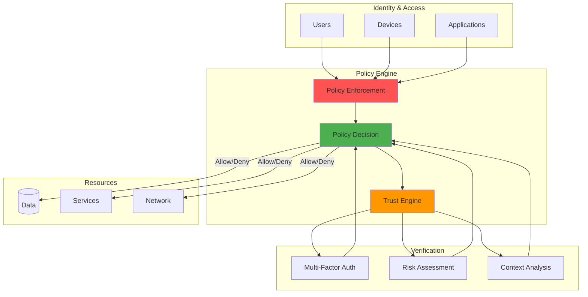

Years ago, I remember when network security felt simpler—if you were inside the corporate firewall, you were trusted. That castle-and-moat approach worked when employees sat at desks connected to company networks and applications lived in data centers behind clearly defined perimeters.


*Photo by Franck on Unsplash*

But that world is gone. The shift to cloud computing, remote work, and distributed systems has made the traditional perimeter meaningless. This is where Zero Trust architecture comes in, operating on the principle of "never trust, always verify."

I've seen organizations struggle with this transition, and I've learned that implementing Zero Trust isn't just about adopting new tools—it's about fundamentally rethinking how we approach security in software development.


## Zero Trust Architecture



## Zero Trust Verification Flow


## Beyond the Perimeter: Why Zero Trust Matters

The traditional model assumed threats existed outside the network. But years ago, I learned the hard way that some of the most damaging incidents come from inside the supposed "secure" perimeter—compromised credentials, malicious insiders, or attackers who've already breached the outer defenses.

Zero Trust flips this assumption. It operates on three core principles:

1. **Verify explicitly**: Authenticate and authorize based on all available data points
2. **Use least privilege access**: Limit user access with Just-In-Time and Just-Enough-Access  
3. **Assume breach**: Minimize blast radius and verify everything

This shift makes security about identity and context rather than network location.

## Identity as the New Perimeter

In a Zero Trust world, identity becomes the primary security boundary. For developers, this means rethinking how authentication and authorization work:

```typescript
// Example of continuous validation middleware
const validateSession = async (req, res, next) => {
  const token = req.headers.authorization?.split(" ")[1];
  
  if (!token) {
    # ... (additional implementation details)
  }
};
```

What I find interesting about this approach is that it validates identity continuously rather than just at login. The system can detect changes in security posture and respond immediately.

## Microservices and Service-to-Service Security

Years ago, when I first worked with microservices, internal service communication often relied on network-level trust. If Service A could reach Service B on the internal network, it was allowed to communicate.

Zero Trust changes this completely. Every service interaction requires authentication and authorization:

- **Mutual TLS (mTLS)**: Services authenticate to each other using certificates
- **Service meshes**: Platforms like Istio enforce security policies transparently
- **API gateways**: Central points for authentication and authorization decisions

```yaml
# Example Istio policy enforcing mTLS between services
apiVersion: security.istio.io/v1beta1
kind: PeerAuthentication
metadata:
  name: default
  namespace: prod
spec:
  mtls:
    mode: STRICT
```

This creates a web of trust where every component must prove its identity before communicating.

## Least Privilege in Practice

The principle of least privilege sounds straightforward, but implementing it effectively requires careful design:

```java
// Fine-grained authorization in a Java application
@PreAuthorize("hasPermission(#documentId, 'Document', 'READ') and " +
              "authentication.details.ipAddress.startsWith('192.168.')")
public Document getDocument(String documentId) {
    return documentRepository.findById(documentId);
}
```

This example shows how authorization can consider multiple factors—not just who is making the request, but what they're trying to access and where they're accessing it from.

## Continuous Verification and Monitoring

Traditional security often involved point-in-time decisions: authenticate once, then trust until the session expires. Zero Trust requires ongoing verification:

```python
# Example of continuous behavior monitoring
def check_for_anomalous_behavior(user_id, action, resource):
    # Get user's historical behavior pattern
    user_pattern = get_user_behavior_pattern(user_id)
    
    # ... (additional implementation details)
    update_behavior_pattern(user_id, action, resource)
    return True
```

This approach creates a learning system that adapts to user behavior patterns and flags deviations that might indicate compromise.

## Securing the CI/CD Pipeline

One area where I've seen Zero Trust principles make a huge difference is in CI/CD security. Years ago, build systems often had broad access to production systems "because they needed to deploy."

Zero Trust approaches this differently:

```yaml
# Example GitLab CI with security scanning and verification
stages:
  - build
  - test  
  - security
    # ... (additional implementation details)
  only:
    - main
```

Every artifact is signed and verified. Deployments use minimal permissions. Security scanning isn't optional—it's a gate that must pass.

## The Challenges I've Encountered

Implementing Zero Trust isn't without challenges. Here are the biggest ones I've faced:

### Performance Impact
Additional authentication and authorization checks add latency. The solution involves smart caching, optimized token validation, and using hardware security modules for cryptographic operations.

### Developer Resistance  
Developers sometimes see security measures as obstacles to productivity. I've found success by building security tooling that integrates seamlessly into existing workflows and providing clear explanations of why these measures matter.

### Legacy System Integration
Older systems often can't support modern authentication methods. API gateways or identity proxies can serve as bridges, adding Zero Trust principles to legacy applications without requiring complete rewrites.

## A Practical Implementation Strategy

Based on my experience, here's an effective approach to adopting Zero Trust:

1. **Assessment**: Map your application's data flows and identify your most sensitive data
2. **Identity foundation**: Implement strong identity management for users, services, and devices
3. **Network segmentation**: Isolate services and implement proper boundaries
4. **Data protection**: Apply encryption and access controls for data at rest and in transit
5. **Monitoring**: Implement comprehensive logging and threat detection
6. **Automation**: Create automated responses to security incidents

The key is to approach this incrementally. You don't need to transform everything overnight.

## Why Zero Trust Matters More Than Ever

The shift to Zero Trust isn't just a security trend—it's a response to fundamental changes in how we build and deploy software. With applications spanning multiple clouds, remote teams, and increasingly sophisticated attacks, the old perimeter-based model simply doesn't work.

What I find most compelling about Zero Trust is how it aligns security with modern development practices. Instead of being an afterthought, security becomes an integral part of how we design and build systems.

The investment in Zero Trust pays dividends beyond security. Applications built with these principles tend to be more resilient, better monitored, and easier to operate at scale.

Remember that Zero Trust is a journey, not a destination. Start with understanding your current security posture, identify the highest-impact improvements, and gradually implement additional controls. The result will be applications that are not only more secure but also better prepared for whatever challenges come next.

---

*For deeper exploration, I recommend the [NIST Special Publication 800-207 on Zero Trust Architecture](https://nvlpubs.nist.gov/nistpubs/SpecialPublications/NIST.SP.800-207.pdf and the [CISA Zero Trust Maturity Model](https://www.cisa.gov/zero-trust-maturity-model for practical implementation guidance.*