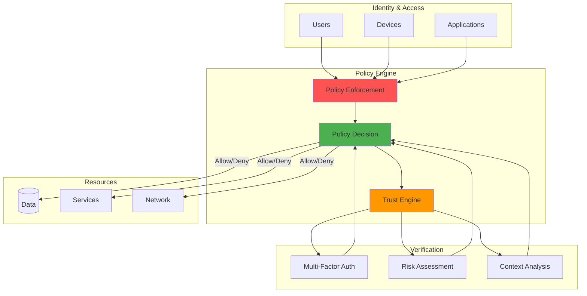

---

date: 2024-04-14
description: Deploy zero trust security with continuous verification and identity-centric controls—implement never-trust-always-verify for Federal EO 14028 compliance.
images:
  hero:
    alt: 'Implementing Zero Trust Security: Never Trust, Always Verify - Hero Image'
    caption: 'Visual representation of Implementing Zero Trust Security: Never Trust, Always Verify'
    height: 630
    src: /assets/images/blog/hero/2024-08-27-zero-trust-security-principles-hero.jpg
    width: 1200
  inline: []
  og:
    alt: 'Implementing Zero Trust Security: Never Trust, Always Verify - Social Media Preview'
    src: /assets/images/blog/hero/2024-08-27-zero-trust-security-principles-og.jpg
title: 'Implementing Zero Trust Security: Never Trust, Always Verify'
tags:
  - devops
  - programming
  - security

---
## BLUF

Federal agencies must adopt Zero Trust Architecture by 2024 under Executive Order 14028[1]. The shift from "castle-and-moat" perimeter security to "never trust, always verify" is mandatory. This guide covers architecture components, implementation strategy, and lessons learned from modernizing security for distributed systems.

**What you'll learn:**
- Zero Trust architecture (policy engine, verification flows, continuous monitoring)
- Identity-centric security model (authentication, authorization, least privilege)
- Service mesh security (mTLS, SPIFFE/SPIRE, API gateway patterns)
- CI/CD pipeline hardening (artifact signing, secret management, security gates)
- Implementation strategy (assessment, identity foundation, network segmentation)

**Why it matters:** 63% of enterprises are adopting Zero Trust[2]. Cloud computing, remote work, and sophisticated attacks have made perimeter-based security obsolete. The world where "inside the firewall = trusted" is gone.

**Perimeter security failed when:**
- Employees moved off corporate networks to remote work
- Applications migrated from data centers to multi-cloud
- Attackers learned to breach perimeters and move laterally

Zero Trust addresses this by verifying every access request, regardless of network location. Security becomes about identity and context, not network boundaries.


## Zero Trust Architecture

⚠️ **Warning:** This diagram illustrates security architecture concepts for educational purposes. Implementation should follow organizational security policies and include proper authorization controls.



### Architecture Components Explained

The Zero Trust Architecture diagram illustrates the policy-driven access control model:

**Identity & Access Layer:**
- Users, devices, and applications each have separate identity planes requiring distinct verification
- No implicit trust based on network location or previous authentication
- Continuous identity validation throughout session lifetime
- Multi-factor authentication as baseline requirement

**Policy Engine:**
- Policy Enforcement Points (PEP): Distributed gatekeepers at every resource boundary
- Policy Decision Points (PDP): Centralized authorization logic evaluating access requests
- Trust Engine: Risk scoring based on identity, device health, context, and behavioral analytics
- Sub-100ms decision latency required for production performance

**Verification Layer:**
- MFA methods: FIDO2, TOTP, biometric, hardware tokens, certificate-based
- Risk assessment: Real-time scoring using threat intelligence and user behavior analytics
- Context analysis: Location, device posture, time of day, peer group behavior
- Adaptive access: Dynamic privilege adjustment based on continuous risk calculation

**Resource Protection:**
- Data encryption at rest and in transit with key management
- Service segmentation with micro-perimeter boundaries
- Network micro-segmentation replacing flat trust zones
- All access decisions logged for compliance and forensic analysis

## Zero Trust Verification Flow


### Verification Flow Stages

The access request flow demonstrates continuous verification:

**Stage 1 - Identity Verification:**
- Multi-factor authentication (password + FIDO2 key, biometric, certificate)
- Session token issuance with short expiration (15-60 minutes)
- Device binding to prevent token theft across endpoints

**Stage 2 - Device Health Check:**
- Endpoint detection and response (EDR) status verification
- Operating system patch level and encryption status
- Compliance with device policies (firewall enabled, antivirus active)

**Stage 3 - Context Evaluation:**
- IP reputation scoring against threat intelligence feeds
- Geo-location anomaly detection (impossible travel scenarios)
- Time-of-day analysis (access outside normal working hours)

**Stage 4 - Risk Assessment:**
- Composite risk score from identity, device, context signals
- High risk: Deny access immediately, trigger security alert
- Medium risk: Require step-up authentication (additional MFA)
- Low risk: Proceed to policy evaluation

**Continuous Monitoring:**
- Session behavior analytics throughout access duration
- Anomaly detection triggers re-verification or revocation
- All decisions logged with full context for audit trail

## Beyond the Perimeter: Why Zero Trust Matters

Traditional perimeter security assumed threats existed outside the network. Reality proved otherwise: the most damaging incidents came from inside the "secure" perimeter through compromised credentials, malicious insiders, or attackers who breached outer defenses and moved laterally.

NIST SP 800-207 defines three core principles[3]:

### 1. Verify Explicitly

Authenticate and authorize using all available data:

- **Multi-factor authentication**: Password + FIDO2 key + biometric
- **Device attestation**: TPM-based secure boot, hardware-backed storage, EDR validation
- **Continuous validation**: Re-verify at every privilege boundary
- **Contextual signals**: IP reputation, geo-location, time patterns, peer behavior
- **Zero standing privileges**: Just-In-Time access with automatic expiration

### 2. Use Least Privilege Access

Limit user access with Just-In-Time and Just-Enough-Access:

- **Just-In-Time (JIT)**: Temporary elevated privileges (1-8 hour windows)
- **Just-Enough-Access (JEA)**: Minimum permissions for specific task
- **Time-bound credentials**: Auto-expiring tokens prevent reuse
- **Attribute-based control (ABAC)**: Role + location + time context
- **Micro-segmentation**: Granular firewall zones limit lateral movement

### 3. Assume Breach

Minimize blast radius with end-to-end encryption:

- **Lateral movement prevention**: Segment networks to block pivot attacks
- **Blast radius minimization**: Isolate failure domains to prevent cascade
- **Encryption everywhere**: At-rest (AES-256), in-transit (TLS 1.3), in-use
- **Behavioral analytics**: Machine learning detects anomalous patterns
- **Automated response**: Rapid containment, session termination, suspension

Security becomes about identity and context, not network location.

## Identity as the New Perimeter

Identity replaces network location as the primary security boundary:

**Verification methods:**
- **Password + MFA**: TOTP, FIDO2 hardware keys, push notifications
- **Certificate-based**: Client certificates, smart cards, TPM-backed keys
- **Biometric**: Fingerprint, facial recognition, typing patterns
- **Federation**: SAML, OpenID Connect, OAuth 2.0 for enterprise SSO

**Session management:**
- **Token-based**: JWT with 15-60 minute expiration and refresh rotation
- **Continuous authentication**: Re-verify at privilege boundaries
- **Risk-based challenges**: Step-up authentication on behavior deviation
- **Device binding**: Tie sessions to endpoints, prevent token replay

**Identity provider integration:**
- **Cloud**: Azure AD, AWS IAM Identity Center, Google Cloud Identity
- **Open source**: Keycloak, Ory, Authentik
- **Passwordless**: FIDO2/WebAuthn, passkeys, certificates
- **Federated**: Cross-organization identity without credential sharing

**Pseudocode - Simplified Validation Middleware:**
```typescript
// Example of continuous validation middleware
const validateSession = async (req, res, next) => {
  const token = req.headers.authorization?.split(" ")[1];

  if (!token) {
    return res.status(401).json({ error: "No token" });
  }
};
```

This approach validates identity continuously, not just at login. The system detects security posture changes and responds immediately.

## Microservices and Service-to-Service Security

Traditional microservices relied on network-level trust: if Service A could reach Service B on the internal network, communication was allowed.

[Zero Trust](/posts/2024-07-09-zero-trust-architecture-implementation) requires authentication and authorization for every service interaction:

**Mutual TLS (mTLS):**
- Certificate-based authentication for each service
- Automatic rotation with 24-48 hour lifetimes
- Private CA for service certificates (Vault, cert-manager)
- Subject alternative name (SAN) verification and revocation checks

**Service mesh platforms:**
- **Istio**: Envoy sidecars, automatic mTLS[6], policy enforcement
- **Linkerd**: Lightweight mesh, minimal overhead, Rust-based
- **Consul Connect**: Service discovery integration
- **AWS App Mesh**: Managed mesh for EKS/ECS
- **Benefits**: 100% encrypted traffic, distributed tracing, metrics

**API gateway patterns:**
- **Centralized**: Single entry point for auth, rate limiting, WAF
- **Distributed**: Per-service gateways for scalability, fault isolation
- **Authentication**: OAuth 2.0, API keys, certificate verification
- **Protection**: Rate limiting, DDoS mitigation, injection prevention

**Service identity standards:**
- **SPIFFE/SPIRE**: Platform-agnostic workload identity[7]
- **Kubernetes**: Service accounts with token projection
- **Cloud IAM**: AWS roles, Azure managed identities

```yaml
# Example Istio policy enforcing mTLS between services
apiVersion: security.istio.io/v1beta1
kind: PeerAuthentication
metadata:
  name: default
  namespace: prod
spec:
  mtls:
    mode: STRICT
```

Every component must prove identity before communicating.

## Least Privilege in Practice

Implementing least privilege requires careful design:

**Permission models:**
- **RBAC**: Job function permissions (developer, admin, auditor)
- **ABAC**: Contextual access (user + resource + environment)
- **ReBAC**: Graph-based permissions (owner, collaborator, viewer)
- **PBAC**: Declarative rules ([Open Policy Agent](/posts/2024-01-08-writing-secure-code-developers-guide), Cedar)

**Just-In-Time (JIT) access:**
- On-demand elevation for specific tasks
- Approval workflows (manager, peer, automated)
- Time-bound permissions (1-8 hours)
- Session recording for privileged actions

**Access governance:**
- Privilege analytics: Identify unused permissions, over-privileged accounts
- Quarterly reviews: Manager recertification, auto-revoke uncertified
- Breakglass: Emergency access with audit trail
- Zero-default: Grant only required permissions

```java
// Fine-grained authorization in a Java application
@PreAuthorize("hasPermission(#documentId, 'Document', 'READ') and " +
              "authentication.details.ipAddress.startsWith('192.168.')")
public Document getDocument(String documentId) {
    return documentRepository.findById(documentId);
}
```

Authorization considers multiple factors: identity, resource, and network location.

## Continuous Verification and Monitoring

Traditional security authenticated once, then trusted until session expiration. Zero Trust requires ongoing verification:

**User Behavior Analytics (UBA):**
- Baseline establishment: Learn normal login times, resources, data volumes
- Anomaly detection: Flag unusual locations, abnormal exfiltration
- Machine learning: Supervised for known threats, unsupervised for novel
- Peer analysis: Compare against colleagues with similar roles

**Risk scoring:**
- Composite: Identity + device health + context + behavior
- Dynamic thresholds: Adjust sensitivity by resource criticality
- Real-time: Re-score on every access request
- Automated response: Step-up auth (medium risk), termination (high risk)

**Threat intelligence:**
- IOC feeds: Malicious IPs, file hashes, domains (CARTA framework[8])
- Reputation: IP reputation, domain age, certificate validity
- MITRE ATT&CK: Map adversary techniques in behavior
- Feedback: False positive tuning, model retraining

⚠️ **Warning:** This code demonstrates security monitoring concepts for educational purposes. Implement behavioral monitoring with proper privacy controls and compliance with organizational policies.

**Pseudocode - Simplified Behavior Monitoring:**
```python
# Example of continuous behavior monitoring
def check_for_anomalous_behavior(user_id, action, resource):
    # Get user's historical behavior pattern
    user_pattern = get_user_behavior_pattern(user_id)

    # Check if action matches normal pattern
    update_behavior_pattern(user_id, action, resource)
    return True
```

The system adapts to user behavior patterns and flags deviations indicating compromise.

## Securing the CI/CD Pipeline

Traditional build systems had broad production access "because they needed to deploy." Zero Trust requires different patterns:

**Pipeline security:**
- Build isolation: Ephemeral containers, no persistent state
- Artifact signing: Cryptographic signatures (Cosign, Notary)
- Integrity verification: Checksum and signature validation
- Immutable artifacts: No modification after signing

**Secret management:**
- External secrets: Vault, AWS Secrets Manager, Azure Key Vault
- Dynamic credentials: Temporary passwords, auto-rotating tokens
- Least privilege: Minimal service account permissions
- Secret scanning: Pre-commit detection of committed credentials

**Security gates:**
- SAST: Code scanning before build
- SCA: Dependency scanning for CVEs
- Container scanning: Trivy/Grype block high-severity issues
- Policy-as-code: OPA policies[9] validate compliance

**Pseudocode - Simplified CI/CD Security Pipeline:**
```yaml
# Example GitLab CI with security scanning and verification
stages:
  - build
  - test
  - security
  - deploy
only:
  - main
```

Every artifact is signed and verified. Deployments use minimal permissions. Security scanning is a gate that must pass.

## Implementation Challenges

Google's BeyondCorp reveals key enterprise lessons[10]. Common challenges:

### Performance Impact

Authentication and authorization checks add latency:

- Latency sources: Auth (50-100ms), authz (10-50ms), encryption (5-15ms)
- Caching: Token caching, policy decisions, session persistence
- CDN: Edge auth (Cloudflare Workers, Lambda@Edge)
- Hardware acceleration: AES-NI, TPM/HSM
- Targets: <100ms auth, <50ms token validation, <200ms mTLS

### Developer Resistance

Common objections require cultural shift:

- Objections: "Security slows us down," "Too many prompts," "Give me admin"
- Developer experience: Transparent security, CLI tools, IDE plugins
- Security champions: Developer advocates, training, resources
- Integration: Build into existing tools (kubectl plugins, CI/CD)
- Cultural shift: Security enables faster, safer deployments (NSA guidance[11])

### Legacy System Integration

Older systems lack modern authentication support:

- Patterns: Reverse proxy (NGINX, Envoy), API gateway, identity proxy
- Translation: Basic auth → OAuth 2.0, NTLM → SAML
- Phased migration: Prioritize by risk, gradual rollout
- Compensating controls: Network segmentation, WAF, monitoring
- Technical debt: Sunset planning, rewrite budget

## Implementation Strategy

CISA's Zero Trust Maturity Model[4] provides a structured approach:

### 1. Assessment

Map data flows and identify sensitive assets:

- Data flow mapping: Trace ingress to storage, identify trust boundaries
- Asset inventory: Users, devices, applications, services with criticality
- Risk assessment: Threat modeling, DISA Reference Architecture[5], attack surface

### 2. Identity Foundation

Build strong identity management:

- Centralized IdP: Azure AD, Okta, or Keycloak
- MFA rollout: Phased (admins first, then all users)
- Service identity: SPIFFE/SPIRE, Kubernetes accounts, cloud IAM roles

### 3. Network Segmentation

Isolate services with micro-perimeters:

- Micro-segmentation: Per-service firewall rules, Kubernetes policies
- Service mesh: Istio sidecar injection, automatic mTLS
- ZTNA: Replace VPN with identity-based access (Cloudflare, Zscaler)

### 4. Data Protection

Encrypt data at rest and in transit:

- Standards: TLS 1.3 (transit), AES-256 (at-rest), hardware key storage
- Classification: Public, internal, confidential, restricted labels
- DLP: Prevention policies, exfiltration detection, data tagging

### 5. Monitoring

Deploy comprehensive logging and threat detection:

- Centralized logging: Aggregate from all sources
- SIEM: Correlation rules, automated incident workflows
- Key metrics: Auth failures, policy denials, anomalous access, lateral movement

### 6. Automation

Create automated incident response:

- Playbooks: Account suspension, network isolation
- Infrastructure as code: Terraform, Pulumi for policy enforcement
- Optimization: Feedback loops, metrics-driven tuning

Approach this incrementally. Transform gradually, not overnight.

## Why Zero Trust Matters

Zero Trust responds to fundamental changes in software deployment:

**Perimeter security fails with:**
- Multi-cloud applications spanning providers
- Remote teams working from anywhere
- Sophisticated attacks bypassing traditional defenses

**Zero Trust benefits:**
- Security aligns with modern development practices
- Applications become more resilient and observable
- Easier operation at scale with comprehensive monitoring

Zero Trust is a journey. Start with current posture assessment, identify high-impact improvements, and add controls gradually. The result: applications that are more secure and better prepared for future challenges.

---

## References

1. **[Executive Order 14028: Improving the Nation's Cybersecurity](https://www.whitehouse.gov/briefing-room/presidential-actions/2021/05/12/executive-order-on-improving-the-nations-cybersecurity/)** - White House, May 2021. Presidential mandate requiring federal agencies to advance toward Zero Trust Architecture, establishing 2024 implementation deadline and comprehensive security baseline requirements.

2. **[Forrester Research - Zero Trust eXtended (ZTX) Ecosystem](https://www.forrester.com/what-it-means/zero-trust-edge/)** - Forrester, 2023. Industry analysis showing 63% enterprise adoption rates and Zero Trust market trends.

3. **[NIST Special Publication 800-207: Zero Trust Architecture](https://csrc.nist.gov/publications/detail/sp/800-207/final)** - National Institute of Standards and Technology, August 2020. Authoritative technical specification defining Zero Trust principles, architecture components, and implementation patterns.

4. **[CISA Zero Trust Maturity Model](https://www.cisa.gov/zero-trust-maturity-model)** - Cybersecurity and Infrastructure Security Agency, 2023. Federal framework for implementing Zero Trust across five maturity levels with specific technical requirements and validation criteria.

5. **[DISA Zero Trust Reference Architecture](https://dl.dod.cyber.mil/wp-content/uploads/devsecops/pdf/DoD-Zero-Trust-Reference-Architecture.pdf)** - Defense Information Systems Agency, February 2021. Department of Defense technical architecture for Zero Trust implementation in classified and unclassified environments.

6. **[Istio Security Documentation](https://istio.io/latest/docs/concepts/security/)** - Istio Project, 2025. Official documentation for service mesh security including mutual TLS, authentication, and authorization patterns in Kubernetes environments.

7. **[SPIFFE/SPIRE Documentation](https://spiffe.io/docs/latest/spiffe-about/overview/)** - Cloud Native Computing Foundation. Workload identity framework for cryptographically verifiable service identities in dynamic infrastructure.

8. **[Gartner CARTA Framework](https://www.gartner.com/en/documents/3834704)** - Gartner Research, 2017. Continuous Adaptive Risk and Trust Assessment model for dynamic security posture evaluation.

9. **[Open Policy Agent (OPA) Documentation](https://www.openpolicyagent.org/docs/latest/)** - Cloud Native Computing Foundation. Policy as code framework for unified policy enforcement across cloud-native infrastructure.

10. **[Google BeyondCorp: A New Approach to Enterprise Security](https://cloud.google.com/beyondcorp)** - Google Cloud, 2014-present. Case study and technical implementation details from Google's pioneering Zero Trust deployment.

11. **[NSA Embracing Zero Trust Security Model](https://media.defense.gov/2021/Feb/25/2002588479/-1/-1/0/CSI_EMBRACING_ZT_SECURITY_MODEL_UOO115131-21.PDF)** - National Security Agency, February 2021. Guidance for implementing Zero Trust in environments facing advanced persistent threats and nation-state actors.

12. **[OWASP Application Security Verification Standard (ASVS)](https://owasp.org/www-project-application-security-verification-standard/)** - OWASP Foundation, 2024. Security verification requirements for modern applications supporting Zero Trust application layer controls.