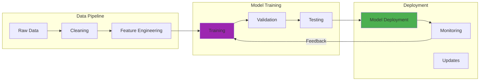

Years ago, I watched a demonstration of a home robot that consistently brought the wrong items when given ambiguous instructions. "Please get me the book from the table," the researcher said, and the robot would dutifully select one of three books present—often not the intended one. The robot never asked which book, never sought clarification, just made its best guess and moved on.

That experience stuck with me because it highlighted a fundamental gap in human-robot interaction. Humans naturally ask clarifying questions when instructions are unclear, but robots have traditionally struggled with this basic social behavior. Recent breakthrough research is finally changing that, and the implications are fascinating.

## How It Works



## The Problem with Assumption-Making Robots

The challenge isn't just technical—it's deeply human. When instructions are ambiguous, traditional embodied AI agents typically handle it in one of three problematic ways:

1. **Making assumptions**: Selecting based on internal heuristics and potentially getting it wrong
2. **Requesting full repetition**: Asking for the entire instruction again, which frustrates users  
3. **Refusing the task**: Simply failing to act, requiring humans to provide more specificity

None of these approaches mirror how humans handle ambiguity. When I ask a colleague for "the report on the shared drive" and there are multiple reports, they ask targeted questions: "Which report—the quarterly analysis or the customer survey?" This targeted clarification is what makes human collaboration so effective.

## The Ask-to-Act Framework: Teaching Robots When to Question

The breakthrough I've been following involves extending traditional Vision-Language-Action (VLA) frameworks with what researchers call "Ask-to-Act" behavior. This approach trains agents to:

1. **Detect ambiguity**: Determine when instructions contain insufficient information given the current visual scene
2. **Generate relevant questions**: Formulate targeted questions addressing the specific ambiguity
3. **Incorporate clarifications**: Process the human's answer to resolve the uncertainty
4. **Execute appropriately**: Perform the correct action based on complete information

What makes this particularly elegant is how it transforms robot behavior from passive instruction-following to active participation in cooperative dialogue.

## The Training Innovation: LLM-Generated Rewards

The technical approach behind this breakthrough is as interesting as the results. Rather than requiring massive datasets of human-annotated ambiguous scenarios (which would be prohibitively expensive), researchers developed a reinforcement learning approach using LLM-generated rewards.

Here's how it works:

```python
# Pseudocode for LLM-reward based training
function train_clarification_agent(initial_model, training_environments):
    reward_model = initialize_reward_llm()
    policy = initialize_policy(initial_model)
    
    # ... (additional implementation details)
    
    return policy
```

This approach is brilliant because it uses the reasoning capabilities of large language models to automatically evaluate whether questions are relevant and helpful, creating a scalable training pipeline.

## Impressive Results and Generalization

The experimental results I've seen are compelling. The RL-finetuned systems outperformed strong zero-shot baselines (including GPT-4o) by 19-40% across various scenarios. More importantly, they showed strong generalization to:

- **Novel object configurations**: Handling new arrangements not seen during training
- **New object categories**: Asking appropriate questions about unfamiliar items
- **New instruction types**: Adapting to instruction patterns beyond the training distribution

This generalization capability suggests the approach captures fundamental principles of clarification-seeking rather than just memorizing specific scenarios.

## Applications Across Domains

The potential applications extend far beyond home robots:

### Healthcare Assistance
Instead of making potentially dangerous assumptions, medical robots could ask clarifying questions: "Which medication would you like: the pain reliever, the antibiotic, or the blood pressure medication?" This reduces the risk of medication errors while maintaining efficiency.

### Educational Technology  
AI tutoring systems could identify when student questions contain ambiguities and seek clarification before providing potentially confusing answers. This mirrors effective teaching practices where educators check their understanding before responding.

### Industrial Robotics
Manufacturing robots could request specification clarification when task instructions are ambiguous: "To what torque specification should I tighten this bolt?" rather than applying arbitrary force levels.

### Accessibility Technology
For assistive robots supporting individuals with disabilities, the ability to seek clarification is crucial for ensuring correct understanding of user needs, especially when communication might be challenging.

## The Human Element: Making Robots Better Collaborators

What excites me most about this research isn't just the technical achievement—it's how it makes robots more genuinely collaborative. Years ago, interacting with robots often felt like issuing commands to a somewhat unpredictable machine. This approach moves us toward genuine partnership.

The key insight is that effective collaboration requires mutual understanding, and mutual understanding often requires dialogue. By teaching robots to engage in clarification-seeking behavior, we're not just improving their task performance—we're making them better communicators and more intuitive partners.

## Challenges and Future Directions

Of course, there are still important challenges to address:

### Avoiding Question Overload
A robot that asks too many questions becomes annoying rather than helpful. The balance between seeking necessary clarification and maintaining efficiency remains delicate.

### Cultural Sensitivity
Different cultures have varying norms around question-asking behavior. Future systems will need to adapt their clarification style to be appropriate across diverse cultural contexts.

### Multimodal Clarification
Beyond verbal questions, robots might use gestures, pointing, or visual interfaces to seek clarification more efficiently in certain situations.

## Looking Ahead: The Future of Human-Robot Interaction

This breakthrough represents a significant step toward more natural and effective human-robot collaboration. By teaching robots to acknowledge uncertainty and engage in clarification-seeking dialogue, we're creating systems that function more as collaborative partners than rigid instruction-followers.

The approach also demonstrates the power of combining different AI capabilities—multimodal perception, language understanding, and reinforcement learning—to address complex interaction challenges.

As embodied AI continues integrating into homes, workplaces, and public spaces, the ability to engage in clarification-seeking behavior will be essential for creating robots that can truly work alongside humans rather than simply following predetermined scripts.

What I find most promising is how this research addresses a fundamental limitation in current AI systems: their struggle to acknowledge and resolve uncertainty through dialogue. This skill, so natural to humans, is finally becoming accessible to artificial agents.

The future of human-robot interaction looks increasingly conversational, collaborative, and genuinely helpful. And that's a future I'm excited to see unfold.

---

*For those interested in diving deeper, the original research paper "Grounding Multimodal LLMs to Embodied Agents that Ask for Help with Reinforcement Learning" provides comprehensive technical details, while the [Stanford Embodied AI Workshop](https://embodied-ai.org/) offers broader context on advances in this field.*