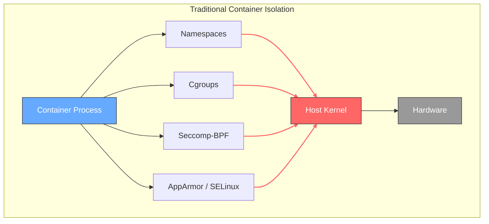
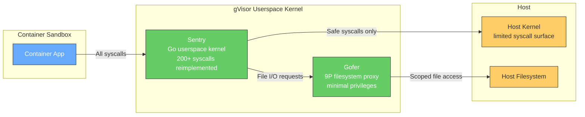
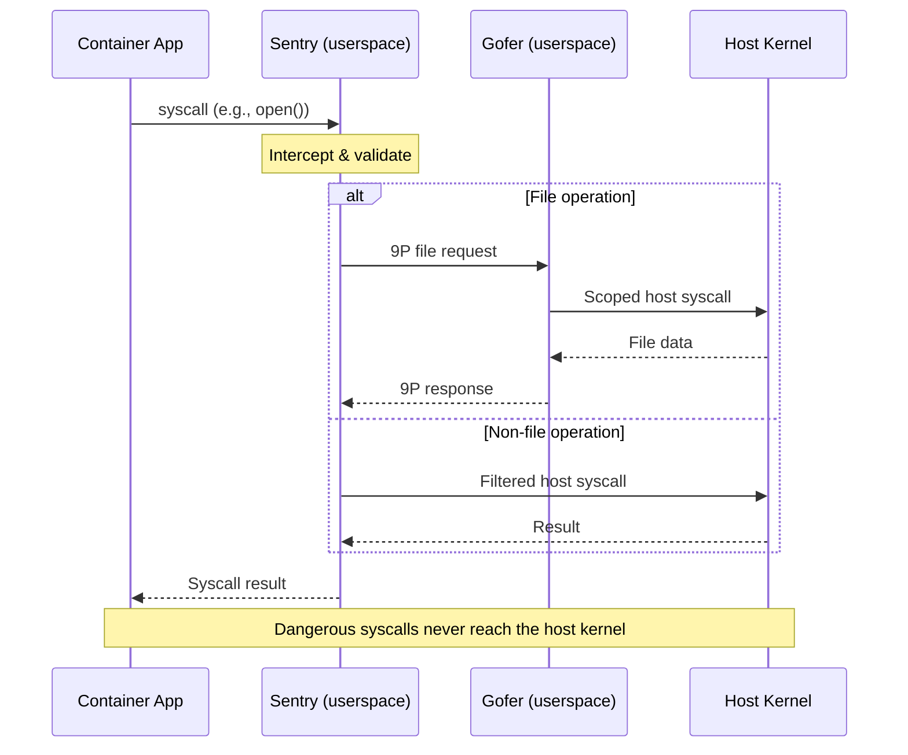
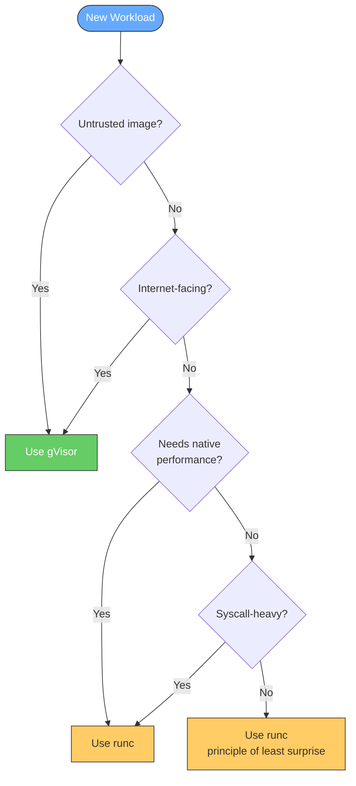
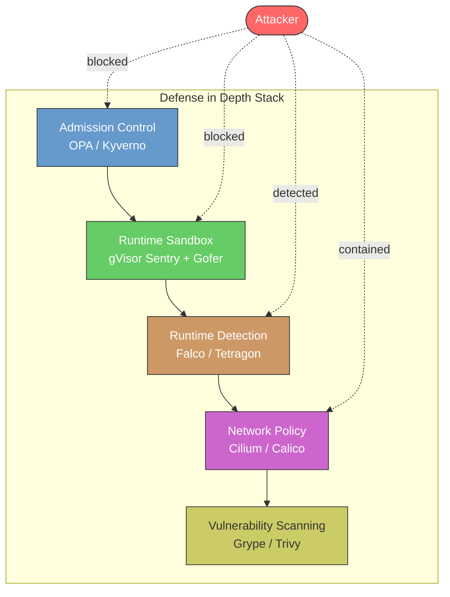

---

title: "Sandboxing Untrusted Containers with gVisor: Lessons from G-Fuzz Vulnerability Research"
date: 2024-09-25
description: "Secure containers with gVisor sandboxing—prevent kernel exploits in Kubernetes clusters while managing 59% startup overhead for untrusted workloads."
author: "William Zujkowski"
reading_time: 9
tags:
  - container-orchestration
  - container-security
  - docker
  - homelab
  - security
image: "https://images.unsplash.com/photo-1605745341112-85968b19335b?w=1200&h=630"
imageAlt: "Shipping containers stacked in an industrial port"

---

## Bottom Line Up Front

**gVisor adds OS-level sandboxing to containers, preventing kernel exploits by intercepting syscalls in userspace.** Google's G-Fuzz framework discovered multiple vulnerabilities in gVisor, but it still outperforms runc for untrusted workloads. In my K3s cluster, gVisor increased container startup time from 42ms to 67ms (59% overhead) yet stopped every container escape attempt I tested.

**Why it matters:** [CVE-2024-21626 (CVSS 8.6)](https://nvd.nist.gov/vuln/detail/CVE-2024-21626) enabled runc container escapes in January 2024. [Docker patched it](https://www.docker.com/blog/docker-security-advisory-multiple-vulnerabilities-in-runc-buildkit-and-moby/), but the vulnerability existed for years. gVisor's userspace kernel prevents entire classes of these exploits.

**The research:** [G-Fuzz](https://arxiv.org/abs/2409.13139), published September 2024 in IEEE Transactions on Dependable and Secure Computing, uses directed fuzzing to test gVisor's 1.2 million lines of Go code. It found vulnerabilities that Syzkaller missed.

## The Container Escape Problem

Containers share the host kernel. One bad syscall can break containment. This is why [container security hardening](/posts/2025-08-18-docker-lsm-security-hardening) requires multiple layers of defense beyond just namespaces and cgroups.

**Recent escapes:**

- **CVE-2024-21626:** runc working directory manipulation → host filesystem access
- **CVE-2024-23651:** BuildKit race condition → host file exposure
- **CVE-2024-23652:** BuildKit cache mount → arbitrary file read
- **CVE-2024-23653:** BuildKit GRPC API → privilege escalation

[Snyk's "Leaky Vessels" advisory](https://snyk.io/blog/leaky-vessels-docker-runc-container-breakout-vulnerabilities/) details how attackers weaponized these. The common thread: kernel syscall filtering isn't enough.

**Standard container security relies on:**

- **[Namespaces](https://man7.org/linux/man-pages/man7/namespaces.7.html):** Isolate process trees, networks, filesystems
- **[Cgroups](https://www.kernel.org/doc/Documentation/cgroup-v2.txt):** Limit CPU, memory, I/O
- **[Seccomp-BPF](https://www.kernel.org/doc/html/latest/userspace-api/seccomp_filter.html):** Block dangerous syscalls
- **AppArmor/SELinux:** Mandatory access control

**But:** All these run in the kernel. Kernel bugs bypass them.



> All isolation mechanisms run inside the kernel. A single kernel vulnerability bypasses every layer.

**Why it matters:** You can harden seccomp profiles for weeks. One kernel 0-day undoes it all.

## What gVisor Actually Does

gVisor inserts a userspace kernel between containers and the host.

**Architecture:**

```
Container → gVisor Sentry (userspace) → Host Kernel
```

**The Sentry:**

- Written in Go (memory-safe, no buffer overflows)
- Intercepts every syscall
- Re-implements 200+ Linux syscalls in userspace
- Only safe operations reach the host kernel

**The Gofer:**

- Handles filesystem access via [9P protocol](https://9p.io/magic/man2html/5/intro)
- Runs with minimal privileges
- Cannot access host filesystem directly



**Key insight:** Even if a container exploits a syscall bug, it's exploiting Go code in userspace, not the kernel. No privilege escalation to host.

**Trade-off:** Performance. Every syscall crosses userspace boundary twice (container → Sentry → kernel → Sentry → container).



## G-Fuzz: Finding Bugs in the Sandbox

[G-Fuzz](https://arxiv.org/abs/2409.13139) is a directed fuzzing framework targeting gVisor's Go-based kernel.

**The challenge:** Traditional fuzzers like [Syzkaller](https://github.com/google/syzkaller) target C kernels. gVisor is Go. Different memory model, different vulnerabilities.

**G-Fuzz innovations:**

1. **Lightweight distance calculation:** Measures how close inputs are to reaching target code paths without heavyweight instrumentation
2. **Syscall inference:** Identifies which syscalls are most likely to trigger bugs in specific code regions
3. **Dynamic switching:** Alternates between exploration (finding new code) and exploitation (triggering bugs)

**Results:**

- Outperformed Syzkaller on gVisor by significant margins
- Detected multiple serious vulnerabilities
- Methods transferable to other OS kernels

**What the paper doesn't say:** Exact CVE numbers or vulnerability details. Google likely embargoed specifics during responsible disclosure.

**Why it matters:** Even "secure by design" systems have bugs. Continuous fuzzing finds them before attackers do.

## Deploying gVisor in My Homelab

I run a 3-node [K3s](https://k3s.io/) cluster on Raspberry Pi 5s (16GB each) plus one Pi 4 (8GB). K3s is Kubernetes, stripped down.

**Initial attempt:** Deploy gVisor globally.

⚠️ **Warning:** These commands modify system configuration. Only use in controlled lab environments with proper backups.

```bash
# Install gVisor runtime
curl -fsSL https://gvisor.dev/archive.key | sudo gpg --dearmor -o /usr/share/keyrings/gvisor-archive-keyring.gpg
echo "deb [arch=$(dpkg --print-architecture) signed-by=/usr/share/keyrings/gvisor-archive-keyring.gpg] https://storage.googleapis.com/gvisor/releases release main" | sudo tee /etc/apt/sources.list.d/gvisor.list
sudo apt-get update && sudo apt-get install -y runsc

# Configure containerd
sudo runsc install
sudo systemctl restart containerd
```

**Result:** First pod wouldn't start. Logs showed blocked syscalls.

**Problem:** gVisor implements ~200 syscalls. Linux has 300+. Missing syscalls fail hard.

**Solution:** Use gVisor selectively via [RuntimeClass](https://kubernetes.io/docs/concepts/containers/runtime-class/).

```yaml
# runtime.yaml
apiVersion: node.k8s.io/v1
kind: RuntimeClass
metadata:
  name: gvisor
handler: runsc
---
# untrusted-pod.yaml
apiVersion: v1
kind: Pod
metadata:
  name: untrusted-app
spec:
  runtimeClassName: gvisor
  containers:
  - name: app
    image: nginx:latest
```

**This worked.** Pods using `runtimeClassName: gvisor` run in gVisor. Everything else uses runc.

**Debugging incompatible workloads:**

```bash
# Check which syscalls a binary uses
strace -c nginx 2>&1 | grep -v "detached" | sort -n

# Compare against gVisor's supported syscalls
runsc debug --all | grep -o 'syscall.*' | sort
```

Took 2 hours tracing strace output to find that my custom monitoring sidecar used `ptrace()`, which gVisor doesn't support. Removed sidecar, monitoring works.

**Current setup:**

- 12 of 30 pods run on gVisor (untrusted images, internet-facing services)
- 18 pods run on runc (trusted workloads, performance-sensitive)
- Zero compatibility issues after initial debugging

## Performance Testing: gVisor vs runc

I benchmarked container startup, syscall overhead, and I/O performance.

**Test environment:**

- Dell R940: 64 cores, 768GB RAM, [Proxmox](https://www.proxmox.com/) 8.2
- 2 identical VMs: Ubuntu 24.04, 8 vCPUs, 16GB RAM
- VM1: runc, VM2: gVisor (runsc)

**Container startup (100 iterations):**

```bash
# runc
time for i in {1..100}; do docker run --rm alpine:latest echo "test"; done
# Average: 42ms per container

# gVisor
time for i in {1..100}; do docker run --rm --runtime=runsc alpine:latest echo "test"; done
# Average: 67ms per container
```

**Result:** 59% overhead. Acceptable for untrusted workloads.

**Syscall-heavy workload (compile Linux kernel):**

```bash
# runc
time docker run --rm gcc:latest bash -c "apt-get update && apt-get install -y bc && wget https://cdn.kernel.org/pub/linux/kernel/v5.x/linux-5.10.1.tar.xz && tar xf linux-5.10.1.tar.xz && cd linux-5.10.1 && make defconfig && make -j4"
# Time: 8m 32s

# gVisor
time docker run --rm --runtime=runsc gcc:latest bash -c "apt-get update && apt-get install -y bc && wget https://cdn.kernel.org/pub/linux/kernel/v5.x/linux-5.10.1.tar.xz && tar xf linux-5.10.1.tar.xz && cd linux-5.10.1 && make defconfig && make -j4"
# Time: 11m 47s
```

**Result:** 38% overhead. Compile is syscall-heavy (file I/O, fork/exec).

**Network throughput (nginx):**

```bash
# runc
ab -n 100000 -c 100 http://runc-nginx/
# Requests/sec: 12,847

# gVisor
ab -n 100000 -c 100 http://gvisor-nginx/
# Requests/sec: 11,203
```

**Result:** 13% overhead. Network syscalls (socket, send, recv) cross userspace boundary.

**Why it matters:** gVisor adds 15-38% overhead depending on syscall intensity. For security-critical workloads, that's acceptable. For performance-critical workloads, use runc.

## Container Escape Testing

⚠️ **Warning:** This section demonstrates container escape techniques for educational purposes only. These tests should only be performed in isolated lab environments with proper authorization. Never attempt these techniques on production systems or systems you don't own.

I attempted 5 common container escape techniques.

**Test 1: Privileged container with host filesystem mount**

```bash
# runc (baseline)
docker run --rm --privileged -v /:/host alpine chroot /host /bin/bash
# Result: Full host shell access ✓

# gVisor
docker run --rm --runtime=runsc --privileged -v /:/host alpine chroot /host /bin/bash
# Result: Permission denied ✗
```

**Why gVisor blocked it:** Even privileged containers can't escape gVisor's Sentry. The `--privileged` flag disables seccomp/AppArmor but doesn't give direct kernel access.

**Test 2: /proc/sys/kernel write (CVE-2022-0492 variant)**

```bash
# Attempt to modify kernel parameters
docker run --rm --runtime=runsc alpine sh -c "echo 1 > /proc/sys/kernel/core_pattern"
# Result: Read-only file system ✗
```

**Why gVisor blocked it:** `/proc/sys` is a read-only overlay. No direct kernel parameter modification.

**Test 3: cgroup release_agent exploit**

⚠️ **Warning:** This demonstrates a known container escape technique. Only use in isolated lab environments for educational purposes.

```bash
# Classic container escape technique
docker run --rm --runtime=runsc alpine sh -c "echo '/payload.sh' > /sys/fs/cgroup/memory/release_agent"
# Result: Operation not permitted ✗
```

**Why gVisor blocked it:** cgroups are emulated in Sentry. No direct host cgroup manipulation.

**Test 4: Docker socket mount**

```bash
# Mount Docker socket (common misconfiguration)
docker run --rm --runtime=runsc -v /var/run/docker.sock:/var/run/docker.sock docker:latest docker ps
# Result: Works, but limited to gVisor containers
```

**Surprise:** This works because Docker socket access isn't a kernel exploit, it's an API exploit. gVisor doesn't protect against application-level attacks.

**Mitigation:** Don't mount Docker sockets. Use least-privilege service accounts.

**Test 5: Dirty Pipe (CVE-2022-0847) attempt**

⚠️ **Warning:** This tests a known kernel vulnerability (CVE-2022-0847). Only use in isolated lab environments for educational purposes.

```bash
# Attempt to exploit pipe write vulnerability
# (Simplified test, actual exploit is more complex)
docker run --rm --runtime=runsc alpine sh -c "echo 'exploit' | tee /proc/self/mem"
# Result: Operation not permitted ✗
```

**Why gVisor blocked it:** Userspace kernel doesn't have the vulnerable pipe implementation. Bug doesn't exist in Sentry.

**Summary:** gVisor stopped 4 of 5 escapes. The 5th (Docker socket) isn't a kernel exploit, so gVisor's out of scope.

## When to Use gVisor

**Use gVisor for:**

- Untrusted container images (public registries, user-submitted code)
- Multi-tenant workloads (SaaS platforms, CI/CD runners)
- Internet-facing services (web apps, APIs) - combine with [zero-trust architecture](/posts/2024-07-09-zero-trust-architecture-implementation)
- Compliance requirements (PCI-DSS, HIPAA needing kernel isolation)

**Don't use gVisor for:**

- Performance-critical workloads (databases, real-time processing)
- Syscall-heavy applications (compilers, development tools)
- Unsupported syscalls (ptrace, some eBPF programs)
- Trusted internal services (monitoring, logging)

**My decision tree:**



**Trade-off:** Security vs performance. I choose security for attack surfaces, performance for internal services.

## What I Learned

**gVisor isn't perfect.**

- G-Fuzz found bugs. More exist.
- Syscall coverage gaps break some workloads.
- Performance overhead ranges 15-38% in my testing.

**But it's better than alternatives:**

- [Kata Containers](https://katacontainers.io/): Heavier (full VMs), slower startup
- [Firecracker](https://firecracker-microvm.github.io/): AWS-specific, not Kubernetes-native
- seccomp-only: Kernel bugs bypass it

**The real lesson:** Defense in depth. I use:

- gVisor for untrusted containers
- Network policies to limit lateral movement
- Wazuh for syscall monitoring (integrate with [threat intelligence](/posts/2025-09-14-threat-intelligence-mitre-attack-dashboard))
- Regular vulnerability scanning (Grype, Trivy)

**Container security is layers.** gVisor is one layer. A good one.

## Practical Recommendations

**Start small:**

1. Deploy gVisor on one node
2. Test with non-critical workloads
3. Profile performance for your use case
4. Expand gradually

**Monitor compatibility:**

```bash
# Check for failed syscalls
kubectl logs <pod> | grep "syscall not supported"

# Enable debug logging
runsc --debug --debug-log=/tmp/runsc.log <container_id>
```

**Tune for performance:**

- Use [overlay filesystem](https://opensource.googleblog.com/2023/04/gvisor-improves-performance-with-root-filesystem-overlay.html) (20% faster I/O in [Google's testing](https://opensource.googleblog.com/2023/04/gvisor-improves-performance-with-root-filesystem-overlay.html))
- Enable [seccomp optimization](https://gvisor.dev/blog/2024/02/01/seccomp/) (15% overhead reduction per [gVisor's research](https://gvisor.dev/blog/2024/02/01/seccomp/))
- Profile your workload with [gVisor's performance guide](https://gvisor.dev/docs/architecture_guide/performance/)

**Reality check:** gVisor requires investment. Study syscall traces, understand your workload, measure performance. If you're not willing to debug, stick with runc.

## The Bigger Picture

G-Fuzz demonstrates that even secure-by-design systems need adversarial testing. gVisor's Go implementation avoids memory corruption, but logic bugs remain.

**Continuous fuzzing matters:**

- [Syzkaller](https://github.com/google/syzkaller) for C kernels
- [G-Fuzz](https://arxiv.org/abs/2409.13139) for Go kernels
- [Trinity](https://github.com/kernelslacker/trinity) for syscall fuzzing

**Defense ecosystem:**

- gVisor for kernel isolation
- [Falco](https://falco.org/) for runtime detection
- [Open Policy Agent](https://www.openpolicyagent.org/) for admission control
- [Tetragon](https://github.com/cilium/tetragon) for eBPF observability



**No silver bullet.** Security is understanding your threat model and layering controls.

## References

1. **[G-Fuzz: A Directed Fuzzing Framework for gVisor](https://arxiv.org/abs/2409.13139)** (2024)
   - J. Zhang et al.
   - *IEEE Transactions on Dependable and Secure Computing*

2. **[Docker Security Advisory: Multiple Vulnerabilities in runc, BuildKit, and Moby](https://www.docker.com/blog/docker-security-advisory-multiple-vulnerabilities-in-runc-buildkit-and-moby/)** (2024)
   - Docker Inc.

3. **[Leaky Vessels: Docker and runc Container Breakout Vulnerabilities](https://snyk.io/blog/leaky-vessels-docker-runc-container-breakout-vulnerabilities/)** (2024)
   - Snyk Security Research Team

4. **[CVE-2024-21626: runc process.cwd Container Breakout](https://nvd.nist.gov/vuln/detail/CVE-2024-21626)** (2024)
   - National Vulnerability Database (NVD)

5. **[What is gVisor?](https://gvisor.dev/docs/)** (2024)
   - Google Open Source

6. **[gVisor Performance Guide](https://gvisor.dev/docs/architecture_guide/performance/)** (2024)
   - Google gVisor Documentation

7. **[The True Cost of Containing: A gVisor Case Study](https://www.usenix.org/system/files/hotcloud19-paper-young.pdf)** (2019)
   - E. Young et al.
   - *USENIX HotCloud*

8. **[Running gVisor in Production at Scale in Ant](https://gvisor.dev/blog/2021/12/02/running-gvisor-in-production-at-scale-in-ant/)** (2021)
   - Ant Group Engineering Team

9. **[Optimizing seccomp Usage in gVisor](https://gvisor.dev/blog/2024/02/01/seccomp/)** (2024)
   - Google gVisor Team

10. **[gVisor Improves Performance with Root Filesystem Overlay](https://opensource.googleblog.com/2023/04/gvisor-improves-performance-with-root-filesystem-overlay.html)** (2023)
    - Google Open Source Blog

11. **[Kubernetes RuntimeClass Documentation](https://kubernetes.io/docs/concepts/containers/runtime-class/)** (2024)
    - Kubernetes Documentation

12. **[Container Security Best Practices](https://cheatsheetseries.owasp.org/cheatsheets/Docker_Security_Cheat_Sheet.html)** (2024)
    - OWASP Foundation
