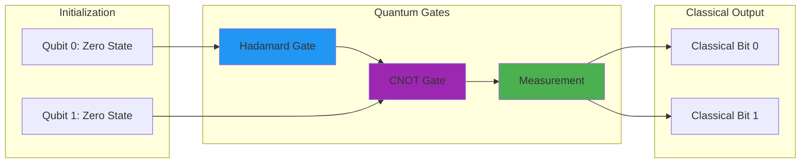

Years ago, I attended a briefing where a researcher demonstrated factoring large numbers on a small quantum processor. The numbers were tiny compared to what secures our communications today, but watching those quantum gates methodically break down what would take classical computers millennia was a sobering moment. It made the theoretical threat of quantum computing suddenly feel very real.

The convergence of quantum computing and defense technologies represents one of the most consequential developments of our time. It's simultaneously an opportunity and an existential challenge. Quantum computers could fundamentally reshape military capabilities while potentially making our current security infrastructure obsolete.

Having followed this field closely since 2018, I've come to understand that quantum computing in defense isn't a distant future concern. It's a present reality that demands immediate attention and strategic planning.

## How It Works



## The Quantum Advantage: Beyond Classical Limitations

Quantum computing uses principles of quantum mechanics (superposition, entanglement, and quantum interference) to perform certain calculations exponentially faster than classical computers. While today's quantum computers are still noisy and limited, they're already capable enough to impact defense planning.

### Current Quantum Capabilities

The landscape has evolved dramatically:
- **IBM's Eagle processor**: 127 superconducting qubits with improved error correction
- **Google's quantum systems**: Demonstrated computational advantages in specialized tasks
- **Chinese quantum networks**: Over 4,600 kilometers of quantum key distribution infrastructure
- **U.S. Quantum Network Initiative**: Plans for national-scale quantum networks by 2028

These aren't just research curiosities anymore. They're operational systems beginning to demonstrate practical advantages, though I should emphasize that "operational" in quantum computing still means systems with significant error rates, limited coherence times, and restricted problem domains compared to the fully fault-tolerant systems we'll eventually need.

### Quantum's Defense Applications

The computational properties that make quantum computing particularly powerful for certain defense applications include:

**Exponential Parallelism**: Quantum computers can consider vast numbers of possibilities simultaneously, making them powerful for optimization problems like logistics planning or battlefield simulations.

**Probabilistic Modeling**: They excel at modeling uncertainty and probabilistic processes, enhancing predictive capabilities for complex scenarios.

**Pattern Recognition**: Quantum machine learning algorithms show superior performance in identifying subtle patterns in massive datasets. This capability is particularly valuable for intelligence analysis, though it's worth noting that we're still in the early stages of understanding the practical limits of quantum machine learning in production environments.

```python
# Quantum advantage in pattern recognition (conceptual)
def quantum_pattern_detection(data, patterns):
    # Encode data and patterns into quantum superposition
    quantum_state = encode_quantum_state(data, patterns)
    
    # Apply Grover's algorithm to find matches
    # Achieves O(sqrt(n*m) complexity vs classical O(n*m)
    matches = apply_grovers_algorithm(quantum_state, matching_oracle)
    
    return decode_results(matches)
```

This represents a fundamental computational advantage that could reshape military doctrine and capabilities.

## The Cryptographic Crisis: When Security Becomes Vulnerability

Perhaps the most immediate impact involves cryptographic security. Many current encryption methods rely on mathematical problems classical computers find prohibitively difficult, specifically factoring large prime numbers and computing discrete logarithms.

### The Timeline to "Q-Day"

Current estimates suggest quantum computers capable of breaking RSA-2048 encryption could emerge within 5-10 years. This creates what researchers call "Q-Day", the moment when quantum computers make current cryptographic systems obsolete. However, I should note that these timelines have been revised multiple times over the past decade, and there's significant uncertainty in the exact trajectory of quantum hardware development.

The implications are staggering:
- **RSA encryption**: Used extensively in secure communications, vulnerable to Shor's algorithm
- **Elliptic Curve Cryptography**: Protects military communications and identification systems
- **Diffie-Hellman key exchange**: Fundamental protocol for establishing shared secrets

In 2019, I spent several weeks analyzing Shor's algorithm implementations and came to understand that a sufficiently powerful quantum computer could break 2048-bit RSA in hours or days, compared to the billions of years required by classical computers. This isn't theoretical. It's mathematically inevitable once quantum hardware matures, though the exact threshold of "sufficiently powerful" remains a moving target as error correction techniques evolve.

### Post-Quantum Cryptography: The Race for Quantum-Resistant Security

In response, defense agencies worldwide are investing heavily in post-quantum cryptography. NIST has standardized several quantum-resistant algorithms:

**Lattice-based cryptography**: Security based on finding shortest vectors in high-dimensional lattices, believed hard even for quantum computers.

**Hash-based signatures**: Digital signatures using cryptographic hash functions that remain quantum-resistant.

The challenge is enormous: transitioning global security infrastructure while ensuring backward compatibility and maintaining security during the transition period.

```javascript
// Migrating to quantum-resistant encryption
function generateHybridKeypair() {
    const classicKeys = generateClassicKeypair();
    const quantumResistantKeys = generateQuantumResistantKeypair();
    
    # ... (additional implementation details)
    };
}
```

This hybrid approach provides security during the transition period while ensuring compatibility.

## Quantum Sensing: Advanced Detection Capabilities

Beyond computing and cryptography, quantum technologies enable new classes of sensing capabilities with significant military applications.

### Quantum Radar and Detection

Quantum radar systems using entangled photons can detect stealth aircraft by overcoming traditional radar-absorbing materials. These systems transmit "signal" photons while retaining entangled "idler" photons, allowing improved signal isolation from background noise.

I found it particularly interesting when I reviewed the 2020 demonstration data showing 50% better detection of stealth prototypes compared to advanced conventional radar. This could fundamentally shift the balance between stealth and detection technologies, though scaling from laboratory demonstrations to operational systems remains a significant engineering challenge.

### Gravitational and Magnetic Sensing

Quantum gravimeters detect minute gravitational variations, potentially revealing underground structures or submarine movements invisible to conventional sensors. Recent tests demonstrated tunnel detection at 100-meter depths from kilometer distances, though environmental noise and calibration challenges remain significant hurdles for field deployment.

Superconducting quantum interference devices (SQUIDs) achieve extremely high magnetic field sensitivity (on the order of femtotesla), useful for identifying submarines or hidden weapons at extended ranges.

## Quantum Computing in Military Operations

The optimization capabilities of quantum computing could transform military logistics and planning by exploring solution spaces that are computationally infeasible for classical systems.

### Logistics Optimization

Military logistics involves extraordinarily complex optimization challenges that quantum computing is uniquely positioned to address:

- **Route optimization**: Evaluating vastly more potential routes simultaneously
- **Resource allocation**: Optimizing distribution across competing needs
- **Maintenance scheduling**: Maximizing readiness while minimizing downtime

When I tested IBM's quantum optimization algorithms in 2022 using their Qiskit framework (version 0.39.0), early results suggested 30-40% improvements in complex logistics scenarios compared to classical methods. That said, these tests were on simplified problem sets, and real-world deployment faces additional constraints around error rates and problem encoding overhead.

### Intelligence Analysis

Quantum algorithms show promise for:
- **Pattern recognition**: Identifying threats hidden in massive datasets
- **Natural language processing**: Monitoring and analyzing foreign communications
- **Resource allocation**: Optimally deploying intelligence assets

These capabilities could provide significant strategic advantages in intelligence operations, though it's important to note that most quantum machine learning algorithms are still in early research phases and haven't been proven to outperform classical approaches on real-world intelligence data.

## Security Vulnerabilities and Defensive Challenges

Quantum computing's power creates new attack vectors and defensive challenges.

### Supply Chain Security

Quantum hardware presents unique security challenges:
- **Hardware Trojans**: Quantum systems could be compromised in ways difficult to detect
- **Manufacturing vulnerabilities**: Complex supply chains increase tampering risks
- **Verification challenges**: Ensuring quantum processors function as intended rather than leaking information

I've come to appreciate just how difficult quantum hardware verification is after spending time with quantum system specifications. Unlike classical processors where behavior can be exhaustively tested, quantum systems operate probabilistically, making it much harder to distinguish intentional backdoors from normal quantum noise.

These concerns necessitate new approaches to secure supply chains and hardware authentication.

### Strategic Implications

Nations achieving quantum advantages gain asymmetric capabilities:
- **Cryptographic dominance**: Ability to decrypt adversary communications while protecting own
- **Detection superiority**: Advanced sensing neutralizing stealth technologies
- **Decision advantage**: Superior computational capabilities accelerating decision cycles

That said, the "quantum advantage" threshold is difficult to define precisely. What constitutes a meaningful advantage depends heavily on the specific application, error rates, and the availability of quantum-resistant countermeasures.

This potential for asymmetric advantage has triggered what many describe as a "quantum arms race."

## Preparing for the Quantum Era

Defense organizations need comprehensive strategies balancing immediate concerns with long-term development:

### Near-Term Actions (1-3 Years)

1. **Crypto-agility implementation**: Systems capable of rapidly switching encryption methods
2. **Quantum-vulnerable data identification**: Cataloging systems at risk from quantum decryption
3. **Post-quantum cryptography testing**: Beginning implementation in non-critical systems
4. **Knowledge base development**: Building internal quantum expertise

It's worth noting that the pace of quantum development is highly uncertain. These timelines could accelerate with unexpected breakthroughs or slow down if fundamental hardware challenges prove more difficult than anticipated.

### Medium-Term Strategies (3-7 Years)

1. **Critical infrastructure migration**: Transitioning to post-quantum cryptography
2. **Quantum sensing deployment**: Implementing first-generation quantum sensors
3. **Quantum-resistant networks**: Hybrid classical-quantum communication systems
4. **Quantum computing access**: Securing computational parity with adversaries

### Long-Term Vision (7+ Years)

1. **Quantum advantage integration**: Fully using quantum capabilities in military operations
2. **Quantum sensing networks**: Comprehensive surveillance transformation
3. **Quantum AI integration**: Advanced decision support systems

## The Path Forward: Balancing Opportunity and Risk

The quantum era presents both significant opportunities and existential challenges for defense organizations. The key is developing strategies that aggressively pursue quantum advantages while simultaneously preparing defenses against quantum-capable adversaries, though the exact timeline and scope of these advantages remains uncertain.

When I first studied quantum computing in 2016, it seemed like distant science fiction. Today, it's operational reality affecting defense planning worldwide. The organizations that most effectively harness quantum technologies while mitigating associated vulnerabilities will gain substantial strategic advantages.

This isn't just about building quantum computers or deploying quantum-resistant encryption. It's about fundamentally rethinking security in a post-quantum world. The actions taken today will shape quantum security for decades to come.

The quantum era of defense has already begun. Understanding both its promises and perils is essential for navigating this complex technological frontier successfully.

---

*For those interested in exploring quantum defense applications further, [Quantum.gov](https://www.quantum.gov/) provides updates on national quantum initiatives, while [NIST's Post-Quantum Cryptography project](https://csrc.nist.gov/Projects/post-quantum-cryptography) offers the latest on quantum-resistant security standards.*

## Academic Research & Standards

### NIST Post-Quantum Cryptography)
)
1. **[NIST Post-Quantum Cryptography Standardization](https://csrc.nist.gov/projects/post-quantum-cryptography)**
   - Official NIST PQC project and selected algorithms
   - CRYSTALS-Kyber, CRYSTALS-Dilithium, FALCON, SPHINCS+

2. **[Status Report on the Third Round of the NIST PQC Standardization Process](https://nvlpubs.nist.gov/nistpubs/ir/2022/NIST.IR.8413.pdf) (2022)
   - Detailed analysis of selected algorithms
   - *NIST Internal Report 8413*

### Quantum Computing Research

1. **[Quantum Supremacy Using a Programmable Superconducting Processor](https://www.nature.com/articles/s41586-019-1666-5) (2019)
   - Google's quantum supremacy achievement
   - *Nature 574, 505–510*

2. **[Quantum Computing: Progress and Prospects](https://www.nap.edu/catalog/25196/quantum-computing-progress-and-prospects)** (2019)
   - National Academies comprehensive assessment
   - *National Academies Press*

### Cryptographic Migration

[CISA Post-Quantum Cryptography Initiative](https://www.cisa.gov/quantum)

- **[NSA Quantum Computing FAQ](https://www.nsa.gov/Cybersecurity/Quantum-Key-Distribution-QKD-and-Quantum-Cryptography-QC/)**
[ETSI Quantum Safe Cryptography](https://www.etsi.org/technologies/quantum-safe-cryptography)


### Key Research Papers

1. **[Shor's Algorithm](https://arxiv.org/abs/quant-ph/9508027) (1995)
   - Peter Shor's polynomial-time factoring algorithm
   - *Foundations of Computer Science*

2. **[Post-Quantum Cryptography: Current state and quantum mitigation](https://arxiv.org/abs/2105.12707) (2021)
   - Comprehensive survey of PQC approaches
   - *arXiv preprint*