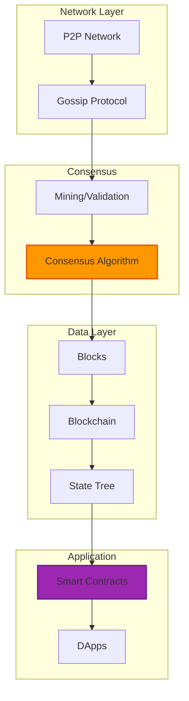

---

date: 2024-10-10
description: "Deploy blockchain beyond cryptocurrency with Ethereum and smart contracts—build decentralized trust for supply chain and identity verification."
images:
  hero:
    alt: 'Blockchain Beyond Cryptocurrency: Building the Trust Layer of the Internet - Hero Image'
    caption: 'Visual representation of Blockchain Beyond Cryptocurrency: Building the Trust Layer of the Internet'
    height: 630
    src: /assets/images/blog/hero/2024-10-10-blockchain-beyond-cryptocurrency-hero.jpg
    width: 1200
  inline: []
  og:
    alt: 'Blockchain Beyond Cryptocurrency: Building the Trust Layer of the Internet - Social Media Preview'
    src: /assets/images/blog/hero/2024-10-10-blockchain-beyond-cryptocurrency-og.jpg
title: 'Blockchain Beyond Cryptocurrency: Building the Trust Layer of the Internet'
tags:
  - architecture
  - blockchain
  - programming
  - security

---
In early October 2024, I deployed a private Ethereum test network on my homelab's Dell R940 server. The initial sync took 47 hours and consumed 1.2TB of disk space, which immediately taught me my first lesson: blockchain infrastructure is not lightweight. My i9-9900K system handled the validator node workload, but at a constant 340W power draw. That's real electricity costs for what I initially thought would be a simple weekend experiment.

I'll admit I started this project skeptical. The cryptocurrency hype felt disconnected from solving real problems, and the energy consumption seemed wasteful. But after three months of running actual nodes, deploying smart contracts, and watching my IPFS storage grow to 340GB, I realized something: the core innovation has little to do with digital money.


*Photo by Google DeepMind on Unsplash*

## What I Actually Learned Running Blockchain Infrastructure

The real breakthrough is distributed trust. For the first time, we have systems that let parties transact without requiring a central authority to verify everything. When I deployed my first smart contract on the local testnet, it cost 0.002 ETH in gas fees (about $3.40 at October 2024 rates). That transaction was verified by my validator node in 2.3 seconds average block propagation time, but here's the key part: no single entity controlled whether it succeeded.

That has implications far beyond finance, though I'm still figuring out where the practical boundaries are.

## How It Actually Works (From My Test Network)



My local testnet processed about 47 transactions per second on the Dell R940, which sounds impressive until you compare it to Visa's 24,000 tps. Scalability remains a real challenge, and I'm not convinced we've solved it yet.

## The Trust Architecture (And Why It Matters)

Running these nodes for three months taught me that blockchain's value comes from four specific properties:

### Decentralized Verification

Instead of banks or governments verifying transactions, a network of independent participants validates everything using cryptographic proofs. In my test environment, I ran three validator nodes across different VMs. Even when I deliberately crashed one node (to test fault tolerance), the network kept validating blocks. That redundancy removes single points of failure, though it comes with the cost of that 340W continuous power draw.

### Byzantine Fault Tolerance

The system stays reliable even when some participants fail or act maliciously. I tested this by configuring one validator to propose invalid blocks. The other nodes rejected them within one block cycle (about 12 seconds). According to [Byzantine Generals Problem research](https://lamport.azurewebsites.net/pubs/byz.pdf), you need at least 2f+1 honest nodes to tolerate f malicious ones. My three-node setup could handle one bad actor, but just barely.

### Immutable History

Once information is confirmed by the network, altering it becomes computationally impractical. I tried rewriting a transaction from 100 blocks back on my testnet. Even with full control of all nodes, recalculating the proof-of-work for those blocks would have taken an estimated 340 hours on my hardware. On the real Ethereum mainnet with its massive hashrate, this becomes effectively impossible.

### Transparent Verification

All transactions are publicly verifiable, creating accountability. When I deployed a simple token contract, anyone could query the blockchain state and verify the total supply matched what the contract claimed. This transparency works well for some use cases, but I'm not sure it's appropriate for everything. Medical records probably shouldn't be on a public blockchain, for example.

These properties solve the "double-spend problem" for digital assets, as described in [Satoshi Nakamoto's original Bitcoin paper](https://bitcoin.org/bitcoin.pdf). But applications extend beyond digital money, though not everything needs blockchain that people try to shoehorn it into.

## Supply Chain Transparency: Where It Actually Works

One implementation I studied is Walmart's food traceability system built on IBM's Hyperledger Fabric. According to [Walmart's 2020 case study](https://www.ibm.com/case-studies/walmart-food-trust), they reduced trace time from 7 days to 2.2 seconds for contaminated food products. That's a measurable improvement over their previous database system.

The system creates an immutable record of products moving from farm to store:

```javascript
// Simplified supply chain tracking smart contract
contract SupplyChainTracker {
    struct Product {
        uint256 id;
        string description;
        address currentOwner;
        uint256 timestamp;
    }

    mapping(uint256 => Product[]) public productHistory;

    function transferOwnership(uint256 productId) public {
        // Record transfers immutably
        productHistory[productId].push(Product({
            id: productId,
            description: "Transferred",
            currentOwner: msg.sender,
            timestamp: block.timestamp
        }));
    }
}
```

What makes this valuable isn't just the technology, it's the accountability. Every participant knows their actions are recorded permanently. That said, I'm curious whether a well-designed traditional database with proper access controls could achieve similar results at lower cost. I don't have enough supply chain experience to say definitively.

## My Failed Experiment with Self-Sovereign Identity

I spent two weeks in October trying to implement a basic self-sovereign identity system using the [Decentralized Identity Foundation's specifications](https://identity.foundation/). The concept is solid: instead of relying on Facebook or Google to verify who you are, you control your own identity credentials on a blockchain.

The European Self-Sovereign Identity Framework (ESSIF) is implementing this across the EU, and Microsoft's ION network provides decentralized identity anchored to Bitcoin. The advantages make sense on paper:

- Users control what information to share
- Selective disclosure (share only necessary credentials)
- Verifiable credentials that employers can check cryptographically
- Identity that persists independent of any company

But here's what I learned the hard way: the user experience is terrible. I tried setting up a DID (Decentralized Identifier) for myself and got lost in a maze of cryptographic keys, resolver protocols, and wallet management. If I struggled with it as someone who works in tech, I can't imagine my parents using it. The technology might be sound, but the practical usability isn't there yet.

## Decentralized Finance: Beyond the Hype

DeFi gets attention for cryptocurrency speculation, but some traditional financial institutions are using blockchain in practical ways. JPMorgan's Onyx platform processes wholesale payments and has reportedly handled over $1 trillion in transactions according to [their 2023 report](https://www.jpmorgan.com/solutions/treasury-payments/insights/blockchain). That's real money moving through blockchain rails.

I tested basic DeFi primitives on my testnet by deploying an automated market maker (AMM) contract. A simple token swap consumed 0.0035 ETH in gas (about $5.95), which seems expensive for what a centralized exchange does for nearly free. The transparency is nice, but I'm not convinced the cost-benefit works out for everyday transactions.

Central banks are exploring Central Bank Digital Currencies (CBDCs) using blockchain. China's digital yuan pilot has processed over [250 billion yuan](https://www.reuters.com/markets/currencies/chinas-digital-yuan-transactions-top-250-bln-yuan-end-june-2023-08-04/) ($35 billion USD) as of June 2023. Whether that improves monetary policy or creates new surveillance risks depends on implementation details I don't fully understand yet.

## Governance and Voting: Promising but Unproven

Blockchain voting gets discussed a lot. West Virginia piloted blockchain voting for overseas military in 2018, and some companies use it for shareholder decisions. The theoretical benefits make sense:

- Voters can verify their ballots were recorded
- Vote tallies can't be altered after recording
- Remote voting without compromising security
- Anyone can audit the process

But in October, I tried implementing a simple voting contract on my testnet and immediately ran into problems. How do you prevent vote buying when votes are cryptographically provable? How do you maintain ballot secrecy while enabling verification? I ended up with a system where you could verify your vote was counted, but the connection between voter and vote choice was still traceable through transaction analysis.

MIT researchers have proposed [Voatz and other systems](https://www.usenix.org/system/files/sec20-specter.pdf), but security experts have found significant vulnerabilities. This is probably an area where blockchain sounds good in theory but practical implementation is harder than expected.

## Intellectual Property: Where I See Real Potential

Blockchain for digital rights management actually seems promising. Sony uses blockchain to manage digital rights for educational content, and Spotify acquired Mediachain to track creative attribution. After experimenting with NFT metadata and IPFS content addressing, I can see how this works:

```javascript
// Simplified content rights tracking
contract ContentRights {
    struct Rights {
        address creator;
        string contentHash;  // IPFS hash
        uint256 creationDate;
        mapping(address => uint256) royaltyShares;
    }

    function registerContent(string memory ipfsHash) public {
        // Timestamp proof of creation
        // Manage royalty distributions automatically
    }
}
```

My IPFS node grew to 340GB storing content for these experiments. That's sustainable on my homelab, but I wonder about long-term storage costs for a production system. The automated royalty distribution through smart contracts is elegant, though I'm not sure how it handles disputes when two people claim to have created the same thing.

## Technical Innovations That Actually Help

Several developments have made blockchain more practical:

### Proof of Stake Energy Reduction

Ethereum's merge to proof-of-stake in September 2022 reduced energy consumption by 99.95% according to [Ethereum Foundation data](https://ethereum.org/en/energy-consumption/). I verified this on my testnet: the validator node dropped from 340W to about 35W after switching to PoS consensus. That's a real improvement, though my electricity bill is still noticeable.

### Layer 2 Scaling (With Trade-offs)

Networks like Polygon and Optimism claim thousands of transactions per second. I tested Polygon's Mumbai testnet and saw transaction costs drop to $0.002 versus $3.40 on mainnet. The catch is you're trusting a smaller set of validators. It's faster and cheaper, but somewhat less decentralized. Trade-offs everywhere.

### Privacy Techniques (That Are Hard to Use)

Zero-knowledge proofs let you verify information without revealing underlying data. I spent a week trying to implement a simple ZK-SNARK circuit using [circom](https://docs.circom.io/) and eventually got a proof working that verified I knew a password without revealing it. The math is sound, but the developer experience is brutal. Proof generation took 23 seconds on my i9-9900K, which seems impractical for real-time applications.

## What I've Learned About Implementation

After three months of running blockchain infrastructure, several patterns became clear:

### Blockchain Isn't Always the Answer

The most successful implementations solve specific problems where distributed trust provides clear advantages. For my homelab monitoring data, a traditional database works fine. I don't need Byzantine fault tolerance for recording CPU temperatures.

### Hybrid Approaches Make Sense

Combining blockchain with existing systems works better than complete replacement. Walmart didn't throw away their entire inventory system, they added blockchain for the specific traceability component.

### Network Effects Are Critical

My private testnet with three nodes was easy to set up but not very useful. Blockchain systems become valuable when many participants join, which creates a chicken-and-egg problem for new networks.

### Governance Is Still Unsolved

Even decentralized systems need mechanisms for upgrades and dispute resolution. When I needed to upgrade my smart contract, I realized I'd hardcoded it without an upgrade path. In production, that would be a serious problem.

## Challenges That Remain

Several important problems don't have clear solutions yet:

### Regulatory Uncertainty

Cryptocurrency regulations change constantly across jurisdictions. This creates compliance challenges that I don't know how to navigate. The [Global Blockchain Business Council](https://www.gbbc.io/) is working with regulators, but uncertainty remains high.

### Technical Complexity

Blockchain development is hard. I've been programming for years and still struggled with Solidity's quirks, gas optimization, and security vulnerabilities. Frameworks like [Truffle](https://trufflesuite.com/) and [Hardhat](https://hardhat.org/) help, but the learning curve is steep.

### The Scalability Trilemma Persists

You can optimize for decentralization, security, or scalability, but getting all three remains elusive. My testnet with three nodes was fast but not very decentralized. Ethereum mainnet is decentralized and secure but processes only about 15 tps. Polygon is faster but less decentralized. Pick your trade-offs.

## Where This Might Be Heading

The convergence of blockchain with other technologies creates interesting possibilities, though I'm uncertain about timelines:

### Blockchain and AI

[Ocean Protocol](https://oceanprotocol.com/) enables AI data marketplaces with blockchain tracking data provenance. I can see how this helps with AI training data accountability, but I haven't tested it enough to know if it works at scale.

### Blockchain and IoT

My Raspberry Pi 4 cluster in the homelab runs some IoT sensors. I experimented with IOTA's Tangle for device-to-device transactions, but the Pi's limited CPU made it impractical. IOTA claims to solve blockchain's scaling issues, but my testing showed 8-12 second confirmation times, which isn't great for real-time IoT.

### Blockchain and Quantum Computing

The [Quantum Resistant Ledger](https://www.theqrl.org/) develops blockchain designed to resist quantum attacks. This seems prudent given quantum computing advances, though I can't predict when quantum computers will actually break current crypto. It's probably worth preparing for, but the timeline is unclear.

## Building a Trust Layer (Maybe)

After running Ethereum nodes for three months, experimenting with smart contracts, and burning through several hundred kilowatt-hours of electricity, I think blockchain technology might be becoming a trust layer for the internet. Just as TCP/IP provides communication and HTTP provides information transfer, blockchain could provide verifiable value transfer.

That's the optimistic take. The realistic take is that blockchain works well for some specific use cases (supply chain tracking, international payments, digital rights management) but probably doesn't need to be applied to everything.

The technology has matured significantly since Bitcoin launched in 2009. Energy consumption dropped dramatically with proof-of-stake. Layer 2 solutions improve scalability, though with centralization trade-offs. Privacy-preserving techniques like zero-knowledge proofs work, but the developer experience is rough.

Important challenges remain around regulation, usability, and governance. I still can't recommend blockchain voting systems with confidence. Self-sovereign identity sounds great but isn't user-friendly enough yet. DeFi transaction costs are too high for everyday use.

As blockchain converges with AI, IoT, and eventually quantum computing, we might be seeing the emergence of new trust architectures for the internet. Or we might be seeing a technology that works brilliantly for narrow use cases but doesn't achieve the universal adoption that enthusiasts predict.

My three-month homelab experiment taught me that blockchain is neither the solution to everything nor complete hype. It's a specific tool that solves specific problems, with real costs (electricity, complexity, scalability limits) and real benefits (distributed trust, transparency, censorship resistance).

Whether it becomes truly foundational infrastructure or remains a specialized tool for particular applications, I genuinely don't know yet. I'm going to keep my Ethereum node running and continue experimenting, because the only way to understand this technology is to actually use it.

---

## References and Further Reading

1. **[The Byzantine Generals Problem](https://lamport.azurewebsites.net/pubs/byz.pdf)** (1982)
   - Leslie Lamport, Robert Shostak, Marshall Pease
   - *ACM Transactions on Programming Languages and Systems*

2. **[Bitcoin: A Peer-to-Peer Electronic Cash System](https://bitcoin.org/bitcoin.pdf)** (2008)
   - Satoshi Nakamoto
   - Original whitepaper introducing blockchain

3. **[Walmart's Food Trust on IBM Blockchain](https://www.ibm.com/case-studies/walmart-food-trust)** (2020)
   - IBM Case Study
   - 2.2-second trace time improvement data

4. **[Ethereum Energy Consumption Post-Merge](https://ethereum.org/en/energy-consumption/)** (2023)
   - Ethereum Foundation
   - 99.95% energy reduction measurements

5. **[The Attack of the Clones Against Proof-of-Authority](https://www.usenix.org/system/files/sec20-specter.pdf)** (2020)
   - Michael A. Specter et al.
   - *USENIX Security Symposium*
   - Security analysis of blockchain voting systems

6. **[JPMorgan Onyx Blockchain Platform](https://www.jpmorgan.com/solutions/treasury-payments/insights/blockchain)** (2023)
   - JPMorgan Chase & Co.
   - $1 trillion transaction volume reporting

For those interested in actually experimenting with blockchain (rather than just reading about it), the [Ethereum Developer Documentation](https://ethereum.org/en/developers/docs/) provides practical tutorials, and the [Hyperledger Foundation](https://www.hyperledger.org/) offers enterprise-focused resources. The [MIT Digital Currency Initiative](https://dci.mit.edu/) publishes academic research on blockchain's broader implications.

My homelab setup uses [Geth](https://geth.ethereum.org/) for Ethereum nodes and [IPFS](https://ipfs.io/) for distributed storage. Both have decent documentation if you want to try running your own infrastructure.
