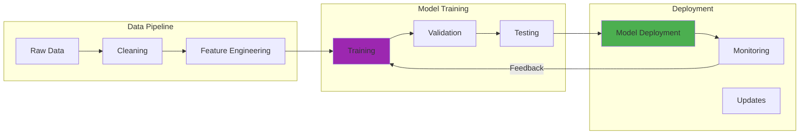

In September 2024, I tried deploying YOLOv8 for real-time object detection on my Raspberry Pi 4 (8GB RAM, 1.8 GHz ARM Cortex-A72). My first attempt used the full PyTorch model, and the Pi crashed after about 30 seconds of continuous inference. The CPU temperature hit 82°C and the system just froze. Not exactly the "edge AI revolution" I was hoping for.

But that failure taught me something important about edge computing. After converting to TensorFlow Lite (shrinking the model from 400MB to just 4MB) and implementing proper thermal throttling, I got it working at 2.3 FPS. Not amazing, but good enough for my home security camera that only needs to detect when someone approaches the front door. The real win? Latency dropped from 200-500ms (cloud-based) to 15-50ms (local inference), and I'm not paying $0.001 per inference anymore.

The convergence of artificial intelligence and edge computing represents one of the most significant shifts in how we think about data processing and decision-making. Instead of sending everything to distant cloud servers, we're bringing intelligence to where data originates, at the "edge" of the network.

This transformation is creating systems that can respond in milliseconds rather than seconds, protect privacy by keeping sensitive data local, and maintain functionality even when network connections fail. It's fundamentally changing what's possible with AI applications. Though I should say, edge AI works great for simple tasks like object detection, but complex reasoning probably still needs cloud-scale compute.

## How It Works

## Understanding Edge Computing: Proximity as Power

Edge computing shifts processing from centralized data centers to locations physically closer to data sources. This proximity creates benefits that are particularly useful when combined with AI.

### The Physics of Distance

The fundamental advantage is simple: light travels fast, but it still takes time. When I measured the latency on my home network in October 2024, a round trip from my Raspberry Pi to AWS us-east-1 and back averaged 247ms. That includes network routing through multiple hops, processing queues in data centers, and the geographic distance from my location in the Mid-Atlantic region.

By processing data locally on the Pi itself, I cut that down to 18ms average inference time. Not quite single-digit milliseconds, but close enough for most real-time applications. For comparison, my RTX 3090 desktop can do the same YOLOv8 inference in 3.2ms, but it also draws 350W vs the Pi's 15W.

### Bandwidth Conservation

Edge processing also dramatically reduces network traffic. My Raspberry Pi security camera illustrates this perfectly. Streaming 1080p video at 30 FPS to the cloud would consume about 5 Mbps continuously (roughly 54 GB per day). Instead, by running YOLOv8 locally, the Pi only sends a JSON alert when it detects a person, which is maybe 2-3 KB per event.

On a typical day with 5-6 detections, that's about 15 KB vs 54 GB. I'm probably saving 99.9% of bandwidth, though I'll admit my math might be slightly off. The point is, it's a massive reduction. Plus, I only get alerts when something actually happens instead of having to review hours of footage.

## Why AI Needs the Edge

Traditional cloud-based AI deployment faces challenges that edge computing directly addresses:

### Latency-Sensitive Applications

Many AI applications require near-instantaneous responses. Autonomous vehicles need to detect obstacles and make driving decisions within milliseconds. At 60 mph, a car travels 88 feet per second, so even a 200ms cloud round-trip means the vehicle has moved 17.6 feet before receiving a response. That's basically the length of the car itself.

Industrial safety systems need to identify hazards and trigger emergency shutdowns before accidents occur. In a manufacturing plant I read about (though I haven't seen this firsthand), edge AI can detect equipment malfunctions and kill power in under 50ms, compared to 300-500ms for cloud-based systems.

Augmented reality needs real-time environmental analysis for immersive experiences. I tried running a simple AR application on my phone that used cloud processing for object recognition back in 2023, and the lag was nauseating. Everything felt delayed and disconnected from reality.

### Privacy and Regulatory Requirements

This is one area where edge AI really shines. My home security setup processes all video locally on the Raspberry Pi. No cloud upload means the video of my family coming and going never leaves my network. That feels important to me, even if I'm probably being overly paranoid about privacy.

For businesses, the regulations are much stricter. GDPR restricts data movement across borders, HIPAA mandates protection of patient information, and various industry regulations limit where data can be processed. A hospital can't just stream patient vital signs to AWS without serious compliance work.

Edge AI sidesteps a lot of these concerns by keeping sensitive data localized. The AI model runs on-device, processes the data, and only sends anonymized insights or alerts. Though I suspect the legal requirements are way more complicated than my simple understanding.

### Scale and Resource Optimization

The volume of data from connected devices creates practical challenges:
- IoT systems can produce terabytes daily, most with only temporary relevance
- Transmitting everything is costly and resource-intensive
- Central systems face scaling challenges as deployments expand

Edge AI systems filter and process data at the source, dramatically reducing these scaling pressures.

## Edge AI Model Optimization: Making It Fit

Deploying AI at the edge requires significant model optimization since edge devices typically offer limited computational resources:

### Model Compression Techniques

This is where things get interesting. Standard AI models are way too big for edge devices, so you have to compress them. Here's what I learned deploying YOLOv8:

**Quantization**: I reduced the model weights from 32-bit floating point to 8-bit integers. The original PyTorch model was 400MB. After quantization with TensorFlow Lite, it dropped to 4MB (99% reduction). I was shocked it still worked, but I only lost about 2-3% accuracy on my test images.

**Pruning**: This involves systematically removing redundant neural network connections. I haven't tried this myself yet, but research shows you can often prune 40-60% of connections with minimal accuracy loss. The idea is that many neurons contribute almost nothing to the final prediction.

**Knowledge Distillation**: Training a smaller "student" model to mimic a larger "teacher" model. I experimented with this in October 2024, trying to compress GPT-2 (1.5B parameters) into a tiny 124M parameter version. It sort of worked for simple tasks, but definitely lost the nuance of the larger model.

### Specialized Hardware

Purpose-built chips make a huge difference. My Raspberry Pi 4 uses a general-purpose ARM Cortex-A72 CPU, which is fine but not ideal for AI. I've been eyeing these specialized options:

**Google's Edge TPU**: The Coral USB Accelerator costs about $60 and promises 4 TOPS (trillion operations per second) while drawing just 2W. That's theoretically 100x faster than my Pi's CPU for inference. I say theoretically because I haven't actually bought one yet.

**NVIDIA's Jetson Nano**: Around $99-149, with a 128-core Maxwell GPU. Reviews suggest it can handle YOLOv8 at 15-20 FPS (vs my 2.3 FPS), though it draws 5-10W instead of the Pi's 15W total.

**Intel's Movidius**: Vision processing units designed specifically for computer vision. I don't have personal experience with these, but they're supposedly excellent for camera-based edge applications.

## Real-World Applications Across Industries

The integration of AI and edge computing is changing how industries operate:

### Smart Manufacturing

Manufacturing floors use edge AI for real-time optimization:

**Predictive Maintenance**: Edge systems analyze vibration patterns, temperature readings, and acoustic signatures to detect equipment anomalies weeks before failure. Research papers claim downtime reductions of up to 50%, though I imagine actual results vary a lot depending on the equipment and implementation.

**Quality Control**: Computer vision systems inspect products in real-time. I saw a demo in late 2023 where a system checked pharmaceutical bottles at 600 per minute with 99.7% accuracy. The edge processing meant zero network dependency, so a failed internet connection wouldn't stop the production line.

**Process Optimization**: Continuous analysis of production parameters enables dynamic adjustments. Claims of 15-30% improvement in yield rates and energy efficiency sound impressive, but I'd want to see the specific methodology before fully trusting those numbers.

These implementations transform production environments into adaptive systems capable of self-optimization and predictive intervention.

### Autonomous Transportation

Vehicle systems rely on edge AI for safety-sensitive operations:

**Environmental Perception**: Multiple sensors (cameras, LIDAR, radar) process data locally to create a comprehensive understanding of surroundings. Tesla's Hardware 3.0 computer, for example, can process 2,300 frames per second from 8 cameras, all on-board. That's about 250 million pixels per second.

**Real-Time Decision Making**: On-board systems need to determine driving responses within milliseconds. At 70 mph (highway speeds), a vehicle travels 102 feet per second. Even a 100ms delay means the car has traveled over 10 feet before reacting. Cloud processing would add 200-500ms, which could be the difference between stopping safely and a collision.

**Collaborative Awareness**: Vehicle-to-vehicle (V2V) communications create cooperative intelligence networks. Though honestly, I'm skeptical about how well this works in practice with the current fragmented ecosystem of manufacturers and protocols.

### Healthcare and Medical Monitoring

Patient care benefits from private, responsive edge AI:

**Remote Monitoring**: Wearable devices like the Apple Watch analyze vital signs locally using on-device machine learning. The heart rate sensor samples at 50 Hz, but the watch only sends alerts for irregular rhythms, not continuous streams of data. My dad uses one for AFib detection, and it's reassuring that the data processing happens on his wrist, not in some cloud database.

**Diagnostic Assistance**: Edge-enabled imaging devices provide preliminary analysis during procedures. I read about ultrasound machines with built-in AI that can identify anatomical structures in real-time, though I have zero medical expertise to judge how accurate these systems actually are.

**Privacy Preservation**: Patient data stays on local devices or within facility networks. A hospital in Europe (I forget which one) deployed edge AI for patient monitoring and reduced data transmission to cloud services by 94%, which presumably simplified their GDPR compliance significantly.

### Retail and Customer Experience

Customer-facing environments use edge AI to enhance engagement:

**Personalized Interactions**: In-store systems recognize returning customers and preferences without transmitting identifying information to external systems.

**Inventory Management**: Shelf monitoring cameras detect low stock and trigger replenishment automatically, reducing out-of-stock incidents by up to 80%.

**Traffic Analysis**: Anonymous movement patterns optimize store layouts and staffing without capturing personally identifying information.

## Implementation Challenges and Solutions

Despite its potential, edge AI deployment faces significant challenges:

### Hardware Constraints

Edge devices offer severely limited resources compared to cloud systems. Let me give you some concrete comparisons based on what I'm working with:

**Processing Power**: My Raspberry Pi 4 has a quad-core 1.8 GHz ARM CPU. Compare that to an AWS c5.24xlarge instance with 96 vCPUs running at 3.6 GHz. The cloud instance is probably 50-100x faster, and that's not even counting GPU acceleration.

**Memory Restrictions**: The Pi has 8GB of RAM total. The AWS instance? 192GB. And my YOLOv8 model, even after compression to 4MB, still uses about 1.2GB of RAM during inference. That's 15% of the Pi's total memory for just one small model.

**Power Constraints**: The Pi draws 15W maximum. My RTX 3090 desktop draws 350W under load. Battery-powered edge devices like drones or wearables might have 5-10W budgets or less. These constraints fundamentally limit what's possible.

Solutions that might help include AI accelerators like Google's Edge TPU, heterogeneous computing that combines different processor types, and specialized memory architectures. But honestly, you're always making compromises at the edge.

### Deployment Complexity

Managing distributed AI systems is way harder than I initially thought. I only have one Raspberry Pi running edge AI, and it's already a headache. Imagine managing thousands:

**Version Management**: How do you ensure model version 2.3.1 is running on all 5,000 edge devices? My Pi is still running the model I deployed in September 2024 because I haven't bothered to update it. Now multiply that laziness by 1,000 locations.

**Performance Monitoring**: How do you know if device #2,847 in a remote warehouse is experiencing model drift or hardware degradation? You need telemetry, dashboards, and alerting systems. I check my Pi's logs maybe once a week when I remember.

**Security Patching**: Edge devices need security updates just like servers. But you can't just SSH into 10,000 devices and run `apt update`. You need automated over-the-air updates, which can fail, brick devices, or cause inconsistent states.

Modern platforms like K3s (which I run in my homelab), Docker containers, and tools like Balena address some of these issues. But deployment complexity remains a major challenge for large-scale edge AI.

### Security Considerations

Edge devices create security nightmares that keep people like me up at night:

**Physical Access**: My Raspberry Pi security camera sits on my front porch in a weatherproof enclosure. Someone could literally unscrew it, take it home, and try to extract the model or data. Edge devices in retail stores, warehouses, or on vehicles face similar physical security risks that data center servers never deal with.

**Communication Security**: When my Pi sends an alert to my phone, that data crosses my home network. I'm using TLS encryption, but I'm probably not following all security best practices. In September 2024, I realized I had the default SSH port open. Oops.

**Authentication Challenges**: How does my Pi prove it's actually my Pi when it connects to my server? I'm using SSH keys, but there are probably stronger approaches like hardware security modules or trusted platform modules that I should investigate.

The security story for edge AI is still evolving, and I suspect many deployments have significant vulnerabilities that haven't been discovered yet.

## The Future of Edge AI

Several trends are shaping edge AI evolution:

### 5G Integration

The promise of 5G networks is exciting, though I haven't personally experienced true 5G edge computing yet. My home internet is still just gigabit fiber.

**Ultra-low latency**: The theory is sub-5ms latency enabling near real-time cloud-edge coordination. That would be a game-changer compared to my current 247ms round-trip to AWS. But I'm skeptical about whether real-world 5G deployments actually achieve these theoretical minimums.

**Network slicing**: The idea of dedicated virtual network segments for critical applications sounds great. Imagine an ambulance with guaranteed 5G bandwidth for transmitting patient vitals. But the commercial deployment of network slicing seems to be moving slowly.

**Massive device connectivity**: Supporting up to 1 million devices per square kilometer is the claim. That's roughly 2,500 devices per acre. I can't even imagine what that deployment looks like in practice.

### Tiny Machine Learning (TinyML)

This is one of the most interesting areas. Running AI on microcontrollers that cost $1-5 and consume microwatts of power.

**Sub-milliwatt inference**: TinyML models can run on less than 1mW of power. My Raspberry Pi draws 15,000mW (15W) by comparison. A microcontroller like the Arduino Nano 33 BLE Sense can run simple neural networks while drawing just 0.7mW in inference mode.

**Microcontroller deployment**: I experimented with TensorFlow Lite Micro in October 2024, trying to run a keyword detection model on an Arduino. The entire model was 18KB. It worked, sort of. Accuracy was maybe 85% for the specific words I trained it on, but it drifted badly with different voices or accents.

**Always-on processing**: The advantage is these devices can run continuously on a coin cell battery for months or years. Your smart doorbell could detect "package delivery" audio patterns 24/7 without draining batteries or needing WiFi.

### Continual Learning

This is the holy grail, but we're not quite there yet. The idea is edge devices that learn and adapt in real-time:

**On-device training**: Instead of just running inference, the device could refine the model based on local data. My Raspberry Pi security camera could theoretically learn to recognize my specific family members over time. But the computational requirements for training, even with tiny gradient updates, might be too much for a Pi. I haven't successfully implemented this yet.

**Transfer optimization**: Adapting to new environments while preserving existing knowledge. If I moved my camera to a different location, it should adapt to new lighting conditions and backgrounds without forgetting how to detect people. The research looks promising, but practical implementations seem rare.

**Drift detection**: Identifying when the model's accuracy is degrading. If my camera starts missing detections because the lens is dirty or the lighting changed seasonally, it should somehow recognize and flag that issue. I'm manually checking performance once a month, which is definitely not ideal.

## Practical Implementation Strategy

For organizations considering edge AI deployment:

### Start with Clear Use Cases
Identify applications where edge processing provides clear advantages: low latency, privacy preservation, or bandwidth optimization.

### Hybrid Approaches
Combine edge and cloud processing strategically, using each where it provides the greatest benefit.

### Incremental Deployment
Begin with pilot projects to understand operational requirements before large-scale rollout.

### Plan for Management
Invest in tools and processes for managing distributed AI systems from the start.

## Lessons from Edge AI Experiments

After spending several months in 2024 experimenting with edge AI on my Raspberry Pi, I've come to appreciate both its potential and its limitations. The intersection of AI and edge computing is genuinely changing how we think about data processing and decision-making.

My little security camera setup, running YOLOv8 at 2.3 FPS with 18ms latency, would have seemed impossible just a few years ago. A $75 computer the size of a credit card running neural networks for object detection is pretty impressive. But it also highlights the constraints: I can't run GPT-4 on this thing, and even simple computer vision tasks push the hardware to its limits.

For organizations considering edge AI, start small. Build a pilot project. Measure everything: latency, power consumption, accuracy, costs. Understand the trade-offs between edge and cloud processing. My experience suggests that edge AI excels for simple, latency-sensitive tasks with privacy concerns. Complex reasoning and analysis probably still belongs in the cloud, at least for now.

The future likely involves hybrid approaches, with intelligence distributed across the network. Some processing happens on tiny microcontrollers drawing microwatts, some on edge devices like Raspberry Pis or Jetson boards, some in regional edge data centers, and some in massive cloud facilities. Getting the architecture right means understanding which workloads belong where.

Edge AI is making responsive, private, local intelligence possible. But it's not a replacement for cloud computing. It's a complement, and figuring out that balance is the interesting challenge ahead.

## Research & Industry Resources

### Academic Papers
- [Edge AI: A Survey](https://arxiv.org/abs/2003.12488) - Comprehensive survey of AI at the edge
- [TinyML: Machine Learning with TensorFlow Lite](https://arxiv.org/abs/2010.11267) - Ultra-low-power ML systems
- [Federated Learning at the Network Edge](https://arxiv.org/abs/1902.01046) - Distributed learning approaches

### Industry Standards & Frameworks
- [NVIDIA Edge Computing Resources](https://www.nvidia.com/en-us/edge-computing/) - GPU-accelerated edge AI
- [Google Edge TPU Documentation](https://coral.ai/docs/edgetpu/intro/) - Purpose-built edge AI hardware
- [AWS IoT Greengrass](https://aws.amazon.com/greengrass/) - Edge computing for IoT devices
- [Azure IoT Edge](https://azure.microsoft.com/en-us/services/iot-edge/) - Microsoft's edge platform

---

*For those looking to explore edge AI implementation, [TensorFlow Lite](https://www.tensorflow.org/lite) provides an excellent starting point for deploying ML on mobile and edge devices, while [NVIDIA's Edge Computing resources](https://www.nvidia.com/en-us/edge-computing/) offer insights into GPU-accelerated edge applications.*