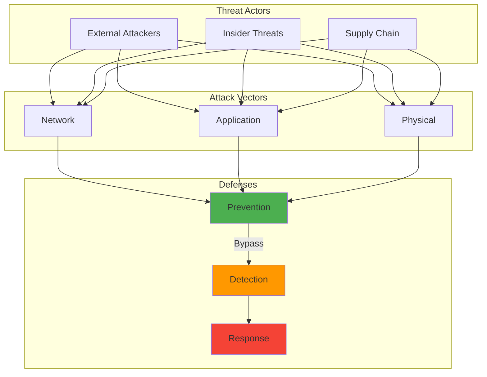

Years ago, I remember reading about the DAO hack—$60 million drained from what was supposed to be a secure smart contract through a reentrancy vulnerability that code reviewers had missed. That incident crystallized something important: traditional code review approaches weren't sufficient for smart contract security. The immutable nature of blockchain deployments means that vulnerable contracts can lead to catastrophic financial losses.

Fast forward to today, and large language models are emerging as potential game-changers for vulnerability detection. Having explored this space extensively, I've found the reality both more promising and more complex than the initial hype suggested.

## How It Works

## The Unique Challenges of Smart Contract Security

Smart contracts present a perfect storm of security challenges that make traditional vulnerability detection difficult:

### High-Stakes Immutability

Once deployed, smart contracts are extremely difficult or impossible to modify. This permanence means that even small security flaws can result in massive financial losses. We've seen this repeatedly with high-profile exploits.

### Complex Vulnerability Categories

Smart contract vulnerabilities span several categories, each with distinct characteristics:

**Reentrancy**: External contract calls made before state updates, allowing recursive exploitation.

**Integer overflow/underflow**: Arithmetic operations exceeding variable limits (though Solidity 0.8.0+ includes automatic checks).

**Access control flaws**: Improper authorization mechanisms allowing unauthorized privileged function execution.

**Logic errors**: Business logic flaws not following intended contract behavior.

**Gas-related vulnerabilities**: Issues with Ethereum's computational pricing model, including denial-of-service through gas exhaustion.

### Traditional Tool Limitations

Established approaches each have significant constraints:

**Static analyzers** like Slither often produce false positives requiring manual filtering.

**Dynamic analysis** tools can miss vulnerabilities in execution paths not covered during testing.

**Formal verification** requires specialized expertise and significant resources.

**Manual auditing** is thorough but time-consuming and expensive.

These limitations created an opportunity for novel approaches—a gap that large language models are increasingly positioned to fill.

## How LLMs Approach Smart Contract Analysis

Large language models represent a fundamentally different approach to code analysis. Rather than applying predefined rules or exploring execution paths, LLMs leverage patterns learned from vast code repositories to identify potential vulnerabilities.

### Current LLM Approaches

**Direct vulnerability identification**: Models like GPT-4 and Claude can analyze smart contract code to identify potential vulnerabilities when properly prompted.

**Explanation-based detection**: LLMs explain code functionality and highlight potential risks even when not explicitly flagging vulnerabilities.

**Test generation**: Models generate comprehensive test cases targeting specific vulnerability classes.

**Fix suggestion**: Beyond identifying issues, models can propose concrete code changes.

### Comparative Performance Analysis

Recent research comparing LLM-based methods against traditional tools reveals distinct patterns:

#### Accuracy by Vulnerability Type

**Standard vulnerabilities**: For well-documented issues like reentrancy and integer overflow, traditional tools like Slither consistently achieved higher detection rates with fewer false positives—over 90% detection for reentrancy versus 70-80% for leading LLMs.

**Logic flaws**: LLMs demonstrated superior performance identifying logical inconsistencies and business logic flaws that don't match common vulnerability patterns. They identified 65% of logic vulnerabilities compared to less than 40% for pattern-matching tools.

**Novel vulnerability types**: For emerging or uncommon vulnerability patterns not yet integrated into rule-based systems, LLMs identified approximately 55% of issues compared to 30% for traditional tools.

#### Operational Characteristics

**Processing time**: Traditional static analyzers typically processed contracts in seconds, while LLM analysis required 30-60 seconds per contract for comprehensive evaluation.

**Resource requirements**: LLM approaches demanded substantially higher computational resources, making them more costly for large-scale analysis.

**Explainability**: LLMs excelled at providing detailed, human-readable explanations of vulnerabilities, often suggesting root causes and potential fixes—an area where traditional tools provide minimal context.

## Promising Integration Approaches

The most effective smart contract security strategies combine multiple approaches rather than relying on any single method:

### Hybrid Detection Frameworks

**LLM-enhanced static analysis**: Using traditional analyzers for initial detection, then employing LLMs to filter false positives and explain findings. This combines speed and reliability with contextual understanding.

**Multi-tool correlation**: Running static analyzers, symbolic execution tools, and LLM detection in parallel, correlating results to identify vulnerabilities detected by multiple approaches with higher confidence.

**LLM-guided formal verification**: Using LLMs to generate formal specifications and invariants for traditional verification tools, making powerful but complex formal methods more accessible.

### Implementation Examples

Several projects have demonstrated effective integration:

**SecuRETH Pipeline**: Combined Slither's static analysis with GPT-4 processing, reducing false positives by 62% while providing detailed explanations.

**SmartBAST System**: Used abstract syntax trees as intermediate format between static analyzers and LLMs, achieving more precise vulnerability localization.

**AuditGPT Framework**: Employed multi-stage analysis where traditional tools performed screening, with LLMs focusing on suspicious sections and generating human-readable reports.

## Current Limitations and Challenges

Despite their promise, LLM-based approaches face several significant constraints:

### Technical Constraints

**Context window limitations**: Most LLMs have restricted context windows, limiting analysis of large contracts or multiple interacting contracts as unified systems.

**Training data recency**: Models trained on older data lack awareness of latest vulnerability patterns and exploits.

**Reasoning depth**: Current models struggle with complex multi-step analyses requiring tracking state changes across multiple functions and transactions.

**Consistency issues**: LLM outputs can vary between identical runs, potentially missing vulnerabilities inconsistently.

### Accuracy Concerns

**Hallucination risk**: LLMs can confidently present incorrect information, identifying non-existent vulnerabilities or missing actual ones.

**Semantic understanding gaps**: Models sometimes struggle with semantic implications of code, particularly for complex gas optimization patterns or assembly operations.

**False positive rates**: Studies found leading LLMs producing 15-25% false positive rates compared to 5-10% for specialized tools on common vulnerabilities.

## Best Practices for Current Implementation

Organizations seeking to leverage LLMs for smart contract security should consider these approaches:

### Effective Integration Strategies

**Layered defense**: Use traditional tools as first-line defense, with LLMs providing secondary analysis for deeper understanding and false positive reduction.

**Human-in-the-loop validation**: Maintain expert review of LLM findings, particularly for high-value contracts where false negatives carry substantial cost.

**Prompt engineering**: Develop specialized prompts guiding models toward comprehensive security analysis with explicit vulnerability pattern checks.

### Proven Prompt Patterns

**Function-by-function analysis**: Breaking contracts into individual functions for targeted analysis overcomes context limitations while focusing on relevant vulnerability patterns.

**Adversarial thinking prompts**: Instructions asking models to "think like an attacker" improve detection rates for subtle vulnerabilities.

**Systematic vulnerability checklists**: Prompts requesting systematic checks for specific vulnerability classes yield more thorough analyses than general security reviews.

**Multi-stage analysis**: Initial overview followed by targeted suspicious section examination produces more comprehensive results.

## Future Directions and Research Opportunities

The integration of LLMs into smart contract security continues evolving rapidly:

### Specialized Model Development

**Domain-specific pretraining**: Models trained specifically on smart contract codebases could develop enhanced blockchain-specific capabilities.

**Smaller, focused models**: Rather than general-purpose models, smaller systems optimized for security analysis could improve performance while reducing computational requirements.

**Fine-tuning on vulnerability datasets**: Comprehensive datasets of vulnerabilities paired with explanations could enable more targeted model specialization.

### Enhanced Integration

**Interactive analysis environments**: Tools combining code editors with real-time LLM vulnerability feedback could transform development processes.

**Automated remediation systems**: Frameworks that detect vulnerabilities and automatically generate, verify, and potentially implement fixes.

**Continuous security monitoring**: Systems monitoring deployed contracts using LLMs to identify suspicious patterns or potential exploitation attempts.

## The Path Forward

Based on my analysis of current capabilities and limitations, the most promising direction involves thoughtful integration rather than replacement of existing approaches. The most effective security strategies will likely continue involving multiple defense layers:

- **Static analyzers** for reliable detection of standard vulnerabilities
- **Symbolic execution** for edge case exploration  
- **Formal verification** for critical components
- **LLMs** for enhanced understanding and logic flaw detection
- **Expert human review** as final authority

The collaborative potential of these approaches offers the most promising path toward addressing the complex and evolving security challenges of smart contract development.

As blockchain technology expands into critical infrastructure and financial systems, the stakes for smart contract security continue increasing. Organizations that thoughtfully integrate LLM capabilities into comprehensive security practices—rather than viewing them as standalone solutions—will be best positioned to address these challenges effectively.

The future of smart contract security lies not in choosing between traditional and AI-powered approaches, but in combining their complementary strengths to create more robust and comprehensive security frameworks.

---

*For those interested in exploring smart contract security further, the [Trail of Bits security toolkit](https://github.com/trailofbits/eth-security-toolbox) provides comprehensive analysis tools, while [ConsenSys Smart Contract Best Practices](https://consensys.github.io/smart-contract-best-practices/) offers foundational guidance for secure development.*

## Academic Research & Security Resources

### LLM Security Research

1. **[Large Language Models for Code: Security Hardening and Adversarial Testing](https://arxiv.org/abs/2302.08468)** (2023)
   - Analysis of security vulnerabilities in LLM-generated code
   - *arXiv preprint*

2. **[Examining Zero-Shot Vulnerability Repair with Large Language Models](https://arxiv.org/abs/2112.02125)** (2022)
   - Stanford research on LLM vulnerability detection capabilities
   - *IEEE Symposium on Security and Privacy*

### Smart Contract Security

- **[SWC Registry](https://swcregistry.io/)** - Smart Contract Weakness Classification
- **[Ethereum Smart Contract Best Practices](https://consensys.github.io/smart-contract-best-practices/)**
- **[OpenZeppelin Security](https://www.openzeppelin.com/security-audits)** - Industry-standard auditing

### Vulnerability Databases

- **[CVE Database](https://cve.mitre.org/)** - Common Vulnerabilities and Exposures
- **[OWASP Smart Contract Top 10](https://owasp.org/www-project-smart-contract-top-10/)**
- **[Slither Vulnerability Detectors](https://github.com/crytic/slither)** - Static analysis framework

### Key Statistics Sources

- **Reentrancy vulnerability prevalence**: Based on [ConsenSys Diligence audit reports](https://consensys.net/diligence/)
- **Integer overflow incidents**: Historical data from [Rekt News](https://rekt.news/)
- **Access control issues**: Statistics from OpenZeppelin security audits