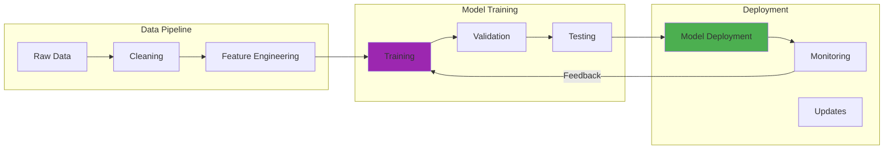

Years ago, I was working with an early version of GPT-3 on a complex analysis task. Halfway through our conversation, the model seemed to "forget" important details I'd provided earlier, giving responses that contradicted its previous analysis. That frustrating experience introduced me to one of the most fundamental constraints in AI systems: the context window.

A context window represents the amount of text a language model can "see" and consider simultaneously when generating responses. Think of it as the model's short-term memory—a finite space where previous conversation, relevant information, and the current query must all fit to be processed together.

This technical constraint shapes everything about how we interact with AI systems, from the length of conversations we can have to the complexity of documents we can analyze. Understanding context windows is crucial for anyone working with large language models.

## How It Works

## The Mechanics: How Context Windows Work

At its core, a context window defines the maximum number of tokens (parts of words, whole words, or punctuation marks) that a language model can process simultaneously. This limitation stems from the fundamental architecture of transformer models, which rely on attention mechanisms that weigh relationships between all elements in a sequence.

The computational resources required for these operations increase quadratically with sequence length. In practical terms, processing a million-token context would require analyzing one trillion token relationships—computationally infeasible with traditional approaches.

### What Consumes Context Space

When interacting with an LLM, several elements compete for the limited context space:
- Previous messages in the conversation
- The model's past responses  
- System prompts and instructions
- Current user queries
- Any additional data (documents, code, etc.)

Each element consumes valuable token space, and when the limit is approached, models typically prioritize more recent information, potentially "forgetting" earlier details.

### The Tokenization Challenge

Different languages and content types consume tokens at varying rates. Programming code, specialized notation, and non-Latin scripts often require more tokens to express the same information as standard English text. This creates practical challenges when working with diverse content within fixed window constraints.

## The Evolution: From Hundreds to Millions of Tokens

The trajectory of context window expansion reveals the priorities and progress in LLM development:

### Early Limitations (2017-2020)
- **BERT**: 512 tokens
- **GPT-2**: 1,024 tokens  
- **T5**: 512 tokens

These constraints severely limited coherence across longer texts or extended conversations. Analyzing a full research paper or maintaining context across complex discussions was challenging or impossible.

### Meaningful Progress (2020-2022)  
- **GPT-3**: 2,048 tokens
- **LaMDA**: ~4,096 tokens
- **PaLM**: ~8,192 tokens

This period enabled more sophisticated conversations and document analysis, though lengthy materials still required segmentation and processing in chunks.

### Current Generation (2023-Present)
- **GPT-4o**: 128,000 tokens
- **Claude 3**: 200,000 tokens  
- **Gemini 1.5 Pro**: 1,000,000 tokens
- **Mistral 8x7B**: 32,000 tokens

Today's models can ingest entire books, large codebases, or comprehensive conversation histories, enabling previously impossible use cases.

## Technical Challenges of Extended Context

Expanding context windows introduces several engineering challenges:

### Quadratic Attention Complexity

Standard self-attention examines relationships between all tokens in a sequence. For a million-token context, this means processing one trillion relationships—clearly impractical with traditional methods.

Several innovations help address this:

**Sparse attention patterns**: Models like Longformer only attend to subsets of tokens rather than the entire sequence.

**Hierarchical processing**: Systems process text in chunks, creating summary representations handled more efficiently at higher levels.

**Efficient implementations**: Techniques like FlashAttention optimize memory access patterns, significantly reducing resource requirements.

**Alternative architectures**: State space models like Mamba achieve linear scaling while maintaining competitive performance.

### Memory Requirements

Long sequences create substantial memory demands. Each token typically requires 128-256 floating-point values for representation. A million-token context translates to gigabytes of memory just for maintaining model state.

### Strategic Trade-offs

Model developers face choices between extending raw context windows versus implementing sophisticated retrieval mechanisms that selectively bring relevant information into smaller contexts.

Retrieval-Augmented Generation (RAG) systems demonstrate how external knowledge bases can be queried to bring only the most relevant information into context, potentially offering more efficient solutions than continuously expanding window sizes.

## Practical Implications Across Applications

Context window constraints influence LLM performance in distinct ways across different use cases:

### Document Analysis and Summarization

For professionals analyzing lengthy documents, context windows determine whether entire contracts, research papers, or reports can be processed cohesively. Limited windows force document segmentation, potentially missing cross-references or thematic connections.

Current-generation models with 100,000+ token windows handle most standard documents, but extremely long materials like full books still require strategic processing.

### Programming and Software Development

Coding tasks involve understanding relationships between multiple files, documentation, and requirements. Limited context windows force careful selection of relevant code snippets when seeking assistance.

Modern models with expanded windows can now ingest entire repositories, dramatically improving their ability to provide coherent assistance across complex software projects.

### Extended Conversations

In interactive applications, context windows define conversation memory. Limited windows lead to frustrating experiences where assistants "forget" earlier information.

Today's expanded windows enable coherence across dozens or hundreds of conversation turns, creating more natural interactions.

### Research and Analysis

Knowledge workers conducting research across multiple sources benefit from larger windows that allow simultaneous consideration of multiple references, enabling sophisticated comparative analysis and information integration.

## Strategic Context Management

Given persistent limitations, several strategies maximize utility within available context:

### Content Compression

Summarizing or compressing less-relevant portions allows more information within the available window:
- Automatic summarization of previous conversation turns
- Extraction of key points from lengthy documents
- Removal of redundant information
- Code comment compression while preserving functionality

These techniques can effectively increase contextual information by 2-10x without expanding raw token count.

### Dynamic Context Management

Rather than simple first-in-first-out approaches, sophisticated systems implement priority-based strategies:
- Preserving explicitly referenced information
- Maintaining critical instructions and system prompts
- Retaining high-semantic-relevance content
- Keeping foundational information that later content builds upon

### Hierarchical Representations

Instead of storing full text, systems maintain tiered information:
- High-level conversation or document summaries
- Medium-level section outlines
- Detailed content only for immediately relevant segments

This creates information pyramids optimizing context utilization.

### Retrieval-Augmented Approaches

By storing information externally and retrieving only what's needed:
1. Information indexed in vector databases for semantic search
2. Relevant content retrieved for specific queries
3. Only retrieved content placed in context with queries  
4. Models generate responses from curated context

This effectively bypasses fixed context limitations while maintaining relevance.

## Future Directions and Innovations

Several trends are shaping context window evolution:

### Technical Breakthroughs

**Linear attention mechanisms**: New approaches scaling linearly rather than quadratically could enable much longer practical contexts.

**Hierarchical transformers**: Models processing information at multiple abstraction levels may better handle long-range dependencies.

**Memory-augmented architectures**: Systems with explicit external memory could distinguish between current context and longer-term storage.

**Continuous context models**: Future systems might move beyond discrete windows toward evolving representations over time.

### Adaptive Context Windows

Rather than fixed sizes, future systems may implement dynamic allocation based on:
- Content complexity and information density
- Specific task requirements  
- Available computational resources
- User-specified priorities

### Specialized Context Handling

Different domains may benefit from tailored approaches:
- **Code understanding**: Preserving structural relationships while compressing less relevant sections
- **Mathematical content**: Specialized representations for equations and proofs capturing logical dependencies
- **Multilingual processing**: Optimizations for different language structures and tokenization requirements

### Hybrid Architectures

The most promising direction may combine:
- Large but finite context windows for immediate processing
- Sophisticated retrieval systems for broader knowledge access
- External tools and APIs for specialized tasks
- Persistent memory systems for long-term retention

## Implications for AI Development

Context windows represent a fundamental interface between computational constraints and AI capability goals. As windows expand from thousands to millions of tokens, we're witnessing qualitative shifts in what these systems can accomplish.

Yet challenges persist. Even million-token windows have limits, and the underlying computational complexity remains. The key insight is that effective AI systems must intelligently manage finite attention and memory resources.

For developers and users, understanding these constraints is crucial for designing effective interactions, building robust applications, and setting realistic expectations. Context windows aren't just technical limitations—they're fundamental aspects of how these systems process and generate language.

As we look toward future developments, the question isn't simply "how large can context windows become?" but "how can we most intelligently utilize the context we have?" The answers continue driving innovation in this rapidly evolving field.

The future of AI systems lies not just in expanding memory but in developing increasingly sophisticated approaches to attention, relevance, and information management—creating systems that can effectively navigate the rich, complex contexts where human language and thought occur.

---

*For those interested in exploring context window innovations further, [Anthropic's research on long-context language models](https://www.anthropic.com/research) provides insights into optimization techniques, while the [Efficient Transformers survey paper](https://arxiv.org/abs/2009.06732) offers comprehensive coverage of architectural improvements addressing these challenges.*