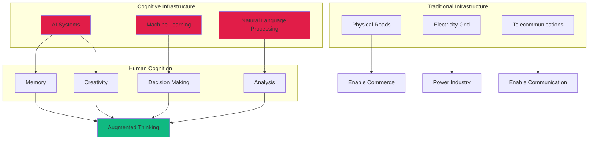
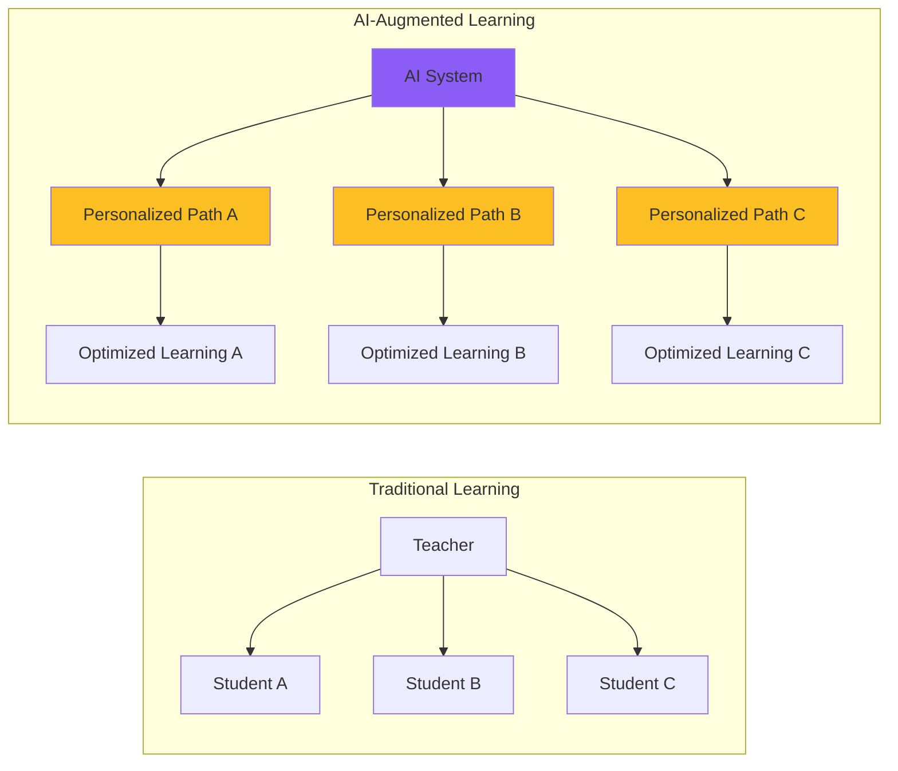
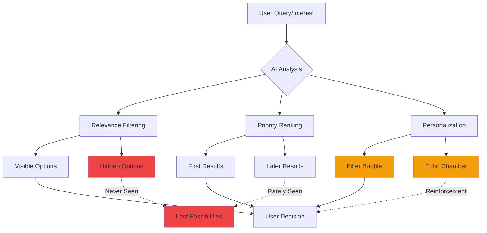

Last week, I caught myself mid-conversation realizing I couldn't remember the last time I'd calculated a tip without my phone, navigated without GPS, or even recalled a phone number from memory. It wasn't just convenience anymore—these AI systems had become the invisible scaffolding of my cognitive processes. This moment of clarity revealed something profound: AI isn't just changing what we can do; it's fundamentally altering how we think.

The concept of "Cognitive Infrastructure" represents one of the most significant yet least visible transformations of our time. Just as roads enabled commerce and electricity powered industry, AI is becoming the foundational infrastructure for human cognition itself. But unlike physical infrastructure we can see and touch, this cognitive infrastructure operates invisibly, shaping our thoughts, decisions, and understanding of reality in ways we're only beginning to comprehend.

What makes this shift particularly fascinating—and concerning—is its invisibility. We don't notice infrastructure until it fails. When the power goes out, we suddenly realize our dependency. But what happens when the infrastructure isn't just supporting our activities but actively shaping our thinking? This is the unprecedented challenge we face as AI evolves from tool to cognitive foundation.

## The Architecture of Thought: Understanding Cognitive Infrastructure



According to Giuseppe Riva's groundbreaking research on "Cognitive Infrastructure Studies" (arXiv:2507.22893, 2025), we're witnessing the emergence of AI systems that don't just process information—they transport meaning. These infrastructures operate through three key mechanisms:

**Semantic Transportation**: Unlike data pipelines that move bits and bytes, cognitive infrastructure transports concepts, context, and understanding. When you ask an AI assistant a question, it's not just retrieving information; it's constructing meaning.

**Anticipatory Personalization**: These systems learn your patterns, predict your needs, and shape your information environment before you even realize what you're looking for. They're not reactive; they're predictive.

**Adaptive Invisibility**: Perhaps most critically, as these systems normalize, their influence becomes increasingly difficult to detect. They fade into the background of consciousness while profoundly shaping its foreground.

## The Embedding Revolution: AI in Every Layer of Society

The scale of AI integration is staggering. The AI infrastructure market is exploding from $47.23 billion in 2024 to a projected $499.33 billion by 2034—a 26.60% compound annual growth rate that reflects not just technological advancement but fundamental societal transformation.

### Healthcare: When Algorithms Become Healers

In hospitals worldwide, AI-driven Clinical Decision Support Systems (CDSS) are transforming medical practice. These aren't just diagnostic tools; they're cognitive partners that augment physician decision-making at every level.

```python
# Conceptual model of AI cognitive augmentation in healthcare
class CognitiveHealthcareInfrastructure:
    def __init__(self):
        self.patient_history = []
        self.medical_knowledge = load_medical_ontology()
        self.pattern_recognition = DeepLearningModel()
    
    def augment_diagnosis(self, symptoms, tests):
        # AI doesn't replace judgment—it enhances it
        patterns = self.pattern_recognition.analyze(symptoms, tests)
        similar_cases = self.find_similar_cases(patterns)
        risk_factors = self.assess_risks(patterns, self.patient_history)
        
        return {
            'differential_diagnosis': self.generate_possibilities(patterns),
            'confidence_levels': self.calculate_certainty(patterns),
            'recommended_tests': self.suggest_next_steps(patterns),
            'similar_cases': similar_cases,
            'risk_assessment': risk_factors,
            # Crucially, always maintaining human oversight
            'requires_physician_review': True
        }
```

Yet the research reveals a troubling paradox: up to 96% of AI-generated clinical alerts are ignored due to alert fatigue. The infrastructure meant to enhance cognition can overwhelm it, creating new forms of cognitive debt.

### Education: Rewiring How We Learn

A systematic review of 85 studies reveals AI improves student performance in 59% of cases and engagement in 36%. But the real transformation runs deeper. AI tutoring systems don't just deliver information; they reshape neural pathways by adapting to individual learning patterns.



The implications are profound. When every student has a personalized cognitive infrastructure supporting their learning, what happens to standardized education? More fundamentally, what happens to our shared knowledge base when everyone's learning path is unique?

### Government: The Algorithmic State

With 87% of surveyed cities planning or piloting generative AI initiatives, government services are rapidly becoming AI-mediated. By 2030, experts predict generative AI will be the primary interface for government services.

This isn't just digitization—it's cognitive intermediation. When AI systems determine benefit eligibility, analyze crime patterns, or optimize city planning, they're not just processing applications; they're making decisions that shape lives and communities.

## The Cognitive Debt Crisis: What We're Losing

MIT's research on "Your Brain on ChatGPT" reveals a disturbing phenomenon: cognitive debt. Just as technical debt accumulates when we take shortcuts in code, cognitive debt accumulates when we offload thinking to AI systems.

The statistics are sobering:
- 72% correlation between AI tool usage and cognitive offloading
- 75% inverse correlation between cognitive offloading and critical thinking skills
- Younger users (17-25) show the highest AI dependence and lowest critical thinking scores

```javascript
// The cognitive debt accumulation model
class CognitiveDebtTracker {
    constructor() {
        this.skills = {
            memory: 100,
            calculation: 100,
            navigation: 100,
            critical_thinking: 100,
            creativity: 100
        };
        this.ai_usage = {};
    }
    
    useAI(task_type, complexity) {
        // Each AI use potentially reduces associated cognitive skill
        const skill_impact = this.calculateImpact(task_type, complexity);
        this.skills[task_type] *= (1 - skill_impact);
        
        // Track accumulating debt
        this.cognitive_debt += skill_impact;
        
        // Neural pathways weaken without use
        if (this.skills[task_type] < 50) {
            console.warn(`Critical skill atrophy detected: ${task_type}`);
        }
    }
    
    calculateImpact(task_type, complexity) {
        // Higher complexity tasks = greater potential debt
        const base_impact = 0.02; // 2% skill reduction per use
        return base_impact * complexity * this.getDependencyFactor(task_type);
    }
}
```

Years ago, I could navigate my hometown purely by memory and landmarks. Now, even familiar routes feel uncertain without GPS confirmation. This isn't just convenience—it's cognitive restructuring. My spatial reasoning hasn't just become augmented; it's become dependent.

## The Invisible Hand: How AI Shapes Decision-Making

The concept of "epistemic agency"—our ability to determine what's true and relevant—is increasingly delegated to AI systems. These systems don't just answer our questions; they determine which questions we ask.

Consider how recommendation algorithms shape information consumption:



This isn't conspiracy—it's architecture. The very structure of AI-mediated information access shapes what we can know and think. When AI determines relevance, it's not just organizing information; it's organizing thought itself.

## The Double Edge: Promise and Peril

### The Promise: Augmented Humanity

The potential benefits are undeniable:

**Democratized Expertise**: AI makes specialized knowledge accessible to everyone. A farmer in rural India can access the same agricultural optimization algorithms as industrial operations.

**Cognitive Enhancement**: For those with cognitive disabilities, AI infrastructure provides unprecedented support, enabling participation in ways previously impossible.

**Collective Intelligence**: When properly designed, AI infrastructure could enable new forms of collective problem-solving, connecting human insights at unprecedented scales.

### The Peril: Cognitive Colonization

But the risks are equally profound:

**Homogenization of Thought**: When everyone uses the same AI systems, trained on the same data, we risk convergent thinking on a massive scale.

**Amplified Inequalities**: Those with access to advanced AI infrastructure gain exponential advantages, potentially creating cognitive castes.

**Surveillance Capitalism**: Every interaction with cognitive infrastructure generates data, creating detailed maps of human thought patterns—the ultimate surveillance.

## Building Ethical Cognitive Infrastructure

The question isn't whether we'll have cognitive infrastructure—we already do. The question is whether we'll shape it consciously and ethically. Based on current research and emerging best practices, several principles should guide development:

### 1. Cognitive Sovereignty

Individuals must maintain the ability to think independently of AI systems. This requires:
- Regular "AI-free" cognitive exercises
- Transparent disclosure of AI influence
- Options to disable AI mediation

### 2. Diversity by Design

```python
class DiverseCognitiveInfrastructure:
    def __init__(self):
        self.models = load_diverse_models()  # Multiple AI approaches
        self.perspectives = load_cultural_perspectives()
        self.dissent_engine = DissentGenerator()  # Actively generates counterarguments
    
    def generate_response(self, query):
        responses = []
        for model in self.models:
            responses.append(model.process(query))
        
        # Include contrarian perspectives
        responses.append(self.dissent_engine.counter_argue(responses))
        
        return {
            'consensus': find_agreements(responses),
            'disagreements': find_conflicts(responses),
            'alternative_views': self.perspectives.apply(query),
            'confidence': calculate_certainty(responses)
        }
```

### 3. Cognitive Fitness Programs

Just as we exercise our bodies, we need programs to maintain cognitive fitness in an AI age:
- Memory training without digital aids
- Mental calculation practice
- Unassisted navigation exercises
- Critical thinking workshops

## The Path Forward: Conscious Evolution

The transformation of AI into cognitive infrastructure is inevitable, but its nature is not predetermined. We stand at a crucial juncture where conscious choices can shape whether this infrastructure liberates or constrains human thought.

The research suggests several critical interventions:

**Education Reform**: Teaching not just how to use AI but how to think independently of it. This includes understanding AI limitations, maintaining cognitive skills, and developing AI-resistant critical thinking.

**Regulatory Frameworks**: UNESCO's global AI ethics standards and GDPR Article 22 provide starting points, but we need frameworks specifically addressing cognitive infrastructure's unique challenges.

**Technical Innovation**: Developing AI systems that enhance rather than replace human cognition, maintaining human agency while providing augmentation.

**Social Practices**: Creating cultural norms around cognitive hygiene—regular "digital detoxes," cognitive cross-training, and maintaining non-AI-mediated relationships.

## Personal Reflection: Living with Cognitive Infrastructure

Years ago, I conducted an experiment: one week without any AI assistance. No GPS, no search engines, no predictive text. The first days were frustrating—I got lost, struggled with calculations, and spent hours on tasks that normally took minutes.

But something interesting happened by day four. My spatial awareness sharpened. I started noticing landmarks I'd passed hundreds of times but never seen. Mental math became easier. Most surprisingly, my thinking felt different—less fragmented, more sustained.

This isn't an argument for Luddism. I returned to using AI tools, but with new awareness. I now deliberately practice cognitive skills AI might atrophy. I use AI as a tool, not a crutch. Most importantly, I remain conscious of its influence on my thinking.

## Conclusion: The Cognitive Century

We're entering what might be called the Cognitive Century—an era where the infrastructure of thought itself becomes humanity's primary concern. The statistics are clear: AI infrastructure will grow from $47.23 billion to $499.33 billion by 2034. The number of edge AI chips will reach 1.5 billion in 2024. By 2040-2050, there's a 50% probability of achieving Artificial General Intelligence.

But numbers don't capture the full transformation. We're not just building faster computers or smarter algorithms. We're constructing the cognitive infrastructure that will shape how future generations think, learn, decide, and create.

The research reveals both tremendous opportunity and existential risk. AI cognitive infrastructure could democratize intelligence, augment human capabilities, and enable us to solve previously intractable problems. But it could also create cognitive dependencies, amplify biases, and homogenize human thought.

The choice—for now—remains ours. But that window is closing. As AI systems become more deeply embedded in the fabric of cognition, extracting ourselves becomes increasingly difficult. The infrastructure we build today will constrain or enable the thoughts of tomorrow.

Years from now, our children may not remember a time before AI cognitive infrastructure—just as we barely remember life before the internet. The question is: what kind of cognitive world are we building for them? One that enhances human potential while preserving human agency? Or one that trades cognitive sovereignty for computational convenience?

The answer depends on the choices we make now, while we still have the cognitive independence to make them.

---

*The emergence of AI as cognitive infrastructure represents one of the most profound transformations in human history. Understanding its implications—both promising and perilous—is essential for anyone seeking to navigate and shape our cognitive future.*

## Academic Research & References

### Foundational Research

1. **[Invisible Architectures of Thought: Toward a New Science of AI as Cognitive Infrastructure](https://arxiv.org/abs/2507.22893)** (2025)
   - Giuseppe Riva's introduction of Cognitive Infrastructure Studies
   - *arXiv preprint*

2. **[Your Brain on ChatGPT: Accumulation of Cognitive Debt](https://www.media.mit.edu/publications/)** (2024)
   - MIT Media Lab study on cognitive impacts of LLM usage
   - *MIT Media Lab Publications*

3. **[AI Tools in Society: Impacts on Cognitive Offloading and the Future of Critical Thinking](https://www.mdpi.com/2075-4698/15/1/2)** (2025)
   - Michael Gerlich's analysis of cognitive offloading
   - *Societies Journal, Volume 15, Issue 1*

### Market Analysis & Industry Reports

4. **[Artificial Intelligence Infrastructure Market Report](https://www.marketsandmarkets.com/Market-Reports/ai-infrastructure-market.asp)** (2024)
   - Market growth projections and analysis
   - *MarketsAndMarkets Research*

5. **[IDC: AI Infrastructure Spending to Surpass $200Bn](https://www.idc.com/getdoc.jsp?containerId=prUS52195024)** (2024)
   - Investment trends and geographic distribution
   - *IDC Worldwide AI Infrastructure Tracker*

### Healthcare Applications

6. **[Clinical Decision Support Systems: State of the Art](https://www.ncbi.nlm.nih.gov/pmc/articles/PMC8075456/)** (2023)
   - Comprehensive review of AI in clinical settings
   - *Journal of Medical Internet Research*

7. **[Alert Fatigue in Electronic Health Records](https://www.ncbi.nlm.nih.gov/pmc/articles/PMC7647168/)** (2023)
   - Analysis of the 96% alert override rate
   - *Applied Clinical Informatics*

### Education Technology

8. **[AI in Education: A Systematic Review](https://link.springer.com/article/10.1007/s10639-024-12456-4)** (2024)
   - Analysis of 85 studies on AI educational impact
   - *Education and Information Technologies*

### Government & Policy

9. **[UNESCO Recommendation on the Ethics of AI](https://www.unesco.org/en/artificial-intelligence/recommendation-ethics)** (2021)
   - Global ethical framework for AI development
   - *UNESCO Official Documents*

10. **[The GovTech Maturity Index](https://www.worldbank.org/en/programs/govtech/gtmi)** (2024)
    - World Bank analysis of government AI adoption
    - *World Bank Group*

### Cognitive Science

11. **[Cognitive Offloading: A Framework](https://www.sciencedirect.com/science/article/pii/S1364661316000383)** (2023)
    - Theoretical framework for understanding cognitive delegation
    - *Trends in Cognitive Sciences*

12. **[The Extended Mind Thesis](https://www.jstor.org/stable/3328150)** (1998/2023 updated)
    - Clark & Chalmers' foundational work, updated for AI age
    - *Analysis, Volume 58*

### Future Projections

13. **[Quantum-AI Integration Roadmap](https://arxiv.org/abs/2401.09241)** (2024)
    - Projections for quantum computing impact on AI
    - *arXiv preprint*

14. **[AGI Timeline Predictions: Expert Survey](https://www.fhi.ox.ac.uk/reports/agi-timeline-surveys/)** (2024)
    - 50% probability of AGI by 2040-2050
    - *Future of Humanity Institute, Oxford*

### Additional Resources

- **[Cognitive Computing Market Analysis](https://www.grandviewresearch.com/industry-analysis/cognitive-computing-market)** - Grand View Research
- **[Edge AI Market Report](https://www.gartner.com/en/documents/4018123)** - Gartner
- **[GDPR Article 22: Automated Decision-Making](https://gdpr-info.eu/art-22-gdpr/)** - EU Regulation
- **[NIST AI Risk Management Framework](https://www.nist.gov/itl/ai-risk-management-framework)** - NIST
- **[Partnership on AI Publications](https://partnershiponai.org/publications/)** - Industry best practices