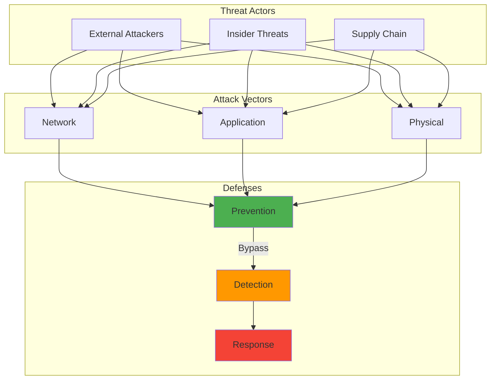

## The Problem: Security Doesn't Scale Without Automation


*Photo by Franck on Unsplash*


## Requirements

To run the code examples in this post, you'll need to install the following packages:

```bash
pip install collections email ipaddress nmap requests smtplib sqlite3 subprocess vulners
```

Or create a `requirements.txt` file:

```text
collections
email
ipaddress
nmap
requests
smtplib
sqlite3
subprocess
vulners
```
Managing home network security is like being a one-person SOC (Security Operations Center). You've got multiple devices, various family members with different tech literacy levels, and new threats emerging daily. Manual security management simply doesn't scale – especially when you're also trying to be present for bedtime stories.

This post shares the Python scripts and automation workflows I've developed to maintain security without sacrificing family time.

## How It Works



## The Foundation: Network Discovery and Asset Management

First challenge: knowing what's actually on your network. New devices appear constantly – kids' friends' phones, that new smart gadget someone bought, the mysterious device that might be the neighbor's printer.

True story: Years ago, I spent an hour hunting down an "ESP_8266_UNKNOWN" device on my network. I was ready to declare a security incident when my wife walked in: "Oh, that's probably the smart light bulb I installed in the guest bathroom."

Silence.

"You installed a what now?"

That's when I realized we needed automation – not just for security, but for marital harmony.

### Automated Device Discovery

Here's the script that saves my sanity (runs hourly, alerts immediately):

```python
#!/usr/bin/env python3
import nmap
import json
import sqlite3
from datetime import datetime
    # ... (additional implementation details)
        print(f"⚠️  Found {len(new_devices)} new devices!")
        # Send notification (covered in the notification section)
```

## DNS Monitoring and Ad Blocking

One of the most effective security measures is controlling DNS. I use Pi-hole for ad blocking but enhanced it with security monitoring.

### Detecting Suspicious DNS Queries

This script monitors DNS logs for suspicious patterns:

```python
import re
import sqlite3
from collections import defaultdict
from datetime import datetime, timedelta

    # ... (additional implementation details)
            # Add more from threat feeds
        }
```

## Automated Vulnerability Scanning

Keeping devices patched is crucial. This script runs weekly to identify vulnerable services:

```python
import nmap
import vulners
import json
from datetime import datetime

    # ... (additional implementation details)
        
        return report
```

## Smart Firewall Rules Management

Static firewall rules don't adapt to changing threats. Here's how I automate rule updates:

```python
import subprocess
import ipaddress
from datetime import datetime, timedelta

class DynamicFirewall:
    # ... (additional implementation details)
            # Update pfBlockerNG lists
            self.update_pf_blocker_list(country_code)
```

## Notification System

All this automation is useless if you don't know what's happening. Here's my notification system:

```python
import smtplib
import requests
from email.mime.text import MIMEText
from email.mime.multipart import MIMEMultipart

    # ... (additional implementation details)
        
        self.send_email("Daily Security Summary", html_content, html=True)
```

## Putting It All Together

The real power comes from orchestrating these scripts. Here's my master automation script:

```python
#!/usr/bin/env python3
"""
Home Security Automation Orchestrator
Runs various security checks and responds to threats
"""
    # ... (additional implementation details)
    orchestrator = SecurityOrchestrator()
    orchestrator.run()
```

## Lessons Learned

### 1. Start with Visibility
You can't secure what you can't see. Network discovery and asset management should be your first automation project.

### 2. Alert Fatigue is Real
Fine-tune your alerts. Too many notifications and you'll start ignoring them. I learned this the hard way when my phone wouldn't stop buzzing.

### 3. Family-Friendly Automation
Your security automation shouldn't impact family life. My scripts include:
- Whitelisting for family devices
- "Quiet hours" for non-critical alerts
- Easy override mechanisms

### 4. Test in Isolation
Always test security automation in an isolated environment first. I once accidentally blocked my entire home network. The family was... not amused.

### 5. Document Everything
Future you (or your family when you're not home) needs to understand how to disable things. I maintain a simple wiki with:
- What each script does
- How to temporarily disable automation
- Emergency contacts

## Tools and Resources

Here are the key tools I use:
- **nmap**: Network discovery and port scanning
- **Pi-hole**: DNS filtering and logging
- **Dream Machine Professional**: Firewall and routing
- **Python libraries**: python-nmap, vulners, schedule
- **Notification**: Pushover for mobile alerts

## What's Next?

Security automation is an ongoing journey. My upcoming projects include:
- Machine learning for anomaly detection
- Automated incident response playbooks
- Integration with threat intelligence feeds
- Voice alerts for critical events ("Alexa, announce security alert")

## Conclusion

Automating home network security has transformed my approach to protecting my family's digital life. Instead of constantly checking logs and running manual scans, I can focus on improving defenses while automation handles the routine work.

The best part? When my kids ask what I do for work, I can show them our "home security robot" in action. Nothing beats seeing their faces light up when they understand that Dad's job is basically being a cyber superhero.

Remember: the goal isn't to build Fort Knox, it's to raise the bar high enough that attackers move on to easier targets. Automation helps you maintain that bar without burning out.


## Further Reading

For more in-depth information on the topics covered in this post:

- [NIST Cybersecurity Framework](https://www.nist.gov/cyberframework)
- [OWASP Top 10](https://owasp.org/www-project-top-ten/)
- [Cloudflare Learning Center](https://www.cloudflare.com/learning/)
- [RFC Editor](https://www.rfc-editor.org/)

---

*Have questions about any of these scripts? Want to share your own automation ideas? Drop me a line – I love connecting with fellow security automation enthusiasts!*